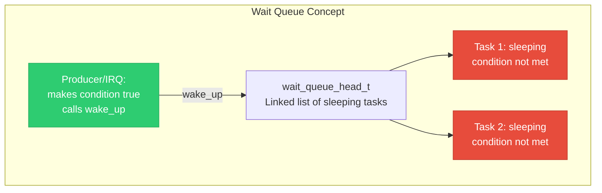
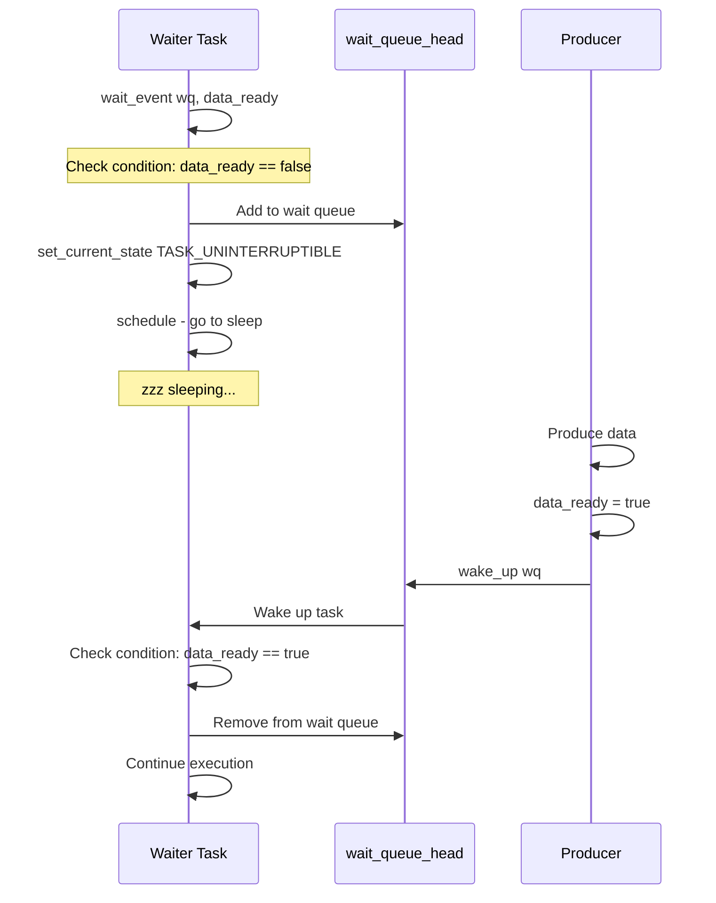
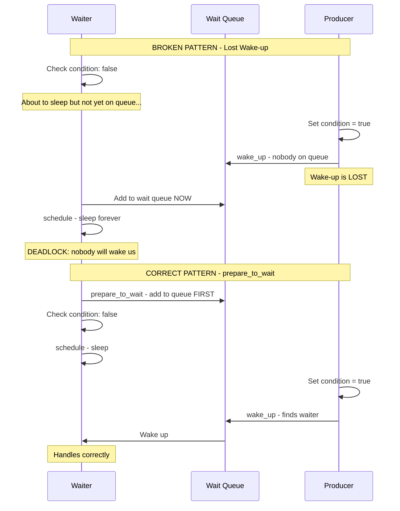
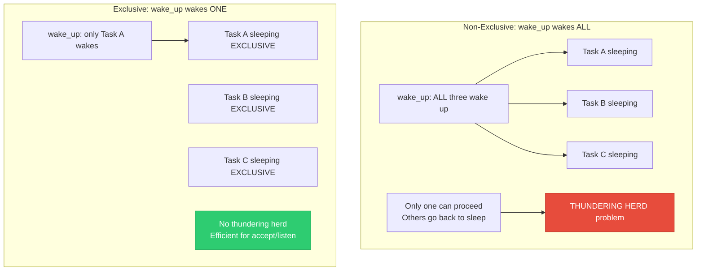

# 12 — Wait Queues

> **Scope**: wait_queue_head_t, wait_event/wake_up macros, exclusive vs non-exclusive waiters, manual prepare_to_wait/finish_wait pattern, thundering herd, and real driver usage.

---

## 1. What is a Wait Queue?

A wait queue is the fundamental mechanism for a kernel task to **sleep until a condition becomes true**, then be woken up by another task or interrupt.



---

## 2. Wait Queue API

```c
#include <linux/wait.h>

/* --- Initialization --- */
DECLARE_WAIT_QUEUE_HEAD(my_wq);      /* Static */
wait_queue_head_t my_wq;
init_waitqueue_head(&my_wq);          /* Dynamic */

/* --- Sleeping (waiter side) --- */

/* Sleep until condition is true (uninterruptible) */
wait_event(my_wq, condition);

/* Interruptible (returns -ERESTARTSYS on signal) */
wait_event_interruptible(my_wq, condition);

/* With timeout (returns 0 on timeout, >0 on success) */
wait_event_timeout(my_wq, condition, timeout_jiffies);

/* Interruptible + timeout */
wait_event_interruptible_timeout(my_wq, condition, timeout);

/* --- Waking (signaler side) --- */

/* Wake all waiters */
wake_up(&my_wq);

/* Wake all interruptible waiters */
wake_up_interruptible(&my_wq);

/* Wake exactly one waiter */
wake_up_nr(&my_wq, 1);

/* Wake all waiters (synonym, more explicit) */
wake_up_all(&my_wq);
```

---

## 3. Wait/Wake Flow



---

## 4. Inside wait_event Macro

```c
/* wait_event(wq, condition) expands to approximately: */

#define wait_event(wq, condition)                    \
do {                                                  \
    DEFINE_WAIT(__wait);                              \
                                                      \
    for (;;) {                                        \
        prepare_to_wait(&wq, &__wait,                \
                        TASK_UNINTERRUPTIBLE);         \
        if (condition)                                \
            break;                                    \
        schedule();  /* Sleep */                      \
    }                                                 \
    finish_wait(&wq, &__wait);                        \
} while (0)

/* KEY: condition is re-checked AFTER waking up.
 * This handles spurious wakeups and race conditions.
 * The condition check is inside a loop. */
```

---

## 5. The Lost Wake-Up Problem



```c
/* The CORRECT manual pattern: */
DEFINE_WAIT(wait);

/* Step 1: Add to queue FIRST */
prepare_to_wait(&wq, &wait, TASK_INTERRUPTIBLE);

/* Step 2: Check condition AFTER adding to queue */
if (!condition) {
    schedule();  /* Sleep — wake_up will find us */
}

/* Step 3: Clean up */
finish_wait(&wq, &wait);
```

---

## 6. Exclusive vs Non-Exclusive Waiters



```c
/* Exclusive waiter — only ONE woken per wake_up */
prepare_to_wait_exclusive(&wq, &wait, TASK_INTERRUPTIBLE);

/* Or use WQ_FLAG_EXCLUSIVE directly */
wait.flags |= WQ_FLAG_EXCLUSIVE;

/* wake_up behavior:
 * 1. Wake all NON-exclusive waiters
 * 2. Wake exactly ONE exclusive waiter
 * 
 * Exclusive waiters are at the END of the queue.
 * This prevents thundering herd in accept() etc. */
```

---

## 7. wait_event_interruptible Pattern

```c
/* Most common pattern in driver code: */
static DECLARE_WAIT_QUEUE_HEAD(data_wq);
static int data_available = 0;
static char data_buffer[256];

/* Read syscall — waits for data */
ssize_t my_read(struct file *file, char __user *buf,
                size_t count, loff_t *ppos)
{
    int ret;
    
    /* Wait until data is available, allow Ctrl+C */
    ret = wait_event_interruptible(data_wq, data_available);
    if (ret)
        return -ERESTARTSYS;
    
    /* Data is ready — copy to user */
    if (copy_to_user(buf, data_buffer, count))
        return -EFAULT;
    
    data_available = 0;
    return count;
}

/* IRQ handler or another thread provides data */
irqreturn_t my_irq_handler(int irq, void *dev)
{
    /* Read hardware data */
    memcpy(data_buffer, hw_buffer, sizeof(data_buffer));
    data_available = 1;
    
    wake_up_interruptible(&data_wq);
    return IRQ_HANDLED;
}
```

---

## 8. Poll/Select with Wait Queues

```c
/* __poll_t my_poll() — used for select()/poll()/epoll() */
__poll_t my_poll(struct file *file, poll_table *wait)
{
    __poll_t mask = 0;
    
    /* Register this wait queue with the poll subsystem */
    poll_wait(file, &data_wq, wait);
    
    /* Check current state */
    if (data_available)
        mask |= EPOLLIN | EPOLLRDNORM;  /* Readable */
    
    if (buffer_has_space)
        mask |= EPOLLOUT | EPOLLWRNORM; /* Writable */
    
    return mask;
}
/* poll_wait does NOT sleep. It just adds the wait queue
 * to the poll table. The VFS poll mechanism handles sleeping. */
```

---

## 9. Internal Structure

```c
struct wait_queue_head {
    spinlock_t lock;
    struct list_head head;  /* List of wait_queue_entry */
};

struct wait_queue_entry {
    unsigned int flags;     /* WQ_FLAG_EXCLUSIVE, etc. */
    void *private;          /* Usually: current task_struct */
    wait_queue_func_t func; /* Wakeup function */
    struct list_head entry; /* Links into wait_queue_head */
};

/* Wake-up walks the list:
 * 1. Call func() for each non-exclusive entry → wake all
 * 2. Call func() for first exclusive entry → wake one
 * 3. Stop at first exclusive entry
 */
```

---

## 10. Deep Q&A

### Q1: Why does wait_event use a loop instead of a single sleep?

**A:** Three reasons: (1) **Spurious wakeups**: `wake_up()` may wake tasks even if the condition isn't met for them (e.g., multiple waiters, only one can proceed). (2) **Race between wake and condition check**: the condition may have changed between the wake-up and the check. (3) **Interruptible sleep**: a signal can wake the task even though the condition isn't true. The loop ensures the task only proceeds when the condition is genuinely true.

### Q2: What is the thundering herd problem?

**A:** When multiple tasks wait for the same event (e.g., accept() on a socket) and `wake_up_all()` is used, ALL tasks wake up but only ONE can handle the event. The rest check the condition, find it false, and go back to sleep. This wastes CPU cycles with context switches that accomplish nothing. Solution: exclusive waiters or `wake_up_nr(&wq, 1)`.

### Q3: Why is the prepare_to_wait/schedule/finish_wait pattern correct?

**A:** The key is the ordering: (1) `prepare_to_wait()` adds the task to the queue AND sets task state to TASK_INTERRUPTIBLE. (2) The condition check happens AFTER the task is on the queue. If wake_up fires between step 1 and step 2, the task is on the queue and will be woken. (3) If the condition is already true, `schedule()` is skipped. This eliminates the lost wake-up race.

### Q4: When should you use wait_event vs completion?

**A:** Use completion for one-shot "wait until done" events — simpler API, handles complete-before-wait correctly. Use wait_event when: (1) the condition is more complex than a single flag, (2) multiple threads wait for different conditions on the same queue, (3) you need the condition re-checked after wakeup (producer-consumer with multiple items).

---

[← Previous: 11 — Preemption Control](11_Preemption_Control.md) | [Next: 13 — Lockdep Debugging →](13_Lockdep_Debugging.md)
