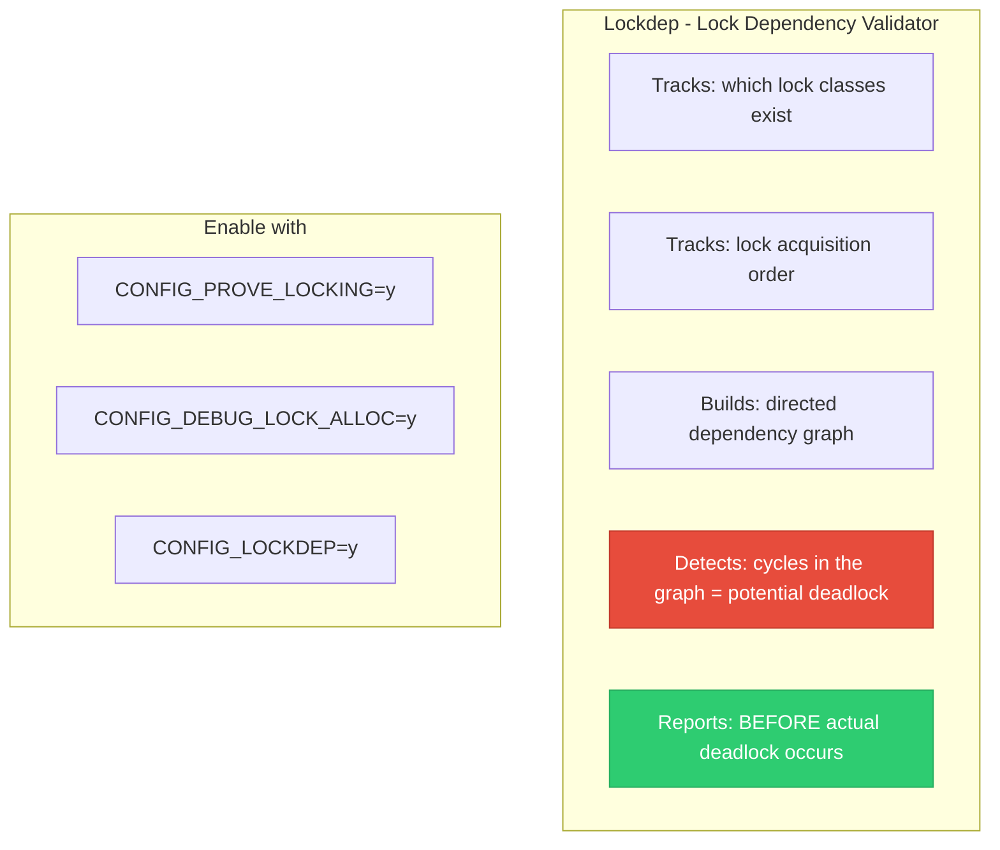
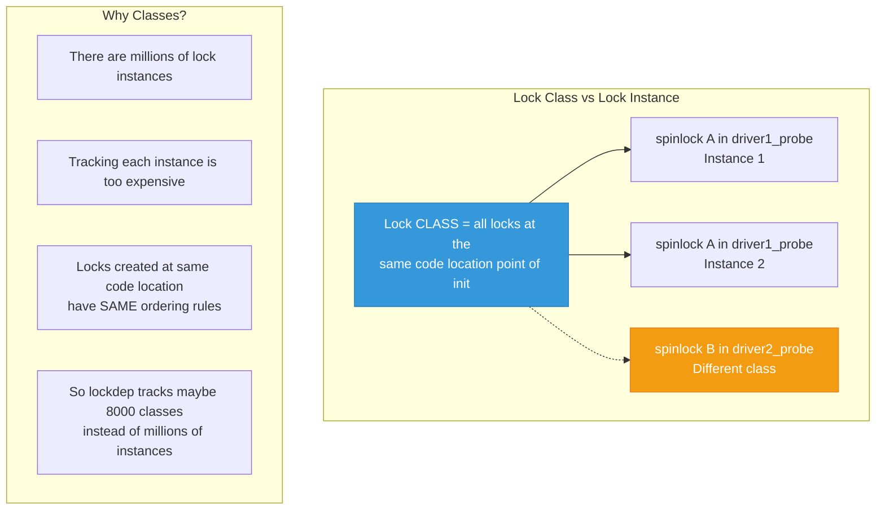
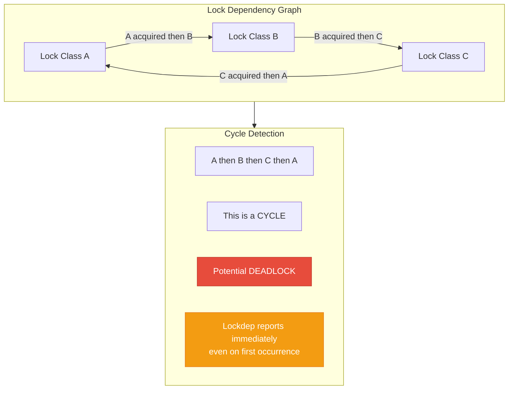
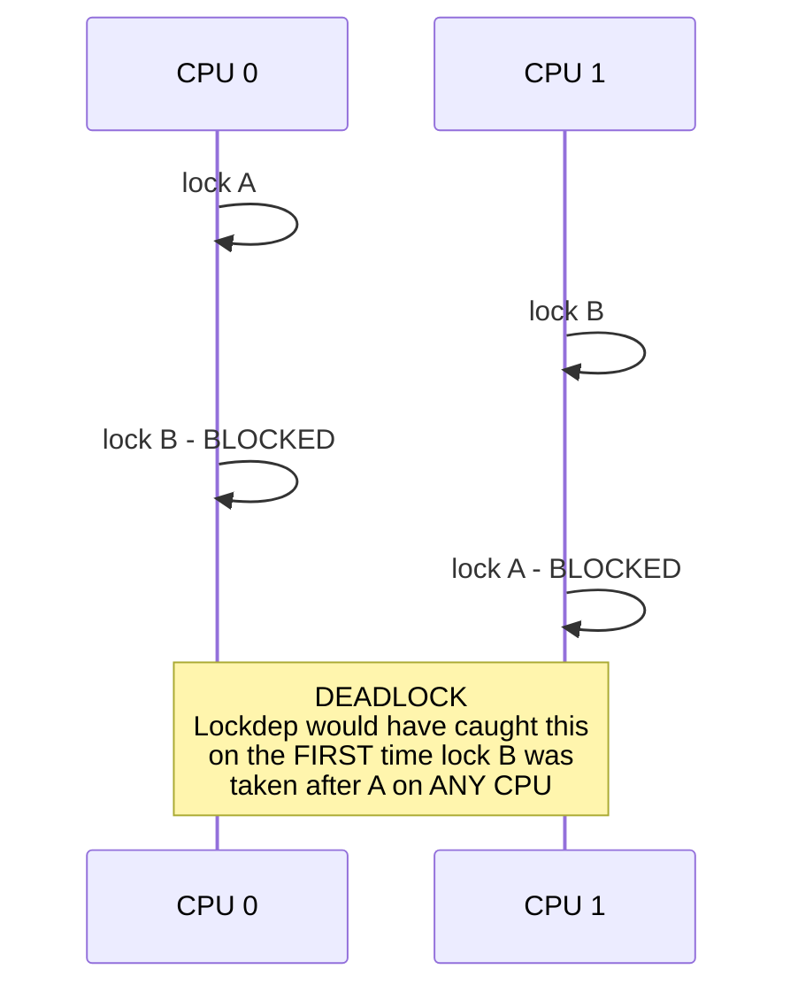
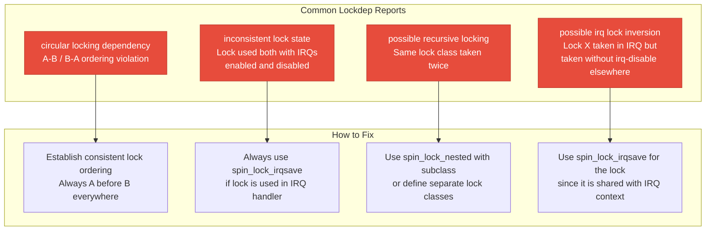

# 13 — Lockdep: Lock Dependency Debugging

> **Scope**: CONFIG_PROVE_LOCKING, lock classes, dependency graph, lockdep annotations, common lockdep warnings, and how to read/fix lockdep splats.

---

## 1. What is Lockdep?

Lockdep is the kernel's **runtime lock dependency validator**. It tracks every lock acquisition and builds a dependency graph. If it detects a potential deadlock (dependency cycle), it prints a warning — even if the deadlock hasn't actually happened yet.



---

## 2. Lock Classes — Not Instances



```c
/* Two locks initialized at different lines = different classes */
spin_lock_init(&dev->lock_a);  /* Class A */
spin_lock_init(&dev->lock_b);  /* Class B */

/* If CPU 0: lock A → lock B
 * And CPU 1: lock B → lock A
 * Lockdep detects the ordering inversion immediately */
```

---

## 3. Dependency Graph and Cycle Detection



### Deadlock Scenario:



---

## 4. Reading a Lockdep Splat

```
=============================================
[ INFO: possible circular locking dependency detected ]
5.10.0 #1 Not tainted
---------------------------------------------
process_A/1234 is trying to acquire lock:
 ffff8880a1b2c3d0 (&dev->lock_b){+.+.}, at: do_something+0x42/0x80

but task is already holding lock:
 ffff8880a1b2c3e0 (&dev->lock_a){+.+.}, at: my_function+0x23/0x60

which lock already depends on the new lock.

the existing dependency chain (in reverse order) is:

-> #1 (&dev->lock_b){+.+.}:
       lock_acquire+0xb5/0x200
       _raw_spin_lock+0x30/0x40
       other_function+0x45/0x90   ← lock B acquired here
       ...

-> #0 (&dev->lock_a){+.+.}:
       lock_acquire+0xb5/0x200
       _raw_spin_lock+0x30/0x40
       yet_another_func+0x33/0x70  ← lock A acquired while B held
       ...

other info that might help us debug this:
 Possible unsafe locking scenario:
       CPU0                    CPU1
       ----                    ----
  lock(&dev->lock_a);
                               lock(&dev->lock_b);
                               lock(&dev->lock_a);  ← DEADLOCK
  lock(&dev->lock_b);
```

### Lock State Annotations:

```
{+.+.} = { hardirq, softirq, in_hardirq, in_softirq }
 +  = lock used in this context
 -  = lock NOT used in this context
 .  = irq state irrelevant

{-.-.}  = Never used in IRQ context
{+.+.}  = Used in both hardirq and softirq
{..+.}  = Used when hardirq is running
```

---

## 5. Lockdep Annotations

```c
/* Nest lock — same class taken twice with subclass */
spin_lock_nested(&child->lock, SINGLE_DEPTH_NESTING);
/* Tells lockdep: this is a DIFFERENT level, not a bug */

/* Lock class key for dynamic locks */
static struct lock_class_key my_lock_key;
lockdep_set_class(&my_lock, &my_lock_key);
/* Assigns a custom class to a lock */

/* Subclass for ordered lists of same-class locks */
mutex_lock_nested(&inode->i_mutex, I_MUTEX_PARENT);
mutex_lock_nested(&child->i_mutex, I_MUTEX_CHILD);
/* Lockdep knows parent-before-child is valid */

/* Crossrelease annotation (lock released by different task) */
lock_acquire(&sem->dep_map, 0, 0, 0, 1, NULL, _RET_IP_);
lock_release(&sem->dep_map, _RET_IP_);

/* Assert lock is held (compile-time + runtime check) */
lockdep_assert_held(&my_lock);
lockdep_assert_held_write(&my_rwsem);
lockdep_assert_held_read(&my_rwsem);

/* Mark a lock as intentionally not validated */
lockdep_set_novalidate_class(&my_lock);
```

---

## 6. Common Lockdep Warnings



---

## 7. IRQ Inversion Detection

```c
/* Lockdep catches this subtle bug: */

/* Thread context: takes lock without disabling IRQs */
spin_lock(&my_lock);
/* ... critical section ... */
spin_unlock(&my_lock);

/* IRQ handler: also takes the same lock */
irqreturn_t my_handler(int irq, void *dev)
{
    spin_lock(&my_lock);  /* Lockdep: WARNING! */
    /* ... */
    spin_unlock(&my_lock);
    return IRQ_HANDLED;
}

/* Lockdep warning: inconsistent {HARDIRQ-ON-W} -> {IN-HARDIRQ-W}
 * 
 * Scenario: Thread holds lock, IRQ fires on same CPU,
 * IRQ handler tries to take same lock = DEADLOCK
 * 
 * Fix: use spin_lock_irqsave() in thread context */
```

---

## 8. Lockdep Performance and Limits

```c
/* Lockdep has kernel-wide limits: */
#define MAX_LOCKDEP_KEYS      8191   /* Lock classes */
#define MAX_LOCKDEP_CHAINS    65536  /* Lock chains */
#define MAX_LOCKDEP_ENTRIES   32768  /* Lock instances tracked */

/* When limits are hit:
 * "BUG: MAX_LOCKDEP_KEYS too low!"
 * Lockdep disables itself (no more checking)
 * 
 * Performance impact:
 * - ~10-30% slower lock acquisition
 * - Extra memory per lock class
 * - Only enable in development/testing, not production */
```

---

## 9. lockdep_assert_held — Defensive Programming

```c
/* Assert that a lock is held at a certain point */
void modify_list(struct my_device *dev)
{
    lockdep_assert_held(&dev->lock);
    /* If dev->lock is NOT held, BUG with stack trace */
    
    list_add(&new_entry->list, &dev->data_list);
}

/* For rwsem: */
void read_data(struct my_device *dev)
{
    lockdep_assert_held_read(&dev->rwsem);
    /* Asserts at least a read lock is held */
}

/* This catches callers that forget to take the lock */
```

---

## 10. Deep Q&A

### Q1: How does lockdep detect deadlocks that haven't happened yet?

**A:** Lockdep builds a directed graph of lock ordering: if lock A is ever held when lock B is acquired, an edge A→B is added. If later, B is held when A is acquired (B→A), lockdep detects the cycle A→B→A and reports it immediately. The actual deadlock requires two CPUs to hit the conflicting order simultaneously — which may be extremely rare. Lockdep catches the bug from a SINGLE observation of each ordering, even on different CPUs at different times.

### Q2: What is a lock chain and why does lockdep track them?

**A:** A lock chain is the sequence of locks held at a given point. For example, holding locks [A, B, C] is one chain, and [B, A] is another. Lockdep computes a hash of each unique chain and validates that no two chains create circular dependencies. This is more efficient than checking every individual edge — chains are cached and only validated once per unique combination.

### Q3: When should you use lock_class_key?

**A:** When locks are created dynamically and lockdep thinks they all have the same class (because they're initialized at the same code line). Example: each device instance has a lock — all are "same class" but have different valid orderings. Use `lockdep_set_class()` or `lockdep_set_class_and_name()` to give each group its own class, preventing false positive warnings.

### Q4: How do you fix a "possible recursive locking detected" warning?

**A:** This means the same lock CLASS is taken twice. Options: (1) If the locks are truly different (parent/child inodes), use `spin_lock_nested(&lock, SUBCLASS)` to tell lockdep they're different levels. (2) If it's the same lock taken twice, it's a real bug — restructure the code to avoid recursive locking. (3) Define separate `lock_class_key` for each level of the hierarchy.

---

[← Previous: 12 — Waitqueues](12_Waitqueues.md) | [Next: 14 — Priority Inversion and RT Mutexes →](14_Priority_Inversion_RT_Mutexes.md)
