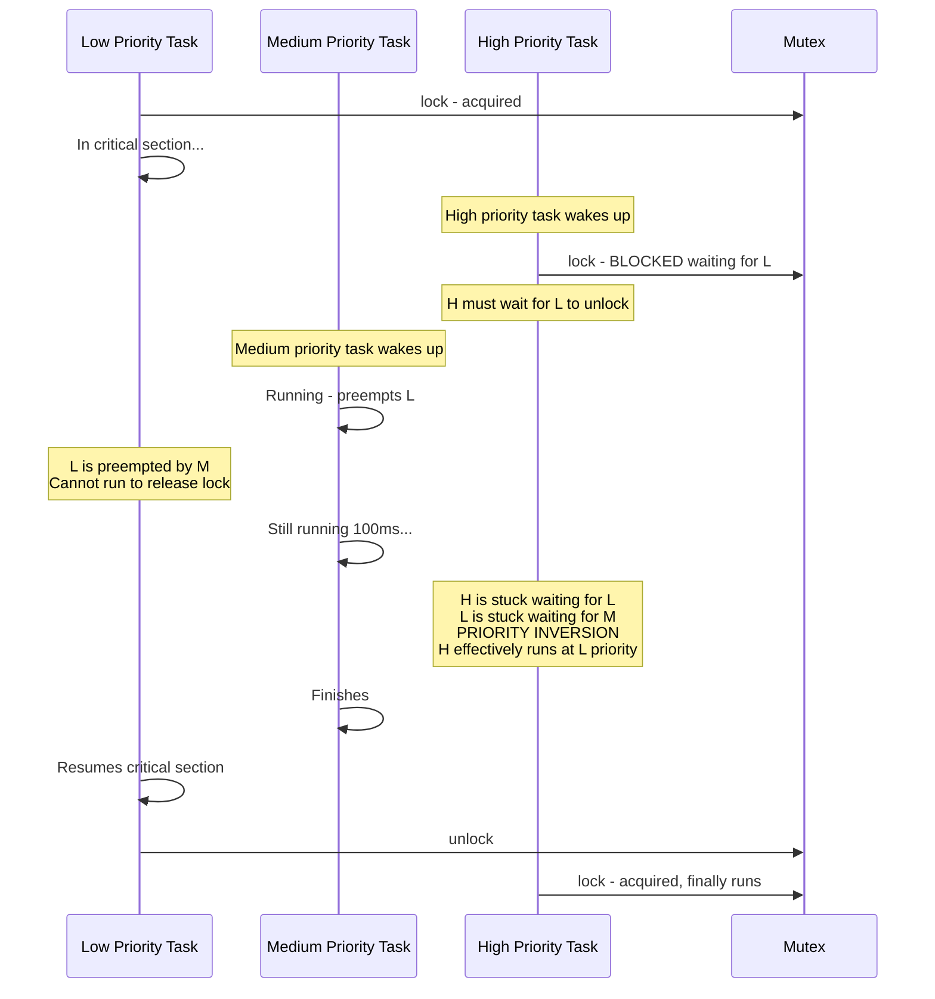
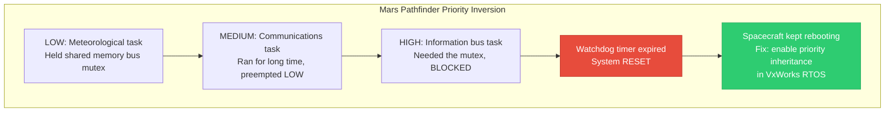
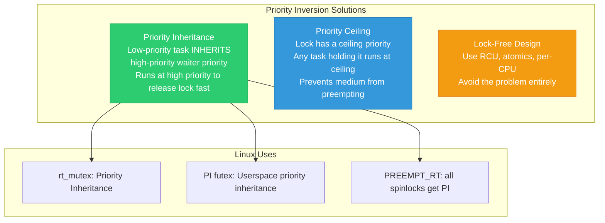
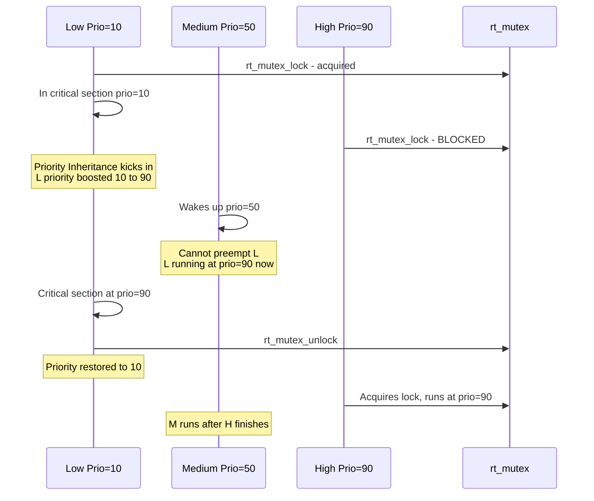
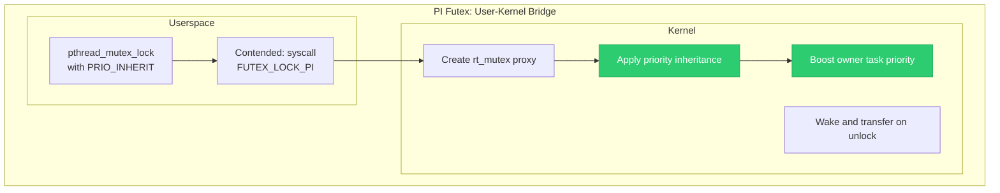
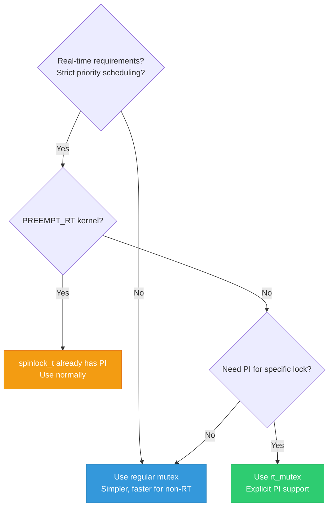

# 14 — Priority Inversion and RT Mutexes

> **Scope**: Priority inversion problem, Mars Pathfinder incident, priority inheritance protocol, priority ceiling, rt_mutex in Linux, PREEMPT_RT, and PI futexes.

---

## 1. What is Priority Inversion?

Priority inversion occurs when a **high-priority task** is blocked waiting for a **low-priority task** that holds a resource, while a **medium-priority task** runs instead of the low-priority task, effectively delaying the high-priority task indefinitely.



---

## 2. The Mars Pathfinder Bug (1997)



---

## 3. Solutions to Priority Inversion



---

## 4. Priority Inheritance in Action



---

## 5. rt_mutex API

```c
#include <linux/rtmutex.h>

struct rt_mutex my_rt_mutex;
rt_mutex_init(&my_rt_mutex);

/* Lock — supports priority inheritance */
void rt_mutex_lock(struct rt_mutex *lock);

/* Interruptible */
int rt_mutex_lock_interruptible(struct rt_mutex *lock);

/* Killable */
int rt_mutex_lock_killable(struct rt_mutex *lock);

/* Try lock */
int rt_mutex_trylock(struct rt_mutex *lock);

/* Unlock */
void rt_mutex_unlock(struct rt_mutex *lock);
```

---

## 6. rt_mutex Internals

```c
struct rt_mutex_base {
    raw_spinlock_t wait_lock;  /* Protects waiter tree */
    struct rb_root_cached waiters; /* RB-tree of waiters, 
                                      sorted by priority */
    struct task_struct *owner;     /* Current owner */
};

/* PI Chain:
 * When H blocks on rt_mutex held by L:
 * 1. H is added to lock's waiter tree
 * 2. L's priority is boosted to H's priority
 * 3. If L is blocked on ANOTHER rt_mutex,
 *    the boost propagates through the chain
 * 4. PI chain depth is limited (prevent infinite loops) */
```


---

## 7. PREEMPT_RT and Spinlock Conversion

```c
/* Under PREEMPT_RT:
 * spinlock_t is internally converted to rt_mutex
 * This means EVERY spinlock gets priority inheritance!
 *
 * Benefits:
 * - No priority inversion with spinlocks
 * - Spinlock holders can be preempted (deterministic latency)
 * - All IRQ handlers run as kernel threads (preemptible)
 *
 * Only raw_spinlock_t remains as a true spinning lock.
 */

/* Standard kernel:
 *   spinlock_t     → actual spinlock (busy-wait)
 *   mutex          → sleeping lock with PI
 *   rt_mutex       → sleeping lock with PI
 *
 * PREEMPT_RT kernel:
 *   spinlock_t     → rt_mutex internally (sleeping, PI)
 *   mutex          → rt_mutex internally (sleeping, PI)
 *   raw_spinlock_t → actual spinlock (busy-wait)
 */
```

---

## 8. PI Futex — Userspace Priority Inheritance

```c
/* Linux extends priority inheritance to userspace via PI futexes */

/* Userspace: pthread_mutex with PTHREAD_PRIO_INHERIT */
#include <pthread.h>

pthread_mutex_t mutex;
pthread_mutexattr_t attr;

pthread_mutexattr_init(&attr);
pthread_mutexattr_setprotocol(&attr, PTHREAD_PRIO_INHERIT);
pthread_mutex_init(&mutex, &attr);

/* Now pthread_mutex_lock uses FUTEX_LOCK_PI syscall
 * Kernel creates an rt_mutex shadow for this userspace mutex
 * Priority inheritance works across user/kernel boundary */
```



---

## 9. When to Use rt_mutex vs mutex



---

## 10. Deep Q&A

### Q1: Why doesn't regular mutex have priority inheritance?

**A:** Regular `struct mutex` is designed for maximum throughput with features like adaptive spinning and fast-path atomic acquisition. PI adds overhead: maintaining a waiter tree sorted by priority, propagating priority changes through chains, and restoring priority on unlock. For most kernel code, deadlines are not strict enough to justify this cost. `rt_mutex` exists for the cases that need it.

### Q2: What is the priority ceiling protocol and why doesn't Linux use it?

**A:** Priority ceiling assigns each lock a ceiling priority (the highest priority of any task that might use it). Any task holding the lock runs at ceiling priority. This prevents priority inversion and deadlock. Linux doesn't use it because: (1) determining the ceiling requires knowing ALL possible users at design time — impractical for a general-purpose OS, (2) it boosts priority even when no high-priority waiter exists — wasteful.

### Q3: Can priority inheritance chains cause problems?

**A:** Yes. PI chains can be arbitrarily deep: Task A→Lock1→Task B→Lock2→Task C→Lock3→... Propagating priority through a long chain is expensive and adds latency to the lock operation. Linux limits PI chain depth (`MAX_LOCK_DEPTH = 48`). If exceeded, the kernel prints a warning and stops propagating. In practice, chains longer than 3-4 are extremely rare and indicate a design problem.

### Q4: How does the kernel handle priority de-boosting on unlock?

**A:** When `rt_mutex_unlock()` is called: (1) Remove the highest-priority waiter from the tree. (2) Wake that waiter. (3) Recalculate the owner's effective priority: it's the maximum of the task's base priority and the highest-priority waiter on ANY OTHER rt_mutex the task holds. (4) If the task holds no more contested rt_mutexes, restore to base priority. This is called "de-boosting."

---

[← Previous: 13 — Lockdep Debugging](13_Lockdep_Debugging.md) | [Next: 15 — Lock Ordering and Deadlock →](15_Lock_Ordering_Deadlock.md)
