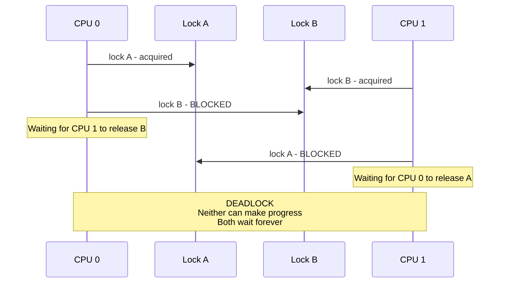
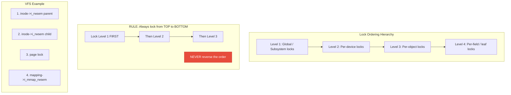
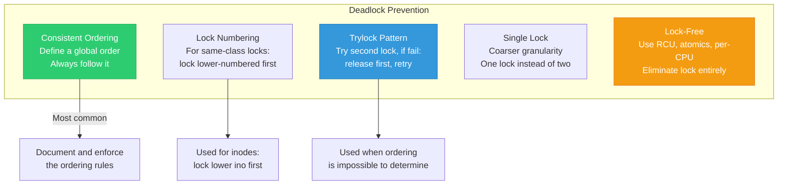
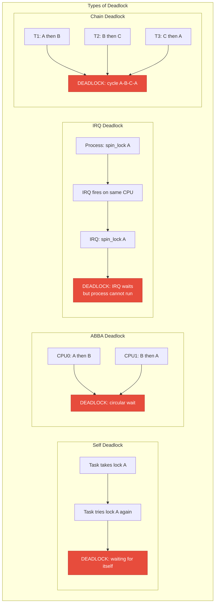
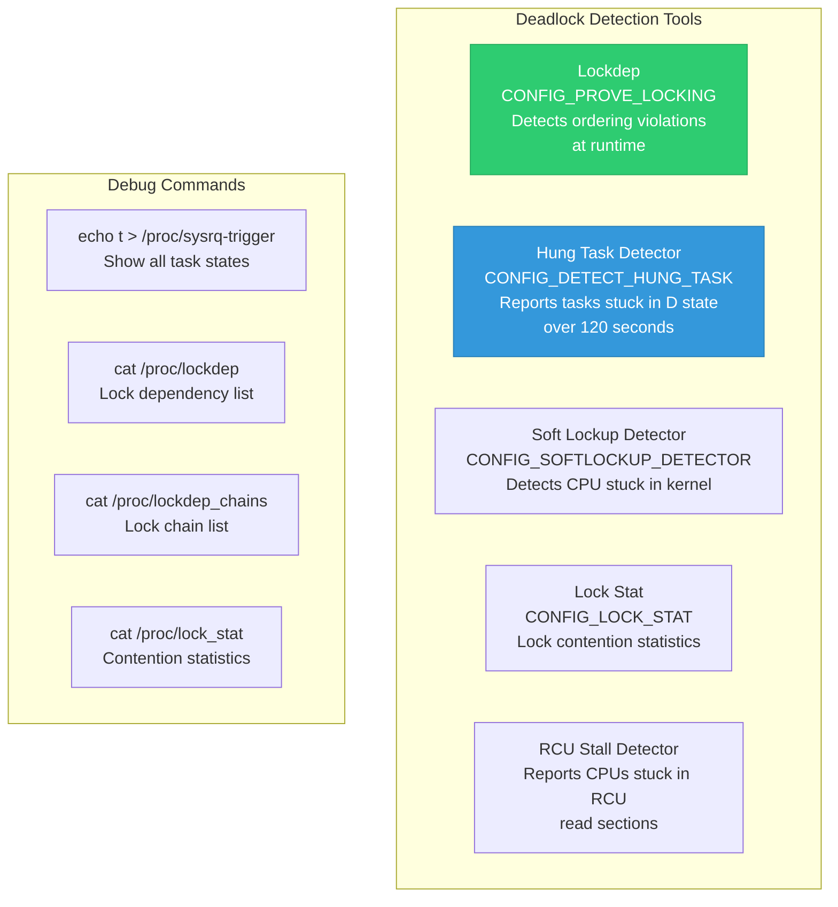

# 15 — Lock Ordering and Deadlock Prevention

> **Scope**: ABBA deadlocks, lock hierarchies, consistent ordering rules, trylock patterns, lock ordering in VFS/networking/block layer, and practical strategies for deadlock avoidance.

---

## 1. The ABBA Deadlock



```c
/* BROKEN: inconsistent lock ordering */

/* Thread 1: */           /* Thread 2: */
spin_lock(&lock_a);       spin_lock(&lock_b);
spin_lock(&lock_b);       spin_lock(&lock_a);  /* DEADLOCK */
/* ... */                 /* ... */
spin_unlock(&lock_b);     spin_unlock(&lock_a);
spin_unlock(&lock_a);     spin_unlock(&lock_b);

/* FIXED: consistent ordering — always A before B */

/* Thread 1: */           /* Thread 2: */
spin_lock(&lock_a);       spin_lock(&lock_a);
spin_lock(&lock_b);       spin_lock(&lock_b);
/* ... */                 /* ... */
spin_unlock(&lock_b);     spin_unlock(&lock_b);
spin_unlock(&lock_a);     spin_unlock(&lock_a);
```

---

## 2. Lock Ordering Hierarchy



---

## 3. Real Kernel Lock Ordering Rules

### VFS Lock Ordering:

```c
/*
 * VFS lock ordering (from Documentation/filesystems/locking.rst):
 *
 * 1. rename_lock (global rw seqlock)
 * 2. dentry->d_lock (per-dentry spinlock)
 * 3. inode->i_lock
 * 4. inode->i_rwsem
 *    - I_MUTEX_PARENT (parent directory)
 *    - I_MUTEX_CHILD  (child inode)
 *    - I_MUTEX_XATTR  (xattr operations)
 *    - I_MUTEX_NORMAL (normal operations)
 * 5. mapping->invalidate_lock
 * 6. page lock (lock_page)
 * 7. mapping->i_mmap_rwsem
 *
 * rename(): locks parent directories before children
 * Always: lock parent inode before child inode
 * Two directories: lock by inode number (lower first)
 */
```

### Network Stack:

```c
/*
 * Network lock ordering:
 * 1. rtnl_lock() (global network configuration mutex)
 * 2. dev->addr_list_lock
 * 3. sk->sk_lock (socket lock)
 * 4. sk->sk_receive_queue.lock
 *
 * Always take rtnl_lock before any per-device lock.
 */
```

---

## 4. Deadlock Prevention Strategies



---

## 5. Trylock Pattern for Dynamic Ordering

```c
/* When you cannot determine lock order at compile time:
 * Example: locking two arbitrary inodes */

void lock_two_inodes(struct inode *inode1, struct inode *inode2)
{
    /* Strategy: always lock by inode number */
    if (inode1->i_ino < inode2->i_ino) {
        mutex_lock(&inode1->i_mutex);
        mutex_lock_nested(&inode2->i_mutex, I_MUTEX_CHILD);
    } else if (inode1->i_ino > inode2->i_ino) {
        mutex_lock(&inode2->i_mutex);
        mutex_lock_nested(&inode1->i_mutex, I_MUTEX_CHILD);
    } else {
        /* Same inode — lock once */
        mutex_lock(&inode1->i_mutex);
    }
}

/* Alternative: trylock + retry pattern */
void lock_two_locks(spinlock_t *a, spinlock_t *b)
{
    for (;;) {
        spin_lock(a);
        if (spin_trylock(b))
            return;  /* Got both */
        spin_unlock(a);
        
        /* Swap so we try the other order next */
        swap(a, b);
        cpu_relax();
    }
}
```

---

## 6. Deadlock Types



---

## 7. Lock Ordering Documentation Pattern

```c
/*
 * Lock ordering for struct my_subsystem:
 *
 *   global_lock
 *     -> dev->config_lock
 *       -> dev->data_lock
 *         -> dev->irq_lock (irqsave)
 *
 * Rules:
 * 1. global_lock protects device list
 * 2. config_lock protects configuration changes
 * 3. data_lock protects runtime data
 * 4. irq_lock is taken in IRQ context (must use irqsave)
 * 5. NEVER take global_lock while holding data_lock
 * 6. IRQ handler only takes irq_lock
 */

struct my_device {
    struct mutex config_lock;    /* Level 2 */
    spinlock_t data_lock;        /* Level 3 */
    spinlock_t irq_lock;         /* Level 4 — used in IRQ */
};

static DEFINE_MUTEX(global_lock); /* Level 1 */
```

---

## 8. Detecting Deadlocks



---

## 9. Deep Q&A

### Q1: How do you determine the correct lock ordering for a new subsystem?

**A:** (1) Identify all locks in the subsystem and their scope (global, per-device, per-object). (2) Map the call graph: which functions can call which other functions while holding locks. (3) Assign levels: coarser/higher-scope locks get lower numbers. (4) Rule: always acquire lower-numbered locks first. (5) Document the ordering in a comment at the top of the source file. (6) Use lockdep annotations (nested, subclass) to validate at runtime.

### Q2: What if you need to lock two objects of the same type?

**A:** Use a deterministic tiebreaker: (1) Sort by memory address (`if (a < b) lock(a), lock(b)`). (2) Sort by a unique ID (inode number, device number). (3) Use trylock with retry. The kernel uses inode number ordering for directory operations like rename. Address ordering is used for memory management (mmap_lock ordering for mremap).

### Q3: Can you detect deadlocks in production without lockdep?

**A:** Partially. The hung task detector (`/proc/sys/kernel/hung_task_timeout_secs`) triggers after a configurable timeout (default 120s) if a task stays in TASK_UNINTERRUPTIBLE. The soft lockup detector watches for CPUs that don't schedule for 20+ seconds. `SysRq+t` dumps all task stack traces for manual analysis. But none of these are as precise as lockdep's compile-path analysis.

### Q4: Explain the ABBA problem in the VFS rename operation.

**A:** `rename(old_dir/A, new_dir/B)` needs to lock both parent directories (`old_dir` and `new_dir`). If two renames happen simultaneously in opposite directions, one locks `old_dir` then `new_dir`, the other locks `new_dir` then `old_dir` — classic ABBA. The VFS solves this by always locking by inode number (lower number first). The `lock_rename()` function handles this with `mutex_lock_nested()` and proper subclass annotations.

---

[← Previous: 14 — Priority Inversion and RT Mutexes](14_Priority_Inversion_RT_Mutexes.md) | [Next: 16 — Futex: User-Kernel Synchronization →](16_Futex_User_Kernel_Sync.md)
