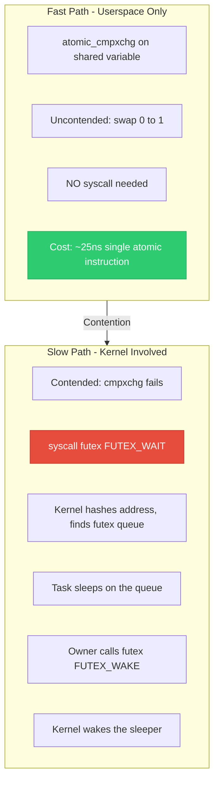
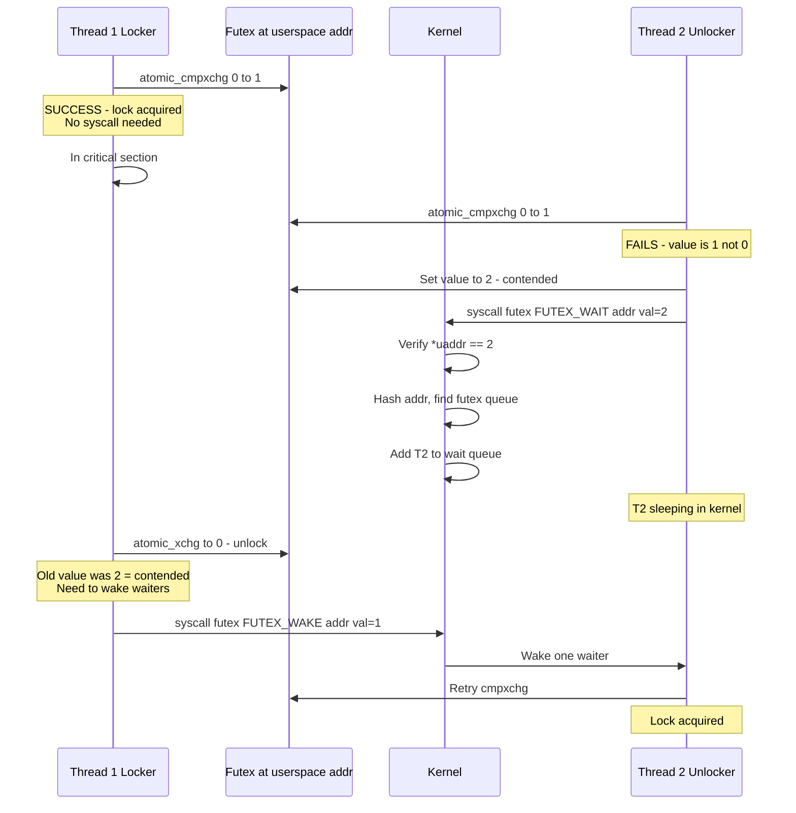
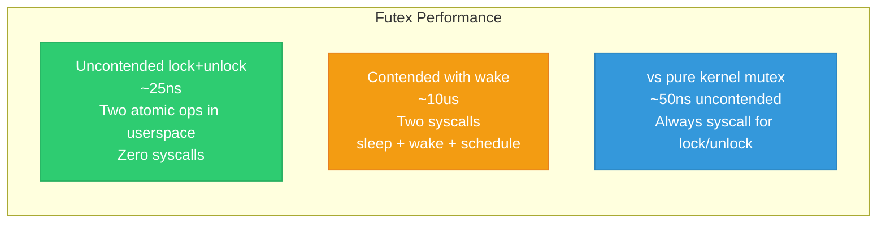

# 16 — Futex: User-Kernel Synchronization Bridge

> **Scope**: Futex mechanism, FUTEX_WAIT/FUTEX_WAKE, how pthread_mutex/condvar/sem use futex, PI futex, futex2, and performance characteristics.

---

## 1. What is a Futex?

**Futex** = **F**ast **U**serspace mu**TEX**. A hybrid primitive: the **fast path** (no contention) runs entirely in userspace with atomics. Only on **contention** does it enter the kernel to sleep/wake.



---

## 2. Futex Syscall

```c
#include <linux/futex.h>
#include <sys/syscall.h>

/* Core futex syscall */
long sys_futex(
    u32 __user *uaddr,    /* Userspace address of the futex word */
    int op,                /* Operation: WAIT, WAKE, etc. */
    u32 val,               /* Expected value (for WAIT) or count (for WAKE) */
    const struct timespec *timeout,  /* Optional timeout */
    u32 __user *uaddr2,    /* Second address (for CMP_REQUEUE) */
    u32 val3               /* Additional value */
);

/* Key operations: */
/* FUTEX_WAIT: if *uaddr == val, sleep. Else return -EAGAIN */
/* FUTEX_WAKE: wake up to val processes waiting on uaddr */
/* FUTEX_LOCK_PI: lock with priority inheritance */
/* FUTEX_UNLOCK_PI: unlock with priority inheritance */
/* FUTEX_CMP_REQUEUE: move waiters from uaddr to uaddr2 */
```

---

## 3. FUTEX_WAIT / FUTEX_WAKE Flow



---

## 4. pthread_mutex Uses Futex

```c
/* glibc pthread_mutex_lock (simplified NPTL): */

int pthread_mutex_lock(pthread_mutex_t *mutex)
{
    /* Fast path: uncontended */
    if (atomic_cmpxchg(&mutex->__lock, 0, 1) == 0)
        return 0;  /* Got it! No kernel call */
    
    /* Slow path: contended */
    int val;
    while ((val = atomic_xchg(&mutex->__lock, 2)) != 0) {
        /* Mark as contended (value=2) */
        /* Sleep in kernel until woken */
        syscall(SYS_futex, &mutex->__lock,
                FUTEX_WAIT, 2, NULL, NULL, 0);
    }
    return 0;
}

int pthread_mutex_unlock(pthread_mutex_t *mutex)
{
    /* Try fast unlock */
    if (atomic_xchg(&mutex->__lock, 0) == 2) {
        /* Was contended — wake one waiter */
        syscall(SYS_futex, &mutex->__lock,
                FUTEX_WAKE, 1, NULL, NULL, 0);
    }
    /* If was 1 (uncontended), no syscall needed */
    return 0;
}
```

---

## 5. Kernel-Side Futex Implementation

```mermaid
flowchart TD
    subgraph KernelFutex["Kernel Futex Internals"]
        HT["futex_hash_bucket array<br/>Size: 256 buckets per CPU<br/>Indexed by hash of uaddr"]
        
        subgraph Bucket["Each Hash Bucket"]
            BL["spinlock"]
            WL["List of futex_q entries<br/>Each entry = one sleeping task"]
        end
        
        HT --> Bucket
    end
    
    subgraph Wait["FUTEX_WAIT Path"]
        W1["Get user page, compute hash"]
        W2["Lock hash bucket"]
        W3["Verify *uaddr still == expected"]
        W4["If not: unlock, return EAGAIN"]
        W5["If yes: enqueue, unlock, sleep"]
        W1 --> W2 --> W3
        W3 -- "Changed" --> W4
        W3 -- "Same" --> W5
    end
    
    subgraph Wake["FUTEX_WAKE Path"]
        K1["Compute hash from uaddr"]
        K2["Lock hash bucket"]
        K3["Walk list, wake up to N waiters"]
        K4["Unlock bucket"]
        K1 --> K2 --> K3 --> K4
    end
    
    style W4 fill:#f39c12,stroke:#e67e22,color:#fff
    style W5 fill:#e74c3c,stroke:#c0392b,color:#fff
    style K3 fill:#2ecc71,stroke:#27ae60,color:#fff
```



---

## 6. Why the Atomic Check in Kernel?

```c
/* CRITICAL: kernel verifies *uaddr == val AFTER taking the bucket lock
 *
 * Why? To prevent lost wakeups:
 *
 * Thread 1 (waiter):           Thread 2 (waker):
 *   reads *uaddr == 1
 *   (about to enter kernel)
 *                                *uaddr = 0
 *                                futex(WAKE) — nobody waiting yet!
 *   futex(WAIT, val=1)
 *   kernel checks: *uaddr is 0 != 1
 *   returns -EAGAIN (retry)
 *
 * Without the kernel check, Thread 1 would sleep forever.
 * The atomic check+enqueue under bucket lock prevents this race.
 */
```

---

## 7. Futex-Based Condition Variable

```c
/* pthread_cond_wait uses futex internally */
/* Simplified flow: */

int pthread_cond_wait(pthread_cond_t *cond, pthread_mutex_t *mutex)
{
    int seq = cond->__futex;  /* Read current sequence */
    
    pthread_mutex_unlock(mutex);
    
    /* Sleep until sequence changes (= signal/broadcast) */
    syscall(SYS_futex, &cond->__futex, FUTEX_WAIT, seq,
            NULL, NULL, 0);
    
    pthread_mutex_lock(mutex);
    return 0;
}

int pthread_cond_signal(pthread_cond_t *cond)
{
    atomic_inc(&cond->__futex);  /* Change sequence */
    syscall(SYS_futex, &cond->__futex, FUTEX_WAKE, 1,
            NULL, NULL, 0);
    return 0;
}

/* FUTEX_CMP_REQUEUE: optimizes pthread_cond_broadcast
 * Instead of waking ALL, wake one and REQUEUE others
 * from condvar futex to mutex futex.
 * Avoids thundering herd. */
```

---

## 8. Process-Shared Futex

```c
/* Futexes can be shared between processes via shared memory */

/* Private futex (same process only): */
syscall(SYS_futex, &var, FUTEX_WAIT | FUTEX_PRIVATE_FLAG, ...);
/* Uses virtual address for hashing — faster */

/* Shared futex (cross-process): */
void *shm = mmap(NULL, 4096, PROT_READ | PROT_WRITE,
                 MAP_SHARED | MAP_ANONYMOUS, -1, 0);
int *futex_var = shm;

/* Fork and both processes can use the futex */
syscall(SYS_futex, futex_var, FUTEX_WAIT, ...);
/* Uses (inode, offset) for hashing — works across address spaces */
```

---

## 9. Performance Characteristics



| Operation | Cost | Syscalls |
|-----------|------|----------|
| Futex lock (uncontended) | ~25 ns | 0 |
| Futex unlock (uncontended) | ~10 ns | 0 |
| Futex lock (contended) | ~5-10 us | 1 (WAIT) |
| Futex unlock (wake waiter) | ~5 us | 1 (WAKE) |
| Kernel mutex lock | ~50 ns | 1 (always) |

---

## 10. Deep Q&A

### Q1: Why not just use a spinlock in userspace instead of futex?

**A:** Userspace spinlocks waste CPU cycles when contended — spinning for milliseconds burns battery and starves other threads. Futex sleeps in the kernel when contended, freeing the CPU. Also, the kernel scheduler doesn't know about userspace spinlocks, so it can't make priority-aware scheduling decisions. Futex integrates with the scheduler for proper wait/wake behavior.

### Q2: What is the futex hash collision problem?

**A:** Multiple futex addresses can hash to the same bucket. Waiters from different futexes share the bucket lock. Under high concurrency with many distinct futexes, this causes false sharing and contention on bucket locks. Modern kernels use per-CPU hash tables and larger bucket counts to mitigate this. `FUTEX_PRIVATE_FLAG` helps by using simpler hashing for process-private futexes.

### Q3: How does FUTEX_CMP_REQUEUE optimize condition variables?

**A:** `pthread_cond_broadcast()` wakes ALL waiters. Each re-acquires the associated mutex, but only one can hold it — the rest immediately block on the mutex. This is wasteful. `FUTEX_CMP_REQUEUE` wakes ONE waiter and moves the rest directly from the condvar's futex queue to the mutex's futex queue. Result: only one context switch instead of N, and no thundering herd.

### Q4: How does PI futex work for userspace?

**A:** `FUTEX_LOCK_PI` creates a kernel-side `rt_mutex` shadow for the userspace futex. The futex value encodes the owner's TID. When contended, the kernel applies priority inheritance: the owner's priority is boosted to the highest-priority waiter. On unlock (`FUTEX_UNLOCK_PI`), the kernel hands off ownership and de-boosts priority. This is how `PTHREAD_PRIO_INHERIT` mutexes work.

---

[← Previous: 15 — Lock Ordering and Deadlock](15_Lock_Ordering_Deadlock.md) | [Next: 17 — Spinlock Variants: BH, IRQ, Nested →](17_Spinlock_Variants_BH_IRQ.md)
