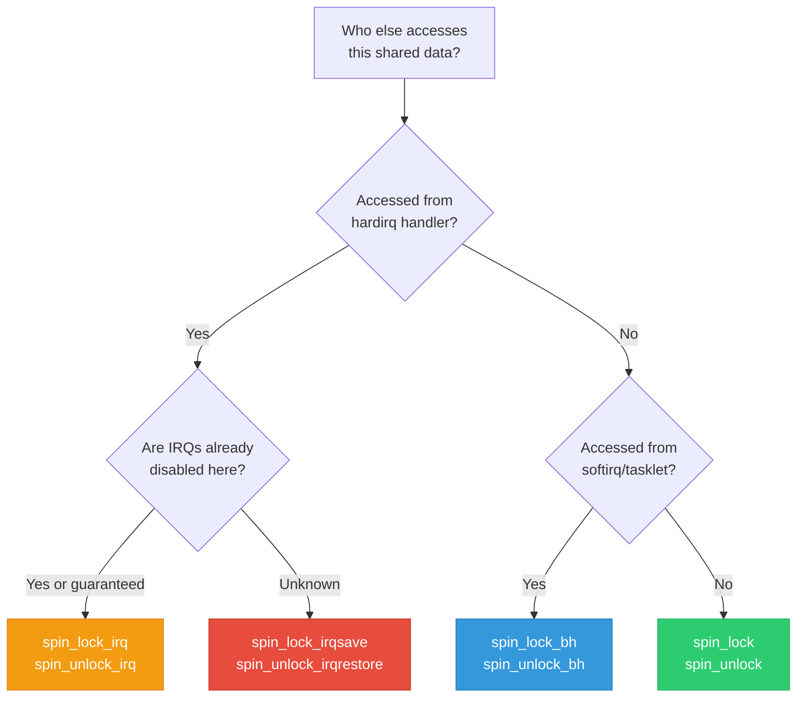
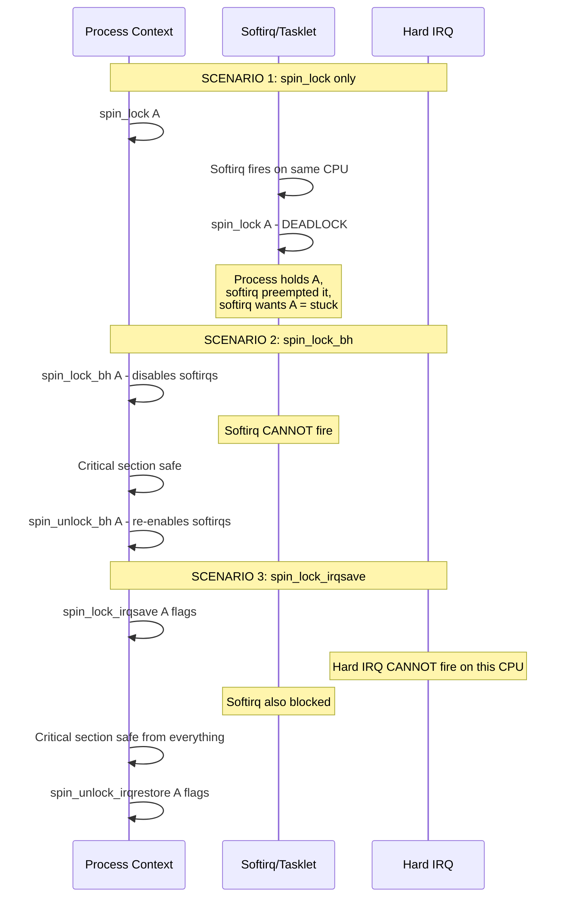
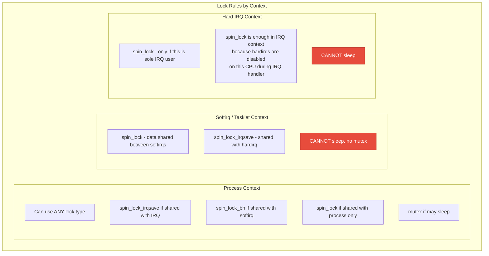

# 17 — Spinlock Variants: BH, IRQ, and Nested

> **Scope**: spin_lock_bh, spin_lock_irq, spin_lock_irqsave, nested spinlocks, spin_lock_nested, local_bh_disable, local_irq_disable, and choosing the right variant for each context.

---

## 1. Spinlock Variant Decision Tree



---

## 2. Why Each Variant Exists



---

## 3. Each Variant Explained

### spin_lock — Basic

```c
spin_lock(&lock);
/* Disables: preemption
 * Does NOT disable: IRQs, softirqs
 * Use when: data shared ONLY between process contexts
 * on different CPUs */
spin_unlock(&lock);
```

### spin_lock_bh — Bottom Half

```c
spin_lock_bh(&lock);
/* Disables: preemption + softirqs (bottom halves)
 * Does NOT disable: hard IRQs
 * Use when: data shared between process context
 * and softirq/tasklet */
spin_unlock_bh(&lock);

/* Equivalent to: */
local_bh_disable();
spin_lock(&lock);
/* ... */
spin_unlock(&lock);
local_bh_enable();
```

### spin_lock_irq — IRQ Disable

```c
spin_lock_irq(&lock);
/* Disables: preemption + ALL IRQs on this CPU
 * Use when: data shared with IRQ handler
 * AND you KNOW IRQs are currently enabled
 * CAUTION: unconditionally re-enables IRQs on unlock */
spin_unlock_irq(&lock);

/* DANGEROUS if called from context where IRQs are already disabled:
 * spin_unlock_irq will ENABLE IRQs unexpectedly! */
```

### spin_lock_irqsave — Safest

```c
unsigned long flags;
spin_lock_irqsave(&lock, flags);
/* Saves current IRQ state, then disables IRQs + preemption
 * Use when: data shared with IRQ handler
 * AND IRQ state is UNKNOWN (might already be disabled)
 * ALWAYS safe. Preferred variant for IRQ-shared data. */
spin_unlock_irqrestore(&lock, flags);
/* Restores IRQ state to what it was before */
```

---

## 4. What Each Variant Disables

| Variant | Preemption | Softirq/BH | Hard IRQ | Context |
|---------|-----------|------------|----------|---------|
| `spin_lock` | YES | no | no | Process only |
| `spin_lock_bh` | YES | YES | no | Process + softirq |
| `spin_lock_irq` | YES | YES* | YES | Process + IRQ |
| `spin_lock_irqsave` | YES | YES* | YES + save | Any context |

*Disabling IRQs implicitly prevents softirqs from running (they run after IRQ handlers)

---

## 5. local_bh_disable / local_irq_disable

```c
/* These disable bottom halves / IRQs WITHOUT taking a lock */

/* Disable/enable softirqs on this CPU */
local_bh_disable();
/* Softirqs and tasklets cannot run on this CPU */
/* Other CPUs are unaffected */
local_bh_enable();

/* Disable/enable IRQs on this CPU */
local_irq_disable();
local_irq_enable();

/* Save/restore IRQ state */
unsigned long flags;
local_irq_save(flags);
/* ... IRQs disabled, original state saved ... */
local_irq_restore(flags);

/* These are used to protect per-CPU data that is
 * accessed from both process and IRQ/softirq context
 * but doesn't need a cross-CPU lock */
```

---

## 6. IRQ Context Lock Rules



---

## 7. Nested Spinlocks

```c
/* Taking multiple spinlocks requires consistent ordering */

/* Correct: always A before B */
spin_lock(&lock_a);
spin_lock(&lock_b);       /* Fine: lockdep tracks A→B */
/* ... */
spin_unlock(&lock_b);
spin_unlock(&lock_a);

/* Same-class locks require spin_lock_nested: */
void lock_child(struct device *parent, struct device *child)
{
    spin_lock(&parent->lock);
    spin_lock_nested(&child->lock, SINGLE_DEPTH_NESTING);
    /* lockdep knows child is a different nesting level */
}

/* Nesting levels: */
#define SINGLE_DEPTH_NESTING 1
/* For deeper nesting, use 2, 3, etc. */

/* Mixed variants: */
spin_lock_irqsave(&outer_lock, flags);
spin_lock(&inner_lock);  /* IRQs already disabled */
/* No need for irqsave on inner — already disabled by outer */
spin_unlock(&inner_lock);
spin_unlock_irqrestore(&outer_lock, flags);
```

---

## 8. Common Mistakes

```c
/* MISTAKE 1: spin_lock_irq when IRQs might be disabled */
void some_function(void)  /* Called from unknown context */
{
    spin_lock_irq(&lock);
    /* ... */
    spin_unlock_irq(&lock);  /* BUG: enables IRQs even if
                                 caller had them disabled! */
}
/* FIX: use spin_lock_irqsave */

/* MISTAKE 2: spin_lock in process ctx, lock shared with softirq */
spin_lock(&lock);
/* Softirq fires here, tries spin_lock(&lock) → DEADLOCK */
spin_unlock(&lock);
/* FIX: use spin_lock_bh */

/* MISTAKE 3: sleeping while holding spinlock */
spin_lock(&lock);
kmalloc(size, GFP_KERNEL);  /* BUG: GFP_KERNEL can sleep! */
spin_unlock(&lock);
/* FIX: use GFP_ATOMIC or move kmalloc outside lock */

/* MISTAKE 4: copy_to_user under spinlock */
spin_lock(&lock);
copy_to_user(ubuf, kbuf, len);  /* BUG: can page fault → sleep */
spin_unlock(&lock);
/* FIX: copy to temp buffer outside lock, then copy_to_user */
```

---

## 9. Real Driver: All Variants in One Device

```c
struct my_device {
    spinlock_t data_lock;       /* Shared: process + softirq */
    spinlock_t irq_lock;        /* Shared: process + IRQ handler */
    struct mutex config_lock;    /* Process context only, may sleep */
    
    struct list_head rx_list;   /* Protected by data_lock */
    u32 hw_status;              /* Protected by irq_lock */
    u8 config[64];              /* Protected by config_lock */
};

/* Process context: configure device (may sleep) */
void configure(struct my_device *dev, u8 *cfg)
{
    mutex_lock(&dev->config_lock);
    memcpy(dev->config, cfg, 64);         /* Fine: mutex allows sleep */
    mutex_unlock(&dev->config_lock);
}

/* Process context: read rx list (shared with softirq) */
void process_rx(struct my_device *dev)
{
    spin_lock_bh(&dev->data_lock);        /* Disable softirqs */
    /* Process rx_list entries */
    spin_unlock_bh(&dev->data_lock);
}

/* Softirq (NAPI poll): add to rx list */
void napi_rx(struct my_device *dev, struct sk_buff *skb)
{
    spin_lock(&dev->data_lock);            /* In softirq: plain ok */
    list_add_tail(&skb->list, &dev->rx_list);
    spin_unlock(&dev->data_lock);
}

/* Process context: read hw status (shared with IRQ) */
u32 read_status(struct my_device *dev)
{
    unsigned long flags;
    u32 status;
    spin_lock_irqsave(&dev->irq_lock, flags);  /* Save + disable IRQ */
    status = dev->hw_status;
    spin_unlock_irqrestore(&dev->irq_lock, flags);
    return status;
}

/* IRQ handler: update hw status */
irqreturn_t my_irq(int irq, void *data)
{
    struct my_device *dev = data;
    spin_lock(&dev->irq_lock);              /* IRQs already off in handler */
    dev->hw_status = readl(dev->regs + STATUS);
    spin_unlock(&dev->irq_lock);
    return IRQ_HANDLED;
}
```

---

## 10. Deep Q&A

### Q1: Why use spin_lock_irqsave instead of always using spin_lock_irq?

**A:** `spin_lock_irq` unconditionally enables IRQs on unlock. If the caller already had IRQs disabled (e.g., called from another IRQ-disabled section or from an IRQ handler that nested), enabling IRQs would be incorrect and dangerous. `spin_lock_irqsave` saves the current IRQ state and restores it on unlock, making it safe in ANY context. The rule: if you don't control all callers, use `irqsave`.

### Q2: In an IRQ handler, why is plain spin_lock sufficient?

**A:** When the hard IRQ handler runs, IRQs are already disabled on that CPU (by hardware). So there's no risk of the same IRQ re-entering. The spin_lock is needed only for SMP protection (other CPUs). Since IRQs are already off, `spin_lock_irqsave` would save/restore the same disabled state — correct but wasteful. Plain `spin_lock` suffices.

### Q3: What does spin_lock_bh actually do internally?

**A:** `spin_lock_bh(&lock)` calls: (1) `__local_bh_disable_ip()` which increments the softirq count in `preempt_count` by `SOFTIRQ_DISABLE_OFFSET`. (2) `spin_lock(&lock)` which increments the preemption count. On unlock: (1) `spin_unlock()` decrements preemption count. (2) `local_bh_enable()` decrements softirq count and, if it reaches zero, checks if softirqs are pending and runs them.

### Q4: Can two different softirqs run simultaneously on different CPUs?

**A:** Yes. `local_bh_disable` only disables softirqs on the local CPU. Different CPUs can run the same softirq handler simultaneously. That's why you need `spin_lock` between softirqs on different CPUs. Within a single CPU, softirqs are serialized (one at a time), so `spin_lock` alone (without `_bh`) is sufficient inside a softirq handler.

---

[← Previous: 16 — Futex: User-Kernel Sync](16_Futex_User_Kernel_Sync.md) | [Next: 18 — Lock-Free Algorithms →](18_Lock_Free_Algorithms.md)
