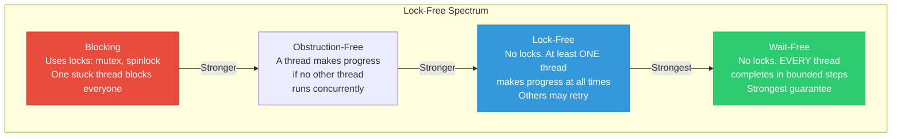
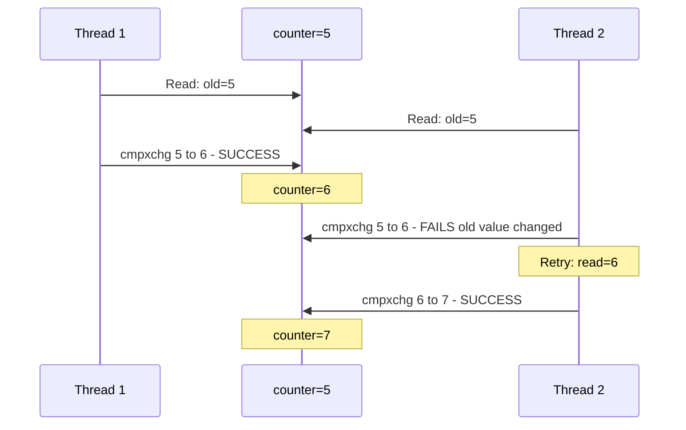
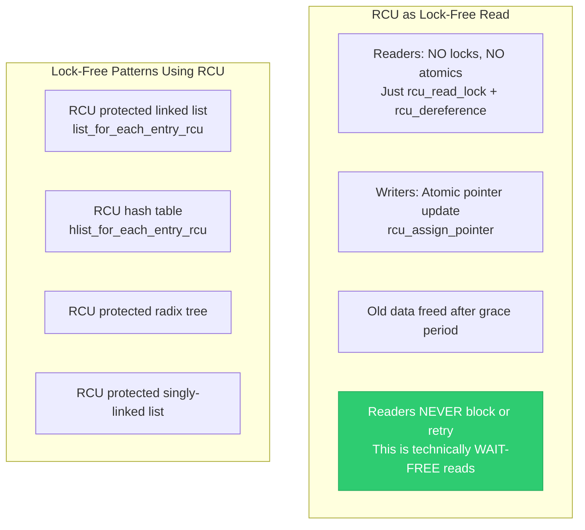
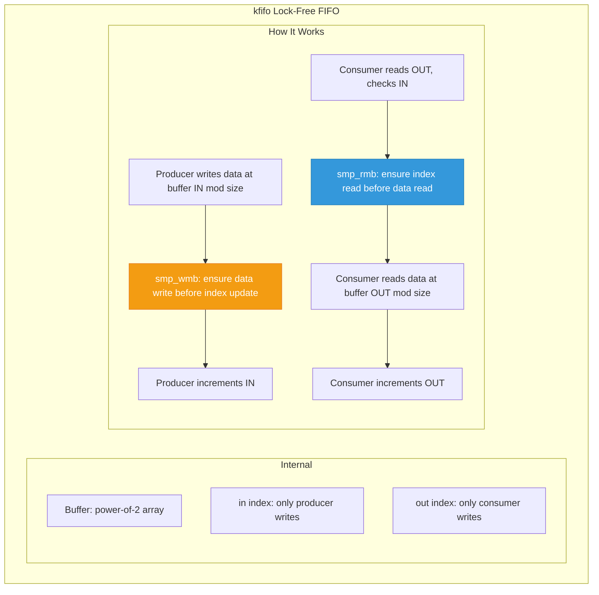
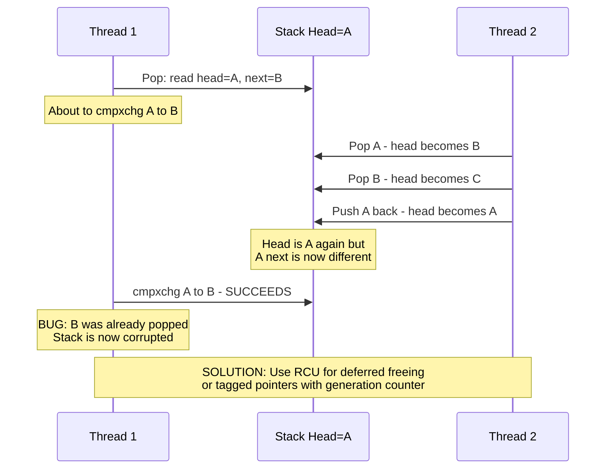
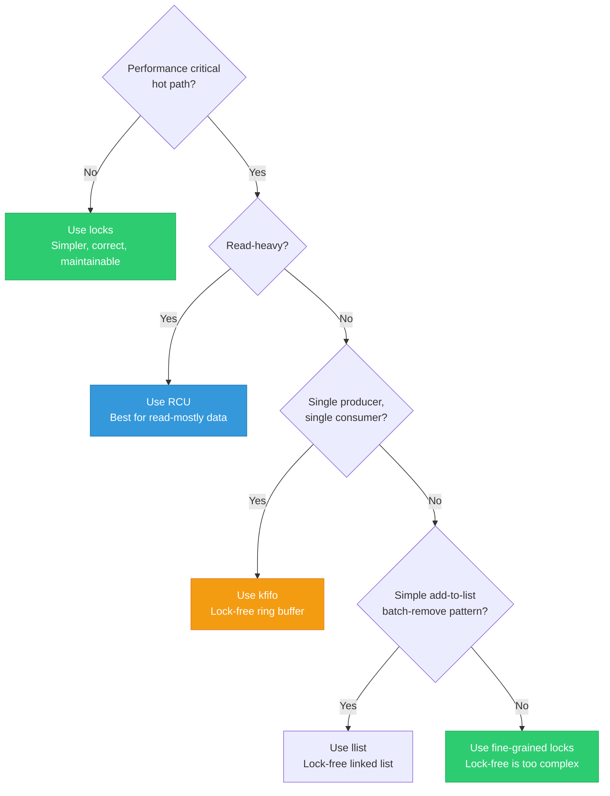

# 18 — Lock-Free Algorithms in the Linux Kernel

> **Scope**: Lock-free vs wait-free, RCU-based lock-free patterns, lockless queues (kfifo), atomic pointer operations, cmpxchg loops, hazard pointers concept, and kernel lock-free data structures.

---

## 1. Lock-Free Terminology



---

## 2. The cmpxchg Loop — Foundation of Lock-Free

```c
/* Compare-and-exchange: the core atomic primitive */
/* atomic_cmpxchg(ptr, expected, new):
 *   if (*ptr == expected) { *ptr = new; return expected; }
 *   else { return *ptr; }
 *   ALL done atomically in ONE instruction */

/* Lock-free increment pattern: */
void lock_free_increment(atomic_t *counter)
{
    int old, new;
    do {
        old = atomic_read(counter);
        new = old + 1;
    } while (atomic_cmpxchg(counter, old, new) != old);
    /* If someone changed counter between read and cmpxchg,
     * cmpxchg fails, we retry with the new value.
     * GUARANTEED: at least one thread succeeds per round. */
}
```



---

## 3. RCU — The Kernel's Primary Lock-Free Mechanism



### Lock-Free List Update:

```c
/* Lock-free insertion (RCU): */
void rcu_list_add(struct item *new, struct list_head *head)
{
    /* No lock needed for the publish step — it's atomic */
    list_add_rcu(&new->list, head);
    /* rcu_assign_pointer ensures new node's fields are
     * visible before the list pointer is updated */
}

/* Reader traversal — completely lock-free: */
struct item *find(int key)
{
    struct item *item;
    rcu_read_lock();
    list_for_each_entry_rcu(item, &my_list, list) {
        if (item->key == key) {
            rcu_read_unlock();
            return item;
        }
    }
    rcu_read_unlock();
    return NULL;
}
```

---

## 4. kfifo — Lock-Free Ring Buffer

```c
#include <linux/kfifo.h>

/* kfifo: single-producer, single-consumer lock-free FIFO */
DEFINE_KFIFO(my_fifo, struct event, 256);  /* power-of-2 size */

/* Producer (one thread only): */
struct event e = { .type = EVENT_DATA, .value = 42 };
kfifo_put(&my_fifo, e);
/* No lock needed! Uses memory barriers internally */

/* Consumer (one thread only): */
struct event e;
if (kfifo_get(&my_fifo, &e))
    process_event(&e);
/* No lock needed! */
```



```c
/* kfifo internal implementation (simplified): */
struct kfifo {
    unsigned int in;     /* Write index (producer only) */
    unsigned int out;    /* Read index (consumer only) */
    unsigned int mask;   /* size - 1 (power of 2) */
    void *data;
};

bool kfifo_put(struct kfifo *fifo, const void *val)
{
    unsigned int off = fifo->in & fifo->mask;
    
    if (kfifo_is_full(fifo))
        return false;
    
    memcpy(fifo->data + off * elem_size, val, elem_size);
    
    smp_wmb();  /* Data visible before index update */
    fifo->in++;
    return true;
}

bool kfifo_get(struct kfifo *fifo, void *val)
{
    unsigned int off;
    
    if (kfifo_is_empty(fifo))
        return false;
    
    smp_rmb();  /* Index read before data read */
    off = fifo->out & fifo->mask;
    memcpy(val, fifo->data + off * elem_size, elem_size);
    
    fifo->out++;
    return true;
}
```

---

## 5. Lock-Free Stack (Treiber Stack)

```c
/* Classic lock-free stack using cmpxchg */
struct node {
    void *data;
    struct node *next;
};

struct lock_free_stack {
    struct node *head;  /* Atomic pointer */
};

void push(struct lock_free_stack *s, struct node *new)
{
    struct node *old_head;
    do {
        old_head = READ_ONCE(s->head);
        new->next = old_head;
    } while (cmpxchg(&s->head, old_head, new) != old_head);
}

struct node *pop(struct lock_free_stack *s)
{
    struct node *old_head;
    struct node *new_head;
    do {
        old_head = READ_ONCE(s->head);
        if (!old_head)
            return NULL;
        new_head = old_head->next;
    } while (cmpxchg(&s->head, old_head, new_head) != old_head);
    return old_head;
    /* WARNING: ABA problem exists — need RCU or epoch for safe free */
}
```

---

## 6. The ABA Problem



```c
/* ABA solution in Linux: use RCU */
struct node *pop(struct lock_free_stack *s)
{
    struct node *old_head;
    struct node *new_head;
    
    rcu_read_lock();
    do {
        old_head = rcu_dereference(s->head);
        if (!old_head) {
            rcu_read_unlock();
            return NULL;
        }
        new_head = READ_ONCE(old_head->next);
    } while (cmpxchg(&s->head, old_head, new_head) != old_head);
    rcu_read_unlock();
    
    /* Don't free old_head immediately — other threads may reference it */
    /* Caller must: kfree_rcu(old_head, rcu) */
    return old_head;
}
```

---

## 7. llist — Lock-Free Singly Linked List

```c
#include <linux/llist.h>

/* Linux provides a lock-free singly-linked list */
struct llist_head my_list = LLIST_HEAD_INIT(my_list);

struct my_item {
    struct llist_node node;
    int data;
};

/* Add (lock-free, multiple producers OK): */
struct my_item *item = kmalloc(sizeof(*item), GFP_KERNEL);
item->data = 42;
llist_add(&item->node, &my_list);
/* Uses cmpxchg loop internally */

/* Delete all (single consumer): */
struct llist_node *list = llist_del_all(&my_list);
/* Atomically removes entire list, returns old head */

/* Process removed items: */
struct llist_node *pos;
llist_for_each(pos, list) {
    struct my_item *item = llist_entry(pos, struct my_item, node);
    process(item);
    kfree(item);
}
```

---

## 8. When to Use Lock-Free vs Locks



---

## 9. Deep Q&A

### Q1: Why is lock-free programming hard?

**A:** (1) Memory ordering: without locks, you must manually reason about CPU and compiler reordering. (2) ABA problem: detecting that data changed and changed back requires extra mechanisms. (3) Memory reclamation: you can't free nodes while other threads may reference them — need RCU, hazard pointers, or epoch-based reclamation. (4) Testing: bugs manifest only under specific timing — hard to reproduce.

### Q2: Is RCU truly lock-free?

**A:** RCU readers are actually **wait-free** — they complete in constant time (just preempt_disable/enable) regardless of what other threads do. RCU writers use locks to serialize updates, but readers never block on those locks. So: readers are wait-free, the overall system (read+write) is lock-free (readers always make progress, writers may be serialized).

### Q3: When does kfifo need external locking?

**A:** kfifo is lock-free ONLY for single-producer/single-consumer. If you have multiple producers, you must serialize them with a spinlock. If you have multiple consumers, same. For MPMC (multi-producer/multi-consumer), use `kfifo_in_spinlocked()` and `kfifo_out_spinlocked()` which take an external spinlock.

### Q4: What is the performance advantage of lock-free?

**A:** Lock-free eliminates: (1) Cache-line bouncing from lock acquisition (shared counter). (2) Convoying: all threads serialize behind one lock holder. (3) Priority inversion: no lock to cause it. (4) Context switch overhead: no sleeping. Benchmarks show 2-10x throughput improvement for read-heavy workloads (RCU vs rwlock). For write-heavy workloads, the advantage is smaller or may even be negative due to retry overhead.

---

[← Previous: 17 — Spinlock Variants: BH, IRQ, Nested](17_Spinlock_Variants_BH_IRQ.md) | [Next: 19 — Synchronization in Interrupt Context →](19_Sync_in_Interrupt_Context.md)
