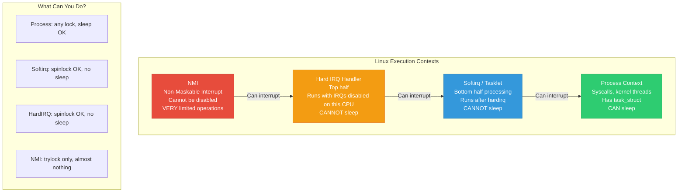
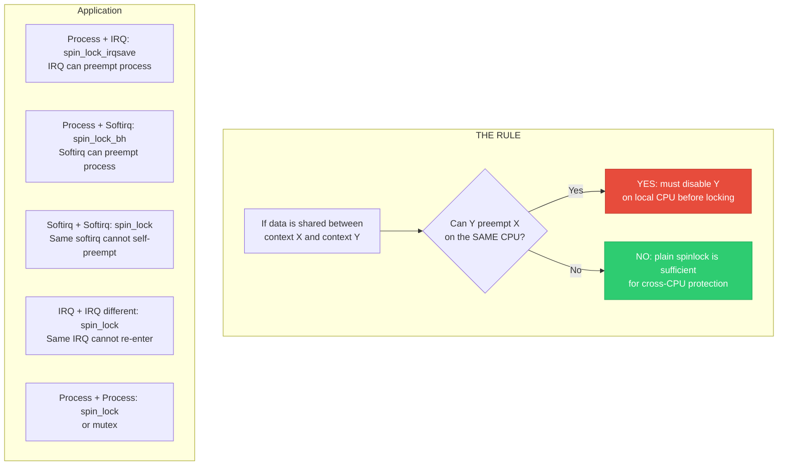
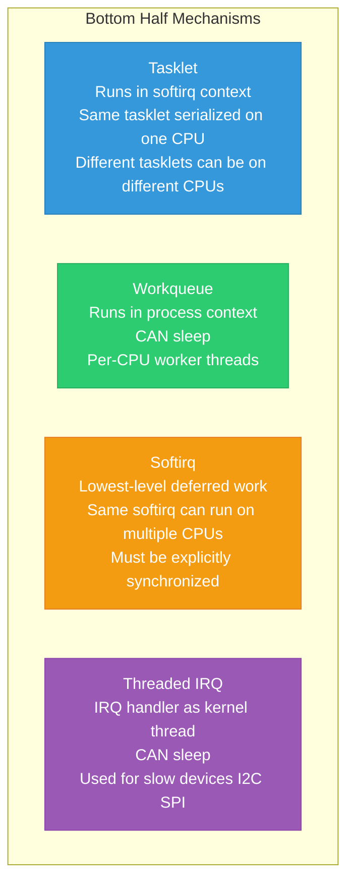
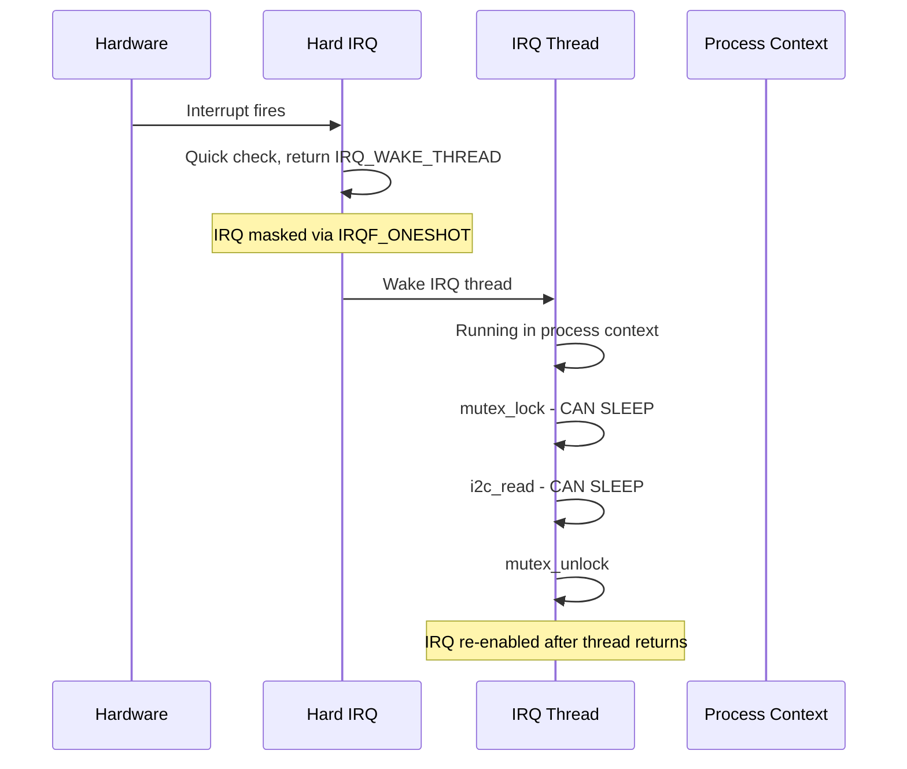

# 19 — Synchronization in Interrupt Context

> **Scope**: Top half vs bottom half synchronization, IRQ handler constraints, threaded IRQs, workqueue sync, softirq serialization, and locking rules across all execution contexts.

---

## 1. Execution Contexts in Linux



---

## 2. The Fundamental Rule



---

## 3. Complete Context Interaction Matrix

| Data shared between | Lock needed in LOWER context | Why |
|--------------------|-----------------------------|-----|
| Process + Process | `spin_lock` or `mutex` | Preemption handled by lock |
| Process + Softirq | `spin_lock_bh` (in process) | Softirq can preempt process |
| Process + IRQ | `spin_lock_irqsave` (in process) | IRQ can preempt process |
| Softirq + Softirq (same type) | `spin_lock` | Same softirq doesn't re-enter on same CPU |
| Softirq + Softirq (diff type) | `spin_lock` | Different softirqs serialize on one CPU |
| Softirq + IRQ | `spin_lock_irqsave` (in softirq) | IRQ can preempt softirq |
| IRQ + IRQ (same) | `spin_lock` | Hardware prevents re-entry |
| IRQ + IRQ (different) | `spin_lock` | Only one IRQ at a time per CPU |
| NMI + anything | `raw_spin_trylock` | NMI cannot block |

---

## 4. Top Half (IRQ Handler) Synchronization

```c
/* Hard IRQ handler constraints:
 * 1. CANNOT sleep (no mutex, no GFP_KERNEL, no copy_from_user)
 * 2. CANNOT take blocking locks
 * 3. Should be FAST (microseconds)
 * 4. IRQs disabled on THIS CPU (other CPUs can run)
 */

irqreturn_t my_irq_handler(int irq, void *dev_id)
{
    struct my_device *dev = dev_id;
    u32 status;
    
    /* Read hardware status */
    status = readl(dev->regs + STATUS_REG);
    if (!(status & dev->irq_mask))
        return IRQ_NONE;
    
    /* Shared data: use spinlock (IRQs already off on this CPU) */
    spin_lock(&dev->lock);  /* Plain lock — IRQs already disabled */
    dev->irq_status = status;
    dev->irq_count++;
    spin_unlock(&dev->lock);
    
    /* Acknowledge interrupt */
    writel(status, dev->regs + ACK_REG);
    
    /* Schedule bottom half */
    tasklet_schedule(&dev->tasklet);
    /* OR: schedule work: schedule_work(&dev->work); */
    
    return IRQ_HANDLED;
}
```

---

## 5. Bottom Half Synchronization



### Tasklet Sync with IRQ:

```c
struct my_device {
    spinlock_t lock;      /* Shared between IRQ and tasklet */
    struct tasklet_struct tasklet;
    u32 irq_status;
    struct list_head pending;
};

/* Tasklet handler (softirq context — cannot sleep) */
void my_tasklet_fn(unsigned long data)
{
    struct my_device *dev = (struct my_device *)data;
    u32 status;
    
    /* Shared with IRQ handler — need irqsave */
    spin_lock_irqsave(&dev->lock, flags);
    status = dev->irq_status;
    dev->irq_status = 0;
    spin_unlock_irqrestore(&dev->lock, flags);
    
    /* Process the status — still in softirq context */
    process_hw_events(dev, status);
}
```

### Workqueue (Can Sleep):

```c
/* Workqueue handler (process context — CAN sleep) */
void my_work_fn(struct work_struct *work)
{
    struct my_device *dev = container_of(work, struct my_device, work);
    
    /* Can use mutex — process context */
    mutex_lock(&dev->config_mutex);
    
    /* Can call sleeping functions */
    i2c_smbus_write_byte(dev->client, dev->pending_config);
    msleep(10);
    
    mutex_unlock(&dev->config_mutex);
}
```

---

## 6. Threaded IRQ Handlers

```c
/* Threaded IRQ: hardirq handler + thread handler */
ret = request_threaded_irq(irq,
    my_hard_irq,       /* Top half: fast, IRQs disabled */
    my_thread_irq,     /* Bottom half: kernel thread, CAN sleep */
    IRQF_ONESHOT,       /* Keep IRQ disabled until thread completes */
    "my_device", dev);

/* Hard IRQ handler: quick check and acknowledge */
irqreturn_t my_hard_irq(int irq, void *dev_id)
{
    struct my_device *dev = dev_id;
    if (!(readl(dev->regs + STATUS) & IRQ_PENDING))
        return IRQ_NONE;
    return IRQ_WAKE_THREAD;  /* Wake the thread handler */
}

/* Thread handler: runs in process context */
irqreturn_t my_thread_irq(int irq, void *dev_id)
{
    struct my_device *dev = dev_id;
    
    /* CAN sleep! CAN use mutex! */
    mutex_lock(&dev->data_mutex);
    
    /* Slow I2C/SPI read */
    dev->value = i2c_smbus_read_word(dev->client, REG_DATA);
    
    mutex_unlock(&dev->data_mutex);
    return IRQ_HANDLED;
}
```



---

## 7. Synchronizing Module Removal

```c
/* When removing a module, you must ensure:
 * 1. No IRQ handler is running
 * 2. No tasklet/softirq is pending
 * 3. No workqueue item is pending
 * 4. No timer is pending
 */

void my_remove(struct platform_device *pdev)
{
    struct my_device *dev = platform_get_drvdata(pdev);
    
    /* 1. Disable and free IRQ — waits for running handler */
    free_irq(dev->irq, dev);
    
    /* 2. Kill tasklet — waits for running tasklet */
    tasklet_kill(&dev->tasklet);
    
    /* 3. Flush and destroy workqueue */
    cancel_work_sync(&dev->work);
    /* cancel_work_sync waits for running work to complete */
    
    /* 4. Delete timer — synchronous */
    del_timer_sync(&dev->timer);
    
    /* Now safe to free resources */
    kfree(dev);
}
```

---

## 8. NMI Context — Most Restricted

```c
/* NMI cannot be masked. NMI handler can interrupt ANYTHING:
 * even code holding spinlocks, even other IRQ handlers.
 *
 * Rules for NMI handlers:
 * 1. NEVER take a blocking lock
 * 2. Use raw_spin_trylock — if fails, skip the operation
 * 3. Only read per-CPU data (safe, no locking needed)
 * 4. Use NMI-safe functions only (printk is NMI-safe since 5.x)
 */

int my_nmi_handler(unsigned int val, struct pt_regs *regs)
{
    /* TRY to get the lock, don't spin */
    if (!raw_spin_trylock(&my_nmi_lock)) {
        /* Lock is held — cannot proceed safely */
        return NMI_DONE;
    }
    
    /* Minimal work under lock */
    nmi_data.timestamp = rdtsc();
    nmi_data.count++;
    
    raw_spin_unlock(&my_nmi_lock);
    return NMI_HANDLED;
}
```

---

## 9. Deep Q&A

### Q1: Why does a softirq need spin_lock (not plain access) for data shared with other softirq instances?

**A:** The same softirq type can run on different CPUs simultaneously. CPU 0 and CPU 1 can both run NET_RX_SOFTIRQ at the same time. If they access shared data (e.g., a global packet counter), they need a spinlock for cross-CPU synchronization. On the SAME CPU, softirqs are serialized (only one runs at a time), so no locking is needed for data accessed only on the local CPU.

### Q2: What is IRQF_ONESHOT and why is it important for threaded IRQs?

**A:** `IRQF_ONESHOT` keeps the interrupt line masked after the hard IRQ handler returns and until the threaded handler completes. Without it: the hard IRQ handler returns, the IRQ is re-enabled, the device still has the pending interrupt, the IRQ fires again immediately — infinite loop. Oneshot ensures the threaded handler has time to clear the interrupt source before the IRQ is re-enabled.

### Q3: Can a workqueue item reschedule itself?

**A:** Yes. A work function can call `schedule_work()` or `queue_delayed_work()` to re-add itself. But be careful: (1) use `cancel_work_sync()` during cleanup to stop the cycle, (2) don't use `schedule_work()` on the same work struct if it might already be queued (use `mod_delayed_work()` instead), (3) avoid infinite re-scheduling without an exit condition.

### Q4: How do you safely share data between process context and NMI?

**A:** You cannot use any blocking primitive. Options: (1) Per-CPU variables — NMI handler writes to current CPU's copy, process context aggregates all copies. (2) Lock-free ring buffer — NMI produces, process context consumes. (3) `raw_spin_trylock` — NMI attempts lock, skips if busy. (4) Atomic operations for simple counters. The key constraint: NMI must NEVER block or spin, so any locking must be non-blocking.

---

[← Previous: 18 — Lock-Free Algorithms](18_Lock_Free_Algorithms.md) | [Next: 20 — Full Synchronization Decision Matrix →](20_Full_Sync_Decision_Matrix.md)
