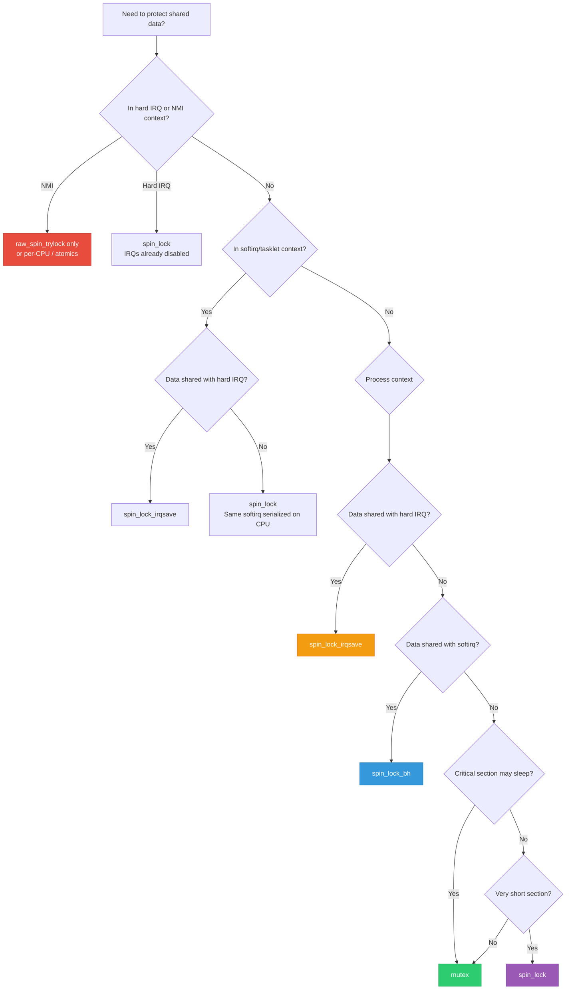
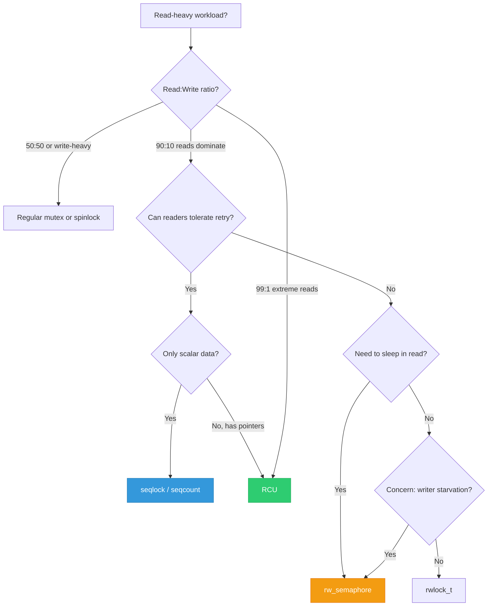
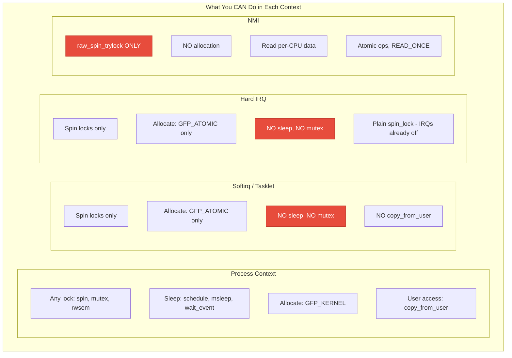
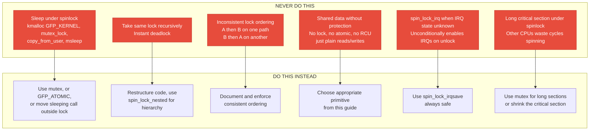

# 20 — Full Synchronization Decision Matrix

> **Scope**: Comprehensive guide to choosing the right synchronization primitive for every scenario. Master reference for kernel developers and interview preparation.

---

## 1. The Master Decision Flowchart



---

## 2. Read-Write Pattern Decision



---

## 3. Complete Primitive Reference Table

| Primitive | Wait | Context | Sleep OK? | PI? | Owner? | Best For |
|-----------|------|---------|-----------|-----|--------|----------|
| `atomic_t` | No wait | Any | N/A | N/A | N/A | Simple counters, flags |
| `spin_lock` | Spin | Process | NO | No | No | Short critical sections |
| `spin_lock_bh` | Spin | Process | NO | No | No | Shared with softirq |
| `spin_lock_irqsave` | Spin | Any | NO | No | No | Shared with IRQ |
| `raw_spinlock_t` | Spin | Any | NO | No | No | Scheduler, RT core |
| `mutex` | Sleep | Process | YES | No* | YES | General sleeping lock |
| `rt_mutex` | Sleep | Process | YES | YES | YES | RT priority inheritance |
| `semaphore` | Sleep | Process | YES | No | No | Count > 1, legacy |
| `rw_semaphore` | Sleep | Process | YES | No | writer | Read-heavy, long sections |
| `rwlock_t` | Spin | Process+IRQ | NO | No | No | Read-heavy, short sections |
| `seqlock_t` | Retry | Readers: any | NO | No | writer | Timestamps, counters |
| `RCU` | None | Readers: any | NO** | N/A | N/A | Read-mostly traversal |
| `SRCU` | None | Readers: any | YES | N/A | N/A | Sleepable RCU reads |
| `completion` | Sleep | Process | YES | No | No | Wait-for-done events |
| `wait_queue` | Sleep | Process | YES | No | No | Condition-based wait |
| `per-CPU` | None | Process+IRQ | N/A | N/A | N/A | Per-CPU stats, avoids lock |
| `kfifo` | None | Any (SPSC) | N/A | N/A | N/A | Lock-free ring buffer |
| `llist` | None | Any | N/A | N/A | N/A | Lock-free list, batch |
| `futex` | Sleep | User+Kernel | YES | PI variant | YES | Userspace locking |

*mutex gets PI under PREEMPT_RT. **Classic RCU readers cannot sleep; SRCU can.

---

## 4. Context Rules Summary



---

## 5. Performance Comparison

| Primitive | Uncontended Cost | Contended Cost | Scalability |
|-----------|-----------------|----------------|-------------|
| `atomic_inc` | ~5 ns (LOCK inc) | ~50 ns (cache bounce) | Moderate |
| `spin_lock` | ~10 ns | CPU spins, wastes cycles | Poor under high contention |
| `mutex` | ~20 ns (fast path) | Context switch ~5 us | Good with adaptive spin |
| `rw_semaphore` | ~25 ns | Reader: concurrent, Writer: wait | Good for reads |
| `RCU read` | ~1 ns (preempt_disable) | No contention possible | Perfect |
| `seqlock read` | ~5 ns + retry cost | Retry on write | Excellent for rare writes |
| `per-CPU` | ~1 ns (this_cpu_inc) | No contention possible | Perfect |
| `completion` | ~20 ns | Context switch ~5 us | N/A (event) |
| `futex` (user) | ~25 ns | Syscall ~5 us | Good |

---

## 6. Common Scenarios Quick Reference

### Scenario 1: Device Driver Data

```c
/* Device has: config (slow, can sleep), 
 * runtime data (shared with softirq),
 * hardware status (shared with IRQ) */

struct my_device {
    struct mutex config_lock;    /* Process context only */
    spinlock_t data_lock;        /* Process + softirq */
    spinlock_t irq_lock;         /* Process + IRQ */
};

/* Config: */     mutex_lock(&dev->config_lock);
/* Data: */       spin_lock_bh(&dev->data_lock);
/* HW status: */  spin_lock_irqsave(&dev->irq_lock, flags);
```

### Scenario 2: Global Statistics

```c
/* Per-CPU counters — no locking needed */
DEFINE_PER_CPU(u64, packet_count);

/* Hot path: */   this_cpu_inc(packet_count);
/* Read total: */ for_each_possible_cpu(cpu) total += per_cpu(packet_count, cpu);
```

### Scenario 3: Read-Mostly Configuration

```c
/* RCU for configuration that changes rarely */
struct config __rcu *global_cfg;

/* Reader (very fast): */
rcu_read_lock();
cfg = rcu_dereference(global_cfg);
use(cfg);
rcu_read_unlock();

/* Writer (rare): */
new_cfg = copy_and_modify(old_cfg);
rcu_assign_pointer(global_cfg, new_cfg);
kfree_rcu(old_cfg, rcu);
```

### Scenario 4: Producer-Consumer Queue

```c
/* kfifo for single-producer, single-consumer */
DEFINE_KFIFO(events, struct event, 256);

/* Producer: */ kfifo_put(&events, ev);  /* No lock */
/* Consumer: */ kfifo_get(&events, &ev); /* No lock */
```

### Scenario 5: Wait for Hardware

```c
/* Completion for IRQ-based hardware events */
reinit_completion(&dev->done);
start_dma_transfer(dev);
wait_for_completion_timeout(&dev->done, HZ);
/* IRQ handler: complete(&dev->done); */
```

---

## 7. Anti-Patterns to Avoid



---

## 8. Interview Cheat Sheet

### "Which lock should I use?" — 30-Second Answer:

1. **Can you avoid locking?** → per-CPU, RCU, atomic
2. **Shared with IRQ handler?** → `spin_lock_irqsave`
3. **Shared with softirq?** → `spin_lock_bh`
4. **Need to sleep?** → `mutex`
5. **Short, fast, no sleep?** → `spin_lock`
6. **Read-heavy, no pointers?** → `seqlock`
7. **Read-heavy, pointers?** → `RCU`
8. **Wait for event?** → `completion`
9. **Limit concurrent access?** → `semaphore(n)`
10. **PREEMPT_RT determinism?** → `rt_mutex`

### "What can go wrong?" — Top 5 Bugs:

1. **ABBA deadlock** — inconsistent lock ordering
2. **Sleep under spinlock** — scheduling while atomic
3. **IRQ self-deadlock** — spin_lock (not irqsave) shared with IRQ
4. **Use-after-free without RCU** — freeing while readers exist
5. **Missing barrier** — reordered writes visible incorrectly on other CPUs

---

## 9. Deep Q&A

### Q1: Design a synchronization scheme for a network driver.

**A:** A typical network driver needs:
- **`spinlock` with `_irqsave`** for TX ring shared between `ndo_start_xmit()` (process) and TX completion IRQ
- **NAPI with `spin_lock`** for RX ring: NAPI poll runs in softirq, IRQ just schedules NAPI
- **`mutex`** for ethtool configuration (can sleep, process context only)
- **Per-CPU counters** for packet/byte statistics (avoid cache bouncing on every packet)
- **RCU** for VLAN table or filter rules (read on every packet, changed rarely)
- **Completion** for firmware loading during probe

### Q2: How would you debug a deadlock in a production system?

**A:** Steps: (1) Enable `CONFIG_DETECT_HUNG_TASK` — reports D-state tasks after 120s. (2) Use `SysRq+t` (`echo t > /proc/sysrq-trigger`) to dump all task stacks. (3) Look for two tasks blocked on locks, each holding what the other needs. (4) Check `dmesg` for lockdep warnings. (5) If reproducing in test: enable `CONFIG_PROVE_LOCKING` to catch ordering violations. (6) Use `cat /proc/lockdep_chains` to see all observed lock orderings.

### Q3: Compare synchronization approaches for a routing table.

**A:** A routing table has extreme read:write ratio (millions of lookups per second, changes every few minutes):
- **rwlock_t**: Readers concurrent, but each reader does atomic op on shared cache line. Doesn't scale beyond 8 CPUs.
- **rw_semaphore**: Better fairness but readers still contend. Can sleep.
- **RCU**: Readers are LOCK-FREE — just `rcu_read_lock()` (preempt_disable). No cache-line bouncing. Writers create new table version, swap pointer, wait for grace period, free old. **This is what Linux uses for routing (fib_table).** 10-100x faster than rwlock for reads.

### Q4: What changes under PREEMPT_RT and why?

**A:** Under PREEMPT_RT: (1) `spinlock_t` becomes `rt_mutex` — can sleep, supports PI, holders can be preempted. This eliminates unbounded latency from spinning. (2) IRQ handlers become kernel threads — preemptible, can be prioritized. (3) `raw_spinlock_t` is the only true spinlock — used in ~30 places (scheduler, timer, printk). (4) `local_irq_disable` only prevents IRQ delivery, not preemption. (5) Softirqs become thread context. The goal: bounded worst-case latency (typically < 100us).

---

## 10. Quick-Reference Card

```
╔══════════════════════════════════════════════════════════╗
║             KERNEL SYNCHRONIZATION QUICK REF             ║
╠══════════════════════════════════════════════════════════╣
║ ATOMIC:    atomic_inc/dec/add/sub/cmpxchg               ║
║ SPINLOCK:  spin_lock / spin_unlock                      ║
║   +BH:     spin_lock_bh       (shared with softirq)    ║
║   +IRQ:    spin_lock_irqsave  (shared with IRQ)         ║
║ MUTEX:     mutex_lock / mutex_unlock  (can sleep)       ║
║ RWSEM:     down_read / down_write     (can sleep)       ║
║ RCU:       rcu_read_lock / rcu_dereference              ║
║ SEQLOCK:   read_seqbegin / read_seqretry                ║
║ COMPLETE:  wait_for_completion / complete                ║
║ WAITQ:     wait_event / wake_up                         ║
║ PER-CPU:   this_cpu_inc / per_cpu()                     ║
║ KFIFO:     kfifo_put / kfifo_get (SPSC lock-free)       ║
║ BARRIER:   smp_mb / smp_wmb / smp_rmb                   ║
║            READ_ONCE / WRITE_ONCE                       ║
║            smp_load_acquire / smp_store_release          ║
╠══════════════════════════════════════════════════════════╣
║ CANNOT SLEEP: spinlock, IRQ, softirq, tasklet, NMI      ║
║ CAN SLEEP:    mutex, rwsem, semaphore, completion       ║
║               waitqueue, workqueue, threaded IRQ         ║
╚══════════════════════════════════════════════════════════╝
```

---

[← Previous: 19 — Synchronization in Interrupt Context](19_Sync_in_Interrupt_Context.md) | [Index: Kernel Synchronization](ReadMe.Md)
