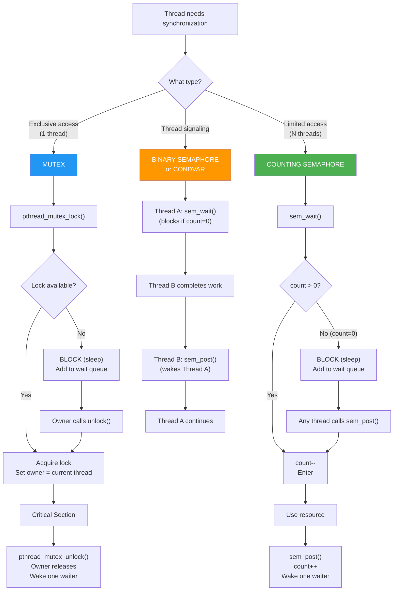
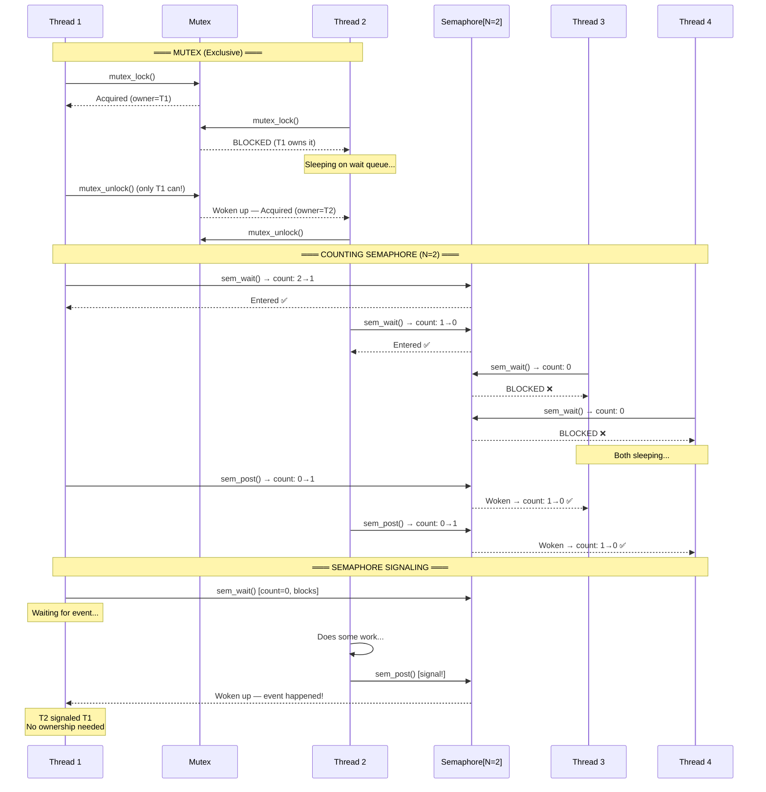
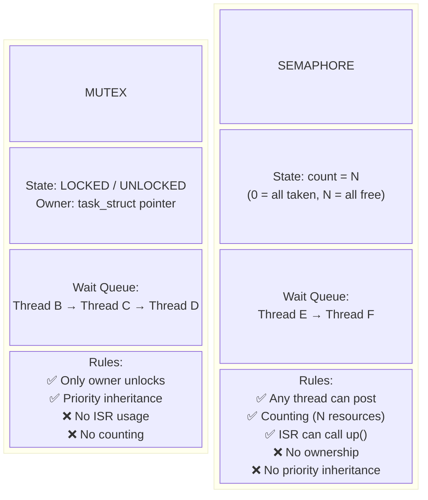

# Linux Mutex vs Semaphore — Complete Guide with 10 Practical Examples

## Table of Contents

1. [What Is a Mutex?](#what-is-a-mutex)
2. [What Is a Semaphore?](#what-is-a-semaphore)
3. [Mutex vs Semaphore — Key Differences](#mutex-vs-semaphore--key-differences)
4. [Linux Kernel Implementation](#linux-kernel-implementation)
5. [Userspace API — pthread_mutex vs sem_t](#userspace-api--pthread_mutex-vs-sem_t)
6. [10 Practical Examples](#10-practical-examples)
   - [Example 1: Basic Mutex — Protecting a Shared Counter](#example-1-basic-mutex--protecting-a-shared-counter)
   - [Example 2: Binary Semaphore — Mutual Exclusion](#example-2-binary-semaphore--mutual-exclusion)
   - [Example 3: Counting Semaphore — Connection Pool](#example-3-counting-semaphore--connection-pool)
   - [Example 4: Mutex with Condition Variable — Producer-Consumer](#example-4-mutex-with-condition-variable--producer-consumer)
   - [Example 5: Semaphore Producer-Consumer — Classic Solution](#example-5-semaphore-producer-consumer--classic-solution)
   - [Example 6: Readers-Writers Lock Using Mutex](#example-6-readers-writers-lock-using-mutex)
   - [Example 7: Semaphore — Rate Limiter (Max N Concurrent)](#example-7-semaphore--rate-limiter-max-n-concurrent)
   - [Example 8: Recursive Mutex — Reentrant Locking](#example-8-recursive-mutex--reentrant-locking)
   - [Example 9: Kernel Mutex — Device Driver](#example-9-kernel-mutex--device-driver)
   - [Example 10: Kernel Semaphore — Resource Limiting](#example-10-kernel-semaphore--resource-limiting)
7. [When to Use Mutex vs Semaphore](#when-to-use-mutex-vs-semaphore)
8. [Flow Diagram — Mutex vs Semaphore Operations](#flow-diagram--mutex-vs-semaphore-operations)
9. [Sequence Diagram — Lock Contention](#sequence-diagram--lock-contention)
10. [Block Diagram — Architecture](#block-diagram--architecture)
11. [Key Data Structures](#key-data-structures)
12. [Common Pitfalls](#common-pitfalls)
13. [Interview Q&A](#interview-qa)
14. [Summary](#summary)

---

## What Is a Mutex?

A **mutex** (mutual exclusion) is a **locking mechanism** that ensures **only one thread** can access a critical section at a time. It provides **ownership** — only the thread that locked the mutex can unlock it.

### Key Properties of Mutex

| Property | Description |
|----------|-------------|
| **Binary state** | Locked or unlocked (only two states) |
| **Ownership** | Only the lock holder can unlock |
| **Sleeping** | Threads waiting for the lock go to sleep (block) |
| **Priority inheritance** | Supported (prevents priority inversion) |
| **Recursive** | Optional — same thread can lock multiple times |
| **Single resource** | Protects exactly ONE critical section |

### Mutex Mental Model

```
                    Mutex = Bathroom Key 🔑
                    ─────────────────────
                    Only ONE key exists.
                    You TAKE the key → lock the door → use bathroom.
                    You RETURN the key → unlock → next person takes it.
                    Only the person who TOOK the key can return it.

Thread A ────► lock(mutex)   ✅ Got lock → enters critical section
Thread B ────► lock(mutex)   ❌ BLOCKED (sleeps until A unlocks)
Thread C ────► lock(mutex)   ❌ BLOCKED
                    ...
Thread A ────► unlock(mutex) ✅ Releases → wakes up B or C
```

### Mutex in Linux Kernel

```c
#include <linux/mutex.h>

/* Static initialization */
DEFINE_MUTEX(my_mutex);

/* Dynamic initialization */
struct mutex my_mutex;
mutex_init(&my_mutex);

/* Usage */
mutex_lock(&my_mutex);          /* Acquire — sleeps if held */
/* ... critical section ... */
mutex_unlock(&my_mutex);        /* Release — only holder can call */

/* Try-lock (non-blocking) */
if (mutex_trylock(&my_mutex)) {
    /* Got it */
    mutex_unlock(&my_mutex);
}

/* Interruptible — can be woken by signals */
if (mutex_lock_interruptible(&my_mutex) == 0) {
    /* ... critical section ... */
    mutex_unlock(&my_mutex);
}
```

### Mutex Rules in Linux Kernel

```
1. Only the OWNER can unlock (strictly enforced)
2. Cannot be used in interrupt context (it sleeps!)
3. Cannot hold a spinlock while acquiring a mutex
4. Must be unlocked before task exits
5. Not recursive by default
```

---

## What Is a Semaphore?

A **semaphore** is a **signaling mechanism** with an **integer counter** that controls access to a shared resource. Unlike mutex, it has **no ownership** — any thread can signal (post) it.

### Two Types of Semaphore

| Type | Counter | Purpose |
|------|---------|---------|
| **Binary Semaphore** | 0 or 1 | Similar to mutex (but NO ownership) |
| **Counting Semaphore** | 0..N | Allow up to N concurrent accesses |

### Key Properties of Semaphore

| Property | Description |
|----------|-------------|
| **Counter-based** | Value >= 0 — wait() decrements, post() increments |
| **No ownership** | ANY thread can call post() (not just the locker) |
| **Sleeping** | Threads blocked when counter reaches 0 |
| **No priority inheritance** | Cannot prevent priority inversion |
| **Signaling** | Can be used for thread synchronization/notification |
| **Multiple resources** | Can manage N identical resources |

### Semaphore Mental Model

```
                    Semaphore = Parking Lot Counter 🅿️
                    ──────────────────────────────────
                    Counter = number of available parking spots.
                    N spots total.

                    Car arrives → counter > 0? → counter-- → enter
                    Car arrives → counter == 0? → WAIT (blocked)
                    Car leaves → counter++ → wake up waiting car

Thread A ────► sem_wait()   counter: 3→2  ✅ Enter
Thread B ────► sem_wait()   counter: 2→1  ✅ Enter
Thread C ────► sem_wait()   counter: 1→0  ✅ Enter
Thread D ────► sem_wait()   counter: 0    ❌ BLOCKED
                    ...
Thread A ────► sem_post()   counter: 0→1  ✅ Wakes up D
```

### Semaphore in Linux Kernel

```c
#include <linux/semaphore.h>

/* Static initialization */
DEFINE_SEMAPHORE(my_sem);           /* Binary: count = 1 */

/* Dynamic initialization */
struct semaphore my_sem;
sema_init(&my_sem, 5);             /* Counting: count = 5 */

/* Usage */
down(&my_sem);                     /* Acquire — decrements counter, sleeps if 0 */
/* ... critical section or use resource ... */
up(&my_sem);                       /* Release — increments counter, wakes waiters */

/* Non-blocking */
if (down_trylock(&my_sem) == 0) {
    /* Got it */
    up(&my_sem);
}

/* Interruptible */
if (down_interruptible(&my_sem) == 0) {
    /* Got it */
    up(&my_sem);
}
```

### POSIX Semaphore (Userspace)

```c
#include <semaphore.h>

sem_t sem;
sem_init(&sem, 0, 5);       /* pshared=0 (threads), initial count=5 */

sem_wait(&sem);              /* Decrement — block if 0 */
/* ... use resource ... */
sem_post(&sem);              /* Increment — wake waiter */

sem_destroy(&sem);
```

---

## Mutex vs Semaphore — Key Differences

| Aspect | Mutex | Semaphore |
|--------|-------|-----------|
| **Purpose** | Mutual exclusion (locking) | Signaling / resource counting |
| **Value** | Binary: locked/unlocked | Integer counter: 0..N |
| **Ownership** | **YES** — only owner can unlock | **NO** — any thread can post |
| **Who unlocks/posts?** | Same thread that locked | Any thread |
| **Count** | Always 1 (binary) | 1 (binary) or N (counting) |
| **Priority inheritance** | ✅ Supported | ❌ Not supported |
| **Use case** | Protect critical section | Limit concurrent access / signaling |
| **Analogy** | Bathroom key (one key, one user) | Parking lot (N spots) |
| **Recursive** | Optional (PTHREAD_MUTEX_RECURSIVE) | N/A |
| **Can signal from ISR?** | ❌ No (kernel mutex) | ✅ Yes (`up()` can be called from ISR) |
| **Performance** | Generally faster (optimized fast-path) | Slightly slower (counter management) |
| **Deadlock detection** | Easier (ownership tracking) | Harder (no ownership) |
| **Linux kernel struct** | `struct mutex` | `struct semaphore` |
| **POSIX userspace** | `pthread_mutex_t` | `sem_t` |
| **Lock operation** | `mutex_lock()` / `pthread_mutex_lock()` | `down()` / `sem_wait()` |
| **Unlock operation** | `mutex_unlock()` / `pthread_mutex_unlock()` | `up()` / `sem_post()` |

### Critical Difference Visualized

```
MUTEX (Ownership):
═══════════════════
Thread A:  lock()  ───────── critical section ────────  unlock()  ✅
Thread B:                                               unlock()  ❌ ERROR!
           (Only the thread that locked can unlock)

SEMAPHORE (No Ownership):
══════════════════════════
Thread A:  wait()  ───────── use resource ─────────────
Thread B:                                               post()   ✅ ALLOWED!
           (Any thread can call post — used for signaling)


COUNTING SEMAPHORE (N=3):
══════════════════════════
Thread A:  wait()  → count: 3→2  ✅
Thread B:  wait()  → count: 2→1  ✅
Thread C:  wait()  → count: 1→0  ✅
Thread D:  wait()  → count: 0    ❌ BLOCKED
Thread A:  post()  → count: 0→1  → wakes D
Thread D:           → count: 1→0  ✅ Entered
```

---

## Linux Kernel Implementation

### struct mutex (kernel)

```c
/* linux/mutex.h */
struct mutex {
    atomic_long_t       owner;      /* Points to owning task_struct */
    spinlock_t          wait_lock;  /* Protects wait_list */
    struct list_head    wait_list;  /* Waiters queue (sleeping tasks) */
#ifdef CONFIG_DEBUG_MUTEXES
    struct task_struct  *magic;     /* Debug: detect corruption */
#endif
};
```

### struct semaphore (kernel)

```c
/* linux/semaphore.h */
struct semaphore {
    raw_spinlock_t      lock;       /* Protects count and wait_list */
    unsigned int        count;      /* Available count (0..N) */
    struct list_head    wait_list;  /* Waiters queue */
};
```

### Kernel Mutex — Fast Path (Optimized)

```
mutex_lock():
  1. Try atomic cmpxchg(owner, 0, current)     ← FAST PATH (no contention)
     └── Success? → Got lock. Return immediately. (~few nanoseconds)
     └── Fail?    → SLOW PATH:
         2. spin_lock(wait_lock)
         3. Add current to wait_list
         4. Set task state = TASK_UNINTERRUPTIBLE
         5. spin_unlock(wait_lock)
         6. schedule()                          ← Context switch (sleep)
         ... (woken up when lock released) ...
         7. Try acquire again

mutex_unlock():
  1. Atomic clear owner
  2. If wait_list not empty:
     3. spin_lock(wait_lock)
     4. Wake up first waiter
     5. spin_unlock(wait_lock)
```

### Kernel Semaphore — down/up

```
down(&sem):                                     up(&sem):
  1. spin_lock(sem->lock)                         1. spin_lock(sem->lock)
  2. if (count > 0):                              2. if (wait_list empty):
       count--                                         count++
       spin_unlock()                                   spin_unlock()
       return (got it!)                                return
  3. else (count == 0):                            3. else:
       add to wait_list                                wake up first waiter
       spin_unlock()                                   spin_unlock()
       schedule() → sleep
```

---

## Userspace API — pthread_mutex vs sem_t

### pthread_mutex_t API

```c
#include <pthread.h>

pthread_mutex_t mutex;

/* Initialize */
pthread_mutex_init(&mutex, NULL);                    /* Default attributes */
/* OR static: */
pthread_mutex_t mutex = PTHREAD_MUTEX_INITIALIZER;

/* Lock */
pthread_mutex_lock(&mutex);        /* Block until acquired */
pthread_mutex_trylock(&mutex);     /* Non-blocking: returns EBUSY if held */
pthread_mutex_timedlock(&mutex, &ts);  /* Block with timeout */

/* Unlock */
pthread_mutex_unlock(&mutex);      /* MUST be called by the lock owner */

/* Destroy */
pthread_mutex_destroy(&mutex);
```

### Mutex Types

```c
pthread_mutexattr_t attr;
pthread_mutexattr_init(&attr);

/* NORMAL — deadlock if same thread locks twice */
pthread_mutexattr_settype(&attr, PTHREAD_MUTEX_NORMAL);

/* ERRORCHECK — returns EDEADLK if same thread locks twice */
pthread_mutexattr_settype(&attr, PTHREAD_MUTEX_ERRORCHECK);

/* RECURSIVE — allows same thread to lock multiple times */
pthread_mutexattr_settype(&attr, PTHREAD_MUTEX_RECURSIVE);

pthread_mutex_init(&mutex, &attr);
```

### sem_t API (POSIX semaphore)

```c
#include <semaphore.h>

sem_t sem;

/* Initialize */
sem_init(&sem, 0, initial_count);  /* 0=thread-shared, count=initial */

/* Named semaphore (inter-process) */
sem_t *sem = sem_open("/my_sem", O_CREAT, 0644, 5);

/* Wait (decrement) */
sem_wait(&sem);          /* Block if count == 0 */
sem_trywait(&sem);       /* Non-blocking: returns EAGAIN if 0 */
sem_timedwait(&sem, &ts);  /* Block with timeout */

/* Post (increment) */
sem_post(&sem);          /* ANY thread can call this */

/* Get current value */
int val;
sem_getvalue(&sem, &val);

/* Destroy */
sem_destroy(&sem);
sem_close(sem);          /* For named semaphore */
sem_unlink("/my_sem");   /* Remove named semaphore */
```

---

## 10 Practical Examples

### Example 1: Basic Mutex — Protecting a Shared Counter

```c
#include <stdio.h>
#include <stdlib.h>
#include <pthread.h>

/*
 * MUTEX: Protect shared counter from race conditions.
 * Without mutex: counter < expected (data race).
 * With mutex:    counter == expected (safe).
 */

#define NUM_THREADS  4
#define INCREMENTS   1000000

long counter = 0;
pthread_mutex_t mutex = PTHREAD_MUTEX_INITIALIZER;

void *increment_safe(void *arg)
{
    int id = *(int *)arg;
    for (int i = 0; i < INCREMENTS; i++) {
        pthread_mutex_lock(&mutex);
        counter++;
        pthread_mutex_unlock(&mutex);
    }
    printf("Thread %d: done\n", id);
    return NULL;
}

void *increment_unsafe(void *arg)
{
    for (int i = 0; i < INCREMENTS; i++) {
        counter++;  /* ❌ RACE CONDITION */
    }
    return NULL;
}

int main(void)
{
    pthread_t threads[NUM_THREADS];
    int ids[NUM_THREADS];

    /* ── Test 1: WITHOUT mutex (race condition) ── */
    counter = 0;
    for (int i = 0; i < NUM_THREADS; i++) {
        ids[i] = i;
        pthread_create(&threads[i], NULL, increment_unsafe, &ids[i]);
    }
    for (int i = 0; i < NUM_THREADS; i++)
        pthread_join(threads[i], NULL);
    printf("WITHOUT mutex: counter = %ld (expected %d) ❌\n",
           counter, NUM_THREADS * INCREMENTS);

    /* ── Test 2: WITH mutex (safe) ── */
    counter = 0;
    for (int i = 0; i < NUM_THREADS; i++) {
        ids[i] = i;
        pthread_create(&threads[i], NULL, increment_safe, &ids[i]);
    }
    for (int i = 0; i < NUM_THREADS; i++)
        pthread_join(threads[i], NULL);
    printf("WITH mutex:    counter = %ld (expected %d) ✅\n",
           counter, NUM_THREADS * INCREMENTS);

    pthread_mutex_destroy(&mutex);
    return 0;
}
/*
 * Compile: gcc -o ex1_mutex ex1_mutex.c -lpthread
 *
 * Output:
 *   WITHOUT mutex: counter = 2847593 (expected 4000000) ❌
 *   WITH mutex:    counter = 4000000 (expected 4000000) ✅
 *
 * KEY: Mutex ensures only ONE thread increments at a time.
 *      Ownership: the thread that locks must unlock.
 */
```

---

### Example 2: Binary Semaphore — Mutual Exclusion

```c
#include <stdio.h>
#include <stdlib.h>
#include <pthread.h>
#include <semaphore.h>

/*
 * BINARY SEMAPHORE (count=1): Works like a mutex but NO ownership.
 * Any thread can call sem_post() — not just the thread that called sem_wait().
 * Use case: When mutex ownership is too restrictive.
 */

#define NUM_THREADS  4
#define INCREMENTS   1000000

long counter = 0;
sem_t binary_sem;

void *increment_with_sem(void *arg)
{
    int id = *(int *)arg;
    for (int i = 0; i < INCREMENTS; i++) {
        sem_wait(&binary_sem);     /* Decrement: 1→0 (enters), or block if 0 */
        counter++;
        sem_post(&binary_sem);     /* Increment: 0→1 (releases) */
    }
    printf("Thread %d: done\n", id);
    return NULL;
}

int main(void)
{
    pthread_t threads[NUM_THREADS];
    int ids[NUM_THREADS];

    sem_init(&binary_sem, 0, 1);   /* Binary: initial count = 1 */

    counter = 0;
    for (int i = 0; i < NUM_THREADS; i++) {
        ids[i] = i;
        pthread_create(&threads[i], NULL, increment_with_sem, &ids[i]);
    }
    for (int i = 0; i < NUM_THREADS; i++)
        pthread_join(threads[i], NULL);

    printf("Binary semaphore: counter = %ld (expected %d) ✅\n",
           counter, NUM_THREADS * INCREMENTS);

    sem_destroy(&binary_sem);
    return 0;
}
/*
 * Compile: gcc -o ex2_binsem ex2_binsem.c -lpthread
 *
 * Output:
 *   Binary semaphore: counter = 4000000 (expected 4000000) ✅
 *
 * KEY: Binary semaphore (count=1) works like mutex for exclusion,
 *      but lacks ownership — any thread can post.
 *      Prefer mutex when you need ownership enforcement.
 */
```

---

### Example 3: Counting Semaphore — Connection Pool

```c
#include <stdio.h>
#include <stdlib.h>
#include <pthread.h>
#include <semaphore.h>
#include <unistd.h>

/*
 * COUNTING SEMAPHORE: Manage a pool of N identical resources.
 * Example: Database connection pool with max 3 connections.
 * Threads beyond 3 must WAIT until a connection is released.
 */

#define MAX_CONNECTIONS  3
#define NUM_CLIENTS      8

sem_t conn_pool;
pthread_mutex_t print_lock = PTHREAD_MUTEX_INITIALIZER;

void *client_task(void *arg)
{
    int id = *(int *)arg;
    int sem_val;

    sem_getvalue(&conn_pool, &sem_val);
    pthread_mutex_lock(&print_lock);
    printf("Client %d: Requesting connection (available=%d)\n", id, sem_val);
    pthread_mutex_unlock(&print_lock);

    sem_wait(&conn_pool);          /* Acquire connection — block if none free */

    sem_getvalue(&conn_pool, &sem_val);
    pthread_mutex_lock(&print_lock);
    printf("Client %d: ✅ GOT connection (remaining=%d)\n", id, sem_val);
    pthread_mutex_unlock(&print_lock);

    usleep(500000 + (rand() % 500000));  /* Simulate DB query */

    sem_post(&conn_pool);          /* Release connection */

    pthread_mutex_lock(&print_lock);
    printf("Client %d: Released connection\n", id);
    pthread_mutex_unlock(&print_lock);

    return NULL;
}

int main(void)
{
    pthread_t clients[NUM_CLIENTS];
    int ids[NUM_CLIENTS];

    sem_init(&conn_pool, 0, MAX_CONNECTIONS);

    printf("=== Connection Pool: %d max connections, %d clients ===\n",
           MAX_CONNECTIONS, NUM_CLIENTS);

    for (int i = 0; i < NUM_CLIENTS; i++) {
        ids[i] = i;
        pthread_create(&clients[i], NULL, client_task, &ids[i]);
    }
    for (int i = 0; i < NUM_CLIENTS; i++)
        pthread_join(clients[i], NULL);

    printf("=== All clients done ===\n");
    sem_destroy(&conn_pool);
    return 0;
}
/*
 * Compile: gcc -o ex3_connpool ex3_connpool.c -lpthread
 *
 * Output (example):
 *   Client 0: ✅ GOT connection (remaining=2)
 *   Client 1: ✅ GOT connection (remaining=1)
 *   Client 2: ✅ GOT connection (remaining=0)
 *   Client 3: Requesting connection (available=0)  ← BLOCKED
 *   Client 0: Released connection
 *   Client 3: ✅ GOT connection (remaining=0)
 *   ...
 *
 * KEY: COUNTING semaphore (N=3) limits concurrent access to 3.
 *      Mutex can't do this — it's always binary (1).
 */
```

---

### Example 4: Mutex with Condition Variable — Producer-Consumer

```c
#include <stdio.h>
#include <stdlib.h>
#include <pthread.h>

/*
 * MUTEX + CONDITION VARIABLE: The proper way to do producer-consumer.
 * Mutex protects data. Condvar provides efficient waiting/notification.
 * This is the PREFERRED pattern over semaphores in modern code.
 */

#define BUF_SIZE 5
#define ITEMS    20

struct {
    int buffer[BUF_SIZE];
    int count, in, out;
    pthread_mutex_t mutex;
    pthread_cond_t  not_full;
    pthread_cond_t  not_empty;
} queue = {
    .count = 0, .in = 0, .out = 0,
    .mutex     = PTHREAD_MUTEX_INITIALIZER,
    .not_full  = PTHREAD_COND_INITIALIZER,
    .not_empty = PTHREAD_COND_INITIALIZER,
};

void *producer(void *arg)
{
    for (int i = 0; i < ITEMS; i++) {
        pthread_mutex_lock(&queue.mutex);

        while (queue.count == BUF_SIZE)            /* Buffer full? */
            pthread_cond_wait(&queue.not_full, &queue.mutex);  /* Wait + unlock */

        queue.buffer[queue.in] = i;
        queue.in = (queue.in + 1) % BUF_SIZE;
        queue.count++;
        printf("Produced: %2d  [count=%d]\n", i, queue.count);

        pthread_cond_signal(&queue.not_empty);     /* Notify consumer */
        pthread_mutex_unlock(&queue.mutex);
    }
    return NULL;
}

void *consumer(void *arg)
{
    for (int i = 0; i < ITEMS; i++) {
        pthread_mutex_lock(&queue.mutex);

        while (queue.count == 0)                   /* Buffer empty? */
            pthread_cond_wait(&queue.not_empty, &queue.mutex);

        int item = queue.buffer[queue.out];
        queue.out = (queue.out + 1) % BUF_SIZE;
        queue.count--;
        printf("Consumed: %2d  [count=%d]\n", item, queue.count);

        pthread_cond_signal(&queue.not_full);      /* Notify producer */
        pthread_mutex_unlock(&queue.mutex);
    }
    return NULL;
}

int main(void)
{
    pthread_t prod, cons;
    pthread_create(&prod, NULL, producer, NULL);
    pthread_create(&cons, NULL, consumer, NULL);
    pthread_join(prod, NULL);
    pthread_join(cons, NULL);
    printf("Done — mutex + condvar producer-consumer\n");
    return 0;
}
/*
 * Compile: gcc -o ex4_mutex_condvar ex4_mutex_condvar.c -lpthread
 *
 * KEY: pthread_cond_wait() atomically:
 *   1. Unlocks the mutex
 *   2. Puts thread to sleep
 *   3. Re-locks the mutex when woken
 *
 *   This is CLEANER than semaphore-based solution.
 *   Mutex + condvar = modern best practice for producer-consumer.
 */
```

---

### Example 5: Semaphore Producer-Consumer — Classic Solution

```c
#include <stdio.h>
#include <stdlib.h>
#include <pthread.h>
#include <semaphore.h>

/*
 * SEMAPHORE-BASED producer-consumer — the classic textbook solution.
 * Uses THREE semaphores:
 *   empty: counts empty slots (initially = BUF_SIZE)
 *   full:  counts filled slots (initially = 0)
 *   mutex: binary semaphore for buffer access (initially = 1)
 */

#define BUF_SIZE 5
#define ITEMS    15

int buffer[BUF_SIZE];
int in = 0, out = 0;

sem_t empty_slots;    /* Counting: available empty slots */
sem_t full_slots;     /* Counting: available full slots */
sem_t mutex_sem;      /* Binary: protect buffer access */

void *producer(void *arg)
{
    for (int i = 0; i < ITEMS; i++) {
        sem_wait(&empty_slots);    /* Wait for empty slot (decrement empty) */
        sem_wait(&mutex_sem);      /* Exclusive buffer access */

        buffer[in] = i;
        printf("Produced: %2d  at index %d\n", i, in);
        in = (in + 1) % BUF_SIZE;

        sem_post(&mutex_sem);      /* Release buffer */
        sem_post(&full_slots);     /* Signal: one more full slot */
    }
    return NULL;
}

void *consumer(void *arg)
{
    for (int i = 0; i < ITEMS; i++) {
        sem_wait(&full_slots);     /* Wait for filled slot (decrement full) */
        sem_wait(&mutex_sem);      /* Exclusive buffer access */

        int item = buffer[out];
        printf("Consumed: %2d  from index %d\n", item, out);
        out = (out + 1) % BUF_SIZE;

        sem_post(&mutex_sem);      /* Release buffer */
        sem_post(&empty_slots);    /* Signal: one more empty slot */
    }
    return NULL;
}

int main(void)
{
    sem_init(&empty_slots, 0, BUF_SIZE);  /* BUF_SIZE empty slots */
    sem_init(&full_slots, 0, 0);          /* 0 full slots initially */
    sem_init(&mutex_sem, 0, 1);           /* Binary: mutual exclusion */

    pthread_t prod, cons;
    pthread_create(&prod, NULL, producer, NULL);
    pthread_create(&cons, NULL, consumer, NULL);
    pthread_join(prod, NULL);
    pthread_join(cons, NULL);

    sem_destroy(&empty_slots);
    sem_destroy(&full_slots);
    sem_destroy(&mutex_sem);

    printf("Done — semaphore producer-consumer (classic)\n");
    return 0;
}
/*
 * Compile: gcc -o ex5_sem_prodcons ex5_sem_prodcons.c -lpthread
 *
 * KEY: Two COUNTING semaphores (empty, full) manage buffer slots.
 *      One BINARY semaphore (mutex) protects buffer array.
 *
 *      Compare with Example 4: Mutex + condvar is cleaner,
 *      but this semaphore solution is the classic CS textbook answer.
 */
```

---

### Example 6: Readers-Writers Lock Using Mutex

```c
#include <stdio.h>
#include <stdlib.h>
#include <pthread.h>
#include <unistd.h>

/*
 * READERS-WRITERS problem solved with mutexes.
 * Multiple readers can read simultaneously.
 * Writer needs exclusive access — blocks all readers.
 *
 * Uses two mutexes:
 *   rw_mutex:     protects shared data (writer lock)
 *   reader_mutex: protects reader_count
 */

int shared_data = 0;
int reader_count = 0;

pthread_mutex_t rw_mutex     = PTHREAD_MUTEX_INITIALIZER;
pthread_mutex_t reader_mutex = PTHREAD_MUTEX_INITIALIZER;

void *reader_func(void *arg)
{
    int id = *(int *)arg;

    for (int i = 0; i < 3; i++) {
        /* ── Enter reading ── */
        pthread_mutex_lock(&reader_mutex);
        reader_count++;
        if (reader_count == 1)
            pthread_mutex_lock(&rw_mutex);  /* First reader blocks writers */
        pthread_mutex_unlock(&reader_mutex);

        /* ── Read (concurrent with other readers) ── */
        printf("Reader %d: read data = %d (readers=%d)\n",
               id, shared_data, reader_count);
        usleep(100000);

        /* ── Exit reading ── */
        pthread_mutex_lock(&reader_mutex);
        reader_count--;
        if (reader_count == 0)
            pthread_mutex_unlock(&rw_mutex);  /* Last reader releases writers */
        pthread_mutex_unlock(&reader_mutex);

        usleep(50000);
    }
    return NULL;
}

void *writer_func(void *arg)
{
    int id = *(int *)arg;

    for (int i = 0; i < 2; i++) {
        pthread_mutex_lock(&rw_mutex);       /* Exclusive access */

        shared_data += 10;
        printf("Writer %d: ✏️ wrote data = %d\n", id, shared_data);
        usleep(200000);

        pthread_mutex_unlock(&rw_mutex);
        usleep(100000);
    }
    return NULL;
}

int main(void)
{
    pthread_t readers[4], writers[2];
    int rids[] = {1, 2, 3, 4};
    int wids[] = {1, 2};

    for (int i = 0; i < 4; i++)
        pthread_create(&readers[i], NULL, reader_func, &rids[i]);
    for (int i = 0; i < 2; i++)
        pthread_create(&writers[i], NULL, writer_func, &wids[i]);

    for (int i = 0; i < 4; i++) pthread_join(readers[i], NULL);
    for (int i = 0; i < 2; i++) pthread_join(writers[i], NULL);

    printf("Final data = %d\n", shared_data);
    return 0;
}
/*
 * Compile: gcc -o ex6_readwrite ex6_readwrite.c -lpthread
 *
 * KEY: Multiple readers run concurrently.
 *      Writer gets EXCLUSIVE access via rw_mutex.
 *      Mutex ownership ensures correctness.
 *
 * NOTE: pthread_rwlock_t provides this built-in:
 *   pthread_rwlock_rdlock() / pthread_rwlock_wrlock()
 */
```

---

### Example 7: Semaphore — Rate Limiter (Max N Concurrent)

```c
#include <stdio.h>
#include <stdlib.h>
#include <pthread.h>
#include <semaphore.h>
#include <unistd.h>
#include <time.h>

/*
 * COUNTING SEMAPHORE as a rate limiter / throttle.
 * Allow max N tasks to execute concurrently.
 * Example: API server allowing max 3 concurrent requests.
 *
 * This is something a MUTEX cannot do — mutex is always binary.
 */

#define MAX_CONCURRENT  3
#define TOTAL_REQUESTS  10

sem_t throttle;
pthread_mutex_t print_lock = PTHREAD_MUTEX_INITIALIZER;

void *handle_request(void *arg)
{
    int id = *(int *)arg;
    struct timespec start, end;

    clock_gettime(CLOCK_MONOTONIC, &start);

    pthread_mutex_lock(&print_lock);
    printf("Request %d: Waiting for slot...\n", id);
    pthread_mutex_unlock(&print_lock);

    sem_wait(&throttle);  /* Acquire slot — blocks if 3 already running */

    clock_gettime(CLOCK_MONOTONIC, &end);
    double waited = (end.tv_sec - start.tv_sec) +
                    (end.tv_nsec - start.tv_nsec) / 1e9;

    int sem_val;
    sem_getvalue(&throttle, &sem_val);

    pthread_mutex_lock(&print_lock);
    printf("Request %d: ✅ Processing (waited %.3fs, slots_left=%d)\n",
           id, waited, sem_val);
    pthread_mutex_unlock(&print_lock);

    usleep(300000 + (rand() % 400000));  /* Simulate work */

    sem_post(&throttle);  /* Release slot */

    pthread_mutex_lock(&print_lock);
    printf("Request %d: Done\n", id);
    pthread_mutex_unlock(&print_lock);

    return NULL;
}

int main(void)
{
    pthread_t threads[TOTAL_REQUESTS];
    int ids[TOTAL_REQUESTS];

    sem_init(&throttle, 0, MAX_CONCURRENT);

    printf("=== Rate Limiter: max %d concurrent, %d total ===\n",
           MAX_CONCURRENT, TOTAL_REQUESTS);

    for (int i = 0; i < TOTAL_REQUESTS; i++) {
        ids[i] = i;
        pthread_create(&threads[i], NULL, handle_request, &ids[i]);
    }
    for (int i = 0; i < TOTAL_REQUESTS; i++)
        pthread_join(threads[i], NULL);

    printf("=== All requests completed ===\n");
    sem_destroy(&throttle);
    return 0;
}
/*
 * Compile: gcc -o ex7_ratelimit ex7_ratelimit.c -lpthread
 *
 * KEY: Only 3 requests run at any time.
 *      Request 4+ waits until a slot opens.
 *      Counting semaphore is PERFECT for resource pools.
 */
```

---

### Example 8: Recursive Mutex — Reentrant Locking

```c
#include <stdio.h>
#include <stdlib.h>
#include <pthread.h>

/*
 * RECURSIVE MUTEX: Same thread can lock the mutex MULTIPLE times.
 * Must unlock the same number of times.
 *
 * Use case: Recursive functions that need to hold a lock.
 * A normal mutex would DEADLOCK if locked twice by the same thread.
 */

pthread_mutex_t recursive_mutex;
int shared_resource = 0;

void recursive_update(int depth)
{
    pthread_mutex_lock(&recursive_mutex);  /* Lock again — OK with recursive */

    shared_resource += depth;
    printf("Depth %d: shared_resource = %d (lock count = %d)\n",
           depth, shared_resource, depth);

    if (depth < 5)
        recursive_update(depth + 1);       /* Recursive call — re-locks! */

    pthread_mutex_unlock(&recursive_mutex); /* Must unlock same number of times */
}

void demonstrate_deadlock_danger(void)
{
    pthread_mutex_t normal_mutex = PTHREAD_MUTEX_INITIALIZER;

    printf("\n--- Normal mutex: locking once = OK ---\n");
    pthread_mutex_lock(&normal_mutex);
    printf("Locked once — OK\n");
    pthread_mutex_unlock(&normal_mutex);

    /* If we try:
     *   pthread_mutex_lock(&normal_mutex);
     *   pthread_mutex_lock(&normal_mutex);  ← DEADLOCK with normal mutex!
     * The thread would block forever waiting for itself.
     */
    printf("Locking twice with normal mutex would DEADLOCK!\n");

    pthread_mutex_destroy(&normal_mutex);
}

int main(void)
{
    /* Setup recursive mutex */
    pthread_mutexattr_t attr;
    pthread_mutexattr_init(&attr);
    pthread_mutexattr_settype(&attr, PTHREAD_MUTEX_RECURSIVE);
    pthread_mutex_init(&recursive_mutex, &attr);
    pthread_mutexattr_destroy(&attr);

    printf("--- Recursive mutex: locking 5 times in recursion ---\n");
    recursive_update(1);
    printf("Final shared_resource = %d\n", shared_resource);

    demonstrate_deadlock_danger();

    pthread_mutex_destroy(&recursive_mutex);
    return 0;
}
/*
 * Compile: gcc -o ex8_recursive ex8_recursive.c -lpthread
 *
 * Output:
 *   Depth 1: shared_resource = 1 (lock count = 1)
 *   Depth 2: shared_resource = 3 (lock count = 2)
 *   Depth 3: shared_resource = 6 (lock count = 3)
 *   Depth 4: shared_resource = 10 (lock count = 4)
 *   Depth 5: shared_resource = 15 (lock count = 5)
 *
 * KEY: Recursive mutex allows the SAME thread to lock N times.
 *      Must unlock N times.
 *      Normal mutex → deadlock if locked twice by same thread.
 *      Semaphore has NO concept of recursion or ownership.
 */
```

---

### Example 9: Kernel Mutex — Device Driver

```c
#include <linux/module.h>
#include <linux/fs.h>
#include <linux/cdev.h>
#include <linux/mutex.h>
#include <linux/uaccess.h>

/*
 * KERNEL MUTEX in a character device driver.
 * Ensures only ONE process reads/writes the device at a time.
 * Mutex is preferred over semaphore in modern kernel code.
 *
 * Rule: Only the SAME context that locked can unlock.
 *       Cannot use in interrupt context (mutex sleeps).
 */

#define DEV_NAME "mutex_demo"
#define BUF_SIZE 256

static dev_t dev_num;
static struct cdev my_cdev;
static struct class *my_class;

static DEFINE_MUTEX(dev_mutex);      /* Kernel mutex — statically initialized */
static char device_buffer[BUF_SIZE];
static int buffer_len = 0;

static int dev_open(struct inode *inode, struct file *filp)
{
    /* Try to acquire mutex — non-blocking */
    if (!mutex_trylock(&dev_mutex)) {
        printk(KERN_WARNING "mutex_demo: Device busy!\n");
        return -EBUSY;
    }
    printk(KERN_INFO "mutex_demo: Device opened by PID %d\n", current->pid);
    return 0;
}

static int dev_release(struct inode *inode, struct file *filp)
{
    mutex_unlock(&dev_mutex);  /* Same process that locked must unlock */
    printk(KERN_INFO "mutex_demo: Device released by PID %d\n", current->pid);
    return 0;
}

static ssize_t dev_read(struct inode *inode, struct file *filp,
                         char __user *buf, size_t count, loff_t *offset)
{
    /* Mutex already held from open() — we're safe */
    int bytes = min((int)count, buffer_len);
    if (bytes == 0)
        return 0;

    if (copy_to_user(buf, device_buffer, bytes))
        return -EFAULT;

    printk(KERN_INFO "mutex_demo: Read %d bytes\n", bytes);
    return bytes;
}

static ssize_t dev_write(struct inode *inode, struct file *filp,
                          const char __user *buf, size_t count, loff_t *offset)
{
    int bytes = min((int)count, BUF_SIZE - 1);

    if (copy_from_user(device_buffer, buf, bytes))
        return -EFAULT;

    device_buffer[bytes] = '\0';
    buffer_len = bytes;
    printk(KERN_INFO "mutex_demo: Wrote %d bytes: '%s'\n", bytes, device_buffer);
    return bytes;
}

static const struct file_operations fops = {
    .owner   = THIS_MODULE,
    .open    = dev_open,
    .release = dev_release,
    .read    = dev_read,
    .write   = dev_write,
};

static int __init mutex_demo_init(void)
{
    alloc_chrdev_region(&dev_num, 0, 1, DEV_NAME);
    cdev_init(&my_cdev, &fops);
    cdev_add(&my_cdev, dev_num, 1);
    my_class = class_create(DEV_NAME);
    device_create(my_class, NULL, dev_num, NULL, DEV_NAME);
    printk(KERN_INFO "mutex_demo: loaded (major=%d)\n", MAJOR(dev_num));
    return 0;
}

static void __exit mutex_demo_exit(void)
{
    device_destroy(my_class, dev_num);
    class_destroy(my_class);
    cdev_del(&my_cdev);
    unregister_chrdev_region(dev_num, 1);
    printk(KERN_INFO "mutex_demo: unloaded\n");
}

module_init(mutex_demo_init);
module_exit(mutex_demo_exit);
MODULE_LICENSE("GPL");
MODULE_DESCRIPTION("Kernel mutex in device driver");
```

```bash
# Test:
sudo insmod mutex_demo.ko
echo "hello" > /dev/mutex_demo     # Process 1: OK
cat /dev/mutex_demo                # Process 1: reads "hello"

# In another terminal:
echo "world" > /dev/mutex_demo     # Process 2: -EBUSY if process 1 still has it open
```

---

### Example 10: Kernel Semaphore — Resource Limiting

```c
#include <linux/module.h>
#include <linux/fs.h>
#include <linux/cdev.h>
#include <linux/semaphore.h>
#include <linux/uaccess.h>

/*
 * KERNEL SEMAPHORE: Allow up to N concurrent opens of a device.
 * Unlike mutex (which allows only 1), semaphore can allow N.
 *
 * Example: A device file that allows max 3 concurrent readers/writers.
 * This is a real use case — some hardware has N DMA channels.
 */

#define DEV_NAME   "sem_demo"
#define BUF_SIZE   256
#define MAX_USERS  3

static dev_t dev_num;
static struct cdev my_cdev;
static struct class *my_class;

static struct semaphore dev_sem;     /* Counting semaphore: max N users */
static DEFINE_MUTEX(buf_mutex);      /* Mutex for buffer protection */
static char device_buffer[BUF_SIZE] = "initial data\n";
static int open_count = 0;

static int dev_open(struct inode *inode, struct file *filp)
{
    /* Try to acquire semaphore (decrement count) */
    if (down_interruptible(&dev_sem)) {
        return -ERESTARTSYS;  /* Interrupted by signal */
    }

    mutex_lock(&buf_mutex);
    open_count++;
    printk(KERN_INFO "sem_demo: Opened by PID %d (users=%d/%d)\n",
           current->pid, open_count, MAX_USERS);
    mutex_unlock(&buf_mutex);

    return 0;
}

static int dev_release(struct inode *inode, struct file *filp)
{
    mutex_lock(&buf_mutex);
    open_count--;
    printk(KERN_INFO "sem_demo: Released by PID %d (users=%d/%d)\n",
           current->pid, open_count, MAX_USERS);
    mutex_unlock(&buf_mutex);

    up(&dev_sem);  /* Release semaphore (increment count) */
    /* NOTE: up() can be called by ANY context, even different from down() */
    return 0;
}

static ssize_t dev_read(struct inode *inode, struct file *filp,
                         char __user *buf, size_t count, loff_t *offset)
{
    int len;

    mutex_lock(&buf_mutex);

    len = strlen(device_buffer);
    if (*offset >= len) {
        mutex_unlock(&buf_mutex);
        return 0;
    }

    len = min((int)(len - *offset), (int)count);
    if (copy_to_user(buf, device_buffer + *offset, len)) {
        mutex_unlock(&buf_mutex);
        return -EFAULT;
    }

    *offset += len;
    mutex_unlock(&buf_mutex);

    return len;
}

static ssize_t dev_write(struct inode *inode, struct file *filp,
                          const char __user *buf, size_t count, loff_t *offset)
{
    int bytes;

    mutex_lock(&buf_mutex);

    bytes = min((int)count, BUF_SIZE - 1);
    if (copy_from_user(device_buffer, buf, bytes)) {
        mutex_unlock(&buf_mutex);
        return -EFAULT;
    }
    device_buffer[bytes] = '\0';
    printk(KERN_INFO "sem_demo: PID %d wrote: '%s'\n",
           current->pid, device_buffer);

    mutex_unlock(&buf_mutex);
    return bytes;
}

static const struct file_operations fops = {
    .owner   = THIS_MODULE,
    .open    = dev_open,
    .release = dev_release,
    .read    = dev_read,
    .write   = dev_write,
};

static int __init sem_demo_init(void)
{
    sema_init(&dev_sem, MAX_USERS);  /* Allow 3 concurrent users */

    alloc_chrdev_region(&dev_num, 0, 1, DEV_NAME);
    cdev_init(&my_cdev, &fops);
    cdev_add(&my_cdev, dev_num, 1);
    my_class = class_create(DEV_NAME);
    device_create(my_class, NULL, dev_num, NULL, DEV_NAME);

    printk(KERN_INFO "sem_demo: loaded (max %d concurrent users)\n", MAX_USERS);
    return 0;
}

static void __exit sem_demo_exit(void)
{
    device_destroy(my_class, dev_num);
    class_destroy(my_class);
    cdev_del(&my_cdev);
    unregister_chrdev_region(dev_num, 1);
    printk(KERN_INFO "sem_demo: unloaded\n");
}

module_init(sem_demo_init);
module_exit(sem_demo_exit);
MODULE_LICENSE("GPL");
MODULE_DESCRIPTION("Kernel counting semaphore demo");
```

```bash
# Test:
sudo insmod sem_demo.ko

# Terminal 1, 2, 3: all succeed (semaphore count = 3)
cat /dev/sem_demo &
cat /dev/sem_demo &
cat /dev/sem_demo &

# Terminal 4: BLOCKS until one of the above finishes
cat /dev/sem_demo   # Waits...

dmesg | grep sem_demo
# sem_demo: Opened by PID 1001 (users=1/3)
# sem_demo: Opened by PID 1002 (users=2/3)
# sem_demo: Opened by PID 1003 (users=3/3)
# (PID 1004 blocks here)
# sem_demo: Released by PID 1001 (users=2/3)
# sem_demo: Opened by PID 1004 (users=3/3)
```

---

## When to Use Mutex vs Semaphore

### Decision Flowchart

```
Need synchronization?
│
├── Protecting a critical section (exclusive access)?
│   │
│   ├── YES ──► Need recursive locking?
│   │           │
│   │           ├── YES ──► RECURSIVE MUTEX
│   │           │
│   │           └── NO ──►  MUTEX (preferred for exclusion)
│   │
│   └── NO ──►  Controlling access to N identical resources?
│               │
│               ├── YES ──► COUNTING SEMAPHORE (N > 1)
│               │
│               └── NO ──►  Need signaling between threads?
│                           │
│                           ├── YES ──► SEMAPHORE (post from any thread)
│                           │           or MUTEX + CONDVAR
│                           │
│                           └── NO ──►  ??? Rethink your design
```

### When to Use What

| Scenario | Use | Why |
|----------|-----|-----|
| **Protect shared variable** | Mutex | Ownership ensures correct lock/unlock pairing |
| **Database connection pool (N=5)** | Counting Semaphore | Limit to exactly N concurrent accesses |
| **Thread-safe linked list** | Mutex | Exclusive access to data structure |
| **Producer-consumer queue** | Mutex + Condvar (modern) | Clean wait/notify pattern |
| **Producer-consumer queue** | Semaphore (classic) | Textbook solution, works but more complex |
| **Rate limiter** | Counting Semaphore | Allow max N concurrent operations |
| **Device driver (single user)** | Mutex | Only one process uses device |
| **Device driver (N channels)** | Counting Semaphore | N DMA channels available |
| **Readers-writers** | Mutex (or rwlock) | Reader count + writer exclusion |
| **Signal completion (one-shot)** | Semaphore | Thread A waits, Thread B signals done |
| **Recursive function with lock** | Recursive Mutex | Same thread relocks without deadlock |
| **Interrupt → process signaling** | Semaphore (kernel) | `up()` works in ISR, `mutex_unlock()` does NOT |

### Real-World Usage

| Component | Mechanism | Why |
|-----------|-----------|-----|
| **Linux kernel drivers** | `struct mutex` | Default choice for process-context locking |
| **Linux kernel (legacy)** | `struct semaphore` | Mostly replaced by mutex; kept for counting use |
| **glibc / NPTL** | `pthread_mutex_t` with futex | Fast userspace mutex with kernel fallback |
| **Java `synchronized`** | Mutex (monitor) | Built-in mutual exclusion |
| **Java `Semaphore`** | Counting semaphore | `new Semaphore(N)` for resource pools |
| **Python `threading.Lock`** | Mutex | Simple lock, no ownership check |
| **Python `threading.Semaphore`** | Counting semaphore | `Semaphore(N)` |
| **Go `sync.Mutex`** | Mutex | Standard go locking |
| **Database row locks** | Mutex-like | Exclusive access to row |
| **Thread pool** | Counting semaphore | Limit worker count |

---

## Flow Diagram — Mutex vs Semaphore Operations



---

## Sequence Diagram — Lock Contention



---

## Block Diagram — Architecture



---

## Key Data Structures

### Linux Kernel — struct mutex

```c
/* linux/mutex.h */
struct mutex {
    atomic_long_t       owner;
    /*
     * Encodes:
     *  - Pointer to owning task_struct
     *  - MUTEX_FLAG_WAITERS  (bit 0): waiters exist
     *  - MUTEX_FLAG_HANDOFF  (bit 1): handoff to first waiter
     *  - MUTEX_FLAG_PICKUP   (bit 2): handoff ready for pickup
     */
    spinlock_t          wait_lock;  /* Protects wait_list */
    struct list_head    wait_list;  /* FIFO list of waiting tasks */
#ifdef CONFIG_MUTEX_SPIN_ON_OWNER
    struct optimistic_spin_queue osq; /* MCS spinner list */
#endif
#ifdef CONFIG_DEBUG_MUTEXES
    void                *magic;
#endif
};

/*
 * Optimistic spinning: If the owner is running on another CPU,
 * the waiter SPINS briefly instead of sleeping immediately.
 * This avoids expensive sleep/wake for short critical sections.
 *
 * Path: mutex_lock() → __mutex_lock_slowpath() →
 *       mutex_optimistic_spin() → [spin] → [got it!]
 *                                         → [owner slept] → schedule()
 */
```

### Linux Kernel — struct semaphore

```c
/* linux/semaphore.h */
struct semaphore {
    raw_spinlock_t      lock;       /* Protects count + wait_list */
    unsigned int        count;      /* Current available count */
    struct list_head    wait_list;  /* FIFO list of waiters */
};

/*
 * Simple operations:
 * down(): lock → if count > 0: count--, unlock. else: add to list, sleep.
 * up():   lock → if list empty: count++, unlock. else: wake first, unlock.
 */
```

### POSIX — pthread_mutex_t internals (glibc / NPTL)

```c
/* Simplified — actual struct is platform-specific */
typedef struct {
    int     __lock;         /* Futex word:
                             *   0 = unlocked
                             *   1 = locked, no waiters
                             *   2 = locked, has waiters
                             */
    int     __count;        /* Recursion count (recursive mutex) */
    int     __owner;        /* Owner thread ID (for error checking) */
    int     __kind;         /* PTHREAD_MUTEX_NORMAL / RECURSIVE / etc */
    /* ... */
} pthread_mutex_t;

/*
 * Fast path: atomic cmpxchg(__lock, 0, 1) → got it!
 * Slow path: futex(FUTEX_WAIT) → kernel puts thread to sleep
 *
 * Futex = Fast Userspace Mutex
 *   - Uncontended: NO kernel entry (pure userspace atomic op)
 *   - Contended: syscall to sleep/wake
 *   - ~25ns uncontended, ~10μs contended
 */
```

### POSIX — sem_t internals

```c
/* Simplified */
typedef struct {
    unsigned int    __value;    /* Atomic counter */
    /* ... */
} sem_t;

/*
 * sem_wait(): atomic_dec_if_positive(__value).
 *   > 0: decrement, return. (fast path, no kernel)
 *   = 0: futex(FUTEX_WAIT) → sleep in kernel
 *
 * sem_post(): atomic_inc(__value)
 *   If waiters: futex(FUTEX_WAKE) → wake one
 */
```

---

## Common Pitfalls

### 1. Deadlock — Lock Ordering Violation

```c
/* ❌ DEADLOCK: Two mutexes locked in different order */
/* Thread A:                    Thread B:                   */
/* mutex_lock(&lock1);          mutex_lock(&lock2);         */
/* mutex_lock(&lock2); BLOCKED  mutex_lock(&lock1); BLOCKED */
/* Both waiting for each other → DEADLOCK                   */

/* ✅ FIX: Always lock in the SAME order */
/* Thread A:                    Thread B:                   */
/* mutex_lock(&lock1);          mutex_lock(&lock1);         */
/* mutex_lock(&lock2);          mutex_lock(&lock2);         */
```

### 2. Using Mutex in Interrupt Context

```c
/* ❌ BUG: Mutex sleeps — cannot use in IRQ handler! */
irqreturn_t my_handler(int irq, void *data) {
    mutex_lock(&my_mutex);    /* KERNEL BUG — sleeps in IRQ! */
    /* ... */
    mutex_unlock(&my_mutex);
    return IRQ_HANDLED;
}

/* ✅ FIX: Use spinlock or signal a semaphore */
irqreturn_t my_handler(int irq, void *data) {
    spin_lock(&my_spinlock);  /* Spinlock is safe in IRQ */
    /* ... */
    spin_unlock(&my_spinlock);
    /* OR: */
    up(&my_semaphore);        /* up() is safe from ISR */
    return IRQ_HANDLED;
}
```

### 3. Forgetting to Unlock

```c
/* ❌ BUG: Early return without unlock */
int process_data(void) {
    pthread_mutex_lock(&mutex);
    if (error_condition)
        return -1;          /* ❌ MUTEX STILL HELD! */
    /* ... */
    pthread_mutex_unlock(&mutex);
    return 0;
}

/* ✅ FIX: Single exit point or goto cleanup */
int process_data(void) {
    int ret = 0;
    pthread_mutex_lock(&mutex);
    if (error_condition) {
        ret = -1;
        goto out;
    }
    /* ... */
out:
    pthread_mutex_unlock(&mutex);
    return ret;
}
```

### 4. Binary Semaphore vs Mutex Confusion

```c
/* ❌ Using binary semaphore for mutual exclusion */
sem_t sem;
sem_init(&sem, 0, 1);

/* Thread A locks */
sem_wait(&sem);      /* Enters critical section */

/* Thread B "unlocks" Thread A's lock! */
sem_post(&sem);      /* ALLOWED — no ownership! */
/* Now critical section is UNPROTECTED */

/* ✅ FIX: Use mutex when you need ownership */
pthread_mutex_t mutex;
/* Thread A locks */
pthread_mutex_lock(&mutex);
/* Thread B tries to unlock → UNDEFINED BEHAVIOR / error */
/* Only Thread A can call pthread_mutex_unlock() */
```

### 5. Semaphore Overflow

```c
/* ❌ BUG: More posts than waits → count grows unbounded */
sem_t sem;
sem_init(&sem, 0, 1);

/* Bug: extra sem_post without matching sem_wait */
sem_post(&sem);   /* count: 1→2 ← UH OH, should be max 1 */
sem_post(&sem);   /* count: 2→3 */
/* Now 3 threads can enter "critical section" simultaneously! */

/* ✅ FIX: Always pair sem_wait/sem_post correctly */
/* Or use mutex — it's binary by nature, can't overflow */
```

### 6. Priority Inversion (Kernel)

```
Low-priority task L:   mutex_lock(A)     ← Holds lock A
Medium-priority task M:                   ← Preempts L
    runs for a LONG time...
High-priority task H:  mutex_lock(A)     ← BLOCKED by L!
    But L can't run because M preempted it.
    H waits for L, L waits for M → Priority Inversion!

✅ FIX: Mutex supports PRIORITY INHERITANCE
    When H blocks on L's mutex, L temporarily inherits H's priority.
    L preempts M, releases lock, H runs.

❌ Semaphore: NO priority inheritance — cannot fix this!
```

---

## Interview Q&A

### Q1: What is the difference between mutex and semaphore?
**A:** Mutex is a **locking mechanism** with ownership — only the thread that locked it can unlock. Semaphore is a **signaling mechanism** with an integer counter — any thread can signal. Mutex is binary (locked/unlocked). Counting semaphore allows N concurrent accesses. Mutex supports priority inheritance; semaphore doesn't.

### Q2: Can a binary semaphore replace a mutex?
**A:** Technically for mutual exclusion, yes, but they're NOT the same. Binary semaphore lacks **ownership** — any thread can post. This means: no priority inheritance, no deadlock detection, and bugs where wrong threads release the lock. Always prefer mutex for mutual exclusion.

### Q3: When would you use a counting semaphore?
**A:** When you have **N identical resources** to manage — connection pools, thread pools, DMA channels, parking lot slots. Semaphore(5) allows exactly 5 concurrent accesses while blocking others.

### Q4: Can mutex be used in interrupt context (kernel)?
**A:** **No**. Kernel `mutex_lock()` can sleep (calls `schedule()`), which is illegal in interrupt context. Use **spinlock** for interrupt context, or use `up()` on a semaphore to signal from ISR to a process-context handler.

### Q5: What is priority inversion and how does mutex solve it?
**A:** Low-priority task L holds a lock. High-priority task H blocks on it. Medium-priority M preempts L, delaying H indefinitely. Mutex solves this with **priority inheritance** — L temporarily gets H's priority, runs, releases the lock, and H proceeds. Semaphore has NO priority inheritance.

### Q6: What is a recursive mutex?
**A:** A mutex that allows the **same thread** to lock it multiple times without deadlocking. Must unlock the same number of times. Use case: recursive functions that need to hold a lock. Set with `PTHREAD_MUTEX_RECURSIVE`. Regular mutex deadlocks if locked twice by the same thread.

### Q7: What kernel synchronization should replace semaphore?
**A:** Linux kernel maintainers **prefer mutex** over binary semaphore for mutual exclusion. Mutex has: ownership tracking, optimistic spinning (faster), deadlock detection (CONFIG_DEBUG_MUTEXES), and priority inheritance. Semaphore remains for counting use cases only.

### Q8: What is a futex?
**A:** Fast Userspace Mutex. The kernel mechanism behind `pthread_mutex_t`. Uncontended lock/unlock happens entirely in userspace via atomic operations (~25ns). Only when contended does it make a syscall to sleep/wake (~10μs). Best of both worlds.

### Q9: Explain sem_wait() and sem_post().
**A:** `sem_wait()` decrements the semaphore counter. If counter > 0, it proceeds. If counter == 0, the calling thread sleeps. `sem_post()` increments the counter and wakes one sleeping thread. Any thread can call `sem_post()` — no ownership required.

### Q10: What is the main danger of using a semaphore for mutual exclusion?
**A:** **No ownership enforcement.** Thread B can accidentally (or maliciously) call `sem_post()` and release Thread A's "lock," allowing two threads into the critical section simultaneously. With mutex, only the owner can unlock — this bug is impossible.

---

## Summary

### Quick Reference

| Feature | Mutex | Binary Semaphore | Counting Semaphore |
|---------|-------|-------------------|---------------------|
| **Max concurrent** | 1 | 1 | N |
| **Ownership** | ✅ Yes | ❌ No | ❌ No |
| **Priority inheritance** | ✅ Yes | ❌ No | ❌ No |
| **Recursive** | Optional | ❌ No | ❌ No |
| **Signal from ISR** | ❌ No | ✅ Yes | ✅ Yes |
| **Deadlock detection** | ✅ Yes | ❌ No | ❌ No |
| **Best for** | Locking | Signaling | Resource pools |

### Kernel API Cheat Sheet

```c
/* ── MUTEX ── */
DEFINE_MUTEX(name);                    /* Static init */
mutex_init(&m);                        /* Dynamic init */
mutex_lock(&m);                        /* Acquire (sleeps) */
mutex_lock_interruptible(&m);          /* Acquire (interruptible) */
mutex_trylock(&m);                     /* Try, return 0 if busy */
mutex_unlock(&m);                      /* Release (owner only!) */
mutex_is_locked(&m);                   /* Check state */

/* ── SEMAPHORE ── */
DEFINE_SEMAPHORE(name);                /* Static init (count=1) */
sema_init(&s, count);                  /* Dynamic init */
down(&s);                              /* Acquire (sleeps) */
down_interruptible(&s);                /* Acquire (interruptible) */
down_trylock(&s);                      /* Try, return non-0 if busy */
up(&s);                                /* Release (any context!) */
```

### Userspace API Cheat Sheet

```c
/* ── PTHREAD MUTEX ── */
pthread_mutex_t m = PTHREAD_MUTEX_INITIALIZER;
pthread_mutex_init(&m, NULL);
pthread_mutex_lock(&m);
pthread_mutex_trylock(&m);
pthread_mutex_timedlock(&m, &ts);
pthread_mutex_unlock(&m);              /* Owner only! */
pthread_mutex_destroy(&m);

/* ── POSIX SEMAPHORE ── */
sem_t s;
sem_init(&s, 0, count);               /* Thread-shared */
sem_open("/name", O_CREAT, 0644, N);  /* Process-shared (named) */
sem_wait(&s);
sem_trywait(&s);
sem_timedwait(&s, &ts);
sem_post(&s);                          /* Any thread! */
sem_getvalue(&s, &val);
sem_destroy(&s);
```

### Key Takeaways

1. **Mutex = locking** (ownership, binary). **Semaphore = signaling/counting** (no ownership, 0..N).
2. **Use mutex** when you need exclusive access to a critical section.
3. **Use counting semaphore** when you need to limit access to N identical resources.
4. **Mutex has ownership** — only the locker can unlock. Semaphore — anyone can post.
5. **Mutex supports priority inheritance** — prevents priority inversion. Semaphore doesn't.
6. **In kernel**: prefer `struct mutex` over `struct semaphore` for mutual exclusion.
7. **Never use mutex in interrupt context** — it sleeps.
8. **Semaphore `up()` CAN be called from ISR** — useful for interrupt→process signaling.
9. **Binary semaphore ≠ mutex** — similar behavior but critically different semantics.
10. **Modern pattern**: mutex + condvar instead of semaphore for producer-consumer.

---

*Document prepared for Linux kernel interview preparation.*
*Covers: mutex vs semaphore internals, ownership, priority inheritance, 10 practical C examples (userspace + kernel), decision flowchart, POSIX and kernel APIs, common pitfalls, 10 interview Q&A.*
