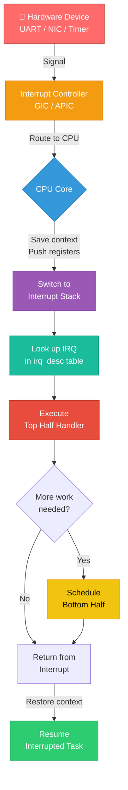
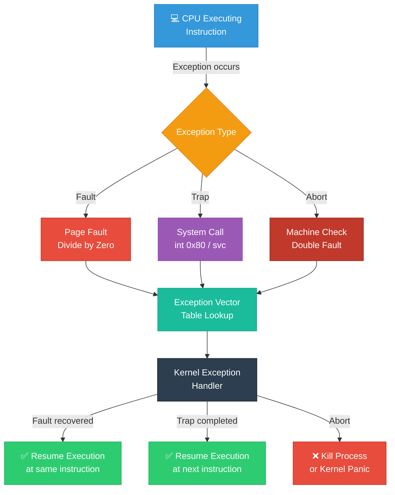
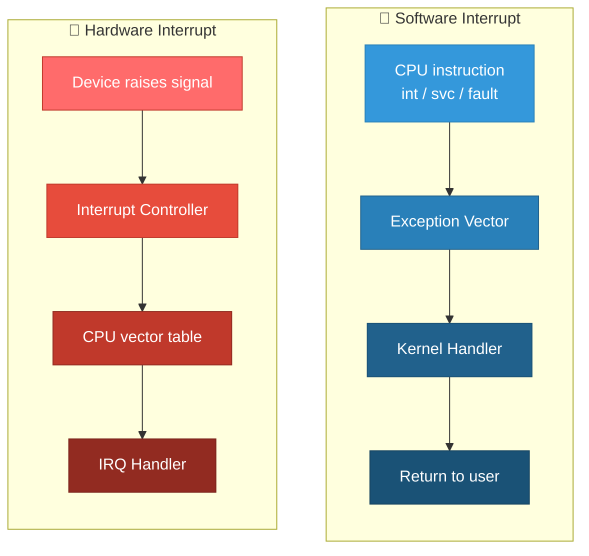

# 01 — Hardware Interrupts vs Software Interrupts

## 📌 Overview

An **interrupt** is an asynchronous or synchronous signal that causes the CPU to pause current execution and jump to a specific handler routine. Linux classifies interrupts into two broad categories:

- **Hardware Interrupts (External/Asynchronous)** — generated by hardware devices
- **Software Interrupts (Internal/Synchronous)** — generated by CPU instructions or exceptions

---

## 🔍 Hardware Interrupts

Hardware interrupts are **asynchronous** signals sent by peripheral devices (keyboard, NIC, disk controller, timer) to the CPU via an **interrupt controller**.

### Key Characteristics
- Generated **externally** by devices
- **Asynchronous** — can arrive at any time
- Routed through an interrupt controller (GIC on ARM, APIC on x86)
- Each interrupt has an **IRQ number**
- The CPU saves context and jumps to the registered handler

### Interrupt Controllers

| Architecture | Controller | Description |
|---|---|---|
| **ARM** | GIC (Generic Interrupt Controller) | GICv2/v3/v4 — handles SPI, PPI, SGI |
| **x86** | APIC (Advanced PIC) | Local APIC + I/O APIC — per-CPU + shared |
| **Legacy x86** | 8259A PIC | Cascade of two 8-bit controllers (16 IRQs) |

### Hardware Interrupt Types (ARM GIC)

| Type | Range | Description |
|---|---|---|
| **SGI** (Software Generated) | 0–15 | Inter-processor interrupts |
| **PPI** (Private Peripheral) | 16–31 | Per-CPU private (timer, PMU) |
| **SPI** (Shared Peripheral) | 32–1019 | Shared across CPUs (UART, SPI, I2C) |

---

## 🔍 Software Interrupts / Exceptions

Software interrupts are **synchronous** — they are triggered by the CPU itself during instruction execution.

### Types of Software Interrupts

| Type | Cause | Example |
|---|---|---|
| **Traps** | Intentional — caused by an instruction | `int 0x80` (x86 syscall), `svc` (ARM syscall) |
| **Faults** | Recoverable error | Page fault, divide-by-zero |
| **Aborts** | Unrecoverable error | Machine check, double fault |

### System Call Path (Software Interrupt)

On **x86** (legacy): `int 0x80` triggers vector 128 → syscall handler  
On **x86_64** (modern): `syscall` instruction → `entry_SYSCALL_64`  
On **ARM64**: `svc #0` instruction → exception vector → `el0_sync` → syscall handler

---

## 🎨 Mermaid Diagrams

### Hardware Interrupt Flow



### Software Interrupt (Exception) Flow



### Comparison: Hardware vs Software Interrupt



---

## 💻 Code Examples

### Registering a Hardware Interrupt Handler

```c
#include <linux/interrupt.h>

static irqreturn_t my_irq_handler(int irq, void *dev_id)
{
    struct my_device *dev = dev_id;
    u32 status = readl(dev->base + STATUS_REG);

    if (!(status & MY_IRQ_FLAG))
        return IRQ_NONE;  /* Not our interrupt */

    /* Acknowledge interrupt in hardware */
    writel(MY_IRQ_FLAG, dev->base + STATUS_REG);

    /* Schedule bottom half for heavy processing */
    tasklet_schedule(&dev->tasklet);

    return IRQ_HANDLED;
}

static int my_probe(struct platform_device *pdev)
{
    int irq = platform_get_irq(pdev, 0);
    
    ret = request_irq(irq, my_irq_handler,
                      IRQF_SHARED, "my_device", my_dev);
    if (ret)
        return ret;
    
    return 0;
}
```

### Software Interrupt — System Call Entry (ARM64)

```c
/* arch/arm64/kernel/entry.S — simplified */
el0_sync:
    /* Save all registers to pt_regs on kernel stack */
    kernel_entry 0
    
    mrs x25, esr_el1          /* Read Exception Syndrome Register */
    lsr x24, x25, #ESR_ELx_EC_SHIFT  /* Extract exception class */
    
    cmp x24, #ESR_ELx_EC_SVC64  /* Is it a system call? */
    b.eq el0_svc               /* Yes → handle syscall */
    
    cmp x24, #ESR_ELx_EC_DABT_LOW  /* Data abort from EL0? */
    b.eq el0_da                     /* Yes → page fault handler */
```

---

## 🔑 Key Differences Summary

| Feature | Hardware Interrupt | Software Interrupt |
|---------|-------------------|-------------------|
| **Source** | External device | CPU instruction / exception |
| **Timing** | Asynchronous | Synchronous |
| **Trigger** | Electrical signal on IRQ line | `int`, `svc`, fault condition |
| **Controller** | GIC, APIC, PIC | Exception vector table only |
| **Maskable?** | Most are (except NMI) | Cannot be masked |
| **Context** | Interrupt context | May be process or interrupt |
| **Nesting** | Configurable | Depends on exception type |
| **Example** | Timer tick, NIC packet | Page fault, system call |

---

## 🔥 Tough Interview Questions & Deep Answers

### ❓ Q1: What is the difference between an IRQ and an exception on ARM64?

**A:** On ARM64, both are routed through the **exception vector table** (`VBAR_EL1`), but they differ fundamentally:

- **IRQ** (`el1_irq` / `el0_irq`): Asynchronous. Triggered by external hardware via GIC. The CPU was executing unrelated code. The handler entry uses `ESR_ELx_EC` = IRQ class. After handling, execution resumes at the interrupted instruction.

- **Exception** (`el1_sync` / `el0_sync`): Synchronous. Triggered by the currently executing instruction (page fault, undefined instruction, SVC). The `ESR_EL1` register contains the **Exception Syndrome** — the exact class and cause. A fault re-executes the faulting instruction after fix; a trap (SVC) returns to the next instruction.

Key insight: ARM64 uses **4 exception levels (EL0-EL3)** and the vector table has entries for each combination of exception type × source EL × stack pointer selection.

---

### ❓ Q2: Can a hardware interrupt arrive while the CPU is handling a software interrupt (exception)?

**A:** **Yes.** Hardware interrupts are asynchronous and can preempt exception handlers — unless IRQs are explicitly disabled (`local_irq_disable()`). 

For example, during a page fault handler:

1. User access triggers a page fault (synchronous exception)
2. Kernel enters `do_page_fault()` — this runs in **process context** with IRQs typically enabled
3. A hardware timer interrupt arrives → CPU saves page fault handler state
4. Timer IRQ handler runs (interrupt context)
5. Timer handler returns → CPU resumes page fault handler

However, hardware interrupts **cannot** be preempted by other hardware interrupts on the same CPU in standard Linux (nested IRQs are disabled by default since kernel 2.6.x).

---

### ❓ Q3: Why did Linux move from `int 0x80` to the `syscall` instruction on x86_64?

**A:** Performance. The `int 0x80` mechanism involves:

1. CPU looks up IDT entry for vector 0x80
2. Privilege level check (DPL)
3. Stack switch (load TSS → new SS:RSP)
4. Push SS, RSP, RFLAGS, CS, RIP onto kernel stack
5. Load new CS:RIP from IDT gate

The `syscall` instruction (introduced with AMD64) is much faster:
1. RCX ← RIP (return address), R11 ← RFLAGS
2. RIP ← `IA32_LSTAR` MSR (kernel entry point)
3. CS/SS loaded from `IA32_STAR` MSR
4. No memory reads — everything from MSRs

This eliminates the IDT lookup, TSS access, and multiple memory writes, saving **~100+ CPU cycles per syscall**. On a system doing millions of syscalls/sec, this is significant.

---

### ❓ Q4: Explain the ARM GIC interrupt flow from device assertion to handler execution.

**A:** 

1. **Device asserts** interrupt line (level-high or edge-rising) connected to GIC SPI input
2. **GIC Distributor** latches the interrupt, checks:
   - Is this IRQ **enabled** in `GICD_ISENABLERn`?
   - What is its **priority** in `GICD_IPRIORITYRn`?
   - Which CPUs are **targeted** in `GICD_ITARGETSRn` (GICv2) or routing via `GICD_IROUTERn` (GICv3)?
3. **Distributor** forwards to the target CPU's **CPU Interface**
4. **CPU Interface** compares interrupt priority against `GICC_PMR` (priority mask) and running priority
5. If higher priority → CPU Interface **asserts IRQ signal** to CPU core
6. **CPU** takes the IRQ exception:
   - Saves `PSTATE` to `SPSR_EL1`, return address to `ELR_EL1`
   - Jumps to exception vector (`VBAR_EL1 + offset`)
7. **Linux handler** reads `GICC_IAR` (acknowledge register) → gets interrupt ID
8. Calls `handle_domain_irq()` → looks up `irq_desc` → calls registered handler
9. Handler returns `IRQ_HANDLED`
10. Linux writes interrupt ID to `GICC_EOIR` (End of Interrupt)
11. GIC deasserts and is ready for next interrupt

---

### ❓ Q5: What happens if a device asserts an interrupt but no handler is registered for that IRQ?

**A:** The kernel tracks this via `irq_desc->action`. If `action == NULL` (no handler registered):

1. The interrupt fires and reaches `handle_irq_event()`
2. Since there's no action chain, the kernel calls `note_interrupt()` with `IRQ_NONE`
3. The spurious interrupt counter increments
4. If spurious interrupts exceed `99,900 out of 100,000` (threshold in `note_interrupt()`), the kernel **disables the IRQ line** and prints: `"irq XX: nobody cared"` followed by a stack trace
5. The IRQ is marked `IRQ_DISABLED` and `IRQS_SPURIOUS_DISABLED`

This mechanism prevents interrupt storms from hanging the system. The relevant code is in `kernel/irq/spurious.c`.

---

[← Back to Index](ReadMe.Md) | [Next: 02 — Interrupt Descriptor Table →](02_Interrupt_Descriptor_Table.md)
