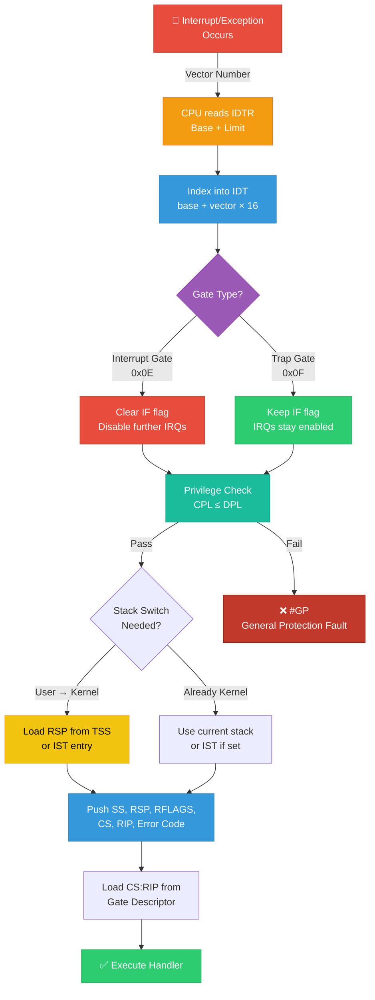
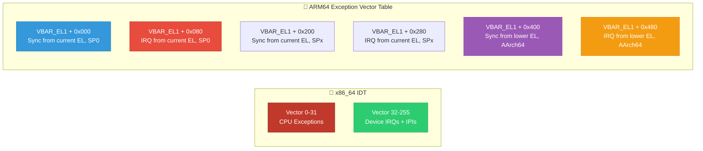

# 02 — Interrupt Descriptor Table (IDT)

## 📌 Overview

The **Interrupt Descriptor Table (IDT)** is an x86/x86_64 data structure that maps each **interrupt vector number** (0–255) to a handler function. When an interrupt or exception occurs, the CPU uses the vector number as an index into the IDT to find the handler's address.

On **ARM64**, the equivalent is the **Exception Vector Table** pointed to by `VBAR_EL1`.

---

## 🔍 IDT Structure (x86_64)

### Vector Number Layout

| Vector Range | Type | Description |
|---|---|---|
| 0–31 | CPU Exceptions | Divide error, Page fault, Double fault, etc. |
| 32–47 | Legacy IRQs | Mapped from 8259A PIC (ISA devices) |
| 48–255 | Available | Used by APIC for device IRQs, IPIs, etc. |
| 128 (0x80) | System Call | Legacy `int 0x80` syscall entry |
| 251–255 | APIC Special | Thermal, APIC error, spurious, etc. |

### IDT Gate Descriptor (16 bytes on x86_64)

```
Bits 127:96  → Offset[63:32]     (handler address high)
Bits 95:80   → Reserved
Bits 79:64   → Offset[31:16]     (handler address mid)
Bits 63:48   → Offset[15:0]      (handler address low)
Bits 47:45   → DPL               (Descriptor Privilege Level)
Bits 44      → Present bit
Bits 43:40   → Gate Type          (0xE = Interrupt, 0xF = Trap)
Bits 39:35   → IST               (Interrupt Stack Table index)
Bits 34:32   → Reserved
Bits 31:16   → Segment Selector   (kernel CS)
```

### Gate Types

| Type | Value | IRQs Disabled? | Use Case |
|---|---|---|---|
| **Interrupt Gate** | 0x0E | Yes (IF cleared) | Hardware IRQs, most exceptions |
| **Trap Gate** | 0x0F | No (IF unchanged) | System calls, breakpoints |

---

## 🎨 Mermaid Diagrams

### IDT Lookup Flow



### IDT Memory Layout

```mermaid
flowchart LR
    subgraph IDTR["📋 IDTR Register"]
        direction TB
        IR1["Base Address (64-bit)"]
        IR2["Limit (16-bit) = 4095<br/>(256 × 16 - 1)"]
    end

    subgraph IDT["📦 IDT Table (256 entries × 16 bytes)"]
        direction TB
        V0["Vector 0: #DE<br/>Divide Error"]
        V1["Vector 1: #DB<br/>Debug"]
        V2["Vector 2: NMI"]
        V6["..."]
        V14["Vector 14: #PF<br/>Page Fault"]
        V32["Vector 32-47:<br/>Legacy IRQs"]
        V128["Vector 128:<br/>int 0x80 syscall"]
        V255["Vector 255:<br/>APIC Spurious"]
    end

    IDTR -->|Points to| IDT

    style IDTR fill:#e74c3c,stroke:#c0392b,color:#fff
    style V0 fill:#3498db,stroke:#2980b9,color:#fff
    style V2 fill:#f39c12,stroke:#e67e22,color:#fff
    style V14 fill:#9b59b6,stroke:#8e44ad,color:#fff
    style V32 fill:#2ecc71,stroke:#27ae60,color:#fff
    style V128 fill:#e67e22,stroke:#d35400,color:#fff
    style V255 fill:#95a5a6,stroke:#7f8c8d,color:#fff
```



### ARM64 Exception Vector Table Comparison



---

## 💻 Code Examples

### Linux IDT Setup (x86_64)

```c
/* arch/x86/kernel/idt.c — simplified */

/* IDT gate descriptor */
struct idt_data {
    unsigned int    vector;
    unsigned int    segment;
    struct idt_bits bits;
    const void      *addr;  /* handler function pointer */
};

/* Exception handlers — vectors 0-31 */
static const __initconst struct idt_data def_idts[] = {
    INTG(X86_TRAP_DE,       asm_exc_divide_error),
    INTG(X86_TRAP_DB,       asm_exc_debug),
    INTG(X86_TRAP_NMI,      asm_exc_nmi),
    SYSG(X86_TRAP_BP,       asm_exc_int3),        /* Trap gate, DPL=3 */
    INTG(X86_TRAP_PF,       asm_exc_page_fault),
    /* ... more exceptions ... */
};

/* Device IRQ handlers — vectors 32+ */
static const __initconst struct idt_data apic_idts[] = {
    INTG(LOCAL_TIMER_VECTOR,    asm_sysvec_apic_timer_interrupt),
    INTG(RESCHEDULE_VECTOR,     asm_sysvec_reschedule_ipi),
    INTG(THERMAL_APIC_VECTOR,   asm_sysvec_thermal),
    INTG(SPURIOUS_APIC_VECTOR,  asm_sysvec_spurious_apic),
};

void __init idt_setup_early_traps(void)
{
    idt_setup_from_table(idt_table, def_idts,
                         ARRAY_SIZE(def_idts), true);
    load_idt(&idt_descr);  /* lidt instruction */
}
```

### Reading IDTR from userspace (educational)

```c
/* This only works at ring 0 (kernel module) */
struct idtr {
    u16 limit;
    u64 base;
} __attribute__((packed));

struct idtr idtr_val;
asm volatile("sidt %0" : "=m"(idtr_val));
pr_info("IDT base: 0x%llx, limit: 0x%x\n", idtr_val.base, idtr_val.limit);
```

### IST (Interrupt Stack Table) for Critical Exceptions

```c
/* Certain exceptions use dedicated stacks via IST to handle
 * scenarios where the normal kernel stack may be corrupted */

/* IST assignments in Linux (arch/x86/include/asm/stacktrace.h) */
#define IST_INDEX_DF    0   /* Double Fault — stack overflow detection */
#define IST_INDEX_NMI   1   /* NMI — can arrive any time */
#define IST_INDEX_DB    2   /* Debug — hardware breakpoints */
#define IST_INDEX_MCE   3   /* Machine Check — hardware failure */
```

---

## 🔑 Key Points

| Concept | Detail |
|---------|--------|
| **IDTR register** | Holds base address + limit of IDT |
| **256 vectors** | 0–31 reserved for CPU, rest for devices/IPIs |
| **Interrupt gate** | Automatically clears IF (disables IRQs) |
| **Trap gate** | Leaves IF unchanged (IRQs stay enabled) |
| **IST** | Dedicated stacks for critical exceptions (NMI, DF, MCE) |
| **DPL field** | Controls which ring can invoke via `int N` instruction |
| **lidt/sidt** | Load/store IDT register instructions |

---

## 🔥 Tough Interview Questions & Deep Answers

### ❓ Q1: Why does the page fault handler use an Interrupt Gate and not a Trap Gate?

**A:** The page fault handler (`#PF`, vector 14) uses an **Interrupt Gate** which disables interrupts (clears IF) upon entry. However, the Linux page fault handler **re-enables interrupts almost immediately** in `exc_page_fault()`:

```c
void exc_page_fault(struct pt_regs *regs, unsigned long error_code)
{
    /* Re-enable interrupts if they were enabled before the fault */
    if (user_mode(regs))
        local_irq_enable();
    ...
}
```

The reason for using an interrupt gate initially is **atomicity of the entry path**: the CPU needs to save the faulting address in `CR2` and push the error code onto the stack. If another interrupt arrived between the `CR2` write and the handler reading it, and that interrupt also caused a page fault, `CR2` would be overwritten. By disabling IRQs during the initial entry, we protect the `CR2` read.

---

### ❓ Q2: What is the IST mechanism and why is it needed? Can't we just use the normal kernel stack?

**A:** The **Interrupt Stack Table (IST)** is an x86_64 feature that provides up to **7 dedicated stacks** per CPU, configured in the **TSS** (Task State Segment). When an IDT gate specifies a non-zero IST index, the CPU **unconditionally** switches to that stack — regardless of the current privilege level or stack state.

**Why it's needed:** For critical exceptions like **Double Fault (#DF)** and **NMI**:

- **Double Fault**: Occurs when the CPU can't handle an exception (e.g., kernel stack overflow caused a page fault, and the page fault handler also faults). If we used the same corrupted stack, the double fault handler would also crash → **triple fault → system reset**. IST gives us a known-good stack.

- **NMI**: Can arrive at any time, including during a stack switch. Without IST, if an NMI arrives while the CPU is between loading the new SS and RSP, the NMI handler would use a partially-switched stack.

IST is configured per-CPU in `cpu_init()` → `tss_setup_ist()`.

---

### ❓ Q3: How does Linux handle the x86_64 IDT differently from a 32-bit x86 IDT?

**A:** Key differences:

| Feature | x86 (32-bit) | x86_64 (64-bit) |
|---------|-------------|-----------------|
| Gate size | 8 bytes | **16 bytes** (to hold 64-bit addresses) |
| IST field | Not available | **3-bit IST index** in gate descriptor |
| Task gates | Supported | **Removed** — no hardware task switching |
| Stack switch | Via TSS SS0:ESP0 | Via TSS RSP0 or **IST** |
| Syscall entry | `int 0x80` common | `syscall` instruction (not via IDT) |
| Gate types used | Interrupt + Trap + Task | Interrupt + Trap only |

The 64-bit mode also enforces that the IDT must be in the **canonical address range** and that segment selectors in gates must be valid kernel segments.

---

### ❓ Q4: What happens during a Double Fault? Walk through the CPU and kernel behavior.

**A:** A **Double Fault (#DF, vector 8)** occurs when the CPU encounters an exception while trying to handle a prior exception, and the combination is in the "double fault" class.

**Step-by-step:**

1. **Original exception** occurs (e.g., stack overflow → page fault #PF)
2. CPU tries to push error frame for #PF but the stack is invalid → **another #PF**
3. CPU detects two consecutive #PF = **Double Fault**
4. CPU looks up IDT[8] — the #DF gate has **IST=1** → switches to a dedicated IST stack
5. CPU pushes error frame (SS, RSP, RFLAGS, CS, RIP, error code=0) onto IST stack
6. Linux `asm_exc_double_fault` handler runs:
   ```c
   DEFINE_IDTENTRY_DF(exc_double_fault) {
       /* Try to fixup espfix64 or guard page faults */
       /* If not fixable → die() → panic */
       die("double fault", regs, error_code);
   }
   ```
7. If the double fault handler itself faults → **Triple Fault → CPU RESET** (no handler possible)

This is why IST is critical for #DF — without a guaranteed-good stack, the handler can never run.

---

### ❓ Q5: On ARM64, there's no IDT. How does interrupt dispatching work?

**A:** ARM64 uses the **Exception Vector Table**, a fixed-layout table of 16 entries (each 128 bytes = 32 instructions) at the address in `VBAR_EL1`:

```
Offset    Source EL      Type
0x000     Current EL, SP0    Synchronous
0x080     Current EL, SP0    IRQ
0x100     Current EL, SP0    FIQ
0x180     Current EL, SP0    SError
0x200     Current EL, SPx    Synchronous
0x280     Current EL, SPx    IRQ
0x300     Current EL, SPx    FIQ
0x380     Current EL, SPx    SError
0x400     Lower EL, AArch64  Synchronous
0x480     Lower EL, AArch64  IRQ
0x500     Lower EL, AArch64  FIQ
0x580     Lower EL, AArch64  SError
0x600     Lower EL, AArch32  Synchronous
0x680     Lower EL, AArch32  IRQ
0x700     Lower EL, AArch32  FIQ
0x780     Lower EL, AArch32  SError
```

Unlike x86's 256-entry IDT with per-vector routing, ARM64 uses **only 4 exception types** × 4 contexts. The **specific interrupt source** is determined by reading the GIC's `IAR` register inside the IRQ handler. The **ESR_EL1** register identifies the specific synchronous exception class.

This design is simpler but means the software (Linux) must do the interrupt source identification, whereas x86 hardware provides per-vector dispatch.

---

[← Previous: 01 — Hardware vs Software Interrupts](01_Hardware_vs_Software_Interrupts.md) | [Next: 03 — Interrupt Context vs Process Context →](03_Interrupt_Context_vs_Process_Context.md)
