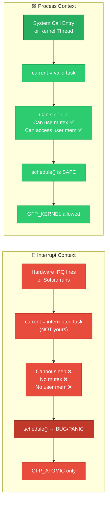
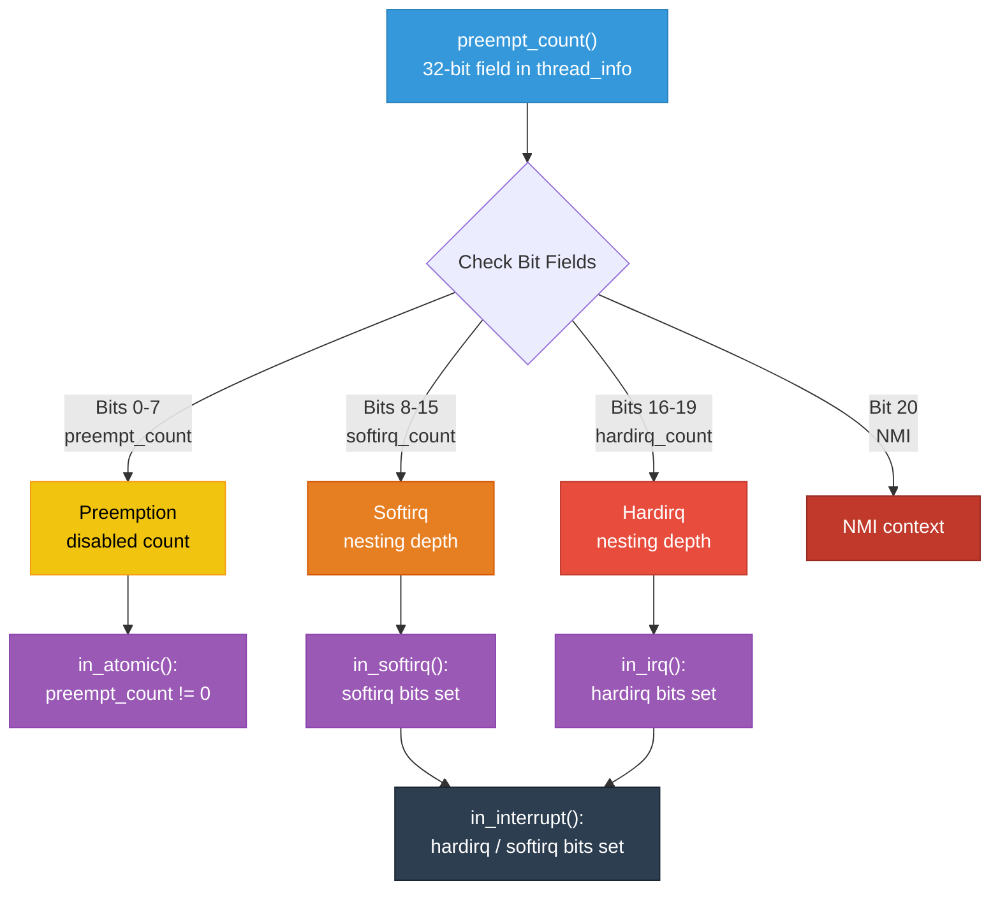
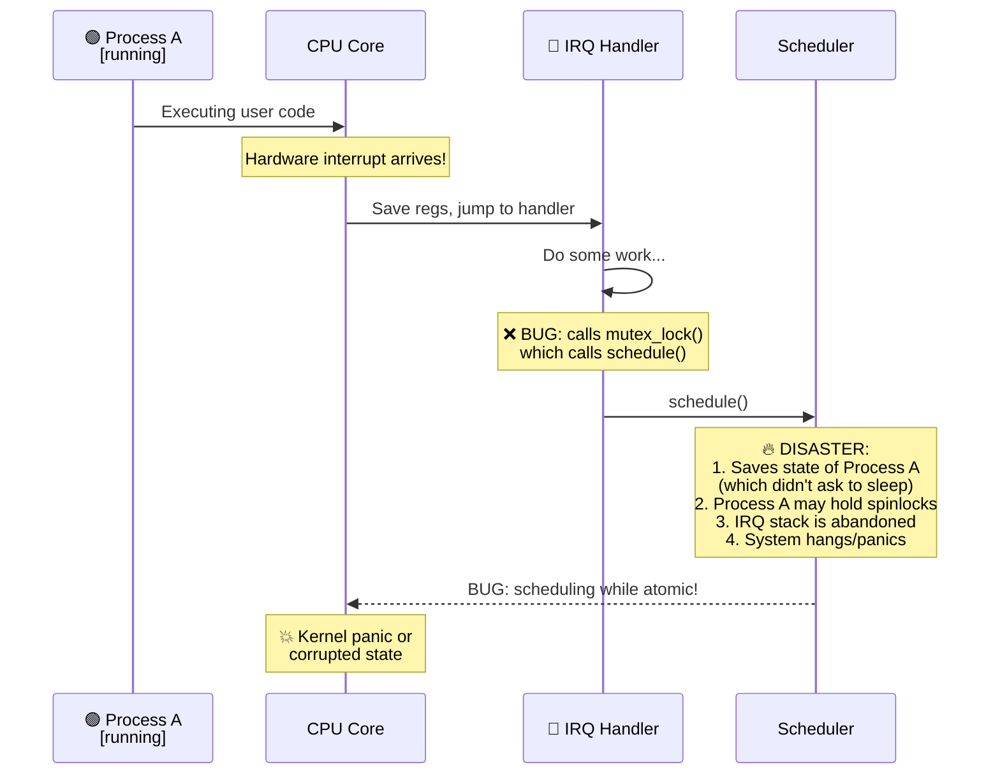

# 03 — Interrupt Context vs Process Context

## 📌 Overview

Understanding the distinction between **interrupt context** and **process context** is fundamental to Linux kernel programming. It determines what operations are safe, which APIs can be called, and how synchronization must be handled.

- **Process Context**: Kernel code running on behalf of a process (syscalls, kernel threads). Has a backing `current` task and can sleep.
- **Interrupt Context**: Kernel code running in response to a hardware/software interrupt. No backing process, **cannot sleep**.

---

## 🔍 Process Context

Code executes in process context when:
- A user-space process makes a **system call** (`read()`, `write()`, `ioctl()`)
- A **kernel thread** (`kworker`, `ksoftirqd`, `kswapd`) is running
- A **workqueue** handler executes

### Characteristics

| Property | Process Context |
|----------|----------------|
| `current` pointer | Valid — points to the task | 
| Can sleep/block | ✅ Yes |
| Can call `kmalloc(GFP_KERNEL)` | ✅ Yes |
| Can call `mutex_lock()` | ✅ Yes |
| Can call `copy_to_user()` / `copy_from_user()` | ✅ Yes |
| Preemptible | ✅ Yes (if CONFIG_PREEMPT) |
| Has user-space address space | ✅ Yes (for syscalls), No (for kernel threads) |
| `in_interrupt()` returns | 0 (false) |

---

## 🔍 Interrupt Context

Code executes in interrupt context when:
- A **hardirq handler** runs (top half — `request_irq()` handlers)
- A **softirq** handler runs
- A **tasklet** runs

### Characteristics

| Property | Interrupt Context |
|----------|------------------|
| `current` pointer | Unreliable — points to interrupted task | 
| Can sleep/block | ❌ **NO** |
| Can call `kmalloc(GFP_KERNEL)` | ❌ No — use `GFP_ATOMIC` |
| Can call `mutex_lock()` | ❌ **NO** — use `spin_lock()` |
| Can call `copy_to_user()` | ❌ **NO** — no user address space |
| Preemptible | ❌ No |
| Has user-space address space | ❌ No |
| `in_interrupt()` returns | Non-zero (true) |

### Why Can't Interrupt Context Sleep?

1. **No backing `task_struct`**: Sleeping requires `schedule()` which saves state to `task_struct->thread` and picks the next task. In interrupt context, `current` points to whatever task was interrupted — we can't sleep "on behalf of" a random process.

2. **Scheduler corruption**: If the interrupt handler sleeps, the interrupted process is put to sleep without it requesting this — it may hold locks, be in a critical section, etc.

3. **Deadlock risk**: If the interrupted code held a spinlock and we schedule away, no other CPU can progress if it needs that lock.

4. **Stack**: Hardirq handlers may run on a special **interrupt stack** (per-CPU, separate from any process kernel stack). The scheduler expects a process kernel stack.

---

## 🎨 Mermaid Diagrams

### Context Comparison Flow



### Preemption Count & Context Detection



### What Happens When You Sleep in Interrupt Context



---

## 💻 Code Examples

### Checking Current Context

```c
#include <linux/preempt.h>

void my_function(void)
{
    if (in_interrupt()) {
        /* We're in interrupt context (hardirq or softirq) */
        pr_info("Interrupt context — cannot sleep!\n");
        buf = kmalloc(size, GFP_ATOMIC);
    } else {
        /* We're in process context — safe to sleep */
        pr_info("Process context — current=%s pid=%d\n",
                current->comm, current->pid);
        buf = kmalloc(size, GFP_KERNEL);
    }

    /* More specific checks */
    if (in_irq())       /* Only true in hardirq handler */
        pr_info("hardirq context\n");
    if (in_softirq())   /* Only true in softirq/tasklet */
        pr_info("softirq context\n");
    if (in_task())      /* True if in process context */
        pr_info("process/task context\n");
}
```

### The `preempt_count` Internals

```c
/* include/linux/preempt.h */
/*
 * preempt_count layout (32-bit):
 *
 *  31        20  19  16  15   8  7    0
 * +----------+----+-----+------+------+
 * | reserved |NMI | HARD | SOFT | PREEMPT |
 * +----------+----+-----+------+------+
 *              1     4      8       8
 *
 * PREEMPT_MASK:    0x000000ff
 * SOFTIRQ_MASK:    0x0000ff00
 * HARDIRQ_MASK:    0x000f0000
 * NMI_MASK:        0x00100000
 */

#define in_irq()        (hardirq_count())
#define in_softirq()    (softirq_count())
#define in_interrupt()  (irq_count())  /* hardirq | softirq */
#define in_task()       (!(in_interrupt()))
#define in_atomic()     (preempt_count() != 0)
```

### Safe API Usage by Context

```c
/* ✅ Process context — full API available */
static long my_ioctl(struct file *file, unsigned int cmd, unsigned long arg)
{
    void *buf;
    struct mutex *lock = &my_dev->lock;
    
    mutex_lock(lock);                          /* ✅ Can sleep */
    buf = kmalloc(4096, GFP_KERNEL);           /* ✅ Can sleep for memory */
    if (copy_from_user(buf, (void __user *)arg, 4096))  /* ✅ User access */
        return -EFAULT;
    msleep(100);                               /* ✅ Can sleep */
    mutex_unlock(lock);
    kfree(buf);
    return 0;
}

/* ❌/✅ Interrupt context — restricted API */
static irqreturn_t my_irq_handler(int irq, void *dev_id)
{
    void *buf;
    
    /* spin_lock(&lock);        ✅ OK — non-sleeping */
    /* buf = kmalloc(64, GFP_ATOMIC);  ✅ OK — non-sleeping alloc */
    /* mutex_lock(&lock);       ❌ BUG — sleeps! */
    /* kmalloc(64, GFP_KERNEL); ❌ BUG — may sleep! */
    /* copy_from_user(...);     ❌ BUG — no user address space! */
    /* msleep(100);             ❌ BUG — sleeps! */
    
    return IRQ_HANDLED;
}
```

---

## 🔑 Quick Reference: What's Allowed Where

| Operation | Process Ctx | Hardirq | Softirq | Tasklet | Workqueue |
|-----------|:-----------:|:-------:|:-------:|:-------:|:---------:|
| `schedule()` / sleep | ✅ | ❌ | ❌ | ❌ | ✅ |
| `mutex_lock()` | ✅ | ❌ | ❌ | ❌ | ✅ |
| `kmalloc(GFP_KERNEL)` | ✅ | ❌ | ❌ | ❌ | ✅ |
| `kmalloc(GFP_ATOMIC)` | ✅ | ✅ | ✅ | ✅ | ✅ |
| `spin_lock()` | ✅ | ✅ | ✅ | ✅ | ✅ |
| `copy_to/from_user()` | ✅ | ❌ | ❌ | ❌ | ✅ |
| `printk()` | ✅ | ✅ | ✅ | ✅ | ✅ |
| Access `current` | ✅ | ⚠️ | ⚠️ | ⚠️ | ✅ |

---

## 🔥 Tough Interview Questions & Deep Answers

### ❓ Q1: Why exactly can't you call `mutex_lock()` in interrupt context? Be precise.

**A:** `mutex_lock()` internally calls `schedule()` when the mutex is contended (owned by another thread). Here's the exact path:

```
mutex_lock() → __mutex_lock_slowpath() → __mutex_lock() → schedule_preempt_disabled()
```

`schedule()` does the following:
1. Calls `__schedule()` which accesses `current->` fields to save state
2. Picks the next task via CFS scheduler
3. Does a `context_switch()` — switches `mm`, stack, registers

In interrupt context:
- `current` points to the **interrupted process**, not the interrupt handler
- There's no `task_struct` for the "interrupt task" — you can't save/restore its state
- The interrupted process didn't volunteer to sleep — it may hold spinlocks
- The interrupt stack will be "abandoned" — if another interrupt arrives on this CPU, it may corrupt it

The kernel has a runtime check: `schedule()` calls `schedule_debug()` → checks `in_atomic_preempt_off()` → prints **"BUG: scheduling while atomic"** and dumps a stack trace.

---

### ❓ Q2: `in_interrupt()` returns true for softirqs, but `ksoftirqd` is a kernel thread. How does that work?

**A:** This is a subtle but important distinction:

- **Softirqs raised inline** (called from `irq_exit()` → `__do_softirq()`): Run with `softirq_count` elevated in `preempt_count`, so `in_interrupt() = true`. They run on the interrupted task's kernel stack (or interrupt stack). They **cannot sleep**.

- **Softirqs via `ksoftirqd`**: When softirqs are deferred to the `ksoftirqd` kernel thread (because too many softirqs in a row), `__do_softirq()` is still called, and `__local_bh_disable_ip()` still increments `softirq_count`. So `in_interrupt()` is **still true** inside the softirq handler, even though `ksoftirqd` is a real kernel thread.

The key insight: `in_interrupt()` doesn't check whether you're a kernel thread. It checks the `preempt_count` bits. The `__do_softirq()` path always sets softirq bits regardless of whether it's called from `irq_exit()` or `ksoftirqd`.

This means: even though `ksoftirqd` *could* theoretically support sleeping, the design forbids it because softirq handlers must have the same behavior regardless of execution path.

---

### ❓ Q3: What is the interrupt stack and why is it separate from the process kernel stack?

**A:** On x86_64, each CPU has a dedicated **interrupt stack** (typically 16KB, configured via `IRQ_STACK_SIZE`). When a hardware interrupt arrives:

1. The IDT gate may specify IST, or the CPU uses the current kernel stack
2. Linux's `irq_entries_start` handler switches to the per-CPU interrupt stack via `call_on_irqstack()`

**Why a separate stack?**

- **Stack overflow protection**: If we used the interrupted process's kernel stack (typically 8-16KB), deep interrupt handler call chains plus the existing process kernel usage could overflow. A separate stack guarantees dedicated space.
- **Nesting safety**: Even though Linux doesn't normally nest IRQs, NMIs and MCEs have their own IST stacks for safety.
- **Process independence**: The interrupt handler shouldn't depend on which process happened to be running when the interrupt arrived.

On **ARM64**, the interrupt handler runs on the interrupted task's kernel stack (unless `CONFIG_IRQ_STACKS` is enabled, which provides per-CPU IRQ stacks since kernel 5.x).

---

### ❓ Q4: Can `workqueue` handlers access user-space memory? Why are they considered "process context"?

**A:** Workqueue handlers run in the context of **`kworker` kernel threads**. They are in process context because:

1. `kworker` has a valid `task_struct` → `current` is meaningful
2. The scheduler manages them normally → they can sleep, block, use mutexes
3. `in_interrupt()` returns false

**However**, they **cannot** access the original user-process's memory via `copy_from_user()` because `kworker` is a **kernel thread** — its `current->mm = NULL`. `copy_from_user()` requires the calling task to have the user's address space mapped.

If a workqueue handler needs user data, the data must be **copied into kernel buffers** before scheduling the work (i.e., in the ioctl/syscall handler that queues the work item).

---

### ❓ Q5: How does `CONFIG_PREEMPT_RT` change interrupt context rules?

**A:** With **PREEMPT_RT** (Real-Time patch, merged in kernel 6.x):

1. **Hardirq handlers become threaded by default**: Most `request_irq()` handlers run as kernel threads (`irq/N-name`), making them **process context**. They can use mutexes!

2. **Softirqs run in `ksoftirqd`**: All softirq processing is deferred to kernel threads — no more inline softirq execution from `irq_exit()`.

3. **Spinlocks become RT-mutexes**: `spin_lock()` maps to `rt_mutex` which can sleep and supports priority inheritance. Only `raw_spin_lock()` remains a true spinning lock.

4. **`local_irq_disable()` only disables preemption**: On PREEMPT_RT, `local_irq_disable()` doesn't actually disable hardware interrupts — it just prevents preemption. Use `raw_local_irq_disable()` for true IRQ disabling.

This fundamentally changes the model: in PREEMPT_RT, very little code runs in "true" interrupt context. Only code between `raw_spin_lock_irqsave()` and the threaded handler dispatch runs with interrupts truly disabled.

---

[← Previous: 02 — IDT](02_Interrupt_Descriptor_Table.md) | [Next: 04 — Top Half and Bottom Half →](04_Top_Half_and_Bottom_Half.md)
