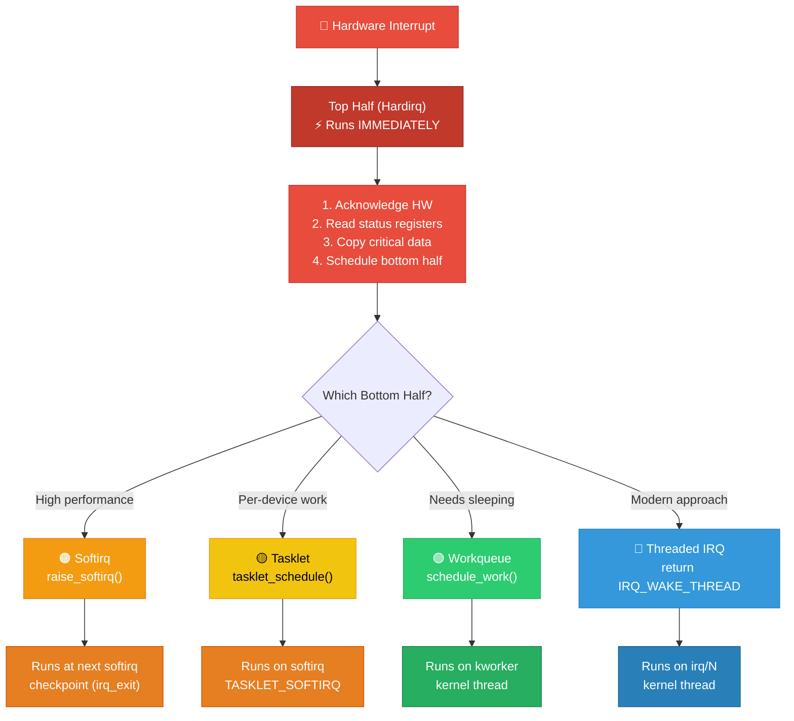
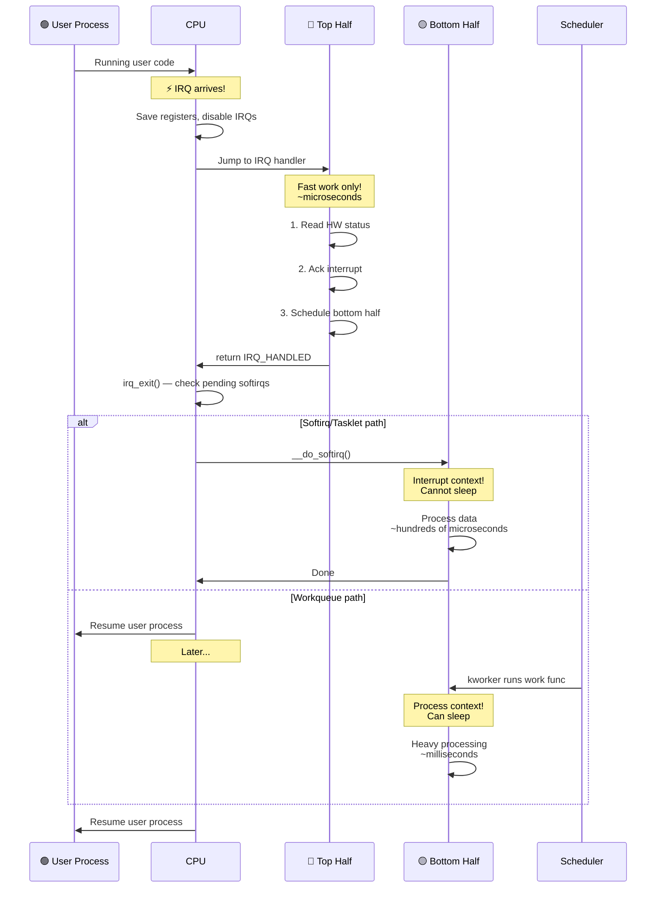
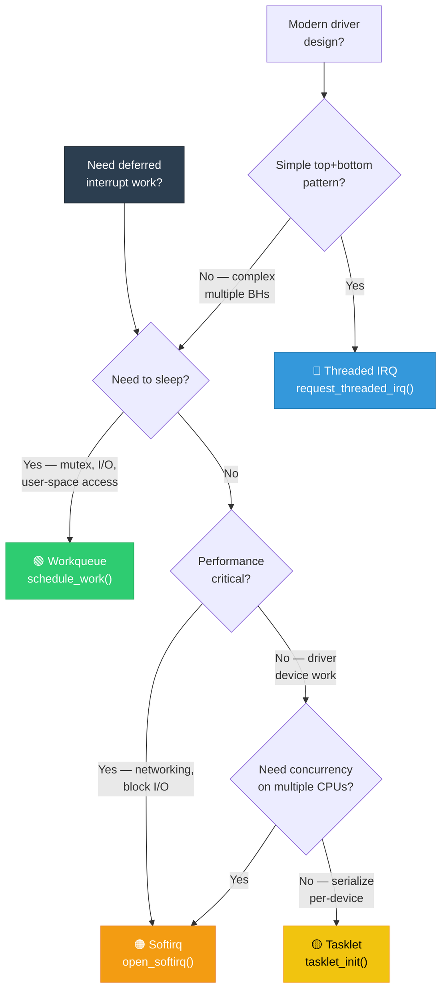

# 04 — Top Half and Bottom Half

## 📌 Overview

Linux splits interrupt processing into two phases to minimize the time spent with interrupts disabled:

- **Top Half (Hardirq)**: Runs immediately in interrupt context. Must be **fast** — acknowledge hardware, save critical data, schedule deferred work.
- **Bottom Half**: Runs later with fewer restrictions. Does the **heavy processing** — protocol handling, buffer management, user notification.

---

## 🔍 Why Split Interrupt Processing?

| Problem | Solution |
|---------|----------|
| Long interrupt handlers block other interrupts | Split: fast top half + deferred bottom half |
| Can't sleep in interrupt context | Bottom half (workqueue) runs in process context |
| Network packet storm floods CPU | Softirq + NAPI batches processing |
| Jitter affects real-time tasks | Threaded IRQs allow priority scheduling |

### The Golden Rule

> The **top half** should do the **minimum necessary work**: acknowledge the interrupt, read time-critical data from hardware, and schedule a bottom half. Everything else goes to the bottom half.

---

## 🔍 Bottom Half Mechanisms

| Mechanism | Context | Can Sleep? | Serialization | Use Case |
|-----------|---------|-----------|---------------|----------|
| **Softirq** | Interrupt | ❌ | Per-CPU, concurrent on different CPUs | High-frequency: networking, block I/O |
| **Tasklet** | Interrupt | ❌ | Same tasklet serialized across CPUs | Per-device deferred work |
| **Workqueue** | Process | ✅ | Configurable | Complex work, needs sleeping |
| **Threaded IRQ** | Process | ✅ | Serialized per-IRQ | Modern replacement for top+bottom |

---

## 🎨 Mermaid Diagrams

### Top Half / Bottom Half Split



### Execution Timeline



### When to Use Which Bottom Half



---

## 💻 Code Examples

### Classic Top Half + Tasklet Bottom Half

```c
#include <linux/interrupt.h>

struct my_device {
    void __iomem *base;
    struct tasklet_struct tasklet;
    u32 saved_status;
    int irq;
};

/* Bottom half — runs in softirq context */
static void my_tasklet_handler(unsigned long data)
{
    struct my_device *dev = (struct my_device *)data;
    
    /* Heavy processing — parse data, update buffers */
    pr_info("Bottom half: processing status 0x%x\n", dev->saved_status);
    /* ... do the real work ... */
}

/* Top half — runs in hardirq context */
static irqreturn_t my_irq_handler(int irq, void *dev_id)
{
    struct my_device *dev = dev_id;
    u32 status;

    /* 1. Read hardware status */
    status = readl(dev->base + STATUS_REG);
    
    /* 2. Check if this IRQ is ours */
    if (!(status & MY_IRQ_PENDING))
        return IRQ_NONE;
    
    /* 3. Acknowledge interrupt in hardware */
    writel(status, dev->base + STATUS_CLR_REG);
    
    /* 4. Save data for bottom half */
    dev->saved_status = status;
    
    /* 5. Schedule bottom half */
    tasklet_schedule(&dev->tasklet);
    
    return IRQ_HANDLED;
}

static int my_probe(struct platform_device *pdev)
{
    struct my_device *dev;
    
    dev = devm_kzalloc(&pdev->dev, sizeof(*dev), GFP_KERNEL);
    
    /* Initialize tasklet */
    tasklet_init(&dev->tasklet, my_tasklet_handler, (unsigned long)dev);
    
    /* Register IRQ */
    dev->irq = platform_get_irq(pdev, 0);
    return devm_request_irq(&pdev->dev, dev->irq, my_irq_handler,
                            0, "my_device", dev);
}
```

### Top Half + Workqueue Bottom Half

```c
struct my_device {
    struct work_struct work;
    u32 saved_data[BUFFER_SIZE];
    struct mutex data_lock;
};

/* Bottom half — runs in process context */
static void my_work_handler(struct work_struct *work)
{
    struct my_device *dev = container_of(work, struct my_device, work);
    
    mutex_lock(&dev->data_lock);      /* ✅ Can sleep! */
    /* Process saved data */
    /* Can do I/O, allocate memory with GFP_KERNEL, etc. */
    mutex_unlock(&dev->data_lock);
}

/* Top half */
static irqreturn_t my_irq_handler(int irq, void *dev_id)
{
    struct my_device *dev = dev_id;
    
    /* Quick: read hardware data into buffer */
    memcpy_fromio(dev->saved_data, dev->base, BUFFER_SIZE);
    writel(ACK, dev->base + IRQ_ACK);
    
    /* Schedule work on system workqueue */
    schedule_work(&dev->work);
    
    return IRQ_HANDLED;
}
```

### Modern Threaded IRQ (Recommended)

```c
/* Top half — minimal, runs in hardirq context */
static irqreturn_t my_irq_hardirq(int irq, void *dev_id)
{
    struct my_device *dev = dev_id;
    
    if (!readl(dev->base + STATUS_REG) & IRQ_PENDING)
        return IRQ_NONE;
    
    /* Disable further device interrupts */
    writel(0, dev->base + IRQ_ENABLE_REG);
    
    return IRQ_WAKE_THREAD;  /* Wake the thread handler */
}

/* Bottom half — runs as kernel thread, process context */
static irqreturn_t my_irq_thread(int irq, void *dev_id)
{
    struct my_device *dev = dev_id;
    
    mutex_lock(&dev->lock);           /* ✅ Can sleep! */
    /* Full data processing */
    process_device_data(dev);
    mutex_unlock(&dev->lock);
    
    /* Re-enable device interrupts */
    writel(IRQ_ENABLE, dev->base + IRQ_ENABLE_REG);
    
    return IRQ_HANDLED;
}

/* Registration */
ret = request_threaded_irq(irq, my_irq_hardirq, my_irq_thread,
                           IRQF_ONESHOT, "my_device", dev);
```

---

## 🔑 Key Timing Characteristics

```
┌──────────────────────────────────────────────────────┐
│  Time →                                              │
│                                                      │
│  ══════╗                                             │
│  Top   ║  ~1-10 μs     IRQs disabled on this CPU    │
│  Half  ║  (must be fast!)                            │
│  ══════╝                                             │
│         ═══════════╗                                 │
│         Softirq/   ║  ~10-100 μs    IRQs enabled    │
│         Tasklet    ║  (interrupt ctx, can't sleep)   │
│         ═══════════╝                                 │
│                     ══════════════════╗               │
│                     Workqueue /       ║  ~100 μs-ms  │
│                     Threaded IRQ      ║  (process ctx)│
│                     ══════════════════╝               │
└──────────────────────────────────────────────────────┘
```

---

## 🔥 Tough Interview Questions & Deep Answers

### ❓ Q1: Why not just make the entire interrupt handler a threaded IRQ and skip top half completely?

**A:** You can! With `request_threaded_irq(irq, NULL, thread_fn, IRQF_ONESHOT, ...)`, the kernel uses `irq_default_primary_handler()` as the top half, which simply returns `IRQ_WAKE_THREAD`.

However, there are cases where a minimal top half is still needed:

1. **Shared interrupts**: With `IRQF_SHARED`, you **must** have a top half that checks if the interrupt is from your device and returns `IRQ_NONE` if not. Otherwise, the kernel would wake your thread for every interrupt on that line.

2. **Hardware requirements**: Some devices need immediate acknowledgment or the hardware may re-assert the interrupt, causing an interrupt storm before the thread gets scheduled.

3. **Latency**: The thread handler depends on the scheduler. Under load, the thread may not run for hundreds of microseconds. If you need guaranteed sub-10μs response, the top half must handle it.

4. **IRQF_ONESHOT purpose**: This flag keeps the IRQ line masked until the thread handler completes, preventing interrupt floods. Without it and without a real top half, repeated interrupts could starve the thread.

---

### ❓ Q2: In what order are softirqs processed? What if a softirq raises itself?

**A:** Softirqs are processed in `__do_softirq()` in **fixed priority order** (index 0 to 9):

```c
enum {
    HI_SOFTIRQ=0,        /* High-priority tasklets */
    TIMER_SOFTIRQ,        /* Timers */
    NET_TX_SOFTIRQ,       /* Network transmit */
    NET_RX_SOFTIRQ,       /* Network receive */
    BLOCK_SOFTIRQ,        /* Block device */
    IRQ_POLL_SOFTIRQ,     /* IRQ polling */
    TASKLET_SOFTIRQ,      /* Normal tasklets */
    SCHED_SOFTIRQ,        /* Scheduler */
    HRTIMER_SOFTIRQ,      /* High-res timers */
    RCU_SOFTIRQ,          /* RCU */
};
```

If a softirq raises itself (e.g., `NET_RX_SOFTIRQ` calls `raise_softirq(NET_RX_SOFTIRQ)` because more packets arrived):

1. `__do_softirq()` processes the pending bitmask
2. After one pass through all pending softirqs, it re-reads the pending bitmask
3. If new softirqs are pending, it loops — **up to MAX_SOFTIRQ_RESTART (10 times)**
4. After 10 iterations, remaining softirqs are **deferred to `ksoftirqd`** kernel thread
5. This prevents a softirq storm from starving user-space

---

### ❓ Q3: Can a bottom half preempt another bottom half? What about nesting?

**A:**

| Preemption Scenario | Allowed? |
|---------------------|----------|
| Hardirq preempts softirq | ✅ Yes — hardware IRQ always preempts |
| Softirq preempts softirq (same CPU) | ❌ No — softirqs don't nest on same CPU |
| Same softirq on different CPUs | ✅ Yes — concurrent execution |
| Hardirq preempts hardirq (nesting) | ❌ No — disabled by default since ~2.6.x |
| Workqueue preempts workqueue | ✅ Yes — they're just kernel threads |
| Same tasklet on different CPUs | ❌ No — tasklets are serialized |

**Softirq non-nesting**: When `__do_softirq()` runs, it sets `SOFTIRQ_OFFSET` in `preempt_count`, which prevents re-entering `__do_softirq()` on the same CPU. But a hardware interrupt CAN arrive, handle its top half, and set a softirq pending bit — that new softirq will run on the **next pass** of the `__do_softirq()` loop.

---

### ❓ Q4: Walk through the exact code path from a hardware interrupt to its bottom half execution.

**A:** Using ARM64 + tasklet as example:

```
1. GIC signals IRQ to CPU core
2. CPU → VBAR_EL1 + 0x480 (IRQ from lower EL)
3. → el0_irq (or el1_irq)
4. → irq_handler (arch/arm64/kernel/entry.S)
5. → handle_domain_irq()
6. → generic_handle_irq() → irq_desc->handle_irq()
7. → handle_fasteoi_irq() (or level/edge variant)
8. → handle_irq_event() → __handle_irq_event_percpu()
9.   → action->handler(irq, dev_id)     ← YOUR TOP HALF
10.  → returns IRQ_HANDLED
11. → irq_exit()
12.   → preempt_count_sub(HARDIRQ_OFFSET)
13.   → if (local_softirq_pending())
14.     → __do_softirq()
15.       → Check bit TASKLET_SOFTIRQ set? → tasklet_action()
16.       → Dequeue tasklet from per-CPU list
17.       → tasklet->func(tasklet->data)   ← YOUR BOTTOM HALF
18.       → Mark tasklet as not scheduled
19. → Return from irq_exit()
20. → Restore registers, eret to user/kernel
```

Key insight: Step 14 is where the **transition** from top to bottom half happens. The softirq runs **immediately after** the hardirq returns, still before returning to the interrupted code, but with IRQs re-enabled.

---

### ❓ Q5: What is the NAPI (New API) model and how does it combine top and bottom halves for networking?

**A:** NAPI combines interrupt-driven notification with **polling** to handle high packet rates efficiently:

1. **First packet arrives** → Normal IRQ fires → Top half runs
2. Top half: disable further NIC interrupts, call `napi_schedule()`
3. `napi_schedule()` raises `NET_RX_SOFTIRQ`
4. **Softirq handler** (`net_rx_action()`) calls driver's `napi_poll()` function
5. `napi_poll()` reads packets from hardware in a **polling loop** (no interrupts!)
6. If all packets processed (budget not exhausted) → re-enable NIC interrupts via `napi_complete_done()`
7. If budget exhausted (too many packets) → leave NAPI scheduled, will run again

```c
/* Driver NAPI poll function */
static int my_napi_poll(struct napi_struct *napi, int budget)
{
    int packets = 0;
    
    while (packets < budget) {
        struct sk_buff *skb = read_packet_from_hw(dev);
        if (!skb)
            break;
        napi_gro_receive(napi, skb);
        packets++;
    }
    
    if (packets < budget) {
        napi_complete_done(napi, packets);
        enable_hw_interrupts(dev);  /* Re-arm interrupt */
    }
    
    return packets;
}
```

This hybrid approach achieves **near line-rate packet processing** (millions of packets/sec) by avoiding per-packet interrupt overhead while still using interrupts for low-traffic notification.

---

[← Previous: 03 — Interrupt vs Process Context](03_Interrupt_Context_vs_Process_Context.md) | [Next: 05 — Softirqs →](05_Softirqs.md)
