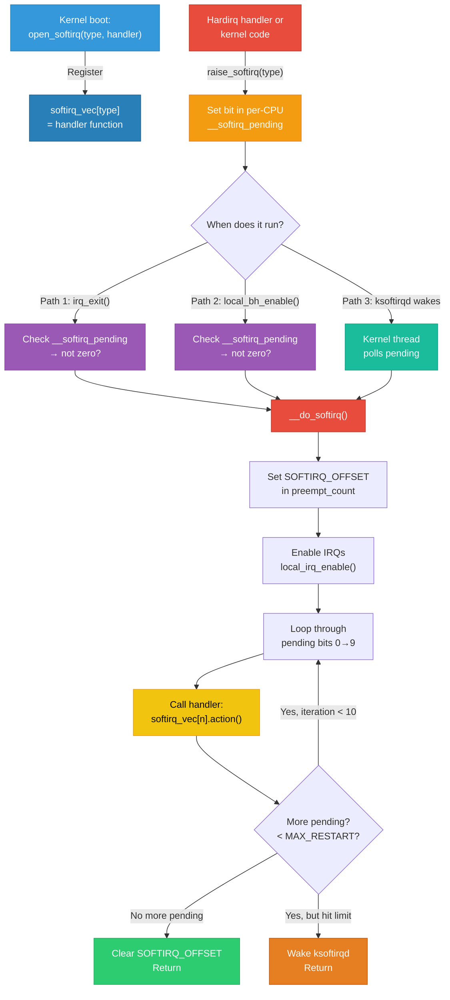
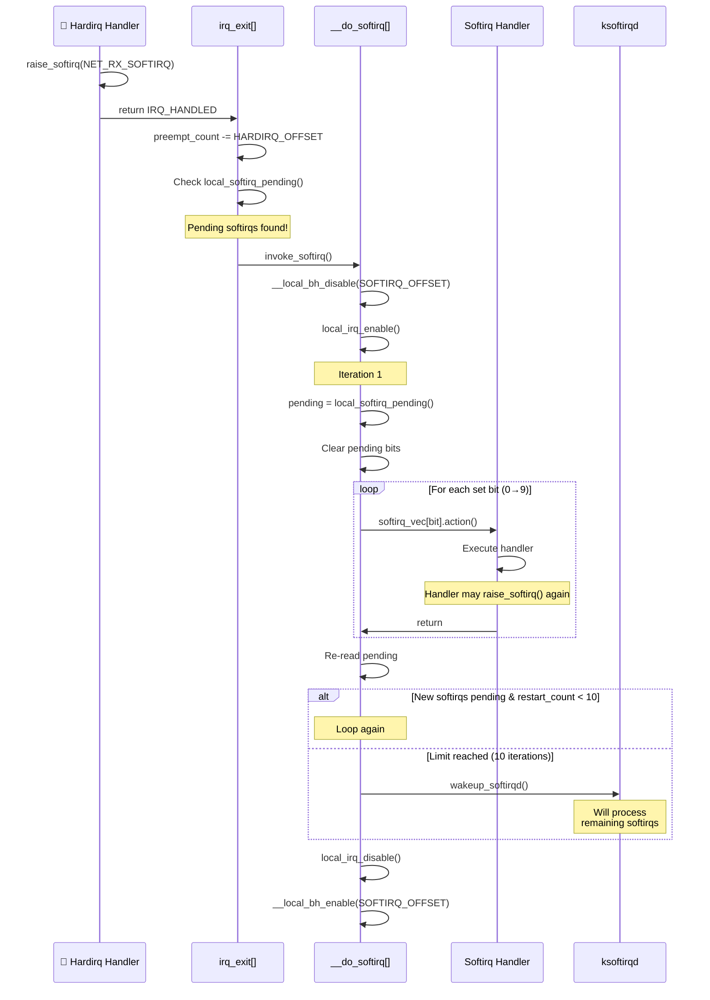
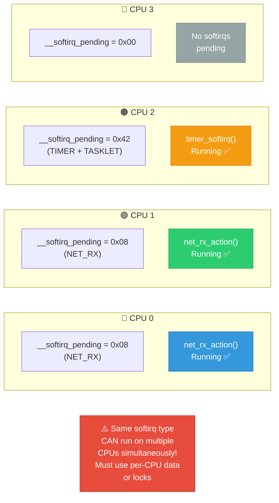

# 05 — Softirqs

## 📌 Overview

**Softirqs** are the highest-performance bottom half mechanism in the Linux kernel. They are **statically allocated** at compile time, run in **interrupt context** (can't sleep), and execute **concurrently on multiple CPUs**.

Only 10 softirq types exist — they are reserved for performance-critical kernel subsystems (networking, block I/O, timers). **Driver developers should NOT add new softirqs** — use tasklets or workqueues instead.

---

## 🔍 Softirq Types

```c
/* include/linux/interrupt.h */
enum {
    HI_SOFTIRQ        = 0,   /* High-priority tasklets */
    TIMER_SOFTIRQ      = 1,   /* Timer callbacks */
    NET_TX_SOFTIRQ     = 2,   /* Network packet transmit */
    NET_RX_SOFTIRQ     = 3,   /* Network packet receive */
    BLOCK_SOFTIRQ      = 4,   /* Block device completion */
    IRQ_POLL_SOFTIRQ   = 5,   /* IRQ poll */
    TASKLET_SOFTIRQ    = 6,   /* Normal-priority tasklets */
    SCHED_SOFTIRQ      = 7,   /* Scheduler load balancing */
    HRTIMER_SOFTIRQ    = 8,   /* High-resolution timers */
    RCU_SOFTIRQ        = 9,   /* RCU callbacks */
};
```

---

## 🔍 Key Characteristics

| Property | Detail |
|----------|--------|
| **Allocation** | Static — compile-time only (10 slots) |
| **Context** | Interrupt context (softirq bit set in preempt_count) |
| **Can sleep** | ❌ No |
| **Concurrency** | Same softirq can run simultaneously on different CPUs |
| **Per-CPU** | Each CPU has its own pending softirq bitmask |
| **Raising** | `raise_softirq()` or `raise_softirq_irqoff()` |
| **Re-entrancy** | NOT re-entrant on the same CPU |
| **When they run** | After hardirq return (`irq_exit()`), or in `ksoftirqd` |

---

## 🎨 Mermaid Diagrams

### Softirq Lifecycle



### Softirq Execution in `__do_softirq()`



### Per-CPU Softirq Concurrency



---

## 💻 Code Examples

### Registering a Softirq (Kernel Internal Only)

```c
/* kernel/softirq.c */
static struct softirq_action softirq_vec[NR_SOFTIRQS];

void open_softirq(int nr, void (*action)(struct softirq_action *))
{
    softirq_vec[nr].action = action;
}

/* Example: Network RX registration — net/core/dev.c */
static __init int net_dev_init(void)
{
    /* ... */
    open_softirq(NET_TX_SOFTIRQ, net_tx_action);
    open_softirq(NET_RX_SOFTIRQ, net_rx_action);
    return 0;
}
```

### Raising a Softirq

```c
/* Raise from hardirq handler (common pattern) */
void raise_softirq(unsigned int nr)
{
    unsigned long flags;
    local_irq_save(flags);
    raise_softirq_irqoff(nr);   /* Set pending bit */
    local_irq_restore(flags);
}

/* If already in irq-disabled context, use this directly */
void raise_softirq_irqoff(unsigned int nr)
{
    __raise_softirq_irqoff(nr);
    /* If not in hardirq and softirqs not disabled,
     * invoke softirqs now */
    if (!in_interrupt())
        wakeup_softirqd();
}

/* The actual bit-set operation */
void __raise_softirq_irqoff(unsigned int nr)
{
    or_softirq_pending(1UL << nr);    /* per-CPU bitmask */
}
```

### The `__do_softirq()` Core (Simplified)

```c
asmlinkage __visible void __do_softirq(void)
{
    struct softirq_action *h;
    __u32 pending;
    int max_restart = MAX_SOFTIRQ_RESTART;  /* 10 */

    pending = local_softirq_pending();
    
    __local_bh_disable_ip(_RET_IP_, SOFTIRQ_OFFSET);
    local_irq_enable();                      /* IRQs ON during softirq */

restart:
    set_softirq_pending(0);                  /* Clear pending */
    h = softirq_vec;

    while ((softirq_bit = ffs(pending))) {   /* Find first set bit */
        h += softirq_bit - 1;
        h->action(h);                        /* Call the handler */
        h++;
        pending >>= softirq_bit;
    }

    pending = local_softirq_pending();
    if (pending) {
        if (--max_restart)
            goto restart;                    /* Loop again */
        wakeup_softirqd();                   /* Defer to ksoftirqd */
    }

    local_irq_disable();
    __local_bh_enable(SOFTIRQ_OFFSET);
}
```

### The `ksoftirqd` Kernel Thread

```c
/* kernel/softirq.c */
static void run_ksoftirqd(unsigned int cpu)
{
    ksoftirqd_run_begin();          /* local_irq_disable + set flags */
    if (local_softirq_pending()) {
        __do_softirq();             /* Same function as inline path */
        ksoftirqd_run_end();
        cond_resched();             /* Give other tasks a chance */
        return;
    }
    ksoftirqd_run_end();
}
```

---

## 🔑 Key Points Summary

| Aspect | Detail |
|--------|--------|
| Only 10 types exist | Cannot add more without kernel modification |
| Per-CPU pending bitmap | 32-bit `__softirq_pending` per CPU |
| Run with IRQs enabled | Unlike hardirqs, softirqs enable interrupts |
| Max 10 restarts | After 10 loops, defer to `ksoftirqd` |
| Same softirq = concurrent | Must protect shared data with locks or per-CPU |
| Softirqs on same CPU = serialized | Cannot nest on same CPU |
| `local_bh_disable()` / `local_bh_enable()` | Inhibit softirq processing |

---

## 🔥 Tough Interview Questions & Deep Answers

### ❓ Q1: Why are softirqs faster than tasklets?

**A:** Two main reasons:

1. **Concurrency**: The same softirq handler can run **simultaneously on multiple CPUs**. For example, `net_rx_action()` can process packets on CPU0 and CPU1 at the same time. Tasklets are serialized — the same tasklet instance never runs on two CPUs simultaneously. This means you must `tasklet_schedule()` again after each execution, adding overhead.

2. **No serialization overhead**: Tasklets use `TASKLET_STATE_RUN` and `test_and_set_bit()` atomic operations to enforce single-instance execution. Softirqs have no such check. The trade-off is that softirq handlers must be fully re-entrant and use per-CPU data structures or explicit locking.

In networking, this matters enormously. At 10 Gbps, the NIC generates millions of packets/sec. With a serialized tasklet, only one CPU could process packets, creating a bottleneck. Softirqs allow all CPUs to process their local receive queues in parallel.

---

### ❓ Q2: What happens to softirqs if `ksoftirqd` is starved by real-time processes?

**A:** `ksoftirqd` runs at `SCHED_NORMAL` policy with nice 0 (default priority). If high-priority real-time processes monopolize the CPU:

1. **Inline softirq path** (`irq_exit()`) still works — after every hardirq, pending softirqs are checked and processed inline (up to 10 iterations). This doesn't depend on `ksoftirqd`.

2. **But** if processing is deferred to `ksoftirqd` (after 10 restarts), and `ksoftirqd` can't run because RT tasks dominate the CPU, softirqs will be **delayed indefinitely**.

3. **Symptoms**: Network latency spikes, timer callback delays, RCU grace period stalls (RCU_SOFTIRQ can't run → "rcu_preempt detected stall").

4. **Mitigation**: 
   - Use `chrt` to give `ksoftirqd` a higher priority
   - With `PREEMPT_RT`, softirqs run as threads and can be priority-boosted
   - Monitor via `/proc/softirqs` counters

---

### ❓ Q3: Explain the difference between `local_bh_disable()` and `local_irq_disable()` — when do you use each?

**A:**

| Function | What it disables | Use case |
|----------|-----------------|----------|
| `local_irq_disable()` | All hardware IRQs on local CPU | Protecting data shared between hardirq and process context |
| `local_bh_disable()` | Softirq/tasklet execution on local CPU | Protecting data shared between softirq and process context |

**`local_bh_disable()`** increments the softirq count in `preempt_count`. This prevents `__do_softirq()` from running on this CPU. Hardware IRQs still fire (their top halves run), but softirqs are deferred.

**When to use `local_bh_disable()` instead of `local_irq_disable()`**: When your critical section is long and you don't want to block hardware interrupts. For example, if process context code updates a data structure also accessed by a softirq handler on the same CPU:

```c
/* Process context code */
local_bh_disable();          /* Block softirqs */
/* Modify shared data — softirq can't run here */
/* But hardware IRQs CAN still fire */
local_bh_enable();           /* Re-enable softirqs; pending ones run now */
```

If you used `local_irq_disable()` here, you'd block all interrupts, potentially causing missed timer ticks or network packet loss.

---

### ❓ Q4: How does `raise_softirq()` work across CPUs? Can CPU0 raise a softirq on CPU1?

**A:** **No, directly.** `raise_softirq()` always sets the pending bit on the **local CPU's** `__softirq_pending`. The pending bitmask is a per-CPU variable.

If you want softirq processing to happen on another CPU:

1. You can't directly raise a softirq on a remote CPU
2. Instead, you **send an IPI** (Inter-Processor Interrupt) to the target CPU, and the IPI handler raises the softirq locally on that CPU

Example in networking:
```c
/* net/core/dev.c — RPS (Receive Packet Steering) */
/* CPU0 has a packet that belongs to CPU1's flow */
cpu = get_rps_cpu(...);           /* Determine target CPU */
enqueue_to_backlog(skb, cpu, ...); /* Queue packet on CPU1's backlog */
/* This internally does: */
____napi_schedule(cpu_rps, ...);   /* Sends IPI if needed */
/* IPI on CPU1 → raises NET_RX_SOFTIRQ on CPU1 */
```

This is the mechanism behind **RPS (Receive Packet Steering)** — distributing network processing across CPUs.

---

### ❓ Q5: If softirqs run with IRQs enabled, can a hardirq arrive during softirq execution? What happens?

**A:** **Yes, absolutely.** This is by design. Softirqs run with `local_irq_enable()` called at the start of `__do_softirq()`.

The sequence:
1. `__do_softirq()` starts, sets `SOFTIRQ_OFFSET` in `preempt_count`
2. Calls `local_irq_enable()` — hardware IRQs can now fire
3. Softirq handler runs (e.g., `net_rx_action()`)
4. **Hardware interrupt arrives** → context switches to hardirq handler
5. Hardirq `preempt_count` is now: `SOFTIRQ_OFFSET | HARDIRQ_OFFSET`
6. Hardirq handler runs, may call `raise_softirq()` setting new pending bits
7. Hardirq returns → `irq_exit()` checks: `in_interrupt()` still true (softirq bits set!) → **does NOT call `__do_softirq()` again** (would be re-entrant!)
8. Returns to the interrupted softirq handler
9. Softirq handler finishes, `__do_softirq()` loop re-reads pending → sees the new bit → processes it in next iteration

**Key insight**: The `SOFTIRQ_OFFSET` in `preempt_count` prevents re-entering `__do_softirq()` from `irq_exit()` during nested hardirqs. This is how softirq non-nesting is enforced.

---

[← Previous: 04 — Top Half and Bottom Half](04_Top_Half_and_Bottom_Half.md) | [Next: 06 — Tasklets →](06_Tasklets.md)
