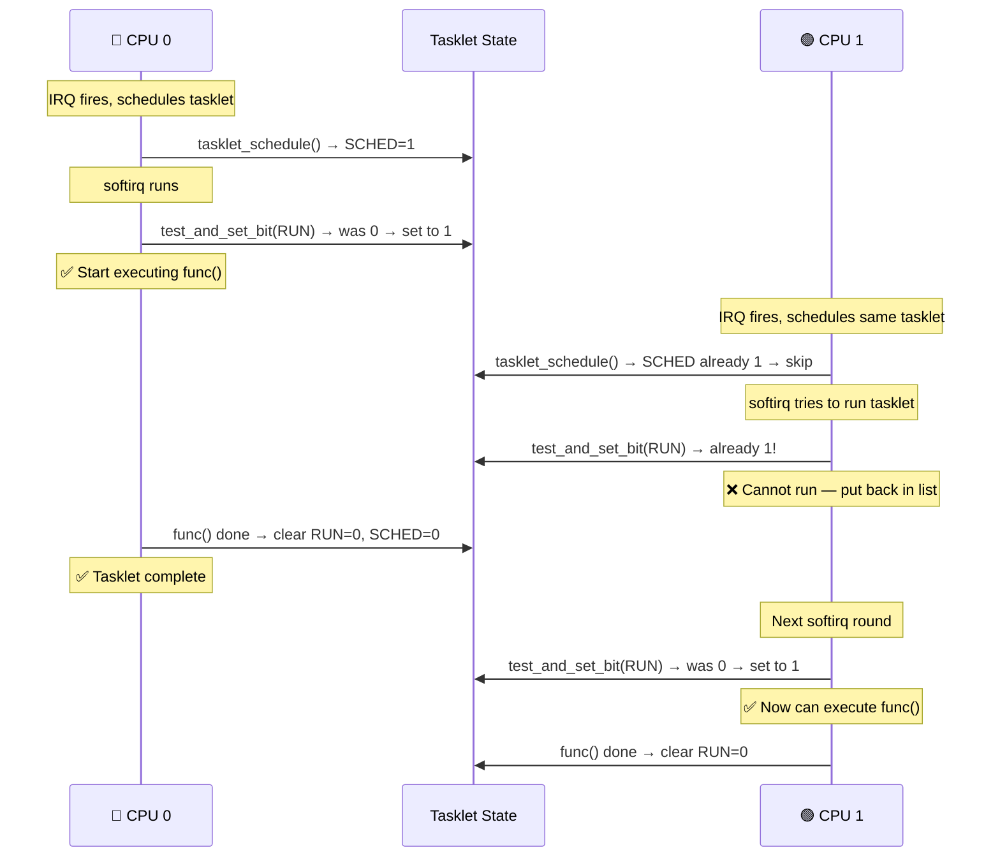
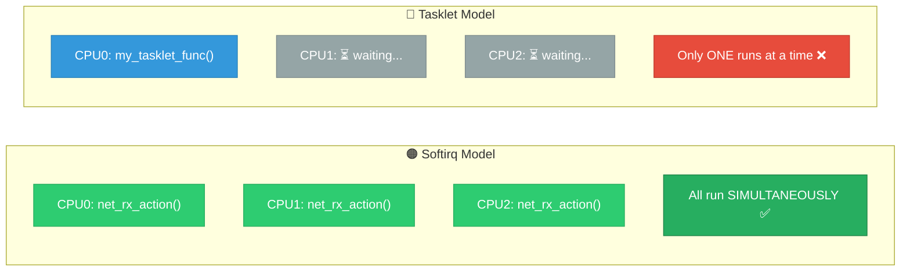

# 06 — Tasklets

## 📌 Overview

**Tasklets** are a bottom half mechanism built on top of softirqs. They provide a simpler API for driver developers with an important guarantee: **a given tasklet never runs concurrently on multiple CPUs** — it is serialized with respect to itself.

> **Note:** Tasklets are considered somewhat legacy. Modern kernel development favors **threaded IRQs** or **workqueues**. However, tasklets are still widely used and heavily asked in interviews.

---

## 🔍 Key Properties

| Property | Tasklet | Softirq (for comparison) |
|----------|---------|--------------------------|
| **Context** | Interrupt (softirq) | Interrupt (softirq) |
| **Can sleep** | ❌ No | ❌ No |
| **Same instance concurrent** | ❌ Serialized | ✅ Concurrent |
| **Different instances concurrent** | ✅ Yes | ✅ Yes |
| **Allocation** | Dynamic (per-device) | Static (compile-time, 10 max) |
| **API complexity** | Simple | Kernel-internal only |
| **Performance** | Good | Best |

---

## 🔍 Tasklet States

A tasklet has two state bits:

| State Bit | Meaning |
|-----------|---------|
| `TASKLET_STATE_SCHED` | Tasklet is scheduled (in per-CPU queue) |
| `TASKLET_STATE_RUN` | Tasklet is currently executing (on some CPU) |

These bits enforce the serialization guarantee:
- `tasklet_schedule()` checks `SCHED` — won't double-schedule
- `tasklet_action()` checks `RUN` with `test_and_set_bit()` — skips if already running

---

## 🎨 Mermaid Diagrams

### Tasklet Lifecycle

```mermaid
flowchart TD
    A["Driver init:<br/>tasklet_init(&tl, func, data)"] --> B["Tasklet exists<br/>STATE = 0"]
    
    C["Hardirq handler"] -->|"tasklet_schedule(&tl)"| D{SCHED bit set?}
    
    D -->|"No — first time"| E["Set TASKLET_STATE_SCHED<br/>Add to per-CPU<br/>tasklet_vec list"]
    D -->|"Yes — already scheduled"| F["Do nothing<br/>(prevent duplicate)"]
    
    E --> G["raise_softirq(TASKLET_SOFTIRQ)"]
    G --> H["softirq runs:<br/>tasklet_action()"]
    
    H --> I{RUN bit set?<br/>test_and_set_bit()}
    I -->|"No — not running"| J["Set TASKLET_STATE_RUN<br/>Clear TASKLET_STATE_SCHED"]
    I -->|"Yes — running on<br/>another CPU"| K["Put back in list<br/>Try again later"]
    
    J --> L["Call func(data)<br/>YOUR HANDLER"]
    L --> M["Clear TASKLET_STATE_RUN"]
    M --> N["Done ✅"]
    
    K --> O["raise_softirq again<br/>Retry on next opportunity"]

    style A fill:#3498db,stroke:#2980b9,color:#fff
    style C fill:#e74c3c,stroke:#c0392b,color:#fff
    style E fill:#f39c12,stroke:#e67e22,color:#fff
    style F fill:#95a5a6,stroke:#7f8c8d,color:#fff
    style G fill:#9b59b6,stroke:#8e44ad,color:#fff
    style J fill:#27ae60,stroke:#1e8449,color:#fff
    style K fill:#e67e22,stroke:#d35400,color:#fff
    style L fill:#2ecc71,stroke:#27ae60,color:#fff
    style N fill:#2ecc71,stroke:#27ae60,color:#fff
```

### Tasklet Serialization Across CPUs



### Tasklet vs Softirq Execution Model



---

## 💻 Code Examples

### Basic Tasklet Usage

```c
#include <linux/interrupt.h>

struct my_device {
    struct tasklet_struct my_tasklet;
    u32 irq_status;
    void __iomem *base;
};

/* Tasklet handler — runs in softirq context */
static void my_tasklet_func(unsigned long data)
{
    struct my_device *dev = (struct my_device *)data;
    
    pr_info("Tasklet running on CPU %d, status=0x%x\n",
            smp_processor_id(), dev->irq_status);
    
    /* Do deferred processing here */
    process_hw_data(dev);
    
    /* Note: Cannot sleep, cannot use mutex, cannot access user memory */
}

/* Hardirq handler — top half */
static irqreturn_t my_irq_handler(int irq, void *dev_id)
{
    struct my_device *dev = dev_id;
    
    dev->irq_status = readl(dev->base + STATUS_REG);
    writel(dev->irq_status, dev->base + STATUS_CLR);
    
    tasklet_schedule(&dev->my_tasklet);  /* Schedule bottom half */
    
    return IRQ_HANDLED;
}

/* Probe / Init */
static int my_probe(struct platform_device *pdev)
{
    struct my_device *dev = devm_kzalloc(&pdev->dev, sizeof(*dev), GFP_KERNEL);
    
    /* Initialize tasklet */
    tasklet_init(&dev->my_tasklet, my_tasklet_func, (unsigned long)dev);
    
    /* Or use static declaration: */
    /* DECLARE_TASKLET(name, func, data); — enabled */
    /* DECLARE_TASKLET_DISABLED(name, func, data); — initially disabled */
    
    int irq = platform_get_irq(pdev, 0);
    return devm_request_irq(&pdev->dev, irq, my_irq_handler, 0, "mydev", dev);
}

/* Remove / Cleanup */
static int my_remove(struct platform_device *pdev)
{
    struct my_device *dev = platform_get_drvdata(pdev);
    
    tasklet_kill(&dev->my_tasklet);   /* Wait for completion + prevent reschedule */
    free_irq(dev->irq, dev);
    
    return 0;
}
```

### High-Priority Tasklet

```c
/* High-priority tasklets use HI_SOFTIRQ (index 0) instead of 
 * TASKLET_SOFTIRQ (index 6), so they run before normal tasklets */
 
tasklet_hi_schedule(&dev->urgent_tasklet);  /* Uses HI_SOFTIRQ */
tasklet_schedule(&dev->normal_tasklet);      /* Uses TASKLET_SOFTIRQ */
```

### Tasklet Enable/Disable

```c
/* Disable tasklet — increments count, prevents execution */
tasklet_disable(&dev->my_tasklet);
/* If tasklet is running, this WAITS for it to finish */

/* Disable without waiting (unsafe if tasklet is running) */
tasklet_disable_nosync(&dev->my_tasklet);

/* Re-enable tasklet — decrements count */
tasklet_enable(&dev->my_tasklet);

/* Kill tasklet — wait for completion + clear SCHED state */
tasklet_kill(&dev->my_tasklet);
/* Must be called from process context (it may sleep!) */
```

### Kernel-Internal: `tasklet_action()` Implementation

```c
/* kernel/softirq.c — simplified */
static void tasklet_action(struct softirq_action *a)
{
    struct tasklet_struct *list;
    
    /* Grab the per-CPU tasklet list atomically */
    local_irq_disable();
    list = __this_cpu_read(tasklet_vec.head);
    __this_cpu_write(tasklet_vec.head, NULL);
    __this_cpu_write(tasklet_vec.tail, &__this_cpu_read(tasklet_vec.head));
    local_irq_enable();
    
    while (list) {
        struct tasklet_struct *t = list;
        list = list->next;
        
        /* Serialization check */
        if (tasklet_trylock(t)) {                /* test_and_set_bit(RUN) */
            if (!atomic_read(&t->count)) {       /* Not disabled? */
                clear_bit(TASKLET_STATE_SCHED, &t->state);
                t->func(t->data);                /* EXECUTE! */
                tasklet_unlock(t);               /* clear RUN bit */
                continue;
            }
            tasklet_unlock(t);
        }
        
        /* Can't run now — put back in the list */
        local_irq_disable();
        t->next = NULL;
        *__this_cpu_read(tasklet_vec.tail) = t;
        __this_cpu_write(tasklet_vec.tail, &t->next);
        raise_softirq_irqoff(TASKLET_SOFTIRQ);  /* Try again later */
        local_irq_enable();
    }
}
```

---

## 🔑 API Quick Reference

| API | Description |
|-----|-------------|
| `tasklet_init(t, func, data)` | Initialize a tasklet |
| `DECLARE_TASKLET(name, func, data)` | Static declaration (enabled) |
| `DECLARE_TASKLET_DISABLED(name, func, data)` | Static declaration (disabled) |
| `tasklet_schedule(t)` | Schedule for execution (TASKLET_SOFTIRQ) |
| `tasklet_hi_schedule(t)` | Schedule high-priority (HI_SOFTIRQ) |
| `tasklet_disable(t)` | Disable + wait if running |
| `tasklet_disable_nosync(t)` | Disable without waiting |
| `tasklet_enable(t)` | Re-enable |
| `tasklet_kill(t)` | Wait + cancel (call from process ctx) |

---

## 🔥 Tough Interview Questions & Deep Answers

### ❓ Q1: Can you schedule a tasklet from another tasklet? What about from process context?

**A:** 

**From another tasklet** — ✅ Yes. A tasklet runs in softirq context. `tasklet_schedule()` simply sets the `SCHED` bit and adds to the per-CPU list. The newly scheduled tasklet will run in the next softirq iteration (or on a different CPU).

**From process context** — ✅ Yes. `tasklet_schedule()` raises `TASKLET_SOFTIRQ`. If softirqs aren't currently processing, the tasklet will execute:
- At the next `irq_exit()` (after a hardware interrupt)
- At the next `local_bh_enable()` call
- Via `ksoftirqd` being woken

However, be aware: if you `tasklet_schedule()` from process context and then immediately call `tasklet_kill()`, the `tasklet_kill()` will wait (potentially sleeping) for the tasklet to finish execution.

---

### ❓ Q2: Why are tasklets being deprecated? What are the arguments for and against them?

**A:**

**Arguments against tasklets:**

1. **Non-deterministic execution CPU**: The tasklet runs on the CPU where it was scheduled (which CPU handled the IRQ), but if that CPU is busy, it bounces to `ksoftirqd`. This makes performance unpredictable.

2. **Serialization prevents scaling**: On multi-core SoCs (Qualcomm Snapdragon, NVIDIA Tegra), a serialized tasklet becomes a bottleneck if the device generates high-frequency interrupts.

3. **Can't sleep**: Unlike threaded IRQs and workqueues, tasklets can't call sleeping APIs. This forces drivers into awkward patterns (tasklet schedules work, which does the actual processing).

4. **Softirq starvation**: Tasklets contribute to softirq budget. Under heavy load, they can delay higher-priority softirqs or cause excessive `ksoftirqd` wakeups.

**Arguments for keeping them:**

1. **Lower latency than workqueues**: No scheduler involvement — tasklets run inline from `irq_exit()`.
2. **Simpler than softirqs**: Auto-serialized, dynamic allocation.
3. **Vast existing codebase**: Thousands of drivers use them.

**Modern replacement**: `request_threaded_irq()` with `IRQF_ONESHOT` is the recommended approach for new drivers.

---

### ❓ Q3: What happens if `tasklet_schedule()` is called multiple times before the tasklet runs?

**A:** Only **one execution** will occur. Here's why:

```c
void tasklet_schedule(struct tasklet_struct *t)
{
    if (!test_and_set_bit(TASKLET_STATE_SCHED, &t->state))
        __tasklet_schedule(t);  /* Actually add to list */
    /* If SCHED was already set, we do nothing */
}
```

1. First `tasklet_schedule()` — `SCHED` was 0, `test_and_set_bit` returns 0 (old value), sets it to 1, tasklet is added to the queue.
2. Second call — `SCHED` is already 1, `test_and_set_bit` returns 1, function returns immediately without adding again.
3. Third call — same as second.

When the tasklet finally runs, `tasklet_action()` clears `SCHED` before calling `func()`. If the condition re-occurs, your IRQ handler will `tasklet_schedule()` again.

**Implication**: You can lose events. If 5 interrupts fire before the tasklet runs, only one tasklet execution happens. Your driver must handle this — e.g., read a FIFO until empty, check all status bits, use a counter.

---

### ❓ Q4: Is `tasklet_kill()` safe to call from interrupt context?

**A:** **No.** `tasklet_kill()` can **sleep**:

```c
void tasklet_kill(struct tasklet_struct *t)
{
    while (test_and_set_bit(TASKLET_STATE_SCHED, &t->state)) {
        do {
            yield();  /* ← THIS SLEEPS */
        } while (test_bit(TASKLET_STATE_SCHED, &t->state));
    }
    tasklet_unlock_wait(t);  /* Waits for RUN to clear */
    clear_bit(TASKLET_STATE_SCHED, &t->state);
}
```

The `yield()` call invokes `schedule()`, which is illegal in interrupt context. You'll get **"BUG: scheduling while atomic!"**.

**Safe alternatives in interrupt context:**
- `tasklet_disable_nosync()` — prevents execution but doesn't wait
- Just don't schedule it — don't call `tasklet_schedule()` anymore

Always call `tasklet_kill()` from **process context** (e.g., in `remove()` / `disconnect()` / module cleanup).

---

### ❓ Q5: Explain the difference between `tasklet_disable()` and `tasklet_disable_nosync()`.

**A:**

**`tasklet_disable()`:**
```c
void tasklet_disable(struct tasklet_struct *t)
{
    tasklet_disable_nosync(t);
    tasklet_unlock_wait(t);   /* Spin-wait until RUN bit is clear */
    smp_mb();
}
```
- Increments `t->count` (preventing execution)
- Then **spins** until the tasklet is no longer running on any CPU
- After return, **guaranteed** the tasklet is not executing and won't start

**`tasklet_disable_nosync()`:**
```c
void tasklet_disable_nosync(struct tasklet_struct *t)
{
    atomic_inc(&t->count);    /* Prevent future execution */
    smp_mb__after_atomic();
}
```
- Increments `t->count` only
- Returns **immediately** — the tasklet might still be running on another CPU
- Use when you don't need the guarantee (e.g., you'll check/sync later)

**Interview insight:** `tasklet_disable()` uses **busy-waiting** (`tasklet_unlock_wait` spins on the `RUN` bit), not sleeping. So it IS safe in atomic context, unlike `tasklet_kill()`. But it wastes CPU cycles if the tasklet takes a long time.

---

[← Previous: 05 — Softirqs](05_Softirqs.md) | [Next: 07 — Workqueues →](07_Workqueues.md)
