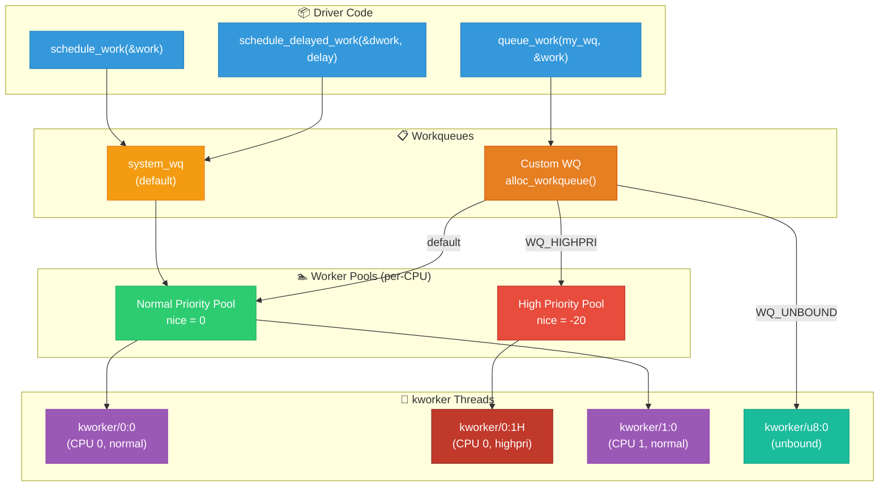
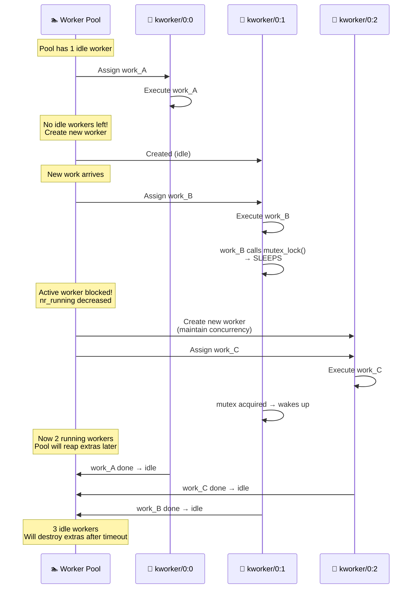

# 07 — Workqueues

## 📌 Overview

**Workqueues** are the most flexible bottom half mechanism. Work items execute in **process context** via kernel worker threads (`kworker`), meaning they can **sleep**, use **mutexes**, allocate memory with `GFP_KERNEL`, and perform I/O.

The **Concurrency Managed Workqueue (CMWQ)** framework (introduced in kernel 2.6.36) replaced the old create_workqueue API, providing automatic thread management and better CPU utilization.

---

## 🔍 Key Concepts

| Concept | Description |
|---------|-------------|
| `struct work_struct` | A single unit of deferred work |
| `struct delayed_work` | Work that executes after a delay |
| `struct workqueue_struct` | Named workqueue with specific behavior |
| `kworker` threads | Kernel threads that execute work items |
| Worker pools | Per-CPU pools of kworker threads |
| `system_wq` | Default system workqueue |

### Workqueue Types

| Type | Flag | Description |
|------|------|-------------|
| **Bound** | (default) | Workers bound to CPU where work was queued |
| **Unbound** | `WQ_UNBOUND` | Workers can migrate across CPUs |
| **Ordered** | `alloc_ordered_workqueue()` | Strictly serialized execution |
| **High priority** | `WQ_HIGHPRI` | Uses high-priority worker pool |
| **Freezable** | `WQ_FREEZABLE` | Frozen during system suspend |

---

## 🎨 Mermaid Diagrams

### Workqueue Architecture (CMWQ)



### Work Item Lifecycle

```mermaid
flowchart TD
    A["INIT_WORK(&work, func)"] --> B["Work initialized<br/>WORK_STRUCT_PENDING = 0"]
    
    C["schedule_work(&work)<br/>or queue_work()"] --> D{PENDING bit?}
    
    D -->|"Not set"| E["Set WORK_STRUCT_PENDING<br/>Add to pool worklist"]
    D -->|"Already set"| F["Return false<br/>(already queued)"]
    
    E --> G["Wake up idle<br/>kworker (or create new)"]
    G --> H["kworker dequeues<br/>work item"]
    H --> I["Clear PENDING bit"]
    I --> J["Call work->func(work)<br/>PROCESS CONTEXT ✅"]
    
    J --> K{func() calls<br/>schedule_work() again?}
    K -->|Yes| C
    K -->|No| L["Work complete ✅"]

    style A fill:#3498db,stroke:#2980b9,color:#fff
    style C fill:#f39c12,stroke:#e67e22,color:#fff
    style E fill:#2ecc71,stroke:#27ae60,color:#fff
    style F fill:#95a5a6,stroke:#7f8c8d,color:#fff
    style G fill:#9b59b6,stroke:#8e44ad,color:#fff
    style J fill:#27ae60,stroke:#1e8449,color:#fff
    style L fill:#2ecc71,stroke:#27ae60,color:#fff
```

### CMWQ Concurrency Management



---

## 💻 Code Examples

### Basic Workqueue Usage

```c
#include <linux/workqueue.h>

struct my_device {
    struct work_struct work;
    struct delayed_work periodic_work;
    struct mutex lock;
    u32 *data_buffer;
};

/* Work handler — runs in process context (kworker thread) */
static void my_work_func(struct work_struct *work)
{
    struct my_device *dev = container_of(work, struct my_device, work);
    
    mutex_lock(&dev->lock);              /* ✅ Can sleep! */
    
    /* Heavy processing */
    dev->data_buffer = kmalloc(4096, GFP_KERNEL);  /* ✅ Can alloc with GFP_KERNEL */
    process_device_data(dev);
    
    mutex_unlock(&dev->lock);
    
    pr_info("Work executed on CPU %d by %s\n",
            smp_processor_id(), current->comm);
}

/* Delayed work handler */
static void my_periodic_func(struct work_struct *work)
{
    struct delayed_work *dwork = to_delayed_work(work);
    struct my_device *dev = container_of(dwork, struct my_device, periodic_work);
    
    /* Do periodic monitoring */
    check_device_health(dev);
    
    /* Reschedule after 1 second */
    schedule_delayed_work(&dev->periodic_work, msecs_to_jiffies(1000));
}

/* IRQ handler — schedules work */
static irqreturn_t my_irq_handler(int irq, void *dev_id)
{
    struct my_device *dev = dev_id;
    
    /* Quick work in interrupt context */
    readl(dev->base + STATUS_REG);
    writel(ACK, dev->base + IRQ_ACK);
    
    /* Defer heavy work to process context */
    schedule_work(&dev->work);
    
    return IRQ_HANDLED;
}

/* Probe */
static int my_probe(struct platform_device *pdev)
{
    struct my_device *dev = devm_kzalloc(&pdev->dev, sizeof(*dev), GFP_KERNEL);
    
    INIT_WORK(&dev->work, my_work_func);
    INIT_DELAYED_WORK(&dev->periodic_work, my_periodic_func);
    mutex_init(&dev->lock);
    
    /* Start periodic monitoring */
    schedule_delayed_work(&dev->periodic_work, msecs_to_jiffies(1000));
    
    return 0;
}

/* Remove */
static int my_remove(struct platform_device *pdev)
{
    struct my_device *dev = platform_get_drvdata(pdev);
    
    cancel_delayed_work_sync(&dev->periodic_work);  /* Wait + cancel */
    cancel_work_sync(&dev->work);                     /* Wait + cancel */
    
    return 0;
}
```

### Custom Workqueue

```c
static struct workqueue_struct *my_wq;

static int __init my_init(void)
{
    /* Create a custom workqueue with max 4 active work items */
    my_wq = alloc_workqueue("my_driver_wq",
                            WQ_UNBOUND | WQ_MEM_RECLAIM,
                            4);  /* max_active = 4 */
    if (!my_wq)
        return -ENOMEM;
    
    return 0;
}

static void __exit my_exit(void)
{
    /* Flush all pending work, then destroy */
    destroy_workqueue(my_wq);
}

/* Queue work on custom workqueue instead of system_wq */
queue_work(my_wq, &dev->work);
queue_delayed_work(my_wq, &dev->delayed_work, msecs_to_jiffies(500));
```

### Ordered Workqueue (Strictly Serialized)

```c
/* All work items execute one at a time, in FIFO order */
my_ordered_wq = alloc_ordered_workqueue("my_ordered_wq", 0);

/* Equivalent to: alloc_workqueue("name", WQ_UNBOUND, 1) */
/* max_active = 1 ensures serialization */

/* Use case: When work items must not execute concurrently
 * (e.g., firmware update steps, state machine transitions) */
```

### Flush and Cancellation

```c
/* Wait for ALL pending work on a workqueue to complete */
flush_workqueue(my_wq);

/* Wait for a specific work item to complete */
flush_work(&dev->work);

/* Cancel work item — returns true if it was pending */
bool was_pending = cancel_work(&dev->work);

/* Cancel and WAIT for completion if running */
bool was_pending = cancel_work_sync(&dev->work);  /* May sleep! */

/* Cancel delayed work */
cancel_delayed_work_sync(&dev->delayed_work);     /* May sleep! */

/* Flush system workqueue */
flush_scheduled_work();  /* Waits for all system_wq items */
```

---

## 🔑 Workqueue Flags Reference

| Flag | Description |
|------|-------------|
| `WQ_UNBOUND` | Workers not bound to any CPU — can run anywhere |
| `WQ_HIGHPRI` | Work items dispatched to high-priority worker pool |
| `WQ_MEM_RECLAIM` | Guarantee forward progress for memory reclaim paths |
| `WQ_FREEZABLE` | Work is frozen during system suspend/hibernate |
| `WQ_CPU_INTENSIVE` | Don't participate in concurrency management |
| `WQ_SYSFS` | Expose workqueue attributes via sysfs |

---

## 🔥 Tough Interview Questions & Deep Answers

### ❓ Q1: What is the difference between `schedule_work()` and `queue_work()`?

**A:** 

```c
/* schedule_work() uses the system-wide default workqueue */
static inline bool schedule_work(struct work_struct *work)
{
    return queue_work(system_wq, work);
}

/* queue_work() targets a specific workqueue */
bool queue_work(struct workqueue_struct *wq, struct work_struct *work);
```

`schedule_work()` is simply a convenience wrapper that queues on `system_wq`. Use it for simple, non-critical deferred work. Use `queue_work()` with a custom workqueue when you need:

- **Isolation**: Your work shouldn't compete with other subsystems' work on `system_wq`
- **Control**: Custom `max_active`, priority, or unbound behavior
- **Guaranteed forward progress**: `WQ_MEM_RECLAIM` ensures workers exist for memory pressure scenarios
- **Independent flushing**: `flush_workqueue(my_wq)` only waits for your work, not all `system_wq` items

**Anti-pattern**: Don't use `flush_scheduled_work()` — it flushes ALL work on `system_wq`, causing unnecessary delays. Flush your specific work item with `flush_work()` instead.

---

### ❓ Q2: How does CMWQ manage kworker thread creation and destruction?

**A:** CMWQ uses an elegant concurrency management algorithm:

**Thread Creation:**
1. Each per-CPU worker pool maintains a count of "running" workers (`pool->nr_running`)
2. When a worker starts executing work, `nr_running++`
3. If a worker **sleeps** (mutex, I/O wait), `nr_running--` via `wq_worker_sleeping()`
4. If `nr_running == 0` (all workers busy or sleeping) AND there's pending work → **wake up an idle worker or create a new one**
5. This ensures at least one worker is always making progress

**Thread Destruction:**
1. Idle workers that have been idle for `IDLE_WORKER_TIMEOUT` (5 minutes) are destroyed
2. Each pool keeps at least one worker alive even when idle
3. The "manager" role (any worker can become a manager) handles creation/destruction
4. The manager is elected via `pool->manager_arb` mutex

**The concurrency guarantee**: "If there is pending work and no worker is running on the CPU, wake/create a worker." This prevents both thread explosion and starvation.

---

### ❓ Q3: What happens when `cancel_work_sync()` is called while the work function is running?

**A:** `cancel_work_sync()` has three scenarios:

1. **Work is queued but not running**: Dequeues it, returns `true`. No waiting.

2. **Work is currently executing**: The function **blocks (sleeps)** until the work function completes, then returns `false`. It uses `flush_work()` internally, which inserts a completion barrier in the workqueue and waits.

3. **Work has already completed**: Returns `false` immediately.

**Critical subtlety**: `cancel_work_sync()` guarantees that after it returns, the work function is NOT running and will NOT be queued. This makes it safe for cleanup in `remove()`:

```c
static int my_remove(struct platform_device *pdev)
{
    /* These MUST be called before freeing the device struct */
    cancel_work_sync(&dev->work);           /* Sleeps if work is running */
    cancel_delayed_work_sync(&dev->dwork);  /* Sleeps if work is running */
    
    /* Now safe to free resources */
    kfree(dev->data_buffer);
    return 0;
}
```

**Warning**: Never call `cancel_work_sync()` from the work function itself — **deadlock!** The function waits for itself to complete.

---

### ❓ Q4: Explain `WQ_MEM_RECLAIM` — why is it needed and how does it work?

**A:** When the system is under **memory pressure**, the kernel tries to free memory (memory reclaim). This may involve:
- Writing dirty pages to disk (writeback)
- Evicting cached pages
- Swapping out pages

Some of this work is done via workqueues. But creating new kworker threads requires memory allocation — which might fail under memory pressure! This creates a deadlock:

```
Memory pressure → need to reclaim pages
→ Reclaim uses workqueue to writeback
→ All kworkers are busy/sleeping
→ Need to create new kworker
→ kmalloc() fails (no memory!)
→ Writeback can't proceed
→ Memory can't be reclaimed
→ DEADLOCK
```

`WQ_MEM_RECLAIM` solves this by pre-allocating a **rescue worker** thread at workqueue creation time. If the normal worker pool is exhausted and new workers can't be created, the rescue worker executes pending work items, ensuring forward progress.

```c
/* For any workqueue in the memory reclaim path, ALWAYS set this flag */
my_wq = alloc_workqueue("my_writeback_wq", WQ_MEM_RECLAIM, 0);
```

This is critical for **block device drivers**, **filesystem drivers**, and anything that participates in page writeback or memory reclaim.

---

### ❓ Q5: Compare workqueue vs threaded IRQs — when would you choose one over the other?

**A:**

| Aspect | Workqueue | Threaded IRQ |
|--------|-----------|-------------|
| **Setup** | `INIT_WORK()` + `schedule_work()` | `request_threaded_irq()` |
| **Thread** | Shared `kworker` thread | Dedicated `irq/N-name` thread |
| **Priority** | `SCHED_NORMAL` by default | `SCHED_FIFO` (RT priority 50) |
| **Latency** | Higher — shares pool with other work | Lower — dedicated RT thread |
| **IRQ masking** | Must manage manually | `IRQF_ONESHOT` auto-masks/unmasks |
| **Multiple work items** | ✅ Queue many items | ❌ One handler function |
| **Concurrency** | Configurable via `max_active` | Serialized per-IRQ |

**Choose threaded IRQ when:**
- You have a **single interrupt with a clear top-half/bottom-half split**
- Low latency matters (RT priority)
- You want the kernel to manage IRQ masking (`IRQF_ONESHOT`)
- Writing a new driver (modern best practice)

**Choose workqueue when:**
- You need to defer work from **multiple sources** (not just IRQs)
- You need **delayed execution** (`schedule_delayed_work()`)
- You need **cancellation** semantics (`cancel_work_sync()`)
- You need to **queue multiple work items** and control concurrency
- Work is not latency-critical

**In practice**, many drivers use both: a threaded IRQ for immediate device servicing, and a workqueue for periodic maintenance, error recovery, or deferred configuration changes.

---

[← Previous: 06 — Tasklets](06_Tasklets.md) | [Next: 08 — Threaded IRQs →](08_Threaded_IRQs.md)
