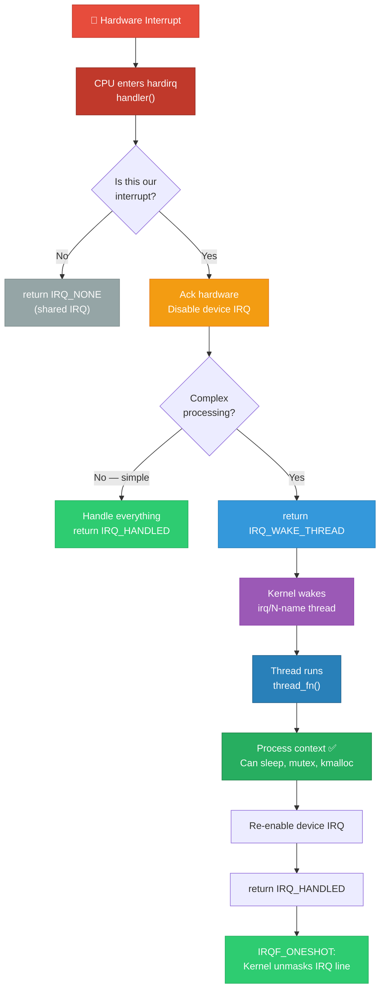
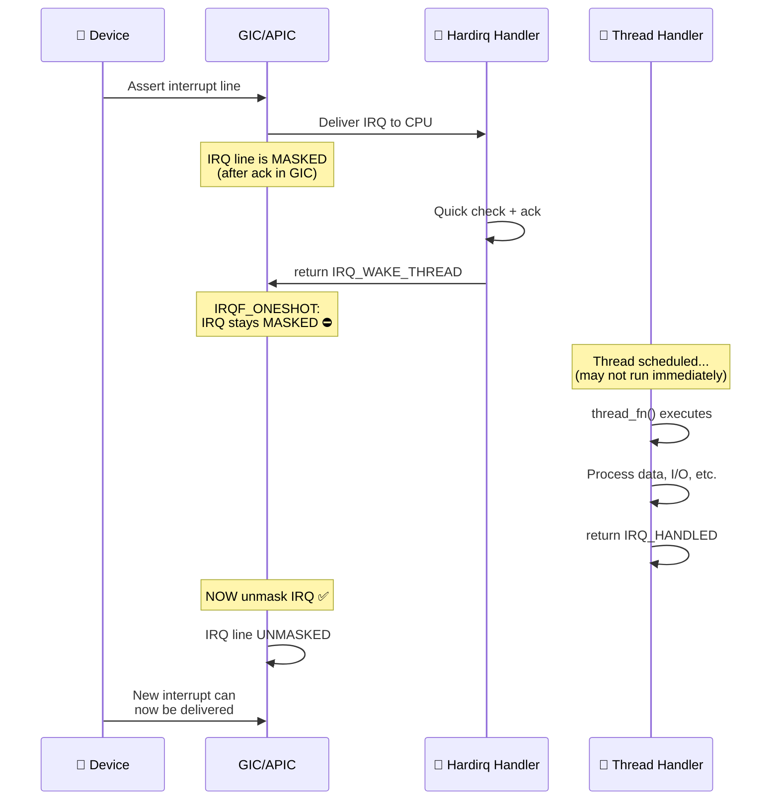
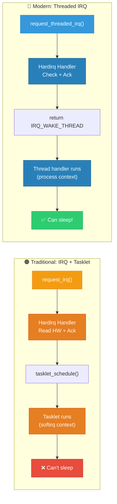
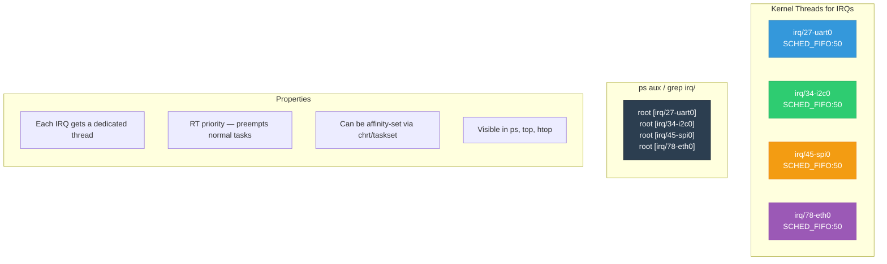

# 08 — Threaded IRQs

## 📌 Overview

**Threaded IRQs** are the modern, recommended approach for interrupt handling in Linux drivers. Instead of using a separate bottom half mechanism (tasklet/workqueue), the kernel provides a built-in framework where the IRQ handler is split into:

1. **Hardirq handler** (top half) — minimal, runs in interrupt context
2. **Thread handler** (bottom half) — runs as a dedicated kernel thread (`irq/N-name`)

Introduced in kernel 2.6.30, threaded IRQs are mandatory in `PREEMPT_RT` kernels and are the preferred pattern in upstream kernel development.

---

## 🔍 Key Features

| Feature | Detail |
|---------|--------|
| **API** | `request_threaded_irq()` |
| **Thread** | Dedicated per-IRQ kernel thread: `irq/N-name` |
| **Scheduling** | `SCHED_FIFO` priority 50 (real-time) |
| **Context** | Thread handler runs in process context (can sleep) |
| **IRQF_ONESHOT** | Keeps IRQ masked until thread handler completes |
| **Shared IRQ support** | Hardirq must return `IRQ_NONE` or `IRQ_WAKE_THREAD` |

---

## 🔍 `request_threaded_irq()` API

```c
int request_threaded_irq(
    unsigned int irq,              /* IRQ number */
    irq_handler_t handler,         /* Hardirq handler (top half) — can be NULL */
    irq_handler_t thread_fn,       /* Thread handler (bottom half) */
    unsigned long irqflags,        /* IRQF_* flags */
    const char *devname,           /* Device name in /proc/interrupts */
    void *dev_id                   /* Private data passed to handlers */
);
```

### Return Values from Hardirq Handler

| Return Value | Meaning |
|---|---|
| `IRQ_NONE` | Not our interrupt (shared IRQ) |
| `IRQ_HANDLED` | Handled completely — don't wake thread |
| `IRQ_WAKE_THREAD` | Wake the thread handler for processing |

---

## 🎨 Mermaid Diagrams

### Threaded IRQ Flow



### IRQF_ONESHOT Timing



### Threaded IRQ vs Traditional Top/Bottom Half



### Thread per IRQ



---

## 💻 Code Examples

### Standard Threaded IRQ Pattern

```c
#include <linux/interrupt.h>

/* Top half — runs in hardirq context */
static irqreturn_t my_hardirq(int irq, void *dev_id)
{
    struct my_device *dev = dev_id;
    u32 status = readl(dev->base + IRQ_STATUS);
    
    /* Check if this interrupt is from our device */
    if (!(status & MY_IRQ_MASK))
        return IRQ_NONE;            /* Not ours (shared IRQ) */
    
    /* Save status for thread handler */
    dev->irq_status = status;
    
    /* Disable device-level interrupt to prevent re-firing */
    writel(0, dev->base + IRQ_ENABLE);
    
    return IRQ_WAKE_THREAD;         /* Wake thread handler */
}

/* Bottom half — runs as kernel thread (process context) */
static irqreturn_t my_thread_fn(int irq, void *dev_id)
{
    struct my_device *dev = dev_id;
    
    /* ✅ Full process context — can sleep! */
    mutex_lock(&dev->lock);
    
    /* Process based on saved status */
    if (dev->irq_status & DATA_READY) {
        /* Read large data block — may involve DMA wait */
        read_device_data(dev);
    }
    
    if (dev->irq_status & ERROR_FLAG) {
        /* Error recovery — may need I2C transactions (sleeping!) */
        recover_device(dev);
    }
    
    mutex_unlock(&dev->lock);
    
    /* Re-enable device interrupt */
    writel(MY_IRQ_MASK, dev->base + IRQ_ENABLE);
    
    return IRQ_HANDLED;
}

/* Registration */
static int my_probe(struct platform_device *pdev)
{
    int irq = platform_get_irq(pdev, 0);
    
    ret = request_threaded_irq(irq,
                               my_hardirq,       /* Top half */
                               my_thread_fn,     /* Bottom half */
                               IRQF_ONESHOT,     /* Keep masked until thread done */
                               "my_device",
                               my_dev);
    return ret;
}
```

### Thread-Only IRQ (No Hardirq Handler)

```c
/* For devices with dedicated (non-shared) IRQ lines,
 * you can skip the hardirq handler entirely */

ret = request_threaded_irq(irq,
                           NULL,              /* No hardirq handler */
                           my_thread_fn,      /* Thread-only */
                           IRQF_ONESHOT | IRQF_TRIGGER_RISING,
                           "my_device",
                           my_dev);

/* The kernel provides irq_default_primary_handler() which 
 * simply returns IRQ_WAKE_THREAD */
```

### I2C/SPI Device — Common Use Case

```c
/* I2C/SPI interrupt handlers MUST use threaded IRQs because
 * reading I2C/SPI registers requires bus transactions that SLEEP */

static irqreturn_t touchscreen_irq_thread(int irq, void *dev_id)
{
    struct ts_device *ts = dev_id;
    u8 buf[6];
    
    /* ✅ I2C read — sleeps! */
    ret = i2c_smbus_read_i2c_block_data(ts->client, 
                                         TOUCH_DATA_REG, 6, buf);
    if (ret < 0)
        return IRQ_NONE;
    
    /* Parse and report touch event */
    int x = (buf[0] << 8) | buf[1];
    int y = (buf[2] << 8) | buf[3];
    
    input_report_abs(ts->input, ABS_X, x);
    input_report_abs(ts->input, ABS_Y, y);
    input_sync(ts->input);
    
    return IRQ_HANDLED;
}

/* Registration in I2C probe */
ret = devm_request_threaded_irq(&client->dev,
                                 client->irq,
                                 NULL,               /* No hardirq */
                                 touchscreen_irq_thread,
                                 IRQF_ONESHOT | IRQF_TRIGGER_LOW,
                                 "my_touchscreen",
                                 ts_dev);
```

### Managed (devm) Threaded IRQ

```c
/* devm_ version — automatically freed on driver unbind */
ret = devm_request_threaded_irq(&pdev->dev,
                                 irq,
                                 my_hardirq,
                                 my_thread_fn,
                                 IRQF_ONESHOT | IRQF_SHARED,
                                 dev_name(&pdev->dev),
                                 my_dev);
/* No need to call free_irq() in remove() */
```

---

## 🔑 Important IRQF Flags for Threaded IRQs

| Flag | Purpose |
|------|---------|
| `IRQF_ONESHOT` | **Required** for thread-only IRQs — keeps IRQ masked until thread completes |
| `IRQF_SHARED` | IRQ line shared with other devices |
| `IRQF_TRIGGER_RISING` | Trigger on rising edge |
| `IRQF_TRIGGER_FALLING` | Trigger on falling edge |
| `IRQF_TRIGGER_HIGH` | Trigger on high level |
| `IRQF_TRIGGER_LOW` | Trigger on low level |
| `IRQF_NO_THREAD` | Force hardirq even on PREEMPT_RT |

---

## 🔥 Tough Interview Questions & Deep Answers

### ❓ Q1: Why is `IRQF_ONESHOT` required when using a threaded IRQ with no hardirq handler?

**A:** Without `IRQF_ONESHOT`, the normal flow is:

1. IRQ fires → hardirq handler runs
2. Hardirq handler returns `IRQ_WAKE_THREAD`
3. Kernel **unmasks the IRQ line** (End of Interrupt to GIC/APIC)
4. Thread handler is scheduled (but hasn't run yet!)

**The problem**: If the device is still asserting the interrupt (level-triggered), the IRQ fires again immediately at step 3 — before the thread handler has had a chance to clear the interrupt source. This causes an **infinite interrupt storm**.

With `IRQF_ONESHOT`:
1. IRQ fires → hardirq handler runs
2. Returns `IRQ_WAKE_THREAD`
3. Kernel **keeps the IRQ masked** 
4. Thread handler runs, services the device, clears the interrupt source
5. Thread handler returns → **NOW the kernel unmasks the IRQ**

When `handler = NULL`, the kernel substitutes `irq_default_primary_handler()`. Without `IRQF_ONESHOT`, it would unmask immediately after this default handler returns, before threading. The kernel explicitly rejects this combination:

```c
/* kernel/irq/manage.c */
if (!handler) {
    if (!thread_fn)
        return -EINVAL;
    if (irqflags & IRQF_ONESHOT)
        /* OK */
    else
        return -EINVAL;  /* MUST set IRQF_ONESHOT */
}
```

---

### ❓ Q2: How does `PREEMPT_RT` convert ALL interrupt handlers to threaded?

**A:** On `PREEMPT_RT` kernels:

1. **`request_irq(irq, handler, flags, ...)`** is transparently converted to a threaded IRQ internally. The `handler` becomes the `thread_fn`, and a default hardirq primary handler is used.

2. Only handlers explicitly marked with `IRQF_NO_THREAD` remain as hardirq handlers. This is used for critical interrupts that must never be delayed (e.g., timer, NMI).

3. `spin_lock()` becomes `rt_mutex` (sleeping), so threaded handlers using spinlocks are safe.

4. The thread scheduling priority can be adjusted:
   ```bash
   # Change IRQ thread priority
   chrt -f -p 80 $(pidof irq/27-uart0)
   
   # Set CPU affinity
   taskset -p 0x02 $(pidof irq/27-uart0)
   ```

5. This transforms the entire interrupt model: instead of hardirq handlers running at CPU-masked priority, they run as schedulable threads with `SCHED_FIFO` policy. Higher-priority real-time tasks can preempt IRQ handlers!

---

### ❓ Q3: Can a threaded IRQ handler be preempted by another interrupt? By another thread?

**A:** Yes to both!

**By a hardware interrupt**: The thread handler runs with IRQs enabled (process context). A hardware interrupt can arrive, preempt the thread, run its hardirq handler, and return. The thread resumes.

**By a higher-priority thread**: The `irq/N` thread runs at `SCHED_FIFO` priority 50 by default. Any thread with priority > 50 preempts it. This is the key benefit for real-time systems — you can prioritize application threads above certain IRQ threads.

**By a lower-priority thread**: Not possible — `SCHED_FIFO` threads run until they block or are preempted by higher priority.

**The unique benefit**: Unlike hardirq handlers (which can't be preempted by normal threads), threaded IRQ handlers participate in the scheduler's priority model. This gives real-time systems deterministic latency control.

---

### ❓ Q4: What's the internal implementation of the IRQ thread? How does it wake up?

**A:** The kernel creates the thread in `__setup_irq()`:

```c
/* kernel/irq/manage.c — simplified */
static int __setup_irq(unsigned int irq, struct irq_desc *desc,
                       struct irqaction *new)
{
    if (new->thread_fn) {
        struct task_struct *t;
        
        t = kthread_create(irq_thread, new, "irq/%d-%s", irq, new->name);
        sched_setscheduler_nocheck(t, SCHED_FIFO, &param);  /* RT prio 50 */
        new->thread = t;
    }
    ...
}
```

The `irq_thread()` function is the thread's main loop:

```c
static int irq_thread(void *data)
{
    struct irqaction *action = data;
    
    while (!irq_wait_for_interrupt(action)) {   /* Blocks here */
        /* Woken up by IRQ_WAKE_THREAD */
        
        irq_thread_check_affinity(desc, action);
        action_ret = action->thread_fn(action->irq, action->dev_id);
        
        if (action_ret == IRQ_HANDLED)
            irq_finalize_oneshot(desc, action);  /* Unmask if ONESHOT */
    }
    return 0;
}
```

The wake-up path:
```
hardirq handler returns IRQ_WAKE_THREAD
→ __irq_wake_thread(desc, action)
→ wake_up_process(action->thread)    /* Wake the RT thread */
```

---

### ❓ Q5: When should you NOT use threaded IRQs?

**A:** Threaded IRQs are not suitable for:

1. **Ultra-low latency requirements** (< 10μs): Thread scheduling adds latency. Even at RT priority, the thread must be scheduled by the CPU, which adds context switch overhead (~1-5μs). A hardirq handler runs immediately.

2. **Pure acknowledgment-only handlers**: If the entire handler is just `readl() + writel()` (< 100ns), the overhead of creating a thread and scheduling context switches is wasteful. Just use `request_irq()`.

3. **High-frequency interrupts** (> 100K/sec): Creating a wake-up per interrupt and scheduling the thread each time adds significant overhead. NAPI-style polling is better for high-frequency scenarios.

4. **Softirq-integrated paths**: Network drivers use softirqs (NAPI) specifically because they run inline without scheduler involvement and can be processed concurrently on multiple CPUs. A threaded IRQ would serialize this.

5. **IRQF_NO_THREAD scenarios**: Timer interrupts, NMIs, and machine check exceptions must execute immediately without scheduler dependency. These use `IRQF_NO_THREAD` to prevent threading even on PREEMPT_RT.

---

[← Previous: 07 — Workqueues](07_Workqueues.md) | [Next: 09 — IRQ API and Registration →](09_IRQ_API_and_Registration.md)
