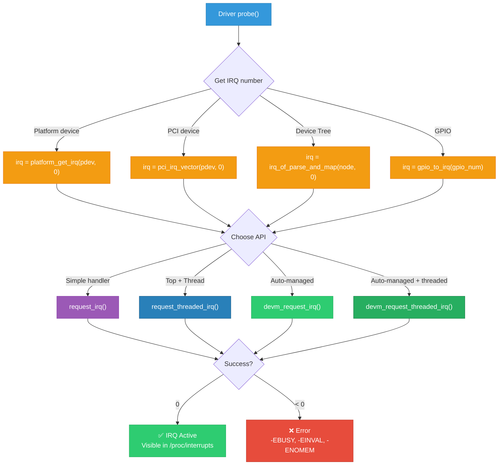
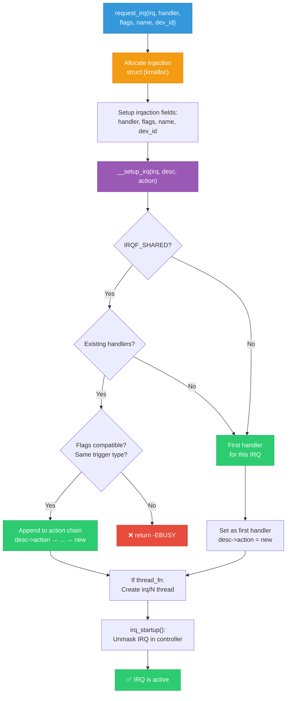
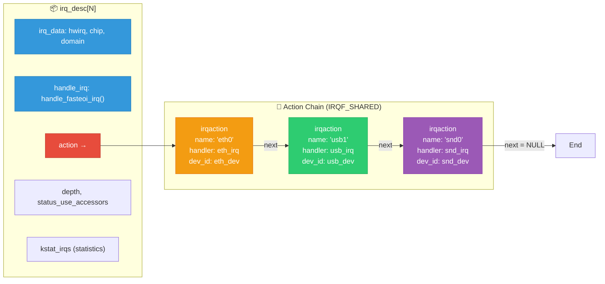

# 09 — IRQ API and Registration

## 📌 Overview

The Linux kernel provides a comprehensive API for requesting, configuring, and releasing interrupt handlers. Understanding these APIs is essential for writing robust device drivers.

---

## 🔍 Core APIs

### `request_irq()` — Basic Registration

```c
int request_irq(unsigned int irq,
                irq_handler_t handler,
                unsigned long flags,
                const char *name,
                void *dev_id);
```

### `request_threaded_irq()` — Threaded Registration

```c
int request_threaded_irq(unsigned int irq,
                         irq_handler_t handler,       /* hardirq (can be NULL) */
                         irq_handler_t thread_fn,     /* thread handler */
                         unsigned long flags,
                         const char *name,
                         void *dev_id);
```

### `devm_request_irq()` — Managed (Auto-freed)

```c
int devm_request_irq(struct device *dev,
                     unsigned int irq,
                     irq_handler_t handler,
                     unsigned long flags,
                     const char *devname,
                     void *dev_id);
/* Automatically calls free_irq() when device is unbound */
```

### `free_irq()` — Release

```c
void free_irq(unsigned int irq, void *dev_id);
/* Waits for any running handler to complete */
/* For shared IRQs, dev_id identifies which handler to remove */
```

---

## 🔍 IRQF Flags Reference

| Flag | Value | Description |
|------|-------|-------------|
| `IRQF_SHARED` | 0x80 | Multiple devices share this IRQ line |
| `IRQF_ONESHOT` | 0x2000 | Keep IRQ masked until thread handler completes |
| `IRQF_TRIGGER_RISING` | 0x01 | Rising edge trigger |
| `IRQF_TRIGGER_FALLING` | 0x02 | Falling edge trigger |
| `IRQF_TRIGGER_HIGH` | 0x04 | Active high level trigger |
| `IRQF_TRIGGER_LOW` | 0x08 | Active low level trigger |
| `IRQF_NO_THREAD` | 0x10000 | Never thread this handler (even on RT) |
| `IRQF_NOBALANCING` | 0x800 | Exclude from IRQ balancing |
| `IRQF_NO_SUSPEND` | 0x4000 | Keep enabled during suspend |
| `IRQF_EARLY_RESUME` | 0x20000 | Re-enable early in resume path |
| `IRQF_PROBE_SHARED` | 0x100 | May be shared, set by caller |

---

## 🎨 Mermaid Diagrams

### IRQ Registration Flow



### Internal `request_irq()` Implementation



### `irq_desc` and Action Chain



---

## 💻 Code Examples

### Getting IRQ Numbers from Different Sources

```c
/* 1. Platform device (Device Tree or ACPI) */
int irq = platform_get_irq(pdev, 0);       /* First IRQ */
int irq2 = platform_get_irq(pdev, 1);      /* Second IRQ */
int irq_named = platform_get_irq_byname(pdev, "tx");  /* By name */

/* 2. PCI device */
ret = pci_alloc_irq_vectors(pdev, 1, max_vecs, PCI_IRQ_MSI | PCI_IRQ_MSIX);
int irq = pci_irq_vector(pdev, 0);         /* First vector */

/* 3. Device Tree manual parsing */
int irq = irq_of_parse_and_map(dev->of_node, 0);

/* 4. GPIO to IRQ */
int irq = gpio_to_irq(MY_GPIO_NUM);
/* or modern gpiod API: */
int irq = gpiod_to_irq(desc);

/* 5. I2C client */
int irq = client->irq;  /* Usually from DT interrupt property */
```

### Complete Driver IRQ Registration Example

```c
#include <linux/interrupt.h>
#include <linux/platform_device.h>

struct my_device {
    void __iomem *base;
    int irq;
    int irq_tx;
    int irq_rx;
    spinlock_t lock;
};

static irqreturn_t my_irq_handler(int irq, void *dev_id)
{
    struct my_device *dev = dev_id;
    u32 status;
    unsigned long flags;
    
    spin_lock_irqsave(&dev->lock, flags);
    status = readl(dev->base + IRQ_STATUS);
    
    if (!status) {
        spin_unlock_irqrestore(&dev->lock, flags);
        return IRQ_NONE;  /* Not our interrupt */
    }
    
    writel(status, dev->base + IRQ_CLEAR);
    spin_unlock_irqrestore(&dev->lock, flags);
    
    if (status & RX_READY)
        handle_rx(dev);
    if (status & TX_DONE)
        handle_tx(dev);
    
    return IRQ_HANDLED;
}

static int my_probe(struct platform_device *pdev)
{
    struct my_device *dev;
    struct resource *res;
    int ret;
    
    dev = devm_kzalloc(&pdev->dev, sizeof(*dev), GFP_KERNEL);
    if (!dev)
        return -ENOMEM;
    
    /* Map MMIO registers */
    res = platform_get_resource(pdev, IORESOURCE_MEM, 0);
    dev->base = devm_ioremap_resource(&pdev->dev, res);
    if (IS_ERR(dev->base))
        return PTR_ERR(dev->base);
    
    spin_lock_init(&dev->lock);
    
    /* Get and request IRQ */
    dev->irq = platform_get_irq(pdev, 0);
    if (dev->irq < 0)
        return dev->irq;
    
    ret = devm_request_irq(&pdev->dev, dev->irq,
                           my_irq_handler,
                           IRQF_SHARED,
                           dev_name(&pdev->dev),
                           dev);  /* dev_id = our device struct */
    if (ret) {
        dev_err(&pdev->dev, "Failed to request IRQ %d: %d\n",
                dev->irq, ret);
        return ret;
    }
    
    platform_set_drvdata(pdev, dev);
    dev_info(&pdev->dev, "Registered IRQ %d\n", dev->irq);
    
    return 0;
}

static int my_remove(struct platform_device *pdev)
{
    /* With devm_request_irq, free_irq() is automatic */
    /* If using request_irq(), must call: */
    /* struct my_device *dev = platform_get_drvdata(pdev); */
    /* free_irq(dev->irq, dev); */
    return 0;
}
```

### IRQ Enable/Disable APIs

```c
/* ===== Local CPU IRQ control ===== */
local_irq_disable();             /* Disable IRQs on this CPU */
local_irq_enable();              /* Enable IRQs on this CPU */

unsigned long flags;
local_irq_save(flags);           /* Save + disable */
local_irq_restore(flags);        /* Restore previous state */

/* ===== Specific IRQ line control ===== */
disable_irq(irq);                /* Disable + wait for running handlers */
disable_irq_nosync(irq);         /* Disable without waiting */
enable_irq(irq);                 /* Re-enable */

/* These are REFERENCE COUNTED — must match disable/enable pairs */
/* disable_irq() twice → need enable_irq() twice */

/* ===== Bottom half control ===== */
local_bh_disable();              /* Disable softirqs on this CPU */
local_bh_enable();               /* Enable softirqs on this CPU */

/* ===== IRQ state query ===== */
irqs_disabled();                 /* Are IRQs disabled on this CPU? */
in_interrupt();                  /* Are we in interrupt context? */
in_irq();                        /* Are we in hardirq context? */
```

---

## 🔑 Common Error Codes

| Error | Meaning |
|-------|---------|
| `-EBUSY` | IRQ already requested (non-shared), or flag mismatch on shared |
| `-EINVAL` | Invalid IRQ number, or thread handler without `IRQF_ONESHOT` |
| `-ENOMEM` | Failed to allocate `irqaction` or thread |
| `-ENOSYS` | IRQ not implemented |
| `-ENODEV` | Platform IRQ not found |

---

## 🔥 Tough Interview Questions & Deep Answers

### ❓ Q1: What's the difference between `disable_irq()` and `disable_irq_nosync()`?

**A:**

```c
void disable_irq(unsigned int irq)
{
    disable_irq_nosync(irq);
    synchronize_irq(irq);  /* ← THIS WAITS */
}
```

**`disable_irq_nosync(irq)`**: Increments `irq_desc->depth` (disable count) and masks the IRQ at the controller level. Returns immediately — the handler **might still be running** on another CPU.

**`disable_irq(irq)`**: Same as `nosync`, plus calls `synchronize_irq()` which **spins** until any currently executing handler for this IRQ completes on all CPUs.

**When to use which:**
- `disable_irq()` from **process context** — safe, ensures handler is done
- `disable_irq_nosync()` from **interrupt context** — avoids deadlock (if you called `disable_irq()` from the IRQ handler itself, the `synchronize_irq()` would wait for itself → deadlock)

**Reference counting**: Both increment `depth`. You must call `enable_irq()` the same number of times to re-enable.

---

### ❓ Q2: Why does `free_irq()` need the `dev_id` parameter?

**A:** For **shared interrupts** (`IRQF_SHARED`), multiple handlers are chained in `irq_desc->action` linked list. Each handler has a unique `dev_id`. When `free_irq(irq, dev_id)` is called:

1. Walk the action chain: `desc->action → a1 → a2 → a3`
2. Find the `irqaction` where `action->dev_id == dev_id`
3. Unlink it from the chain
4. If it was the last handler, mask the IRQ
5. Call `synchronize_irq()` to wait for any running handlers
6. `kfree()` the action

If `dev_id` was not required, the kernel wouldn't know WHICH handler to remove from a shared IRQ.

**Important**: For shared IRQs, `dev_id` MUST be unique (usually your device struct pointer) and MUST NOT be `NULL`.

---

### ❓ Q3: Explain the `devm_` (device-managed) IRQ API. What order are resources freed?

**A:** `devm_request_irq()` registers the IRQ handler and also registers a **devres (device resource)** cleanup action. When the device is unbound (driver's `remove()` is called), devres automatically calls `free_irq()`.

**Cleanup order**: devres cleanup happens in **reverse order** of registration (LIFO):

```c
static int my_probe(struct platform_device *pdev)
{
    /* Registered first — freed LAST */
    dev->base = devm_ioremap_resource(&pdev->dev, res);
    
    /* Registered second */
    dev->clk = devm_clk_get(&pdev->dev, NULL);
    
    /* Registered third — freed FIRST */
    devm_request_irq(&pdev->dev, irq, handler, 0, "dev", dev);
}
```

On unbind:
1. First: `free_irq()` runs (devm cleanup for IRQ)
2. Then: clock is released
3. Last: `iounmap()` runs

This LIFO order is critical: the IRQ handler is freed before MMIO is unmapped, so the handler never accesses freed MMIO regions.

**Anti-pattern**: Don't mix `devm_request_irq()` with manual `free_irq()` in `remove()` — the devres will try to `free_irq()` again, causing a double-free.

---

### ❓ Q4: Walk through what happens internally when `request_irq()` is called.

**A:**

```
request_irq(irq, handler, flags, name, dev_id)
│
├── kmalloc(sizeof(struct irqaction), GFP_KERNEL)
│   Set: action->handler = handler
│   Set: action->flags = flags
│   Set: action->name = name
│   Set: action->dev_id = dev_id
│
├── __setup_irq(irq, desc, action)
│   │
│   ├── raw_spin_lock_irqsave(&desc->lock)
│   │
│   ├── if (desc->action) {  /* Existing handlers? */
│   │   ├── Check IRQF_SHARED compatibility
│   │   ├── Check trigger type match
│   │   └── Append to end of action chain
│   │   }
│   │
│   ├── if (thread_fn) {
│   │   ├── kthread_create(irq_thread, action, "irq/%d-%s")
│   │   └── wake_up_process(action->thread)
│   │   }
│   │
│   ├── irq_startup(desc, ...)
│   │   ├── irq_enable(desc)
│   │   └── desc->irq_data.chip->irq_unmask()  ← GIC/APIC unmask
│   │
│   ├── raw_spin_unlock_irqrestore(&desc->lock)
│   │
│   └── register_irq_proc(irq, desc)  ← Create /proc/irq/N/
│
└── return 0  (success)
```

Key insight: `irq_startup()` calls into the **irq_chip** driver (GIC, APIC, GPIO controller) to physically unmask the hardware interrupt line. From this point, the device CAN generate interrupts.

---

### ❓ Q5: How do you handle a device with multiple IRQ lines?

**A:** Many SoC devices have multiple interrupt lines (TX, RX, error, DMA). There are several patterns:

**Pattern 1: Separate handlers**
```c
dev->irq_tx = platform_get_irq_byname(pdev, "tx");
dev->irq_rx = platform_get_irq_byname(pdev, "rx");
dev->irq_err = platform_get_irq_byname(pdev, "error");

devm_request_irq(dev, dev->irq_tx, tx_handler, 0, "mydev-tx", dev);
devm_request_irq(dev, dev->irq_rx, rx_handler, 0, "mydev-rx", dev);
devm_request_irq(dev, dev->irq_err, err_handler, 0, "mydev-err", dev);
```

**Pattern 2: Single handler, check source**
```c
static irqreturn_t my_handler(int irq, void *dev_id)
{
    struct my_device *dev = dev_id;
    
    if (irq == dev->irq_tx) { /* TX complete */ }
    else if (irq == dev->irq_rx) { /* RX data */ }
    else if (irq == dev->irq_err) { /* Error */ }
    
    return IRQ_HANDLED;
}
```

**Pattern 3: MSI/MSI-X vectors (PCI)**
```c
int num_vecs = pci_alloc_irq_vectors(pdev, 1, MAX_QUEUES,
                                      PCI_IRQ_MSIX | PCI_IRQ_MSI);
for (int i = 0; i < num_vecs; i++) {
    int irq = pci_irq_vector(pdev, i);
    request_irq(irq, queue_handler, 0, name, &dev->queues[i]);
}
```

In device tree, multiple interrupts are specified as:
```dts
my_device@0 {
    interrupts = <GIC_SPI 100 IRQ_TYPE_LEVEL_HIGH>,
                 <GIC_SPI 101 IRQ_TYPE_LEVEL_HIGH>,
                 <GIC_SPI 102 IRQ_TYPE_EDGE_RISING>;
    interrupt-names = "tx", "rx", "error";
};
```

---

[← Previous: 08 — Threaded IRQs](08_Threaded_IRQs.md) | [Next: 10 — Shared Interrupts →](10_Shared_Interrupts.md)
