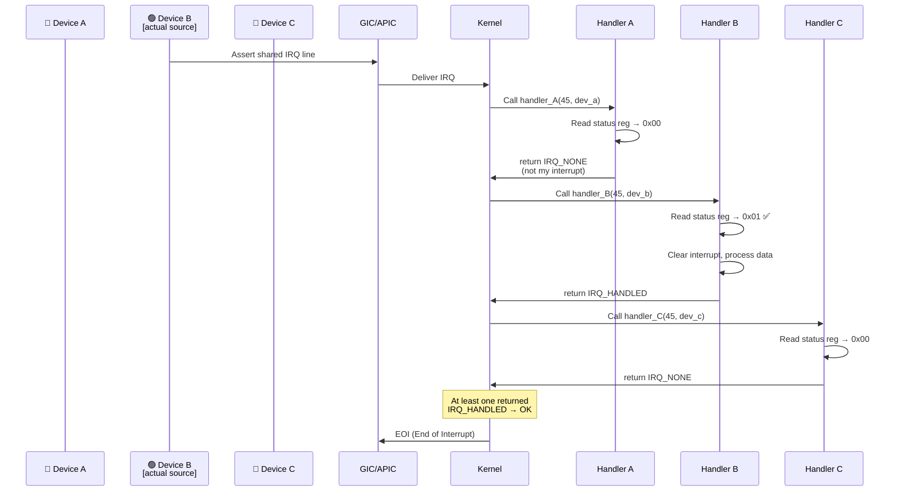
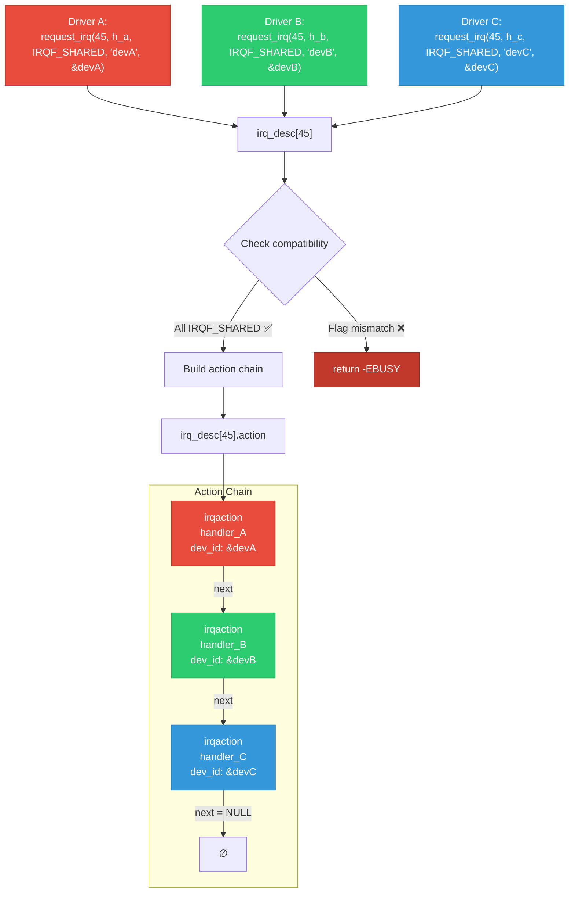
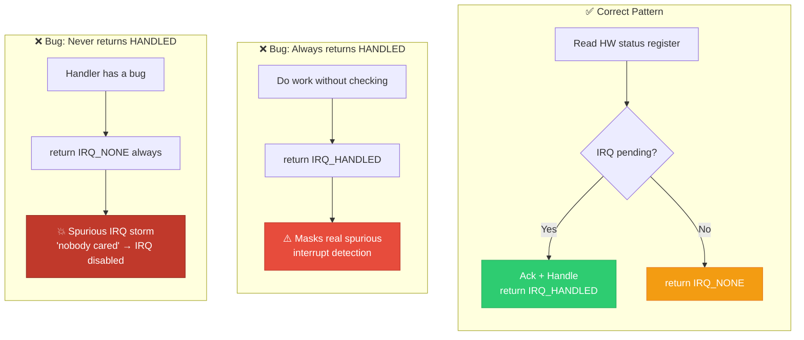

# 10 — Shared Interrupts

## 📌 Overview

**Shared interrupts** occur when multiple devices share the same physical IRQ line. This is common with:
- **PCI** — legacy PCI uses 4 shared INT lines (INTA-INTD)
- **SoC platforms** — limited GPIO interrupt lines shared by multiple peripherals
- **Legacy ISA** — 16 IRQ lines shared among many devices

When a shared IRQ fires, the kernel calls **all registered handlers** in sequence. Each handler must check if its device actually generated the interrupt.

---

## 🔍 How Shared Interrupts Work

1. Multiple drivers call `request_irq()` with `IRQF_SHARED` for the same IRQ number
2. The kernel chains their `irqaction` structs in `irq_desc->action` linked list
3. When the IRQ fires, `handle_irq_event_percpu()` iterates the chain, calling each handler
4. Each handler checks its hardware status register
5. Returns `IRQ_HANDLED` (our interrupt) or `IRQ_NONE` (not ours)

---

## 🔍 Requirements for Shared IRQs

| Requirement | Reason |
|-------------|--------|
| All handlers must set `IRQF_SHARED` | Kernel rejects mismatched flags |
| `dev_id` must be **non-NULL** and **unique** | Used by `free_irq()` to identify which to remove |
| Trigger type must match | All must agree on edge/level trigger |
| Handler must check hardware | Must return `IRQ_NONE` if not your interrupt |
| Device must support status query | You need a register to check "did I interrupt?" |

---

## 🎨 Mermaid Diagrams

### Shared IRQ Handler Chain



### Shared IRQ Registration Flow



### Shared IRQ: What Can Go Wrong



---

## 💻 Code Examples

### Correct Shared IRQ Handler

```c
static irqreturn_t my_shared_handler(int irq, void *dev_id)
{
    struct my_device *dev = dev_id;
    u32 status;
    
    /* CRITICAL: Always check if THIS device caused the interrupt */
    status = readl(dev->base + IRQ_STATUS_REG);
    
    if (!(status & MY_IRQ_PENDING_MASK))
        return IRQ_NONE;  /* Not our interrupt — let next handler check */
    
    /* Clear the interrupt at hardware level */
    writel(status & MY_IRQ_PENDING_MASK, dev->base + IRQ_CLEAR_REG);
    
    /* Process the interrupt */
    if (status & RX_DATA_READY)
        process_rx_data(dev);
    if (status & TX_COMPLETE)
        complete_tx(dev);
    
    return IRQ_HANDLED;
}

/* Registration — note IRQF_SHARED and non-NULL dev_id */
ret = request_irq(shared_irq,
                  my_shared_handler,
                  IRQF_SHARED,           /* Required for sharing */
                  "my_device",
                  dev);                   /* MUST be non-NULL and unique */
```

### Shared Threaded IRQ

```c
/* For shared + threaded, the hardirq handler MUST check ownership */
static irqreturn_t my_shared_hardirq(int irq, void *dev_id)
{
    struct my_device *dev = dev_id;
    u32 status = readl(dev->base + IRQ_STATUS);
    
    if (!(status & MY_IRQ_MASK))
        return IRQ_NONE;       /* Not ours — don't wake thread */
    
    dev->saved_status = status;
    writel(0, dev->base + IRQ_ENABLE);  /* Disable device IRQs */
    
    return IRQ_WAKE_THREAD;    /* Wake OUR thread */
}

static irqreturn_t my_shared_thread(int irq, void *dev_id)
{
    struct my_device *dev = dev_id;
    
    mutex_lock(&dev->lock);
    process_irq_data(dev);
    mutex_unlock(&dev->lock);
    
    writel(IRQ_ENABLE_MASK, dev->base + IRQ_ENABLE);
    return IRQ_HANDLED;
}

ret = request_threaded_irq(shared_irq,
                           my_shared_hardirq,
                           my_shared_thread,
                           IRQF_SHARED | IRQF_ONESHOT,
                           "my_device", dev);
```

### PCI Shared Interrupt (Legacy INTx)

```c
/* PCI legacy interrupts are shared by design */
static irqreturn_t pci_irq_handler(int irq, void *dev_id)
{
    struct my_pci_dev *dev = dev_id;
    u32 status;
    
    /* PCI config space or BAR status register */
    status = ioread32(dev->mmio + PCI_STATUS_REG);
    
    if (!(status & PCI_IRQ_PENDING))
        return IRQ_NONE;
    
    /* Handle interrupt */
    iowrite32(status, dev->mmio + PCI_STATUS_REG);  /* W1C */
    
    process_pci_event(dev);
    
    return IRQ_HANDLED;
}

/* PCI registration */
pci_enable_device(pdev);
ret = request_irq(pdev->irq, pci_irq_handler,
                  IRQF_SHARED, "my_pci", my_dev);

/* Modern alternative: MSI/MSI-X avoids sharing entirely */
ret = pci_alloc_irq_vectors(pdev, 1, 1, PCI_IRQ_MSI);
/* MSI interrupts are NOT shared */
```

---

## 🔑 Shared IRQ Statistics

You can see shared interrupt handlers in `/proc/interrupts`:

```
           CPU0       CPU1       CPU2       CPU3
 45:      12841      13022      11945      12234   GIC-SPI   Level     eth0, usb-host, dma-ctrl
```

Multiple device names separated by commas indicate a shared IRQ.

---

## 🔥 Tough Interview Questions & Deep Answers

### ❓ Q1: What happens if all handlers return `IRQ_NONE` for a shared interrupt?

**A:** The kernel's **spurious interrupt detection** mechanism kicks in. In `note_interrupt()` (`kernel/irq/spurious.c`):

1. Every IRQ invocation, the kernel tracks how many handlers returned `IRQ_NONE` vs `IRQ_HANDLED`
2. If **99,900 out of 100,000** consecutive invocations have ALL handlers returning `IRQ_NONE`, the kernel declares this a spurious interrupt storm
3. The IRQ is **forcibly disabled**: `disable_irq_nosync(irq)`
4. Kernel prints: `"irq 45: nobody cared (try booting with the \"irqpoll\" option)"`
5. A stack trace is dumped
6. The flag `IRQS_SPURIOUS_DISABLED` is set

This protects the system from **interrupt storms** where a malfunctioning device continuously asserts an interrupt that no handler claims.

**Recovery**: The `irqpoll` boot parameter enables polling mode where disabled IRQs are periodically re-checked.

---

### ❓ Q2: Can you share an interrupt between a threaded IRQ and a non-threaded IRQ handler?

**A:** **Yes**, but with important constraints:

```c
/* Driver A: Non-threaded */
request_irq(irq, handler_a, IRQF_SHARED, "dev_a", &dev_a);

/* Driver B: Threaded */
request_threaded_irq(irq, hardirq_b, thread_b, 
                     IRQF_SHARED | IRQF_ONESHOT, "dev_b", &dev_b);
```

This works because:
1. The kernel walks the action chain and calls each handler's hardirq component
2. For driver A: calls `handler_a()` directly
3. For driver B: calls `hardirq_b()`, which returns `IRQ_WAKE_THREAD`
4. The `IRQF_ONESHOT` complication: the IRQ stays masked until driver B's thread completes, which also delays driver A's future interrupts

**This can cause latency issues for driver A** — its interrupts are blocked while driver B's thread runs. This is why `IRQF_ONESHOT` on shared lines requires careful design.

---

### ❓ Q3: Why does PCI use shared interrupts? How does MSI/MSI-X solve this?

**A:**

**Why PCI shares**: Legacy PCI has only **4 physical interrupt pins** (INTA#, INTB#, INTC#, INTD#) on the PCI bus. With dozens of devices on a system, multiple devices must share these 4 lines. The PCI bridge routes them to a limited number of system IRQs.

**Problems with shared PCI interrupts**:
1. **Performance**: Every interrupt invokes ALL handlers on the chain — most return `IRQ_NONE`
2. **Latency**: Walking a long handler chain takes time
3. **Level-triggered**: PCI INTx is active-low, level-triggered — device must hold the line asserted until software clears the status. This requires additional register read/write cycles.

**MSI/MSI-X solution**:
- **Message Signaled Interrupts**: The device writes a message to a special memory address (in the APIC/GIC address range)
- Each device (or even each queue within a device) gets its own unique interrupt vector
- **No sharing** — each MSI vector maps to a dedicated IRQ
- **Edge-triggered semantics** — the write IS the interrupt signal
- **Per-queue interrupts** — NVMe, high-speed NICs use MSI-X with one interrupt per queue per CPU

```c
/* MSI-X allocation for a high-performance NIC */
num_vectors = pci_alloc_irq_vectors(pdev, 
                                     min_vecs,    /* Minimum needed */
                                     num_cpus,    /* Ideal: one per CPU */
                                     PCI_IRQ_MSIX | PCI_IRQ_MSI);
```

---

### ❓ Q4: In what order are shared interrupt handlers called? Can you control the order?

**A:** Handlers are called in the order they were registered (FIFO — `request_irq()` appends to the end of the action chain):

```
First registered  → called first:   handler_A
Second registered → called second:  handler_B
Third registered  → called third:   handler_C
```

**Can you control the order?** Not directly via the API. The kernel does not provide a priority mechanism for shared IRQ handlers.

**Indirect control**:
1. Module load order determines registration order
2. `late_initcall()` vs `module_init()` vs `early_initcall()` affects order
3. Built-in drivers ordered by `Makefile` link sequence

**Does order matter?** Generally no, because:
- ALL handlers are called regardless
- Each handler independently checks its hardware
- Return values are OR'd together
- No short-circuiting (even if handler_A returns `IRQ_HANDLED`, handler_B is still called)

The one exception: if a handler **clears a shared status condition** that another handler also checks, the second handler may miss it. This is a hardware design bug, not a software issue.

---

### ❓ Q5: Explain the `irqreturn_t` return values and how the kernel uses them for shared IRQs.

**A:**

```c
enum irqreturn {
    IRQ_NONE        = (0 << 0),   /* Not from this handler's device */
    IRQ_HANDLED     = (1 << 0),   /* Handler processed the interrupt */
    IRQ_WAKE_THREAD = (1 << 1),   /* Wake threaded handler */
};
```

**How the kernel uses them** in `__handle_irq_event_percpu()`:

```c
irqreturn_t retval = IRQ_NONE;

for_each_action(action, desc->action) {
    irqreturn_t res;
    res = action->handler(irq, action->dev_id);
    
    retval |= res;  /* OR all return values together */
    
    switch (res) {
        case IRQ_WAKE_THREAD:
            __irq_wake_thread(desc, action);
            break;
        case IRQ_HANDLED:
            break;
        case IRQ_NONE:
            break;
    }
}

/* Pass combined result to note_interrupt() for spurious detection */
note_interrupt(desc, retval);
```

**`note_interrupt()` logic**:
- If `retval` has `IRQ_HANDLED` bit set → at least one handler claimed it → reset spurious counter
- If `retval == IRQ_NONE` → ALL handlers said "not mine" → increment spurious counter
- After threshold → disable the IRQ

**Critical mistake**: If your handler always returns `IRQ_HANDLED` without checking hardware, it masks spurious interrupt detection. The kernel thinks the interrupt is being properly serviced, even when no device actually caused it.

---

[← Previous: 09 — IRQ API](09_IRQ_API_and_Registration.md) | [Next: 11 — Spinlocks in Interrupt Context →](11_Spinlocks_in_Interrupt_Context.md)
