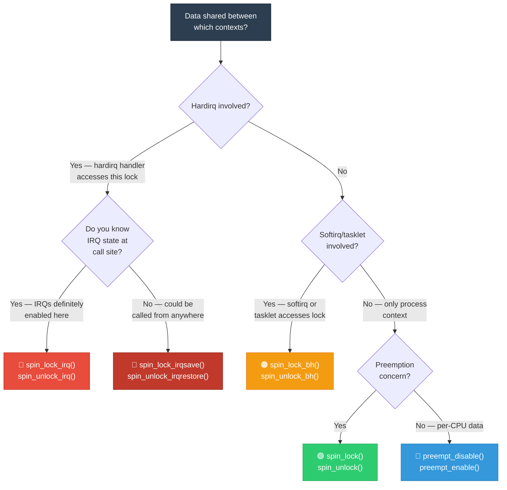
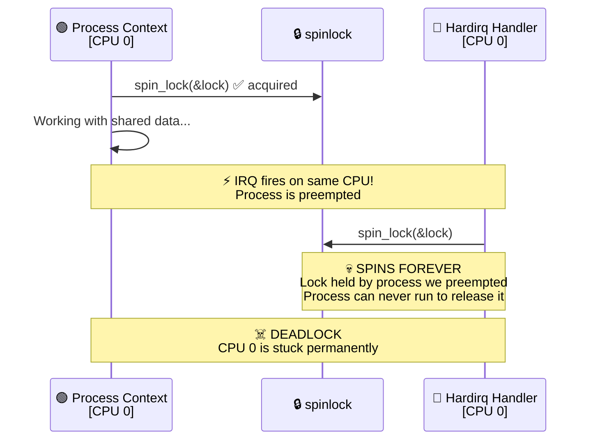
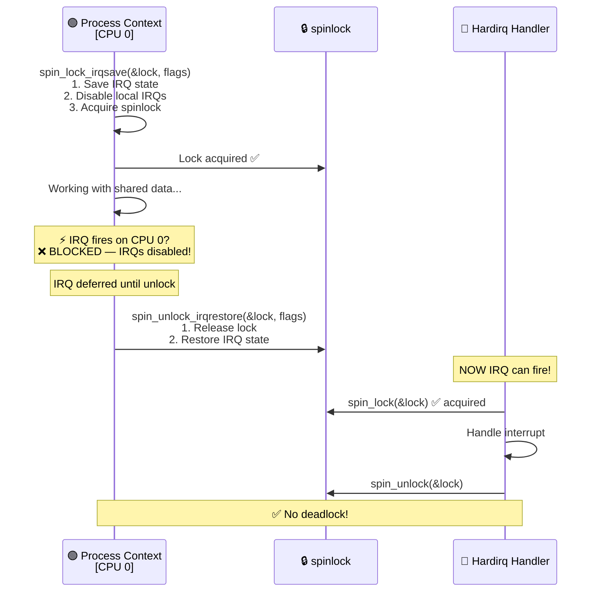
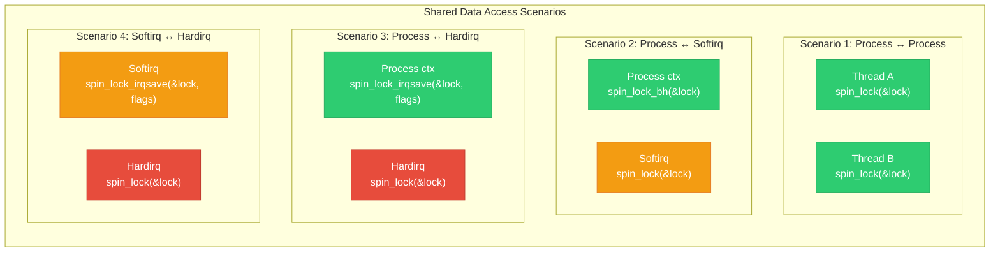

# 11 — Spinlocks in Interrupt Context

## 📌 Overview

When data is shared between **interrupt handlers** and **process context** (or between different interrupt contexts), synchronization is essential. **Spinlocks with IRQ variants** are the primary locking mechanism because mutexes cannot be used in interrupt context.

Choosing the wrong spinlock variant is one of the most common sources of **deadlocks** in kernel drivers.

---

## 🔍 Spinlock Variants

| API | Disables | Use Case |
|-----|----------|----------|
| `spin_lock()` | Preemption only | Between process contexts (no IRQ sharing) |
| `spin_lock_bh()` | Preemption + softirqs | Process ctx ↔ softirq/tasklet |
| `spin_lock_irq()` | Preemption + local IRQs | Process ctx ↔ hardirq (IRQs known enabled) |
| `spin_lock_irqsave()` | Preemption + local IRQs (saves flags) | Process ctx ↔ hardirq (IRQ state unknown) |

### The Golden Rule

> **If your lock is ever acquired in a hardirq handler, ALL other acquirers must use `spin_lock_irqsave()` or `spin_lock_irq()`.**

---

## 🔍 Why Different Variants Exist

The core problem: **if you hold a spinlock and an interrupt arrives that tries to acquire the same lock on the same CPU → DEADLOCK** (because the interrupt handler spins forever waiting for the lock that the interrupted code holds).

```
Process context:     spin_lock(&lock)  ← acquired
                     /* doing work... */
                     
     🔔 IRQ fires on SAME CPU!
     
Hardirq handler:     spin_lock(&lock)  ← SPINS FOREVER!
                     /* Deadlock: process code can't release
                        because we preempted it */
```

**Solution**: Disable interrupts before acquiring the lock → the IRQ can't arrive while we hold the lock.

---

## 🎨 Mermaid Diagrams

### Choosing the Right Spinlock Variant



### Deadlock Scenario Without IRQ Disable



### Correct Pattern with `spin_lock_irqsave()`



### Locking Hierarchy: Multiple Lock Contexts



---

## 💻 Code Examples

### Pattern 1: Process Context ↔ Hardirq

```c
struct my_device {
    spinlock_t lock;
    u32 data_buffer[BUFFER_SIZE];
    int read_index;
    int write_index;
};

/* Hardirq handler — acquires lock with spin_lock() 
 * (IRQs already disabled in hardirq context) */
static irqreturn_t my_irq_handler(int irq, void *dev_id)
{
    struct my_device *dev = dev_id;
    
    spin_lock(&dev->lock);       /* No need for irqsave — we're in hardirq */
    
    /* Write data from hardware to buffer */
    dev->data_buffer[dev->write_index] = readl(dev->base + DATA_REG);
    dev->write_index = (dev->write_index + 1) % BUFFER_SIZE;
    
    spin_unlock(&dev->lock);
    return IRQ_HANDLED;
}

/* Process context (ioctl/read) — MUST disable IRQs when acquiring */
static ssize_t my_read(struct file *file, char __user *buf, 
                        size_t count, loff_t *ppos)
{
    struct my_device *dev = file->private_data;
    unsigned long flags;
    u32 data;
    
    spin_lock_irqsave(&dev->lock, flags);  /* Save flags + disable IRQs */
    
    if (dev->read_index == dev->write_index) {
        spin_unlock_irqrestore(&dev->lock, flags);
        return -EAGAIN;  /* No data */
    }
    
    data = dev->data_buffer[dev->read_index];
    dev->read_index = (dev->read_index + 1) % BUFFER_SIZE;
    
    spin_unlock_irqrestore(&dev->lock, flags);  /* Restore flags */
    
    if (copy_to_user(buf, &data, sizeof(data)))
        return -EFAULT;
    
    return sizeof(data);
}
```

### Pattern 2: Process Context ↔ Softirq/Tasklet

```c
struct net_device_priv {
    spinlock_t tx_lock;
    struct sk_buff_head tx_queue;
};

/* Softirq/Tasklet handler */
static void tx_tasklet(unsigned long data)
{
    struct net_device_priv *priv = (void *)data;
    struct sk_buff *skb;
    
    spin_lock(&priv->tx_lock);   /* In softirq — just spin_lock() */
    skb = __skb_dequeue(&priv->tx_queue);
    spin_unlock(&priv->tx_lock);
    
    if (skb)
        transmit_packet(skb);
}

/* Process context (xmit function) */
static netdev_tx_t my_xmit(struct sk_buff *skb, struct net_device *dev)
{
    struct net_device_priv *priv = netdev_priv(dev);
    
    spin_lock_bh(&priv->tx_lock);   /* Disable softirqs + acquire */
    __skb_queue_tail(&priv->tx_queue, skb);
    spin_unlock_bh(&priv->tx_lock); /* Enable softirqs + release */
    
    tasklet_schedule(&priv->tx_tasklet);
    return NETDEV_TX_OK;
}
```

### Pattern 3: Hardirq ↔ Hardirq (Different IRQ Lines)

```c
/* Two different IRQ handlers sharing the same data */
struct shared_data {
    spinlock_t lock;
    int counter;
};

/* IRQ handler for device A */
static irqreturn_t irq_handler_a(int irq, void *dev_id)
{
    struct shared_data *sd = dev_id;
    unsigned long flags;
    
    /* Even though we're in hardirq, another IRQ on another CPU
     * could call irq_handler_b. spin_lock() is sufficient because
     * hardirqs don't nest on the same CPU. */
    spin_lock(&sd->lock);
    sd->counter++;
    spin_unlock(&sd->lock);
    
    return IRQ_HANDLED;
}

/* IRQ handler for device B (different IRQ number) */
static irqreturn_t irq_handler_b(int irq, void *dev_id)
{
    struct shared_data *sd = dev_id;
    
    spin_lock(&sd->lock);
    sd->counter += 2;
    spin_unlock(&sd->lock);
    
    return IRQ_HANDLED;
}
```

---

## 🔑 Complete Locking Decision Matrix

| Lock holder | Contender | Required Lock API |
|-------------|-----------|-------------------|
| Process ctx | Process ctx | `spin_lock()` |
| Process ctx | Softirq | `spin_lock_bh()` (process side) |
| Process ctx | Hardirq | `spin_lock_irqsave()` (process side) |
| Softirq | Softirq (same CPU) | `spin_lock()` (softirqs don't nest) |
| Softirq | Hardirq | `spin_lock_irqsave()` (softirq side) |
| Hardirq | Hardirq (diff CPU) | `spin_lock()` (hardirqs don't nest) |

---

## 🔥 Tough Interview Questions & Deep Answers

### ❓ Q1: Why use `spin_lock_irqsave()` instead of `spin_lock_irq()`? When is `spin_lock_irq()` safe?

**A:** 

**`spin_lock_irq()`** unconditionally disables interrupts and unconditionally re-enables them:
```c
spin_lock_irq(&lock);
/* ... critical section ... */
spin_unlock_irq(&lock);   /* ← Forces IRQs ON */
```

**`spin_lock_irqsave()`** saves the current IRQ state and restores it:
```c
spin_lock_irqsave(&lock, flags);   /* Save current state */
/* ... critical section ... */
spin_unlock_irqrestore(&lock, flags); /* Restore previous state */
```

**`spin_lock_irq()` is safe ONLY when** you are 100% certain IRQs were enabled before the call. This is true for:
- Top-level ioctl/read/write handlers (entered from syscall with IRQs enabled)
- `probe()` / `remove()` functions

**`spin_lock_irq()` is UNSAFE when**:
- The function might be called from another function that already disabled IRQs
- The function might be called from interrupt context
- Helper functions called from multiple contexts

**Example of the bug**:
```c
void helper_func(struct my_dev *dev)
{
    spin_lock_irq(&dev->lock);
    /* work */
    spin_unlock_irq(&dev->lock);  /* Forces IRQs ON */
}

void another_func(struct my_dev *dev)
{
    local_irq_disable();     /* We want IRQs off here */
    /* do something critical */
    helper_func(dev);        /* BUG: spin_unlock_irq re-enables IRQs! */
    /* We expected IRQs to still be disabled here — WRONG */
}
```

**Rule of thumb**: When in doubt, always use `spin_lock_irqsave()`.

---

### ❓ Q2: Why can't you use `mutex_lock()` in interrupt context? What about `spin_lock()`?

**A:** 

**`mutex_lock()` fails because**:
1. If contended, `mutex_lock()` calls `schedule()` to sleep
2. `schedule()` requires a valid `task_struct` and process context
3. In interrupt context, `current` points to the interrupted task — sleeping it would corrupt its state
4. The kernel detects this and triggers `"BUG: scheduling while atomic!"`

**`spin_lock()` works because**:
1. If contended, `spin_lock()` busy-waits (spins) in a tight loop — no sleeping
2. It disables preemption (`preempt_disable()`) but NOT interrupts
3. No scheduler involvement — just a CPU loop checking the lock variable
4. The spinning is fast if the holder is on another CPU (they'll release soon)

**Caution**: `spin_lock()` in interrupt context has specific rules:
- In hardirq: plain `spin_lock()` is OK (IRQs already disabled for this CPU)
- In softirq: plain `spin_lock()` is OK for softirq-only locks
- But if the same lock is also held in hardirq: use `spin_lock_irqsave()` from softirq too

---

### ❓ Q3: What happens with spinlocks on a UP (uniprocessor) system?

**A:** On **UP** (single CPU) systems, spinlocks are optimized differently:

| Operation | SMP Behavior | UP Behavior |
|-----------|-------------|-------------|
| `spin_lock()` | Disable preemption + acquire lock | **Disable preemption only** (no lock) |
| `spin_lock_irqsave()` | Disable IRQs + acquire lock | **Disable IRQs only** (no lock) |
| `spin_lock_bh()` | Disable BH + acquire lock | **Disable BH only** (no lock) |

**Why no actual lock on UP?**: With only one CPU, concurrency comes only from interrupts and preemption:
- `spin_lock()`: Disabling preemption prevents process context contention
- `spin_lock_irqsave()`: Disabling IRQs prevents interrupt contention
- The lock variable itself is never contested because only one CPU exists

This is a significant **performance optimization** — no cache line bouncing, no atomic operations, just IRQ/preemption flag manipulation.

**Compilation**: `spin_lock()` compiles to `preempt_disable()` on UP with preemption, or to **nothing** on UP without preemption.

---

### ❓ Q4: Explain the ABBA deadlock with spinlocks. How do you prevent it?

**A:** **ABBA deadlock** occurs when two code paths acquire two locks in opposite order:

```
Thread 1:                    Thread 2:
spin_lock(&lock_A);          spin_lock(&lock_B);
/* holds A, wants B */       /* holds B, wants A */
spin_lock(&lock_B); ← SPIN  spin_lock(&lock_A); ← SPIN
/* DEADLOCK! */              /* DEADLOCK! */
```

**Prevention strategies:**

1. **Lock ordering**: Always acquire locks in a fixed, documented order:
   ```c
   /* Convention: always lock A before B */
   spin_lock(&lock_A);
   spin_lock(&lock_B);
   /* ... */
   spin_unlock(&lock_B);
   spin_unlock(&lock_A);
   ```

2. **Lock nesting annotations** (for lockdep):
   ```c
   static DEFINE_SPINLOCK(parent_lock);
   static DEFINE_SPINLOCK(child_lock);
   
   /* Use lock_nested() for known nesting */
   spin_lock(&parent_lock);
   spin_lock_nested(&child_lock, SINGLE_DEPTH_NESTING);
   ```

3. **`lockdep`** (Lock Dependency Validator): `CONFIG_LOCKDEP` dynamically detects potential ABBA deadlocks at runtime. It tracks every lock acquisition pair and reports violations:
   ```
   ======================================================
   WARNING: possible circular locking dependency detected
   Thread 1: lock_A → lock_B
   Thread 2: lock_B → lock_A
   ```

4. **`trylock`** pattern:
   ```c
   spin_lock(&lock_A);
   if (!spin_trylock(&lock_B)) {
       spin_unlock(&lock_A);
       /* retry or handle differently */
   }
   ```

---

### ❓ Q5: How does `PREEMPT_RT` change spinlock behavior?

**A:** With `PREEMPT_RT`:

| Standard Kernel | PREEMPT_RT |
|----------------|------------|
| `spin_lock()` → true spinlock | `spin_lock()` → **`rt_mutex`** (sleepable!) |
| `spin_lock_irqsave()` → disable IRQs + spin | `spin_lock_irqsave()` → **`rt_mutex`** (no IRQ disable!) |
| No priority inheritance | **Priority inheritance** on rt_mutex |
| `raw_spin_lock()` → true spinlock | `raw_spin_lock()` → **true spinlock** (unchanged) |

**Implications:**

1. **Sleeping spinlocks**: `spin_lock()` on RT can sleep — this is intentional. It converts all lock contention to scheduler decisions, making the system fully preemptible.

2. **IRQs stay enabled**: `spin_lock_irqsave()` does NOT disable hardware IRQs on RT. It only acquires the rt_mutex. This means interrupt handlers continue running.

3. **Priority inheritance**: If a high-priority RT task blocks on a spinlock held by a low-priority task, the low-priority task temporarily inherits the high priority → prevents priority inversion.

4. **`raw_spin_lock()`**: For code that truly needs a real spinlock (interrupt controller code, scheduler, printk), use `raw_spin_lock_irqsave()`. This is the real, non-sleeping spinlock even on RT.

5. **Critical sections are shorter**: Because spinlocks on RT can sleep and allow preemption, `spin_lock()` critical sections can be longer without affecting system latency — unlike standard kernels where spinning blocks the CPU.

---

[← Previous: 10 — Shared Interrupts](10_Shared_Interrupts.md) | [Next: 12 — Interrupt Affinity SMP →](12_Interrupt_Affinity_SMP.md)
