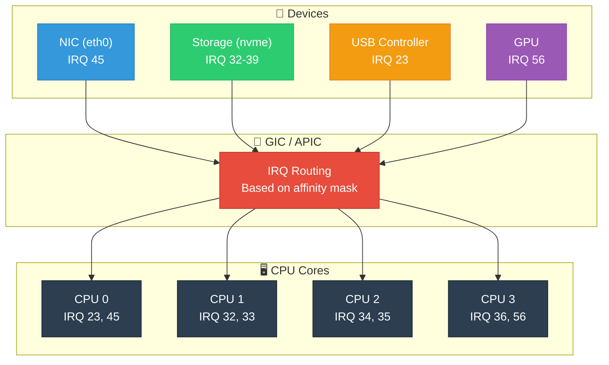
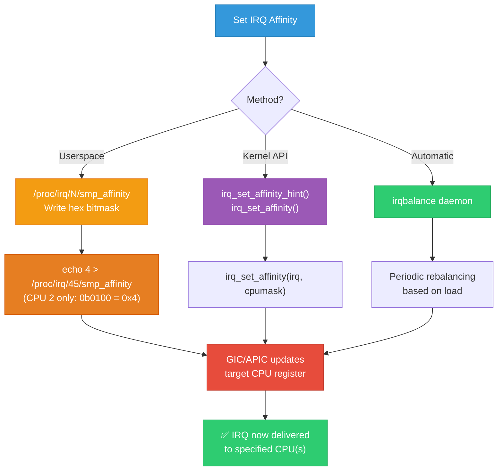
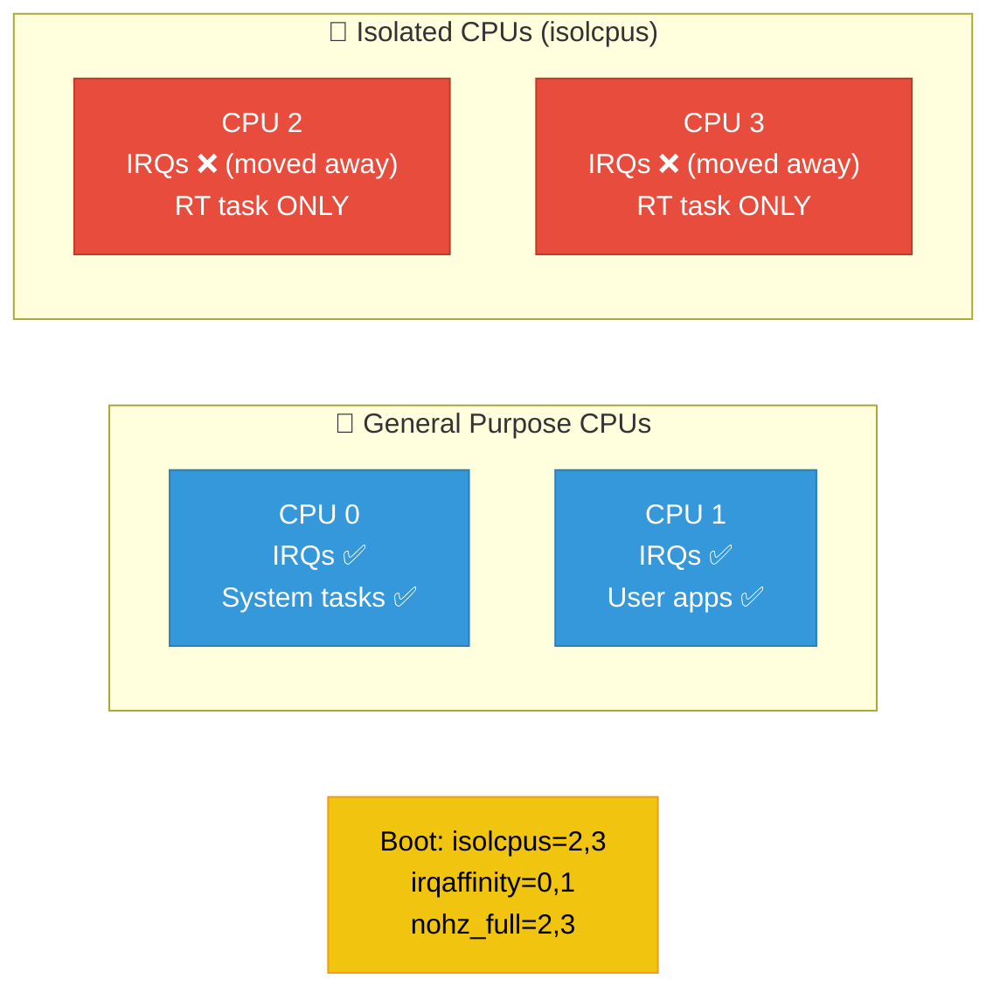

# 12 — Interrupt Affinity and SMP

## 📌 Overview

On multi-core systems, **interrupt affinity** determines which CPU(s) handle a particular interrupt. Proper IRQ affinity configuration is critical for:
- **Performance**: Spreading interrupt load across CPUs
- **Cache locality**: Keeping interrupt processing on the same CPU as the data consumer
- **Real-time**: Isolating interrupts from latency-sensitive CPUs

---

## 🔍 Key Concepts

| Concept | Description |
|---------|-------------|
| **IRQ Affinity** | CPU bitmask defining which CPUs can handle an IRQ |
| **SMP Affinity** | `/proc/irq/N/smp_affinity` — hex bitmask |
| **Affinity List** | `/proc/irq/N/smp_affinity_list` — CPU list format |
| **irqbalance** | Userspace daemon that auto-distributes IRQs |
| **RPS** | Receive Packet Steering — software IRQ distribution for networking |
| **Effective Affinity** | `/proc/irq/N/effective_affinity` — actual CPUs used by hardware |

---

## 🎨 Mermaid Diagrams

### IRQ Distribution Across CPUs



### Setting IRQ Affinity



### CPU Isolation for Real-Time



---

## 💻 Code Examples

### Userspace: Reading and Setting Affinity

```bash
# View current IRQ distribution
cat /proc/interrupts

# View affinity for IRQ 45
cat /proc/irq/45/smp_affinity           # Hex mask: e.g., "f" (all 4 CPUs)
cat /proc/irq/45/smp_affinity_list      # List: e.g., "0-3"

# Set IRQ 45 to CPU 2 only
echo 4 > /proc/irq/45/smp_affinity      # 0x4 = bit 2 = CPU 2

# Set IRQ 45 to CPU 0 and CPU 2
echo 5 > /proc/irq/45/smp_affinity      # 0x5 = bits 0,2

# Using list format
echo 2 > /proc/irq/45/smp_affinity_list       # CPU 2 only
echo 0,2 > /proc/irq/45/smp_affinity_list     # CPU 0 and 2
echo 0-3 > /proc/irq/45/smp_affinity_list     # CPU 0,1,2,3

# View effective affinity (what hardware actually uses)
cat /proc/irq/45/effective_affinity
```

### Kernel API: Setting Affinity from Driver

```c
#include <linux/interrupt.h>
#include <linux/cpumask.h>

static int my_probe(struct platform_device *pdev)
{
    int irq = platform_get_irq(pdev, 0);
    cpumask_var_t mask;
    
    /* Register IRQ */
    ret = request_irq(irq, my_handler, 0, "mydev", dev);
    
    /* Set affinity hint (advisory — irqbalance may override) */
    alloc_cpumask_var(&mask, GFP_KERNEL);
    cpumask_clear(mask);
    cpumask_set_cpu(2, mask);  /* Prefer CPU 2 */
    irq_set_affinity_hint(irq, mask);
    free_cpumask_var(mask);
    
    return 0;
}

static int my_remove(struct platform_device *pdev)
{
    irq_set_affinity_hint(dev->irq, NULL);  /* Clear hint */
    free_irq(dev->irq, dev);
    return 0;
}
```

### MSI-X Per-Queue Affinity (NIC Example)

```c
/* High-performance NIC: one MSI-X vector per CPU queue */
static int nic_setup_interrupts(struct nic_device *nic)
{
    int num_queues = num_online_cpus();
    struct irq_affinity affd = {
        .pre_vectors = 1,    /* Admin queue */
        .post_vectors = 0,
    };
    
    /* Auto-assign IRQ affinity across CPUs */
    num_vecs = pci_alloc_irq_vectors_affinity(nic->pdev,
                                               1, num_queues + 1,
                                               PCI_IRQ_MSIX | PCI_IRQ_AFFINITY,
                                               &affd);
    
    /* Each queue gets IRQ on its local CPU */
    for (int i = 0; i < num_queues; i++) {
        int irq = pci_irq_vector(nic->pdev, i + 1);
        request_irq(irq, queue_handler, 0, 
                    nic->queue[i].name, &nic->queue[i]);
        /* Affinity already set by pci_alloc_irq_vectors_affinity() */
    }
    
    return 0;
}
```

### CPU Isolation Boot Parameters

```bash
# Kernel command line for RT system
# CPU 0-1: General purpose (handles all IRQs, system tasks)
# CPU 2-3: Isolated for real-time application

isolcpus=2,3              # Remove CPUs 2,3 from scheduler
irqaffinity=0,1           # Direct all IRQs to CPU 0,1
nohz_full=2,3             # Disable timer ticks on CPU 2,3
rcu_nocbs=2,3             # Offload RCU callbacks from CPU 2,3
```

---

## 🔑 `/proc/interrupts` Explained

```
           CPU0       CPU1       CPU2       CPU3       
  0:         45          0          0          0   IO-APIC    2-edge      timer
  1:          3          0          0          0   IO-APIC    1-edge      i8042
 45:      28571      28834      28193      28402   GIC-SPI   45-level    eth0
 46:       1204          0          0          0   GIC-SPI   46-edge     mmc0
NMI:        157        142        138        151   Non-maskable interrupts
LOC:     524876     518234     512891     521345   Local timer interrupts
RES:       8234       7891       8012       7956   Rescheduling interrupts
```

| Column | Meaning |
|--------|---------|
| IRQ number | hardware IRQ / virtual number |
| CPUn count | Interrupt count per CPU |
| Controller | GIC-SPI, IO-APIC, etc. |
| Trigger | edge / level |
| Name | Device name from `request_irq()` |

---

## 🔥 Tough Interview Questions & Deep Answers

### ❓ Q1: How does the GIC (ARM) route an interrupt to a specific CPU?

**A:** GIC uses the **GICD_ITARGETSRn** (GICv2) or **GICD_IROUTERn** (GICv3) registers:

**GICv2**: `GICD_ITARGETSR[N]` — each IRQ has an 8-bit CPU target field (one bit per CPU, max 8 CPUs). Setting bit 2 means CPU 2 will receive this interrupt. Multiple bits can be set for "1-of-N" delivery.

**GICv3**: `GICD_IROUTER[N]` — each IRQ has a 64-bit routing register containing the target CPU's MPIDR affinity value. Additionally, `IRM` (Interrupt Routing Mode) bit selects:
- `IRM=0`: Fixed target CPU specified by affinity value
- `IRM=1`: "1-of-N" — any participating CPU can take it

**Linux sets these** via `irq_chip->irq_set_affinity()`:
```
irq_set_affinity() → gic_set_affinity() → write to GICD_ITARGETSR / GICD_IROUTER
```

**Key insight**: On GICv2, only 8 CPUs are addressable. GICv3/v4 support arbitrary MPIDR-based routing, enabling systems with hundreds of CPUs.

---

### ❓ Q2: What is `irqbalance` and should you use it in production?

**A:** `irqbalance` is a userspace daemon that periodically (default: 10 seconds):

1. Reads `/proc/interrupts` and `/proc/stat` for IRQ and CPU load data
2. Calculates optimal IRQ-to-CPU assignment based on:
   - IRQ frequency
   - CPU load
   - NUMA topology (prefer local NUMA node)
   - Cache domains (keep related IRQs on same L2/L3 cache group)
3. Writes new affinity to `/proc/irq/N/smp_affinity`

**Use in production:**

| Scenario | Use irqbalance? |
|----------|-----------------|
| General server | ✅ Yes — it handles distribution well |
| High-performance networking | ❌ No — manual per-queue affinity is better |
| Real-time systems | ❌ No — IRQ movement causes jitter |
| Embedded SoC | ❌ Usually no — limited CPUs, predictable load |
| NUMA server | ✅ Yes — NUMA-aware distribution |

**Disable irqbalance** when you need deterministic interrupt latency. Manual affinity assignment gives you full control.

---

### ❓ Q3: What happens when all CPUs in the affinity mask are offline?

**A:** When the last online CPU in an IRQ's affinity mask goes offline (CPU hotplug):

1. `irq_migrate_all_off_this_cpu()` is called during CPU offline
2. For each IRQ affined to the dying CPU:
   - If other CPUs in the affinity mask are online → migrate to one of them
   - If NO CPUs in the mask are online → kernel **overrides** the affinity and migrates to **any online CPU** (usually CPU 0)
3. The kernel prints: `"IRQ N: set affinity failed, forced to CPU X"`
4. When the CPU comes back online, the affinity is NOT automatically restored

**The `irq_default_affinity`** (default: all CPUs) is used as a fallback. The `/proc/irq/default_smp_affinity` file controls this.

**In code** (`kernel/irq/cpuhotplug.c`):
```c
static bool migrate_one_irq(struct irq_desc *desc)
{
    affinity = irq_data_get_affinity_mask(d);
    
    if (cpumask_any_and(affinity, cpu_online_mask) >= nr_cpu_ids) {
        /* No online CPU in affinity mask — force migration */
        affinity = cpu_online_mask;
        brokeaff = true;
    }
    ...
}
```

---

### ❓ Q4: Explain NUMA-aware interrupt affinity and why it matters for performance.

**A:** On NUMA systems, each CPU has "local" memory (fast access, ~100ns) and "remote" memory (slow access, ~300ns). Interrupt processing typically:

1. Reads data from device DMA buffer (in memory)
2. Pushes data to protocol stack / application buffers (in memory)

If the IRQ handler runs on a CPU in **NUMA node 0** but the DMA buffer and application are in **NUMA node 1**:
- Every memory access crosses the NUMA link (QPI/UPI on Intel, Infinity Fabric on AMD)
- Adds ~100-200ns penalty per access
- For high-throughput devices (NVMe, 100GbE NIC), this causes up to **30-40% performance loss**

**Best practice**: Affinitize the IRQ to CPUs in the **same NUMA node** as the device's PCIe root port:

```bash
# Find NUMA node for a PCI device
cat /sys/bus/pci/devices/0000:3b:00.0/numa_node
# Returns: 1

# Get CPUs in NUMA node 1
cat /sys/devices/system/node/node1/cpulist
# Returns: 8-15

# Set NIC IRQs to NUMA-local CPUs
echo 8-15 > /proc/irq/45/smp_affinity_list
```

**Application alignment**: The application thread consuming the data should also be pinned to the same NUMA node (`numactl --cpunodebind=1 --membind=1 ./app`).

---

### ❓ Q5: How does MSI-X per-queue affinity scale better than a single shared IRQ?

**A:** Consider a NIC processing 10 million packets/sec:

**Single shared IRQ**:
```
All 10M packets/sec → IRQ 45 → CPU 0
CPU 0: 100% utilized processing packets
CPUs 1-7: idle
Throughput: Limited by single CPU capacity (~3-4 Mpps typical)
```

**MSI-X with 8 queues**:
```
Queue 0 → IRQ 100 → CPU 0: 1.25M pps
Queue 1 → IRQ 101 → CPU 1: 1.25M pps
Queue 2 → IRQ 102 → CPU 2: 1.25M pps
...
Queue 7 → IRQ 107 → CPU 7: 1.25M pps
Total: 10M pps distributed across 8 CPUs
```

**How it works**:
1. The NIC hashes each packet's 5-tuple (src IP, dst IP, src port, dst port, protocol) to select a queue
2. Each queue has its own DMA ring buffer and **dedicated MSI-X vector**
3. The MSI-X vector is affinitized to a specific CPU
4. Each CPU only processes its queue — no lock contention between CPUs
5. Cache locality is maintained — each CPU's cache holds its queue's data

This is why `pci_alloc_irq_vectors_affinity()` automatically spreads vectors across CPUs, and why high-performance NICs (Intel X710, Mellanox ConnectX) support 64+ MSI-X vectors.

---

[← Previous: 11 — Spinlocks](11_Spinlocks_in_Interrupt_Context.md) | [Next: 13 — Edge vs Level Triggered →](13_Edge_vs_Level_Triggered.md)
