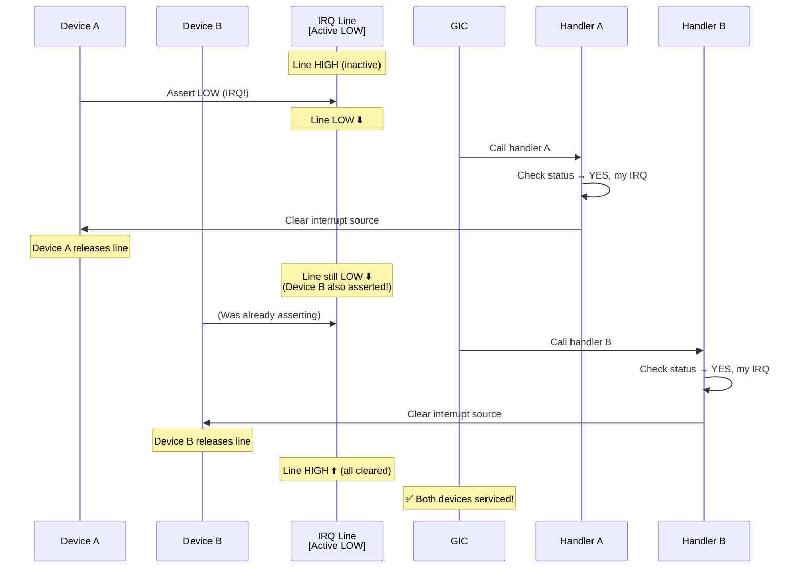
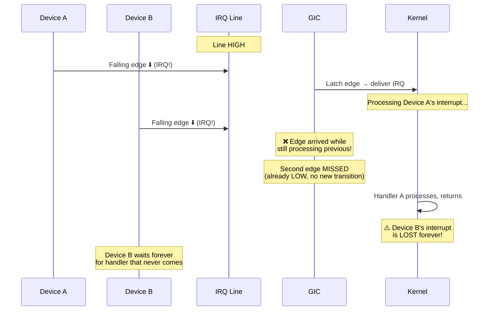
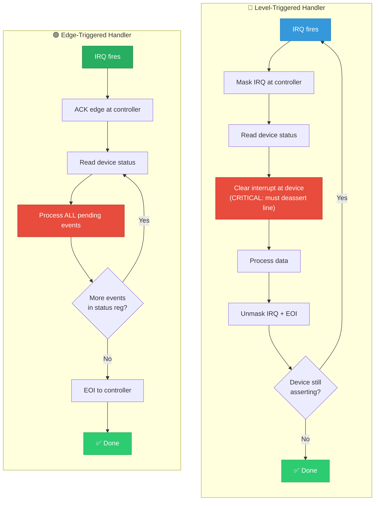

# 13 — Edge-Triggered vs Level-Triggered Interrupts

## 📌 Overview

The **trigger mode** determines how the interrupt controller detects an interrupt signal from a device. This choice affects reliability, sharing capability, and how the handler must acknowledge the interrupt.

- **Level-triggered**: The IRQ is active as long as the signal is asserted (held HIGH or LOW)
- **Edge-triggered**: The IRQ fires on a signal **transition** (rising or falling edge)

---

## 🔍 Comparison

| Property | Level-Triggered | Edge-Triggered |
|----------|----------------|----------------|
| **Detection** | Signal IS at active level | Signal TRANSITIONS to active |
| **Persistent** | Yes — stays asserted until cleared | No — one-shot event |
| **Shared IRQ** | ✅ Safe — naturally supports sharing | ⚠️ Risky — can lose interrupts |
| **Lost interrupts** | Cannot lose (re-detected if still asserted) | CAN lose if edge missed |
| **Handling** | Must clear cause before EOI | Must handle all pending before EOI |
| **PCI Legacy** | Level-triggered (active low) | Not used |
| **GPIO** | Both supported | Both supported |
| **MSI/MSI-X** | Edge semantics (write = interrupt) | Edge semantics |

---

## 🎨 Mermaid Diagrams

### Signal Comparison

```mermaid
flowchart TD
    subgraph Level["📊 Level-Triggered"]
        direction TB
        L1["Signal: ____________╲_________╱____________"]
        L2["Active while signal is LOW"]
        L3["IRQ fires continuously<br/>until device clears it"]
        L4["If handler doesn't clear:<br/>IRQ re-fires immediately → storm"]
    end
    
    subgraph Edge["📈 Edge-Triggered"]
        direction TB
        E1["Signal: ____________╲______╱___╲___╱_______"]
        E2["Active on FALLING edge only"]
        E3["IRQ fires ONCE<br/>per transition"]
        E4["If edge missed:<br/>interrupt LOST forever"]
    end

    style L1 fill:#3498db,stroke:#2980b9,color:#fff
    style L2 fill:#3498db,stroke:#2980b9,color:#fff
    style L3 fill:#f39c12,stroke:#e67e22,color:#fff
    style L4 fill:#e74c3c,stroke:#c0392b,color:#fff
    style E1 fill:#2ecc71,stroke:#27ae60,color:#fff
    style E2 fill:#2ecc71,stroke:#27ae60,color:#fff
    style E3 fill:#f39c12,stroke:#e67e22,color:#fff
    style E4 fill:#e74c3c,stroke:#c0392b,color:#fff
```



### Level-Triggered: Why Sharing Works



### Edge-Triggered: The Lost Interrupt Problem



### Flow Chart: Handling Each Type



---

## 💻 Code Examples

### Level-Triggered Handler Pattern

```c
/* Level-triggered: device holds line active until status is cleared */
static irqreturn_t level_irq_handler(int irq, void *dev_id)
{
    struct my_device *dev = dev_id;
    u32 status;
    
    status = readl(dev->base + IRQ_STATUS);
    if (!status)
        return IRQ_NONE;
    
    /* MUST clear the interrupt source at the device!
     * If we don't, the line stays asserted → IRQ re-fires 
     * immediately → interrupt storm */
    writel(status, dev->base + IRQ_CLEAR);  /* Write-1-to-clear */
    
    /* Now safe to process */
    if (status & RX_READY)
        handle_rx(dev);
    if (status & TX_DONE)
        handle_tx(dev);
    
    return IRQ_HANDLED;
}
```

### Edge-Triggered Handler Pattern

```c
/* Edge-triggered: must process ALL pending events before returning
 * because we only get one edge notification */
static irqreturn_t edge_irq_handler(int irq, void *dev_id)
{
    struct my_device *dev = dev_id;
    u32 status;
    irqreturn_t ret = IRQ_NONE;
    
    /* Loop: process ALL accumulated events */
    while ((status = readl(dev->base + IRQ_STATUS)) != 0) {
        /* Clear what we're about to handle */
        writel(status, dev->base + IRQ_CLEAR);
        
        if (status & EVENT_A)
            handle_event_a(dev);
        if (status & EVENT_B)
            handle_event_b(dev);
        
        ret = IRQ_HANDLED;
    }
    
    /* If we don't loop, events that arrived during processing
     * would be missed — no new edge will fire for them */
    
    return ret;
}
```

### Device Tree Trigger Configuration

```dts
/* Level-triggered, active high */
my_device@0 {
    interrupt-parent = <&gic>;
    interrupts = <GIC_SPI 100 IRQ_TYPE_LEVEL_HIGH>;
};

/* Edge-triggered, rising edge */
gpio_key@0 {
    interrupt-parent = <&gpio1>;
    interrupts = <5 IRQ_TYPE_EDGE_RISING>;
};

/* Both edges (useful for GPIO buttons) */
button@0 {
    interrupts = <7 IRQ_TYPE_EDGE_BOTH>;
};
```

### Requesting with Trigger Flags

```c
/* Edge-triggered rising */
request_irq(irq, handler, IRQF_TRIGGER_RISING, "mydev", dev);

/* Level-triggered active low */
request_irq(irq, handler, IRQF_TRIGGER_LOW, "mydev", dev);

/* Both edges */
request_irq(irq, handler, 
            IRQF_TRIGGER_RISING | IRQF_TRIGGER_FALLING, 
            "mydev", dev);
```

---

## 🔑 GIC Interrupt Type Configuration

| `IRQ_TYPE_*` | Value | Meaning |
|---|---|---|
| `IRQ_TYPE_EDGE_RISING` | 1 | Rising edge |
| `IRQ_TYPE_EDGE_FALLING` | 2 | Falling edge |
| `IRQ_TYPE_EDGE_BOTH` | 3 | Both edges |
| `IRQ_TYPE_LEVEL_HIGH` | 4 | Active high level |
| `IRQ_TYPE_LEVEL_LOW` | 8 | Active low level |

In GIC: `GICD_ICFGRn` register — 2 bits per interrupt:
- `00` = Level-sensitive
- `10` = Edge-triggered

---

## 🔥 Tough Interview Questions & Deep Answers

### ❓ Q1: Why is level-triggered safer for shared interrupts than edge-triggered?

**A:** With **level-triggered** shared interrupts:

1. Device A asserts the line LOW → IRQ fires
2. Handler A runs → clears Device A's status → Device A releases the line
3. But Device B is ALSO holding the line LOW
4. The line stays LOW → the controller sees it's still active → fires IRQ again
5. Handler B runs → clears Device B → line goes HIGH
6. **No interrupts lost** — the persistent level guarantees re-detection

With **edge-triggered** shared interrupts:

1. Device A pulls line LOW (edge detected) → IRQ fires
2. During handler A execution, Device B also pulls LOW
3. **No new edge!** The line was already LOW → no transition → no new IRQ
4. Handler A finishes, the line stays LOW because of Device B
5. **Device B's interrupt is LOST** — no edge will ever fire unless the line goes HIGH first

**The only safe edge-triggered shared pattern**: The handler must check ALL devices on the shared line and loop until no device has a pending interrupt:

```c
do {
    handled = false;
    for_each_handler_on_chain:
        if (handler returns IRQ_HANDLED)
            handled = true;
} while (handled);
```

This is impractical and inefficient, which is why edge-triggered sharing is generally avoided.

---

### ❓ Q2: An edge-triggered interrupt is occasionally "lost." How do you debug this?

**A:** This is a classic hardware/software interaction bug. Debugging steps:

1. **Check handler completeness**: Is the handler reading ALL pending events?
   ```c
   /* Bug: Only reads one event per IRQ */
   status = readl(STATUS);
   handle(status);        /* Other events lost! */
   
   /* Fix: Loop until empty */
   while ((status = readl(STATUS)) != 0)
       handle(status);
   ```

2. **Check timing**: Use a logic analyzer/oscilloscope on the hardware IRQ line. Look for edges arriving during handler execution that aren't generating new IRQs.

3. **Check EOI timing**: The EOI (End of Interrupt) to the controller must be sent AFTER all events are processed. If sent too early, new edges during processing are missed.

4. **Check interrupt masking**: If `disable_irq()` is called and an edge occurs while masked, the edge is lost (no edge latch mechanism in many controllers). Some GICs have an edge latch register that captures edges while masked.

5. **Software workaround**: Add a polling fallback:
   ```c
   /* After processing, re-check status before returning */
   status = readl(STATUS);
   if (status)
       goto process_again;  /* Caught event that arrived during handling */
   ```

6. **Convert to level-triggered**: If the hardware supports it, switch to level-triggered to eliminate the root cause.

---

### ❓ Q3: How does `handle_level_irq()` differ from `handle_edge_irq()` in the kernel?

**A:** These are the `irq_flow_handler_t` functions set in `irq_desc`:

**`handle_level_irq()`** (`kernel/irq/chip.c`):
```
1. irq_chip->irq_mask()    ← Mask the IRQ immediately
2. irq_chip->irq_ack()     ← ACK to controller
3. handle_irq_event()      ← Call all handlers in chain
4. irq_chip->irq_unmask()  ← Unmask after handling
```
The mask-before-handling approach prevents re-entry while the handler runs.

**`handle_edge_irq()`**:
```
1. irq_chip->irq_ack()     ← ACK the edge immediately (allows new edges)
2. handle_irq_event()      ← Call handlers
3. Check: new edges arrived during handling?
4. If yes → re-process (loop)
5. No mask/unmask — edges are ACKed individually
```
The ACK-first approach allows new edges to be latched while processing, preventing edge loss.

**`handle_fasteoi_irq()`** (most common on GIC):
```
1. handle_irq_event()      ← Call handlers
2. irq_chip->irq_eoi()     ← Send EOI to controller
```
Used with GIC's "fast EOI" mode — no explicit mask/unmask needed. The GIC handles priority-based masking automatically.

---

### ❓ Q4: What is "interrupt storm" caused by level-triggered misconfiguration?

**A:** An **interrupt storm** occurs when a level-triggered IRQ continuously fires because the handler fails to deassert the interrupt source:

```
1. Device asserts line (level LOW)
2. IRQ fires → handler runs
3. Handler has a BUG: doesn't clear the device status register
4. Handler returns IRQ_HANDLED
5. Controller does EOI → checks line → STILL LOW!
6. IRQ fires AGAIN immediately → goto step 2
7. Infinite loop → CPU pegged at 100% in IRQ context
8. System is frozen — no process-context code can run
```

**How the kernel protects against this**:
- `note_interrupt()` tracks IRQ frequency
- If 99% of invocations have `IRQ_NONE` (nobody handled it) → disable the IRQ
- Prints "irq N: nobody cared"

**But** if the handler returns `IRQ_HANDLED` (incorrectly claiming to handle it), the spurious detection doesn't trigger, and the storm continues forever.

**Resolution**:
1. Fix the driver to properly clear the hardware interrupt source
2. Use `IRQF_ONESHOT` with threaded IRQs — keeps IRQ masked until thread completes
3. As emergency: `echo 1 > /proc/irq/N/spurious` to trigger spurious detection

---

### ❓ Q5: GPIO interrupts on an SoC — when would you use edge vs level, and what are the pitfalls?

**A:**

**Use edge-triggered for:**
- **Buttons/keypresses**: Rising edge = press, falling edge = release
- **Pulse signals**: Short pulses that quickly return to idle
- **Wake-up sources**: Edge on a GPIO can wake the SoC from deep sleep (many PMICs only support edge wake)

**Use level-triggered for:**
- **Interrupt lines from I2C/SPI peripherals**: These devices hold the line active until the driver reads their status register via the bus. Since I2C/SPI reads are slow (ms), the line stays asserted during processing.
- **Shared GPIO interrupts**: Level is safer for sharing

**Common pitfalls:**

1. **Edge during suspend**: SoC enters suspend → GPIO controller is clock-gated → edge that arrives is MISSED. Solution: Use wake-up IRQ with edge latching, or use level-triggered for wake sources that hold the line.

2. **Glitch sensitivity**: Edge-triggered GPIOs catch electrical noise glitches as interrupts. Use hardware debouncing + `IRQF_TRIGGER_RISING`:
   ```c
   gpiod_set_debounce(desc, 50000);  /* 50ms debounce */
   ```

3. **I2C peripheral + edge**: A sensor pulls an interrupt line LOW. If you use edge-triggered, the falling edge fires once. But if the sensor has more data available by the time you finish reading via I2C, there's no new edge → data is lost. Always use **level-triggered** for I2C interrupt lines.

4. **Power sequencing**: If the peripheral powers up with the interrupt line already at the active level, a level-triggered IRQ will fire immediately at `request_irq()`. Use `disable_irq()` before `request_irq()` if initialization isn't complete.

---

[← Previous: 12 — Interrupt Affinity SMP](12_Interrupt_Affinity_SMP.md) | [Next: 14 — IPI →](14_IPI_Inter_Processor_Interrupts.md)
