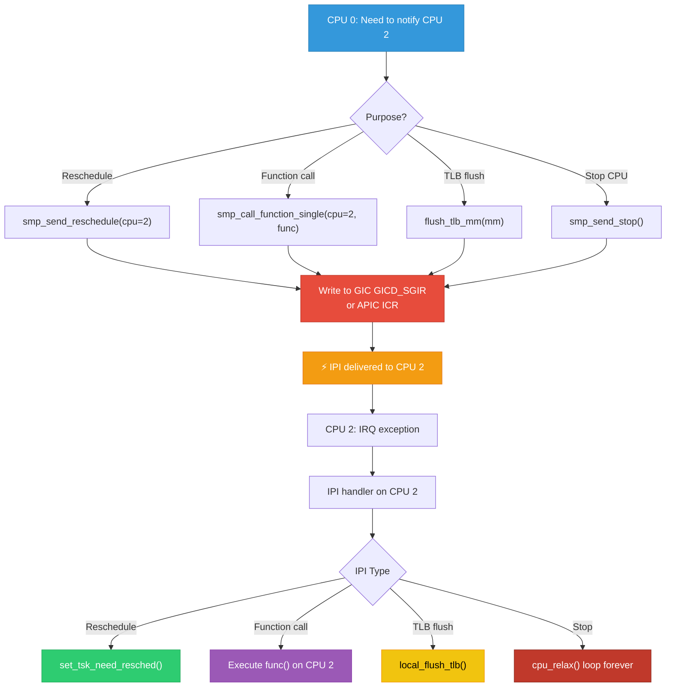
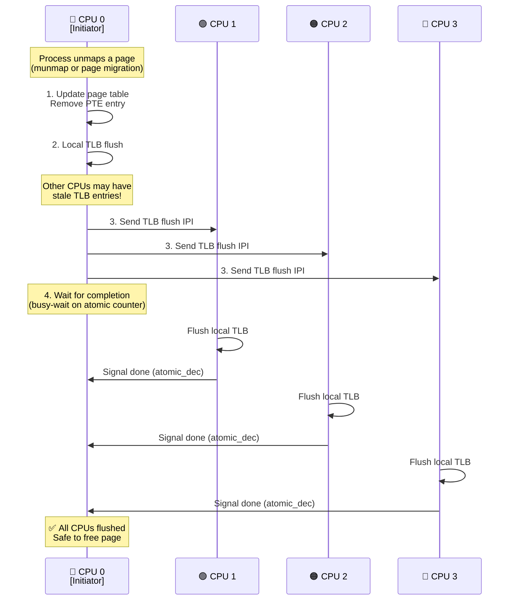
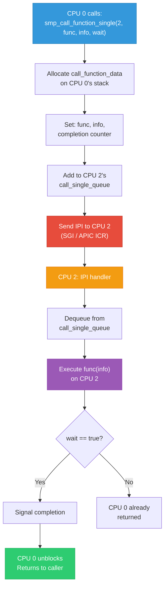

# 14 — IPI (Inter-Processor Interrupts)

## 📌 Overview

**Inter-Processor Interrupts (IPIs)** are special interrupts sent from one CPU core to another. They are the fundamental mechanism for CPU-to-CPU communication in SMP Linux systems.

IPIs are not triggered by external devices — they are software-generated using the interrupt controller (GIC SGI on ARM, ICR on x86 APIC).

---

## 🔍 Common IPI Uses in Linux

| IPI Type | Purpose | Frequency |
|----------|---------|-----------|
| **Reschedule IPI** | Wake up target CPU to run scheduler | Very high |
| **TLB Shootdown** | Flush TLB entries on remote CPUs | High |
| **Function Call** | Execute a function on a specific CPU | Medium |
| **Timer** | Broadcast timer events | Medium |
| **Stop CPU** | Halt CPU during panic/kexec | Rare |
| **IRQ Work** | Deferred work on specific CPU | Medium |

---

## 🔍 IPI on ARM (GIC SGI)

GIC defines **SGI (Software Generated Interrupts)** — IRQ numbers 0–15:

| SGI | Linux Usage |
|-----|-------------|
| 0 | `IPI_RESCHEDULE` — scheduler |
| 1 | `IPI_CALL_FUNC` — smp_call_function |
| 2 | `IPI_CPU_STOP` — stop CPU |
| 3 | `IPI_CPU_CRASH_STOP` — crash handling |
| 4 | `IPI_TIMER` — timer broadcast |
| 5 | `IPI_IRQ_WORK` — irq_work |
| 6 | `IPI_WAKEUP` — CPU wakeup from deep idle |

---

## 🎨 Mermaid Diagrams

### IPI Mechanism Flow



### TLB Shootdown IPI Sequence



### `smp_call_function` IPI



---

## 💻 Code Examples

### `smp_call_function` API

```c
#include <linux/smp.h>

/* Execute function on ALL other CPUs */
void smp_call_function(smp_call_func_t func, void *info, int wait);

/* Execute function on a specific CPU */
int smp_call_function_single(int cpu, smp_call_func_t func, 
                              void *info, int wait);

/* Execute function on a set of CPUs */
void smp_call_function_many(const struct cpumask *mask,
                            smp_call_func_t func, void *info, int wait);

/* Execute function on each CPU (including this one) */
void on_each_cpu(smp_call_func_t func, void *info, int wait);
```

### Practical Example: Read MSR on Target CPU

```c
/* We need to read a CPU-specific register on CPU 3 */
struct msr_info {
    u32 msr;
    u64 value;
};

static void read_msr_on_cpu(void *data)
{
    struct msr_info *info = data;
    /* This executes on the target CPU */
    rdmsrl(info->msr, info->value);
}

static u64 get_remote_msr(int cpu, u32 msr)
{
    struct msr_info info = { .msr = msr };
    
    /* Send IPI to target CPU, wait for result */
    smp_call_function_single(cpu, read_msr_on_cpu, &info, 1);
    
    return info.value;
}
```

### ARM GIC: Sending SGI

```c
/* arch/arm64/include/asm/smp.h */
static inline void smp_cross_call(const struct cpumask *target, 
                                   unsigned int ipinr)
{
    /* Write to GICD_SGIR (GICv2) or ICC_SGI1R_EL1 (GICv3) */
    gic_raise_softirq(target, ipinr);
}

/* GICv3 IPI send — arch/arm64/kernel/smp.c */
void arch_send_call_function_single_ipi(int cpu)
{
    smp_cross_call(cpumask_of(cpu), IPI_CALL_FUNC);
}
```

### x86 APIC: Sending IPI

```c
/* arch/x86/kernel/apic/apic.c */
void apic_send_IPI(int cpu, int vector)
{
    /* Write to APIC ICR (Interrupt Command Register) */
    apic->send_IPI(cpu, vector);
}

/* Reschedule IPI — most common */
void smp_send_reschedule(int cpu)
{
    apic_send_IPI(cpu, RESCHEDULE_VECTOR);
}
```

### IPI Statistics

```bash
# ARM: /proc/interrupts shows IPI counts
cat /proc/interrupts | grep IPI
#      CPU0       CPU1       CPU2       CPU3
# IPI0: 123456   234567   345678   456789   Rescheduling interrupts
# IPI1:    456      567      678      789   Function call interrupts
# IPI2:      0        0        0        0   CPU stop interrupts
# IPI3:      0        0        0        0   CPU crash stop
# IPI4:   8901     7890     8912     9012   Timer broadcast
# IPI5:    123      234      345      456   IRQ work interrupts
```

---

## 🔥 Tough Interview Questions & Deep Answers

### ❓ Q1: What is a TLB shootdown, and why does it require an IPI?

**A:** When the kernel modifies a **page table entry** (e.g., `munmap()`, page migration, CoW), the virtual-to-physical mapping changes. However, each CPU core caches page table translations in its local **TLB** (Translation Lookaside Buffer).

**The problem**: If CPU 0 changes a PTE, CPU 1/2/3 still have the old translation cached in their TLBs. If they use the stale TLB entry, they'll access the wrong physical address → **data corruption or security vulnerability**.

**The solution — TLB Shootdown**:
1. CPU 0 modifies the PTE
2. CPU 0 flushes its own local TLB (`invlpg` on x86 / `TLBI` on ARM64)
3. CPU 0 sends an IPI to every other CPU that might have the stale entry
4. Each target CPU's IPI handler flushes the specific TLB entry
5. CPU 0 **waits** for all CPUs to complete before proceeding

**Why an IPI is required**: There's no hardware mechanism to remotely invalidate another CPU's TLB. ARMv8.4-A introduced `TLBI` instructions with `IS` (Inner Shareable) suffix that can broadcast TLB invalidation without IPIs, but older hardware requires explicit IPIs.

**Performance impact**: TLB shootdowns are one of the most expensive operations in SMP systems. At scale (hundreds of CPUs), they cause significant overhead. This is why the kernel uses optimizations like:
- Batching TLB flushes
- Lazy TLB mode (defer flush if no tasks running)
- PCID/ASID to avoid flushing unrelated entries

---

### ❓ Q2: What happens if an IPI is sent to a CPU that is in deep idle (WFI/C-state)?

**A:** The IPI **wakes the CPU from idle**:

**ARM**: CPU is in WFI (Wait For Interrupt) state. The GIC delivers the SGI, causing an IRQ exception which exits WFI. The CPU resume path processes the IPI.

**x86**: CPU is in a deep C-state (C3, C6). The APIC interrupt wakes the CPU. The wake-up latency depends on the C-state depth:
- C1: ~1μs
- C3: ~100μs
- C6: ~200μs+

**The problem**: Waking a CPU from deep idle is expensive. Frequent IPIs (especially reschedule IPIs) prevent CPUs from entering deep idle, increasing power consumption.

**Optimizations**:
- `NO_HZ_FULL` (tickless): Avoid timer IPIs to idle CPUs
- `nohz_full=` boot parameter: Exempt certain CPUs from timer broadcasts
- Scheduler: Batch wake-ups, prefer CPUs already running
- `IPI_WAKEUP` (ARM): Dedicated IPI for controlled wake-up

---

### ❓ Q3: Can IPIs be lost? What guarantees does the kernel rely on?

**A:** IPIs are generally **not lost** because:

1. **GIC SGI**: Writing to `GICD_SGIR` (GICv2) or `ICC_SGI1R_EL1` (GICv3) atomically posts the interrupt to the target CPU's pending set. The GIC hardware holds it pending until the target CPU acknowledges it.

2. **APIC ICR**: Writing to the ICR register triggers the IPI. The APIC holds it pending in the target CPU's IRR (Interrupt Request Register) until serviced.

**However, there are edge cases:**

- **Multiple identical IPIs coalesce**: If CPU 0 sends two reschedule IPIs to CPU 1 before CPU 1 handles the first, they may coalesce into one. The kernel is designed to handle this — the reschedule IPI just sets `TIF_NEED_RESCHED`, which is idempotent.

- **smp_call_function**: Uses a **queue** per CPU. The IPI is a signal to check the queue. Even if one IPI is coalesced, the queue still has all pending function calls. Each processing clears the queue completely.

- **GIC SGI pending**: On GICv2, each SGI has a **separate pending bit per source CPU** per target CPU. So CPU 0's SGI to CPU 2 and CPU 1's SGI to CPU 2 are tracked independently.

**The kernel's assumption**: IPIs may coalesce but the underlying data structures (queues, flags) are designed to be resilient to this. No information is lost because the IPI is just a "wake up and check" notification.

---

### ❓ Q4: How does `smp_call_function_single()` ensure the target CPU executes the function?

**A:** 

1. **Caller** (CPU 0) allocates `struct __call_single_data` on its stack (or from pool)
2. Sets `csd->func = func`, `csd->info = info`
3. Adds `csd` to the target CPU's `call_single_queue` (lock-free list)
4. Sends IPI to target CPU
5. If `wait=1`: spins waiting for `csd->node.u_flags` completion bit

**Target** (CPU 2) IPI handler:
```c
void __smp_call_single_queue(int cpu, struct llist_node *node)
{
    /* Add to per-CPU lock-free list */
    if (llist_add(node, &per_cpu(call_single_queue, cpu)))
        send_call_function_single_ipi(cpu);
}

/* IPI handler on target CPU */
void generic_smp_call_function_single_interrupt(void)
{
    struct llist_node *entry;
    entry = llist_del_all(&this_cpu_read(call_single_queue));
    
    llist_for_each_entry_safe(csd, ..., entry) {
        csd->func(csd->info);
        if (csd->node.u_flags & CSD_TYPE_SYNC)
            complete(&csd->done);  /* Signal caller */
    }
}
```

**What if the target CPU is busy?**: The IPI preempts whatever the target CPU is doing (except NMI handlers). The function executes in **interrupt context** on the target CPU, meaning it must be fast and cannot sleep.

---

### ❓ Q5: What is the performance cost of IPIs, and how does Linux minimize them?

**A:** IPI costs:

| Operation | Typical Cost |
|-----------|-------------|
| Send IPI (write ICR/SGIR) | ~50-100ns |
| Target receives + ACK | ~200-500ns |
| Target context switch to handler | ~500-1000ns |
| Total round-trip (with wait) | ~1-5μs |
| Wake from deep C-state | ~100-200μs |

**Linux optimizations:**

1. **Lazy reschedule**: Instead of sending IPI immediately when a task becomes runnable, set a flag and let the target CPU check at the next interrupt return or tick.

2. **Batched TLB shootdown**: Collect multiple PTE changes and send one IPI with a range of addresses instead of one IPI per page.

3. **Per-CPU data**: Using `per_cpu` variables eliminates the need for IPIs to synchronize data — each CPU has its own copy.

4. **RCU (Read-Copy-Update)**: Avoids explicit synchronization (and IPIs) by using grace periods and memory barriers instead.

5. **Lock-free queues**: `call_single_queue` is a lock-free linked list — no IPI needed for queueing, only for notification.

6. **PCID/ASID**: Memory context IDs reduce TLB shootdowns — if no task with the old ASID is running on a CPU, no IPI is needed.

---

[← Previous: 13 — Edge vs Level Triggered](13_Edge_vs_Level_Triggered.md) | [Next: 15 — Device Tree Interrupt Mapping →](15_Device_Tree_Interrupt_Mapping.md)
