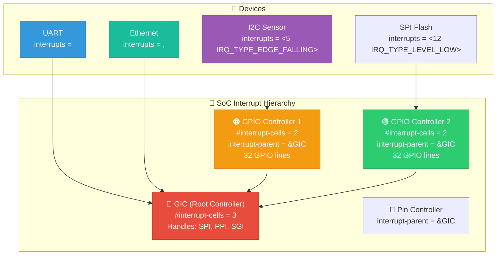
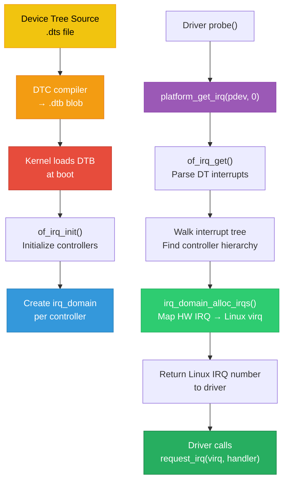
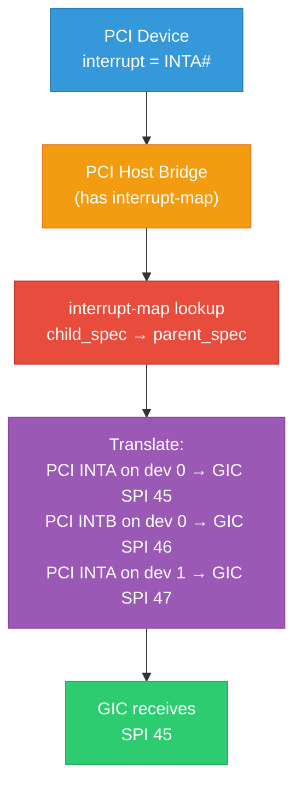

# 15 — Device Tree Interrupt Mapping (ARM)

## 📌 Overview

On ARM-based SoCs, **Device Tree (DT)** is the standard mechanism for describing hardware, including interrupt routing. The DT specifies how each device's interrupts connect to the interrupt controller hierarchy.

Understanding DT interrupt bindings is critical for SoC bring-up, BSP development, and driver writing at companies like Qualcomm, NVIDIA, NXP, and TI.

---

## 🔍 Key DT Properties

| Property | Description |
|----------|-------------|
| `interrupt-controller` | Marks a node as an interrupt controller |
| `#interrupt-cells` | Number of cells to describe one interrupt |
| `interrupt-parent` | Phandle to the parent interrupt controller |
| `interrupts` | List of interrupt specifiers for this device |
| `interrupt-names` | Named labels for each interrupt |
| `interrupt-map` | Translates child interrupts to parent domain |
| `interrupt-map-mask` | Mask applied before `interrupt-map` lookup |

---

## 🔍 GIC Interrupt Specifiers

For ARM GIC, `#interrupt-cells = <3>`:

| Cell | Meaning | Values |
|------|---------|--------|
| Cell 0 | Type | `GIC_SPI` (0) = Shared, `GIC_PPI` (1) = Private |
| Cell 1 | Interrupt number | SPI: 0-987, PPI: 0-15 |
| Cell 2 | Trigger flags | `IRQ_TYPE_LEVEL_HIGH` (4), `IRQ_TYPE_EDGE_RISING` (1) |

> **Note**: SPI numbers in DT are offset from 32. So `GIC_SPI 100` = hardware IRQ 132.

---

## 🎨 Mermaid Diagrams

### Interrupt Controller Hierarchy



### DT → Kernel IRQ Mapping Flow



### Interrupt Map (Bridge/Nexus) Translation



---

## 💻 Code Examples

### Basic Device Tree: GIC + Devices

```dts
/ {
    interrupt-parent = <&gic>;   /* Default parent for all children */
    
    /* GIC — Root Interrupt Controller */
    gic: interrupt-controller@f9000000 {
        compatible = "arm,gic-400";
        interrupt-controller;          /* I am a controller */
        #interrupt-cells = <3>;        /* 3 cells per interrupt specifier */
        reg = <0xf9000000 0x1000>,     /* Distributor */
              <0xf9002000 0x2000>;     /* CPU interface */
    };
    
    /* UART — Direct connection to GIC */
    uart0: serial@f991e000 {
        compatible = "qcom,msm-uartdm-v1.4";
        reg = <0xf991e000 0x1000>;
        interrupts = <GIC_SPI 108 IRQ_TYPE_LEVEL_HIGH>;
        /* This means: SPI #108 (HW IRQ 140), level-triggered, active high */
    };
    
    /* Ethernet — Multiple interrupts */
    ethernet@e000b000 {
        compatible = "cdns,gem";
        reg = <0xe000b000 0x1000>;
        interrupts = <GIC_SPI 22 IRQ_TYPE_LEVEL_HIGH>,  /* RX */
                     <GIC_SPI 23 IRQ_TYPE_LEVEL_HIGH>,  /* TX */
                     <GIC_SPI 24 IRQ_TYPE_EDGE_RISING>;  /* Error */
        interrupt-names = "rx", "tx", "error";
    };
};
```

### GPIO as Interrupt Controller

```dts
/* GPIO controller acts as secondary interrupt controller */
gpio1: gpio@e000a000 {
    compatible = "xlnx,zynq-gpio-1.0";
    interrupt-controller;         /* I route interrupts */
    #interrupt-cells = <2>;       /* 2 cells: <pin_number trigger_type> */
    interrupt-parent = <&gic>;
    interrupts = <GIC_SPI 20 IRQ_TYPE_LEVEL_HIGH>;  /* GPIO→GIC connection */
    gpio-controller;
    #gpio-cells = <2>;
    reg = <0xe000a000 0x1000>;
};

/* I2C sensor connected via GPIO interrupt */
&i2c0 {
    touchscreen@48 {
        compatible = "ti,tsc2007";
        reg = <0x48>;
        interrupt-parent = <&gpio1>;                    /* Parent is GPIO */
        interrupts = <5 IRQ_TYPE_EDGE_FALLING>;         /* GPIO pin 5, falling */
    };
};
```

### Interrupt Map (PCI Bridge)

```dts
pcie: pcie@f8000000 {
    compatible = "xlnx,axi-pcie-host-1.00.a";
    interrupt-parent = <&gic>;
    interrupts = <GIC_SPI 52 IRQ_TYPE_LEVEL_HIGH>;   /* Bridge's own IRQ */
    
    #interrupt-cells = <1>;
    interrupt-map-mask = <0 0 0 7>;    /* Only look at interrupt# (3 bits) */
    interrupt-map = 
        <0 0 0 1 &gic GIC_SPI 53 IRQ_TYPE_LEVEL_HIGH>, /* INTA → SPI 53 */
        <0 0 0 2 &gic GIC_SPI 54 IRQ_TYPE_LEVEL_HIGH>, /* INTB → SPI 54 */
        <0 0 0 3 &gic GIC_SPI 55 IRQ_TYPE_LEVEL_HIGH>, /* INTC → SPI 55 */
        <0 0 0 4 &gic GIC_SPI 56 IRQ_TYPE_LEVEL_HIGH>; /* INTD → SPI 56 */
};
```

### Driver: Parsing Interrupts from DT

```c
static int my_probe(struct platform_device *pdev)
{
    int irq, irq_tx, irq_rx;
    
    /* Method 1: Get by index */
    irq = platform_get_irq(pdev, 0);      /* First interrupt */
    if (irq < 0)
        return irq;
    
    /* Method 2: Get by name */
    irq_tx = platform_get_irq_byname(pdev, "tx");
    irq_rx = platform_get_irq_byname(pdev, "rx");
    
    /* Method 3: Manual DT parsing */
    struct device_node *np = pdev->dev.of_node;
    int num_irqs = of_irq_count(np);
    pr_info("Device has %d interrupts\n", num_irqs);
    
    /* Method 4: Parse with full specifier info */
    struct of_phandle_args oirq;
    of_irq_parse_one(np, 0, &oirq);
    /* oirq.args[0] = type, oirq.args[1] = number, oirq.args[2] = flags */
    
    return devm_request_irq(&pdev->dev, irq, handler, 0, "mydev", dev);
}
```

---

## 🔑 Common DT Interrupt Patterns

| Pattern | DT Syntax |
|---------|-----------|
| Direct to GIC | `interrupts = <GIC_SPI N flags>;` |
| Via GPIO | `interrupt-parent = <&gpio>; interrupts = <pin flags>;` |
| Multiple IRQs | `interrupts = <...>, <...>, <...>;` |
| Named IRQs | `interrupt-names = "name1", "name2";` |
| PCI bridge | `interrupt-map = <child_spec parent_spec>;` |

---

## 🔥 Tough Interview Questions & Deep Answers

### ❓ Q1: Explain the interrupt tree walk. How does the kernel resolve a device's interrupt to a Linux IRQ number?

**A:** When `platform_get_irq()` is called:

```
1. of_irq_get(np, index)
   → of_irq_parse_one(np, index, &oirq)
      → Read 'interrupts' property, extract specifier cells
      → Find 'interrupt-parent' (walk up tree if not specified)
      → oirq = {controller_np, args[3]}

2. If controller has 'interrupt-map':
   → of_irq_parse_raw()
   → Apply interrupt-map-mask to child specifier
   → Lookup in interrupt-map table
   → Get parent controller + parent specifier
   → Recurse until we reach a root controller (no interrupt-map)

3. irq_create_of_mapping(&oirq)
   → Find the irq_domain for the controller node
   → irq_domain_alloc_irqs()
      → domain->ops->alloc(domain, virq, nr_irqs, &oirq.args)
      → GIC alloc: configure GICD for hw_irq = oirq.args[1] + 32
   → Return virq (Linux virtual IRQ number)

4. Driver receives virq → request_irq(virq, handler, ...)
```

The tree walk is necessary because interrupts can cascade through multiple controllers (GPIO → GIC, or PCI bridge → GIC).

---

### ❓ Q2: What is the difference between `#interrupt-cells = <2>` and `#interrupt-cells = <3>`?

**A:** `#interrupt-cells` defines how many 32-bit cells describe one interrupt in the `interrupts` property:

**`#interrupt-cells = <3>`** (ARM GIC):
```dts
interrupts = <type number flags>;
/* Cell 0: GIC_SPI(0) or GIC_PPI(1) */
/* Cell 1: Interrupt number */
/* Cell 2: Trigger flags (IRQ_TYPE_*) */

/* Example: */
interrupts = <GIC_SPI 100 IRQ_TYPE_LEVEL_HIGH>;
```

**`#interrupt-cells = <2>`** (GPIO controller):
```dts
interrupts = <pin_number flags>;
/* Cell 0: GPIO pin number */
/* Cell 1: Trigger flags */

/* Example: */
interrupts = <5 IRQ_TYPE_EDGE_FALLING>;
```

**`#interrupt-cells = <1>`** (Simple controller):
```dts
interrupts = <irq_number>;
/* Cell 0: IRQ number only (trigger fixed in hardware) */
```

The controller's driver is responsible for interpreting these cells in its `irq_domain_ops->xlate()` callback:
```c
static int gic_irq_domain_xlate(struct irq_domain *d,
                                struct device_node *controller,
                                const u32 *intspec, unsigned int intsize,
                                unsigned long *out_hwirq,
                                unsigned int *out_type)
{
    if (intspec[0] == GIC_SPI)
        *out_hwirq = intspec[1] + 32;  /* SPI offset */
    else
        *out_hwirq = intspec[1] + 16;  /* PPI offset */
    
    *out_type = intspec[2] & IRQ_TYPE_SENSE_MASK;
    return 0;
}
```

---

### ❓ Q3: A new I2C sensor on your Qualcomm SoC has an interrupt pin connected to GPIO 45. Write the complete DT binding.

**A:**

```dts
/* In the SoC DTSI (already defined) */
tlmm: pinctrl@1000000 {
    compatible = "qcom,sm8150-pinctrl";
    interrupt-controller;
    #interrupt-cells = <2>;
    interrupt-parent = <&intc>;  /* Parent is GIC */
    interrupts = <GIC_SPI 208 IRQ_TYPE_LEVEL_HIGH>;
    gpio-controller;
    #gpio-cells = <2>;
};

/* In the board DTS */
&i2c_3 {
    status = "okay";
    
    sensor@1a {
        compatible = "vendor,my-sensor";
        reg = <0x1a>;
        
        /* Interrupt configuration */
        interrupt-parent = <&tlmm>;           /* GPIO controller */
        interrupts = <45 IRQ_TYPE_EDGE_FALLING>; /* GPIO 45, falling edge */
        
        /* Pin configuration for interrupt line */
        pinctrl-names = "default";
        pinctrl-0 = <&sensor_irq_default>;
    };
};

/* Pin configuration */
&tlmm {
    sensor_irq_default: sensor-irq-default {
        pins = "gpio45";
        function = "gpio";          /* GPIO function */
        bias-pull-up;               /* Internal pull-up (active low IRQ) */
        drive-strength = <2>;       /* 2mA */
        input-enable;               /* Configure as input */
    };
};
```

In the driver:
```c
static int sensor_probe(struct i2c_client *client)
{
    /* client->irq is auto-populated from DT */
    ret = devm_request_threaded_irq(&client->dev, client->irq,
                                     NULL, sensor_irq_thread,
                                     IRQF_ONESHOT | IRQF_TRIGGER_FALLING,
                                     "my-sensor", dev);
}
```

---

### ❓ Q4: What happens when `interrupt-parent` is not specified in a device node?

**A:** The kernel walks **up the device tree** to find the nearest ancestor with `interrupt-parent`:

```dts
/ {
    interrupt-parent = <&gic>;     /* Root-level default */
    
    soc {
        /* No interrupt-parent → inherits / (root) = &gic */
        
        bus@10000000 {
            interrupt-parent = <&gpio1>;  /* Override for children */
            
            device@a000 {
                /* No interrupt-parent → inherits bus = &gpio1 */
                interrupts = <5 IRQ_TYPE_LEVEL_HIGH>;
                /* This goes to gpio1, NOT gic */
            };
        };
        
        uart@20000 {
            /* No interrupt-parent → inherits soc → / = &gic */
            interrupts = <GIC_SPI 50 IRQ_TYPE_LEVEL_HIGH>;
        };
    };
};
```

The resolution in code (`of_irq_find_parent()`):
1. Check if the node has `interrupt-parent` property → use that
2. If not, go to parent node → check again
3. Repeat until found or reach root
4. If root has it → use root's `interrupt-parent`
5. If nobody has it → error (no interrupt controller found)

---

### ❓ Q5: How does `interrupt-map` work for a PCI host bridge? Walk through the translation.

**A:** `interrupt-map` translates interrupts from one domain (child/PCI) to another (parent/GIC).

Given:
```dts
pcie@f8000000 {
    #address-cells = <3>;    /* PCI address: phys.hi, phys.mid, phys.lo */
    #interrupt-cells = <1>;  /* PCI interrupt: just INTA/B/C/D (1-4) */
    
    interrupt-map-mask = <0xf800 0 0 7>;
    /* Mask extracts: device number (bits 15:11) and interrupt# (bits 2:0) */
    
    interrupt-map = 
        /*  child_address   child_int   parent    parent_int_spec */
        <0x0000 0 0  1  &gic  GIC_SPI 53 IRQ_TYPE_LEVEL_HIGH>,  /* Dev0 INTA */
        <0x0000 0 0  2  &gic  GIC_SPI 54 IRQ_TYPE_LEVEL_HIGH>,  /* Dev0 INTB */
        <0x0800 0 0  1  &gic  GIC_SPI 55 IRQ_TYPE_LEVEL_HIGH>,  /* Dev1 INTA */
        <0x0800 0 0  2  &gic  GIC_SPI 56 IRQ_TYPE_LEVEL_HIGH>;  /* Dev1 INTB */
};
```

**Translation steps** for PCI device at bus 0, device 1, function 0, INTA:

1. **Child specifier**: `address = <0x0800 0 0>`, `int = <1>` (INTA)
2. **Apply mask**: `<0x0800 0 0 1> & <0xf800 0 0 7>` = `<0x0800 0 0 1>`
3. **Lookup in map**: Find row matching `<0x0800 0 0 1>`
4. **Match**: Row 3 → parent is `&gic`, parent spec = `<GIC_SPI 55 IRQ_TYPE_LEVEL_HIGH>`
5. **Result**: This PCI device's INTA → GIC SPI 55 (HW IRQ 87)

The kernel does this in `of_irq_parse_raw()`:
```c
/* Walk the interrupt-map entries */
for (each entry in interrupt-map) {
    if ((child_spec & mask) == entry_child_spec)
        → found! Use entry's parent controller + parent specifier
}
```

---

[← Previous: 14 — IPI](14_IPI_Inter_Processor_Interrupts.md) | [Next: 16 — Interrupt Debugging →](16_Interrupt_Debugging_proc.md)
