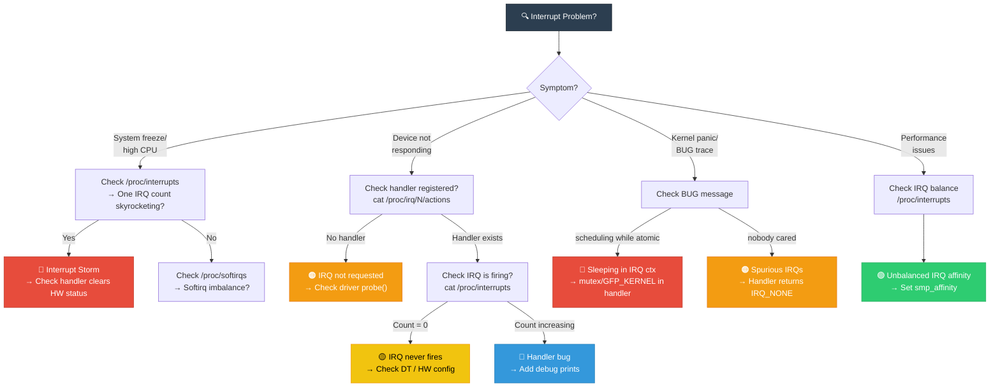
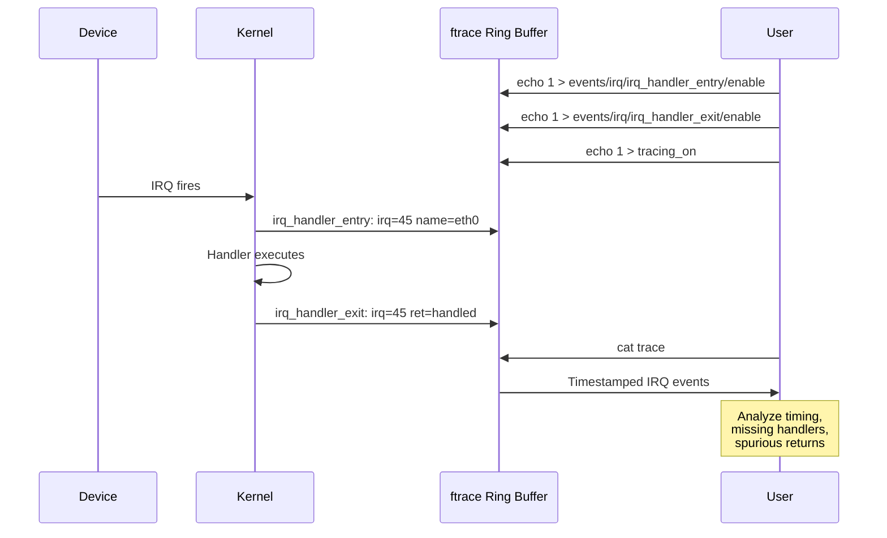

# 16 — Interrupt Debugging & /proc/interrupts

## 📌 Overview

Debugging interrupt issues is a critical kernel development skill. Linux provides several tools and interfaces for monitoring, tracing, and diagnosing interrupt-related problems.

---

## 🔍 Debugging Interfaces

| Interface | Path | Purpose |
|-----------|------|---------|
| `/proc/interrupts` | Per-CPU IRQ counts | IRQ distribution across CPUs |
| `/proc/softirqs` | Per-CPU softirq counts | Softirq load distribution |
| `/proc/irq/N/` | Per-IRQ directory | Affinity, actions, type |
| `ftrace` | `/sys/kernel/debug/tracing/` | Dynamic IRQ tracing |
| `perf` | User-space tool | Hardware PMU interrupt profiling |
| `lockdep` | Runtime | Deadlock detection in IRQ paths |
| `dmesg` | Kernel log | "nobody cared", spurious IRQ messages |

---

## 🎨 Mermaid Diagrams

### Debugging Decision Tree



### IRQ Debugging Flow with ftrace



---

## 💻 Code Examples & Commands

### Reading `/proc/interrupts`

```bash
$ cat /proc/interrupts
           CPU0       CPU1       CPU2       CPU3
  0:         45          0          0          0   IO-APIC   2-edge    timer
  1:          3          0          0          0   IO-APIC   1-edge    i8042
  8:          0          0          0          0   IO-APIC   8-edge    rtc0
  9:          0          0          0          0   IO-APIC   9-fasteoi acpi
 14:          0          0          0          0   IO-APIC  14-edge    ata_piix
 45:     284571     285034     283193     284402   PCI-MSI-X  eth0-rx-0
 46:     142285     142517     141596     142201   PCI-MSI-X  eth0-rx-1
 47:       5231          0          0          0   GIC-SPI   Level     mmc0
NMI:        157        142        138        151   Non-maskable interrupts
LOC:     524876     518234     512891     521345   Local timer interrupts
RES:       8234       7891       8012       7956   Rescheduling interrupts
CAL:       1234       1123       1098       1201   Function call interrupts
TLB:       4567       4321       4456       4398   TLB shootdowns
```

### Reading `/proc/softirqs`

```bash
$ cat /proc/softirqs
                    CPU0       CPU1       CPU2       CPU3
          HI:         15          3          2          8
       TIMER:     210847     198234     201456     205678
      NET_TX:       2341       1234       2567       1890
      NET_RX:     567890     578234     559012     571234
       BLOCK:      12345       7890       8901       9012
    IRQ_POLL:          0          0          0          0
     TASKLET:       4567       3456       4012       3890
       SCHED:      98765      87654      91234      89012
     HRTIMER:          0          0          0          0
         RCU:     345678     334567     341234     338901
```

### Per-IRQ Details

```bash
# List all info for IRQ 45
ls /proc/irq/45/
# affinity_hint  effective_affinity  node  smp_affinity  spurious
# actions         effective_affinity_list  smp_affinity_list

# See registered handlers
cat /proc/irq/45/actions
# → eth0

# See spurious count
cat /proc/irq/45/spurious
# count 0
# unhandled 0
# last_unhandled 0 ms

# See which NUMA node this IRQ belongs to
cat /proc/irq/45/node
# → 0
```

### ftrace: Tracing Interrupts

```bash
# Enable IRQ tracing
cd /sys/kernel/debug/tracing

# Method 1: Trace IRQ handlers
echo 1 > events/irq/irq_handler_entry/enable
echo 1 > events/irq/irq_handler_exit/enable

# Method 2: Trace softirqs
echo 1 > events/irq/softirq_entry/enable
echo 1 > events/irq/softirq_exit/enable
echo 1 > events/irq/softirq_raise/enable

# Start tracing
echo 1 > tracing_on

# Read trace
cat trace

# Output:
#  kworker/0-123  [000] d..1  1234.567890: irq_handler_entry: irq=45 name=eth0
#  kworker/0-123  [000] d..1  1234.567895: irq_handler_exit: irq=45 ret=handled
#  kworker/0-123  [000] d.s1  1234.567900: softirq_entry: vec=3 [action=NET_RX]
#  kworker/0-123  [000] d.s1  1234.567950: softirq_exit: vec=3 [action=NET_RX]

# Filter specific IRQ
echo 'irq==45' > events/irq/irq_handler_entry/filter

# Measure IRQ handler latency
echo irqsoff > current_tracer
cat trace  # Shows max IRQ-disabled duration
```

### Detecting Scheduling in IRQ Context

```bash
# Check dmesg for these critical messages:

# 1. Sleeping in atomic context
dmesg | grep "BUG: scheduling while atomic"
# BUG: scheduling while atomic: swapper/0/0/0x00010001
# Call trace: dump_backtrace → show_stack → dump_stack → __schedule_bug → ...

# 2. Spurious IRQ
dmesg | grep "nobody cared"
# irq 45: nobody cared (try booting with the "irqpoll" option)
# handlers: [<ffffff80012345678>] my_handler

# 3. IRQ disabled too long
dmesg | grep "BUG: soft lockup"
# BUG: soft lockup - CPU#2 stuck for 22s!
```

### Using `/proc/irq/default_smp_affinity`

```bash
# Set default affinity for all newly created IRQs
echo f > /proc/irq/default_smp_affinity  # All 4 CPUs

# Script to balance IRQs evenly
#!/bin/bash
cpus=$(nproc)
irq_list=$(awk '/^ *[0-9]+:/ {print $1}' /proc/interrupts | tr -d ':')
cpu=0
for irq in $irq_list; do
    mask=$((1 << cpu))
    echo $(printf '%x' $mask) > /proc/irq/$irq/smp_affinity 2>/dev/null
    cpu=$(( (cpu + 1) % cpus ))
done
```

### Kernel Debug: Adding IRQ Debug to Driver

```c
/* Add debug counters to your driver */
struct my_device {
    atomic_t irq_count;
    atomic_t spurious_count;
    ktime_t last_irq_time;
    ktime_t max_handler_time;
};

static irqreturn_t my_debug_handler(int irq, void *dev_id)
{
    struct my_device *dev = dev_id;
    ktime_t start = ktime_get();
    u32 status;
    
    status = readl(dev->base + IRQ_STATUS);
    
    if (!status) {
        atomic_inc(&dev->spurious_count);
        dev_warn_ratelimited(&dev->pdev->dev,
                             "Spurious IRQ! count=%d\n",
                             atomic_read(&dev->spurious_count));
        return IRQ_NONE;
    }
    
    writel(status, dev->base + IRQ_CLEAR);
    atomic_inc(&dev->irq_count);
    
    /* Process interrupt */
    handle_data(dev);
    
    /* Track handler duration */
    ktime_t elapsed = ktime_sub(ktime_get(), start);
    if (ktime_compare(elapsed, dev->max_handler_time) > 0) {
        dev->max_handler_time = elapsed;
        dev_info(&dev->pdev->dev, "New max handler time: %lldns\n",
                 ktime_to_ns(elapsed));
    }
    
    return IRQ_HANDLED;
}

/* Expose via debugfs */
static int irq_stats_show(struct seq_file *s, void *data)
{
    struct my_device *dev = s->private;
    seq_printf(s, "IRQ count: %d\n", atomic_read(&dev->irq_count));
    seq_printf(s, "Spurious: %d\n", atomic_read(&dev->spurious_count));
    seq_printf(s, "Max handler time: %lld ns\n",
               ktime_to_ns(dev->max_handler_time));
    return 0;
}
DEFINE_SHOW_ATTRIBUTE(irq_stats);
```

---

## 🔑 Common IRQ Debug Scenarios

| Symptom | Check | Root Cause |
|---------|-------|------------|
| CPU stuck at 100% | `/proc/interrupts` shows rapidly increasing count | Interrupt storm — handler not clearing HW |
| "nobody cared" in dmesg | Handler always returns `IRQ_NONE` | Wrong HW status register, wrong IRQ number |
| "scheduling while atomic" | Stack trace in dmesg | `mutex_lock()` or `GFP_KERNEL` in IRQ context |
| Device timeout | IRQ count stays at 0 | DT interrupt wrong, IRQ not enabled, HW issue |
| Uneven performance | `/proc/interrupts` shows all IRQs on CPU0 | Missing SMP affinity configuration |
| Softirq starvation | `/proc/softirqs` imbalance | Too much work in softirq, high IRQ rate |

---

## 🔥 Tough Interview Questions & Deep Answers

### ❓ Q1: You see "irq 45: nobody cared" in dmesg. Walk through your debugging process.

**A:**

**Step 1: Understand the message**
```
irq 45: nobody cared (try booting with the "irqpoll" option)
CPU: 0 PID: 0 Comm: swapper/0 Not tainted
handlers:
[<ffffff80012345678>] my_handler [my_driver]
Disabling IRQ #45
```

This means: 99,900 out of 100,000 invocations had ALL handlers return `IRQ_NONE`.

**Step 2: Check the handler**
```c
// Is the handler checking the right status register?
status = readl(dev->base + IRQ_STATUS);  // Correct offset?
if (!(status & MY_IRQ_MASK))             // Correct mask?
    return IRQ_NONE;
```

**Step 3: Verify hardware**
```bash
# Is the IRQ actually from this device?
devmem2 0xf991e000  # Read status register directly
# If always 0 → device isn't generating the interrupt
# The IRQ might be from another device sharing the line
```

**Step 4: Check DT binding**
```bash
# Is the IRQ number correct?
dtc -I fs /proc/device-tree | grep -A5 "my_device"
# Compare interrupts property with hardware documentation
```

**Step 5: Add debug**
```c
static irqreturn_t my_handler(int irq, void *dev_id) {
    u32 status = readl(dev->base + IRQ_STATUS);
    pr_info_ratelimited("IRQ handler: status=0x%x\n", status);
    // If status always 0 → wrong register or wrong device
}
```

**Common causes**: Wrong register offset, wrong interrupt number in DT, shared IRQ with missing device, hardware stuck asserting.

---

### ❓ Q2: How do you measure interrupt latency (time from HW assertion to handler execution)?

**A:** Several methods:

**Method 1: ftrace irqsoff tracer**
```bash
echo irqsoff > /sys/kernel/debug/tracing/current_tracer
echo 1 > tracing_on
# Run workload
cat /sys/kernel/debug/tracing/tracing_max_latency
# Shows max time (μs) IRQs were disabled
cat trace  # Detailed stack trace of worst case
```

**Method 2: Hardware timestamp (most accurate)**
```c
/* Read a high-resolution hardware timer in the IRQ handler */
static irqreturn_t my_handler(int irq, void *dev_id) {
    u64 hw_timestamp = readl(dev->base + HW_TIMER_REG);
    u64 entry_time = arch_counter_get_cntvct();  /* ARM generic timer */
    
    dev->irq_latency = entry_time - hw_timestamp;
    /* hw_timestamp = when device asserted, entry_time = when handler runs */
}
```

**Method 3: GPIO + oscilloscope**
- Device asserts IRQ → measure on scope
- First instruction in handler toggles a GPIO → measure on scope
- Delta = hardware → software latency (most accurate for real-time analysis)

**Method 4: perf**
```bash
perf stat -e irq:irq_handler_entry -a sleep 10
# Shows interrupt rate and overhead
```

**Typical latencies:**
- Bare-metal IRQ entry: ~1-5μs
- Linux hardirq handler entry: ~3-10μs
- Threaded IRQ handler entry: ~10-100μs (plus schedule latency)

---

### ❓ Q3: How do you debug an interrupt storm that freezes the system?

**A:** An interrupt storm makes the system unresponsive because the CPU spends 100% time in hardirq handlers.

**If you can still access the console (serial/SSH):**
```bash
# Check which IRQ is causing the storm
watch -n1 cat /proc/interrupts | head -20
# Look for rapidly increasing count on one IRQ

# Disable the offending IRQ temporarily
echo 1 > /proc/irq/45/actions  # Check which device
echo 0 > /sys/devices/.../driver/my_device/enable  # Disable device

# Or forcibly disable the IRQ
echo "disable" > /proc/irq/45/spurious  # Not standard, but...
```

**If system is frozen (no console):**
1. Use **NMI watchdog** — if enabled, it fires after 10s of no timer interrupts → generates crash dump
2. Use **JTAG/debug probe** — connect hardware debugger, halt CPU, read PC/backtrace
3. Use **serial console** — SysRq magic keys: `Alt+SysRq+t` (show tasks), `Alt+SysRq+l` (show backtrace)
4. Use **kdump/kexec** — if configured, NMI → kexec → crashkernel saves dump

**Prevention:**
- `note_interrupt()` in the kernel automatically detects storms (when handlers return `IRQ_NONE`)
- `IRQF_ONESHOT` + threaded IRQs prevent storms by keeping IRQ masked during processing
- Hardware: ensure the driver properly clears the interrupt source

---

### ❓ Q4: Explain `lockdep` and how it detects interrupt-related deadlocks.

**A:** `lockdep` (CONFIG_LOCKDEP) builds a **directed graph of lock dependencies** at runtime. For each lock acquisition, it records:

1. Which lock is being acquired
2. Which locks are already held
3. The current execution context (hardirq, softirq, process)

**Interrupt context checks:**
- If lock A is acquired in process context AND in hardirq context:
  - Process context must use `spin_lock_irqsave()` — lockdep verifies this
  - If process context uses plain `spin_lock()` → lockdep warns: "possible interrupt deadlock"

- If lock A is acquired in softirq AND lock B is acquired while holding A in process context with `spin_lock_bh()`:
  - Lockdep traces: A → B (process), B is never held in softirq → OK
  - If B IS also acquired in softirq without `spin_lock_bh()` → potential deadlock

**Lockdep output example:**
```
=============================================
WARNING: possible irq lock inversion dependency detected
  Thread 1: process context, holds lock A with spin_lock()
  IRQ handler: tries to acquire lock A with spin_lock()
  
  This could deadlock if IRQ fires while Thread 1 holds lock A!
  
  Fix: Use spin_lock_irqsave() in Thread 1
=============================================
```

**How to enable:**
```bash
CONFIG_LOCKDEP=y
CONFIG_PROVE_LOCKING=y
CONFIG_DEBUG_LOCK_ALLOC=y
```

---

### ❓ Q5: How do you use `perf` to profile interrupt overhead on a live system?

**A:**

```bash
# 1. Count interrupts per second
perf stat -e interrupts -a -I 1000 -- sleep 10
# Shows interrupt rate every second

# 2. See which IRQ handlers take the most time
perf top -e irq:irq_handler_entry -sort comm
# Real-time view of interrupt handler frequency

# 3. Record interrupt trace for analysis
perf record -e irq:irq_handler_entry,irq:irq_handler_exit \
            -e irq:softirq_entry,irq:softirq_exit \
            -a -- sleep 30
perf report

# 4. Measure time spent in handlers
perf script | awk '
/irq_handler_entry/ { start[$4] = $1 }
/irq_handler_exit/ { if ($4 in start) { 
    diff = $1 - start[$4]; 
    printf "%s: %.3f us\n", $4, diff*1000000 
}}'

# 5. Flame graph of interrupt processing
perf record -g -e irq:irq_handler_entry -a -- sleep 10
perf script | stackcollapse-perf.pl | flamegraph.pl > irq_flame.svg
```

---

[← Previous: 15 — Device Tree](15_Device_Tree_Interrupt_Mapping.md) | [Next: 17 — NMI →](17_NMI_Non_Maskable_Interrupts.md)
