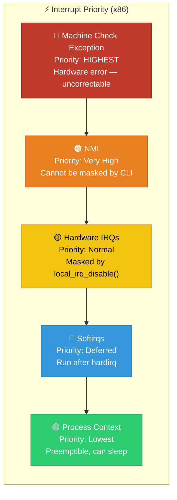
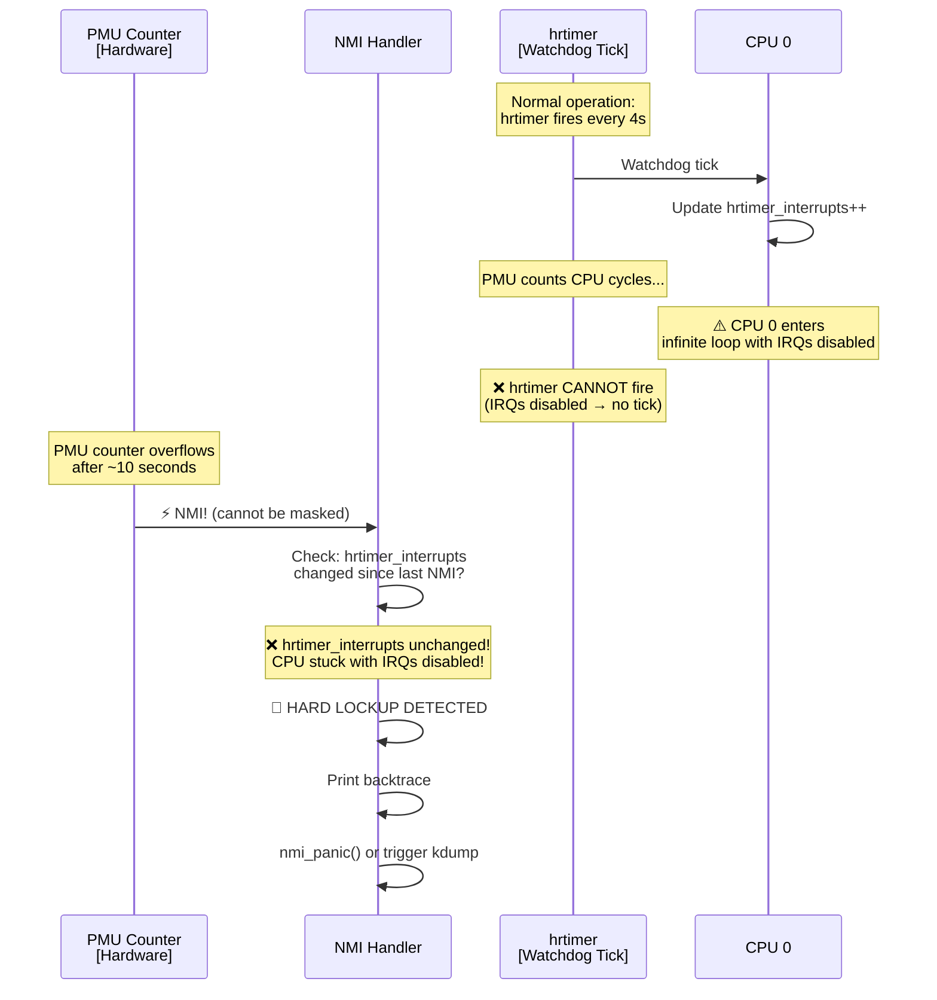
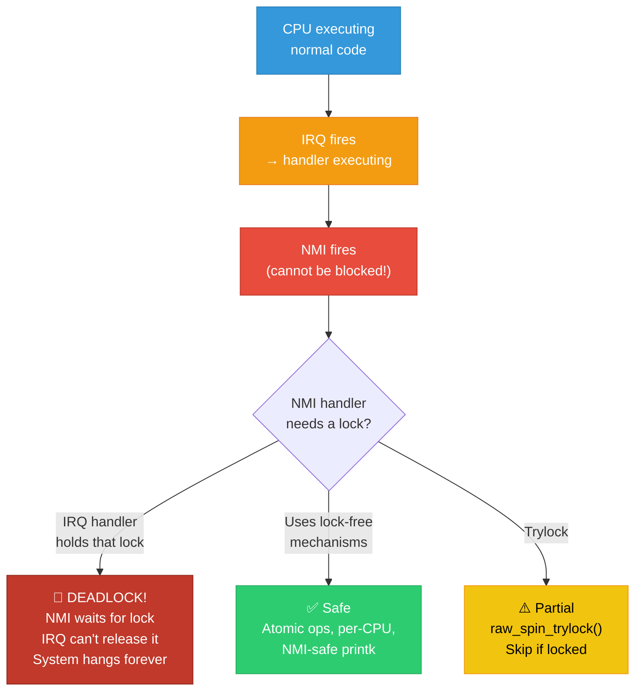
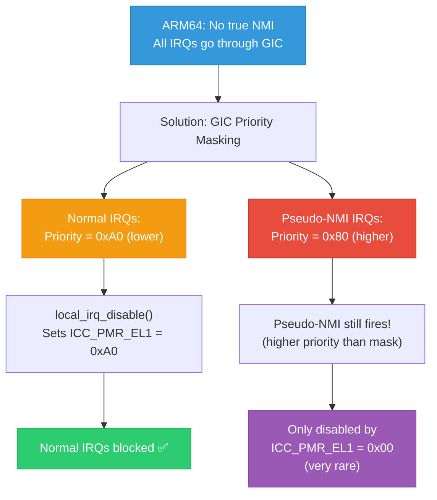

# 17 — NMI (Non-Maskable Interrupts)

## 📌 Overview

**Non-Maskable Interrupts (NMIs)** are the highest-priority interrupts that **cannot be disabled or masked** by software. They bypass all interrupt masking mechanisms (`cli`, `local_irq_disable()`, `spin_lock_irqsave()`).

NMIs are used for critical system diagnostics — detecting hard lockups, profiling, and last-resort debugging when the system is unresponsive.

---

## 🔍 NMI Use Cases

| Use Case | Architecture | Mechanism |
|----------|-------------|-----------|
| **Hard lockup detector** | x86 | PMU counter overflow → NMI |
| **Watchdog** | x86/ARM | NMI fires if no tick for 10s |
| **perf profiling** | x86 | PMU sampling via NMI |
| **Crash dump (kdump)** | x86 | Send NMI to all CPUs → kexec |
| **Machine check** | x86 | MCE (Machine Check Exception) |
| **System reset** | All | External NMI button/BMC |
| **FIQ (ARM)** | ARM32 | Fast Interrupt — NMI-like |
| **Pseudo-NMI** | ARM64 | GIC priority masking |

---

## 🔍 NMI Constraints

NMI handlers execute in the **most restricted context** possible:

| Action | Allowed in NMI? | Reason |
|--------|-----------------|--------|
| `printk()` | ⚠️ Limited | May deadlock if logbuf locked |
| `spin_lock()` | ❌ NO | Could deadlock if lock already held |
| Memory allocation | ❌ NO | Allocator uses locks |
| `schedule()` | ❌ NO | Cannot sleep or reschedule |
| Read from registers | ✅ Yes | Direct hardware access safe |
| Atomic operations | ✅ Yes | Lock-free by design |
| `nmi_panic()` | ✅ Yes | Designed for NMI context |

---

## 🎨 Mermaid Diagrams

### NMI Priority in Exception Hierarchy



### Hard Lockup Detection via NMI Watchdog



### NMI Nesting Problem



### ARM64 Pseudo-NMI



---

## 💻 Code Examples

### NMI Watchdog (x86)

```c
/* kernel/watchdog.c */

/* The PMU NMI watchdog — fires if CPU doesn't get timer interrupts */
static int watchdog_nmi_enable(unsigned int cpu)
{
    struct perf_event *event;
    struct perf_event_attr attr = {
        .type           = PERF_TYPE_HARDWARE,
        .config         = PERF_COUNT_HW_CPU_CYCLES,
        .sample_period  = hw_nmi_get_sample_period(watchdog_thresh),
        .pinned         = 1,
        .disabled       = 1,
    };
    
    /* Register PMU event that overflows → NMI */
    event = perf_event_create_kernel_counter(&attr, cpu, NULL,
                                              watchdog_overflow_callback, NULL);
    per_cpu(watchdog_ev, cpu) = event;
    perf_event_enable(event);
    return 0;
}

/* NMI callback: check if hrtimer is still ticking */
static void watchdog_overflow_callback(struct perf_event *event,
                                        struct perf_sample_data *data,
                                        struct pt_regs *regs)
{
    /* Get the current count from the hrtimer watchdog */
    unsigned long touch_ts = per_cpu(watchdog_touch_ts, smp_processor_id());
    unsigned long now = get_timestamp();
    
    /* If hrtimer hasn't fired in > threshold → hard lockup */
    if (time_after(now, touch_ts + watchdog_thresh * NSEC_PER_SEC)) {
        /* HARD LOCKUP! */
        pr_emerg("Watchdog detected hard LOCKUP on cpu %d\n",
                 smp_processor_id());
        show_regs(regs);
        
        if (hardlockup_panic)
            nmi_panic(regs, "Hard LOCKUP");
    }
}
```

### Registering an NMI Handler (x86)

```c
#include <asm/nmi.h>

/* NMI handler — MUST be safe: no locks, no printk (use nmi_safe versions) */
static int my_nmi_handler(unsigned int type, struct pt_regs *regs)
{
    /* Only handle if this NMI is for us */
    if (type != NMI_LOCAL)
        return NMI_DONE;
    
    /* Read some diagnostic data (lock-free) */
    u64 diagnostic = rdtsc();
    
    /* Store in per-CPU buffer (no locks needed) */
    this_cpu_write(nmi_data, diagnostic);
    
    return NMI_HANDLED;
}

static int __init my_nmi_init(void)
{
    register_nmi_handler(NMI_LOCAL, my_nmi_handler, 0, "my_nmi");
    return 0;
}

static void __exit my_nmi_exit(void)
{
    unregister_nmi_handler(NMI_LOCAL, "my_nmi");
}
```

### ARM64 Pseudo-NMI

```c
/* arch/arm64/kernel/irq.c */

/* Enable pseudo-NMI support — boot with "irqchip.gicv3_pseudo_nmi=1" */

/* In GICv3 driver */
static void gic_irq_nmi_setup(struct irq_data *d)
{
    struct irq_desc *desc = irq_to_desc(d->irq);
    
    /* Set this IRQ to high priority (bypass normal masking) */
    gic_set_irq_prio(d, GICD_INT_NMI_PRI);
    
    desc->handle_irq = handle_percpu_devid_fasteoi_nmi;
}

/* Normal local_irq_disable() masks at priority 0xA0 */
/* Pseudo-NMI has priority 0x80 → still fires! */
/* Only gic_pmr_mask_all() (priority 0x00) blocks it */
```

### kdump: NMI-Triggered Crash Dump

```bash
# Configure kdump
# 1. Reserve memory for crash kernel
# Boot param: crashkernel=256M

# 2. Trigger crash dump via NMI (x86)
echo 1 > /proc/sys/kernel/unknown_nmi_panic
# Now pressing NMI button on server → panic → crashdump

# 3. Trigger manually via sysrq
echo c > /proc/sysrq-trigger
# Or: Alt+SysRq+c

# 4. Analyze crash dump
crash vmlinux vmcore
crash> bt          # Backtrace of panicking task
crash> irq -a      # Show all IRQ info
crash> log         # Kernel log buffer
```

---

## 🔥 Tough Interview Questions & Deep Answers

### ❓ Q1: Why can't NMI handlers use spinlocks? What alternatives exist?

**A:** **The deadlock scenario:**

```
1. CPU 0: spin_lock(&my_lock) → acquires lock
2. NMI fires on CPU 0 (cannot be masked!)
3. NMI handler: spin_lock(&my_lock) → DEADLOCK!
   The NMI handler waits for the lock, but the lock holder
   (also on CPU 0) can't run because NMI has higher priority.
```

This is an **unrecoverable** deadlock — no interrupt can preempt the NMI to let the lock holder continue.

**Alternatives:**

1. **Atomic operations**: `atomic_inc()`, `atomic_set()`, `cmpxchg()` — lock-free
2. **Per-CPU variables**: `this_cpu_write()` — no contention
3. **Lock-free data structures**: `llist` (lock-free linked list), ring buffers
4. **Trylock**: `raw_spin_trylock()` — skip operation if locked:
   ```c
   if (raw_spin_trylock(&lock)) {
       /* Got it — safe to proceed */
       raw_spin_unlock(&lock);
   } else {
       /* Skip — someone else holds it */
   }
   ```
5. **NMI-safe printk**: Uses a separate NMI ring buffer that's drained later by a non-NMI context.

---

### ❓ Q2: Explain the difference between soft lockup and hard lockup detection.

**A:**

**Soft lockup** = CPU in kernel mode for too long, not scheduling but interrupts still work:
```
Detection: watchdog hrtimer fires (every 4s)
           → checks if watchdog kthread ran recently
           → If kthread hasn't run in 20s → soft lockup
             (CPU is handling interrupts but never returns to process context)

Trigger: Preemption disabled too long, infinite loop in kernel with
         preempt_disable() but without disabling IRQs.
```

**Hard lockup** = CPU with interrupts disabled, completely stuck:
```
Detection: NMI watchdog (PMU overflow)
           → NMI fires every ~10s regardless of IRQ state
           → Checks if hrtimer_interrupts counter changed
           → If unchanged → hard lockup
             (CPU can't even process timer interrupts!)

Trigger: spin_lock_irqsave() held forever, infinite loop with
         local_irq_disable(), firmware SMI taking too long.
```

```
Priority chain:
  Process context → interrupted by → softirq/tasklet
  Softirq → interrupted by → hardirq
  Hardirq → interrupted by → NMI (for hard lockup detection)
  
  Soft lockup: hardirq works, process context doesn't
  Hard lockup: nothing works, only NMI fires
```

---

### ❓ Q3: ARM64 doesn't have a true NMI. How does Linux implement NMI-like functionality?

**A:** ARM64 uses **GIC priority-based masking** to create "pseudo-NMI":

**How normal IRQ masking works on ARM64:**
- `local_irq_disable()` writes to `ICC_PMR_EL1` (Priority Mask Register)
- Sets PMR to `0xA0` → only IRQs with priority < 0xA0 are delivered
- Normal IRQs have priority `0xA0` → masked

**How pseudo-NMI works:**
- Pseudo-NMI IRQs configured with priority `0x80` (higher priority = lower number)
- When PMR = `0xA0`, pseudo-NMIs still fire (0x80 < 0xA0 → passes the filter)
- Only `PMR = 0x00` masks everything (used in very specific NMI handler paths)

**Configuration:**
```bash
# Boot parameter to enable
irqchip.gicv3_pseudo_nmi=1
```

**Interrupt types using pseudo-NMI:**
- Hard lockup watchdog (PMU overflow)
- perf profiling
- SDEI (Software Delegated Exception Interface) for RAS

**Limitations vs true x86 NMI:**
- Still goes through GIC — has slightly higher latency
- Can be masked if PMR set to 0x00 (x86 NMI truly cannot be masked)
- Requires GICv3 — not available on GICv2

**ARM32 FIQ**: ARM32 had FIQ (Fast Interrupt Request) which was a separate exception vector with its own banked registers. Linux traditionally didn't use FIQ, but some debuggers (JTAG) used it. ARMv8/ARM64 replaced FIQ with the GIC priority scheme.

---

### ❓ Q4: How does `printk()` work in NMI context without deadlocking?

**A:** Regular `printk()` acquires `logbuf_lock`. If NMI hits while that lock is held → deadlock.

Since Linux 5.x, `printk()` was redesigned with NMI safety:

**Pre-5.x approach:**
```c
static int printk_nmi_handler(void) {
    /* NMI-safe: write to per-CPU NMI buffer */
    nmi_seq_buf_write(this_cpu_ptr(&nmi_print_buf), msg);
    /* Flushed to main log later in non-NMI context */
}
```

**Modern approach (printk ringbuffer):**
```c
/* The printk ringbuffer is lock-free! */
struct printk_ringbuffer {
    struct prb_desc_ring desc_ring;  /* Lock-free descriptor ring */
    struct prb_data_ring text_data_ring;  /* Lock-free data ring */
};

/* printk() safe in any context including NMI: */
void vprintk_store(int facility, int level, const char *fmt, ...) {
    /* 1. Reserve space in lock-free ringbuffer → atomic cmpxchg */
    prb_reserve(&rb, &desc_ring, &info);
    
    /* 2. Write message → no lock needed */
    vscnprintf(text_buf, text_size, fmt, args);
    
    /* 3. Commit → atomic store */
    prb_commit(&rb);
    
    /* 4. Wake up console (deferred if in NMI) */
    if (in_nmi())
        irq_work_queue(&printk_irq_work);  /* Drain later */
    else
        console_flush();
}
```

The key insight: the **ringbuffer is lock-free** using atomic operations, so NMI can safely write to it. The console output (actually printing to serial/tty) is deferred to non-NMI context via `irq_work`.

---

### ❓ Q5: A production server occasionally hard-locks. How do you set up NMI-based debugging?

**A:**

**Step 1: Enable NMI watchdog**
```bash
# Boot parameter
nmi_watchdog=1

# Verify
cat /proc/sys/kernel/nmi_watchdog
# 1

# Check NMI counts
grep NMI /proc/interrupts
# NMI:      157     142     138     151   Non-maskable interrupts
```

**Step 2: Enable panic on hard lockup + kdump**
```bash
# Boot parameters
crashkernel=256M nmi_watchdog=1 hardlockup_panic=1

# Or at runtime
echo 1 > /proc/sys/kernel/hardlockup_panic

# Verify kdump is loaded
systemctl status kdump
```

**Step 3: Enable unknown NMI panic (for IPMI/BMC)**
```bash
echo 1 > /proc/sys/kernel/unknown_nmi_panic
# Now BMC can send NMI to force crash dump
# Or: ipmitool chassis power diag (sends NMI via IPMI)
```

**Step 4: Configure serial console**
```bash
# Boot param: console=ttyS0,115200
# Captures panic output even when display freezes
```

**Step 5: Analyze crash dump**
```bash
crash /usr/lib/debug/lib/modules/$(uname -r)/vmlinux /var/crash/vmcore

crash> bt          # Backtrace of panicking CPU
crash> bt -a       # Backtrace of ALL CPUs
crash> irq -a      # All IRQ state at time of crash  
crash> foreach bt  # Backtrace for every task
crash> log         # dmesg at time of crash
crash> struct irq_desc.action ffff8801234567 # IRQ handler details
```

---

[← Previous: 16 — Interrupt Debugging](16_Interrupt_Debugging_proc.md) | [Next: 18 — irq_domain Framework →](18_irq_domain_Framework.md)
