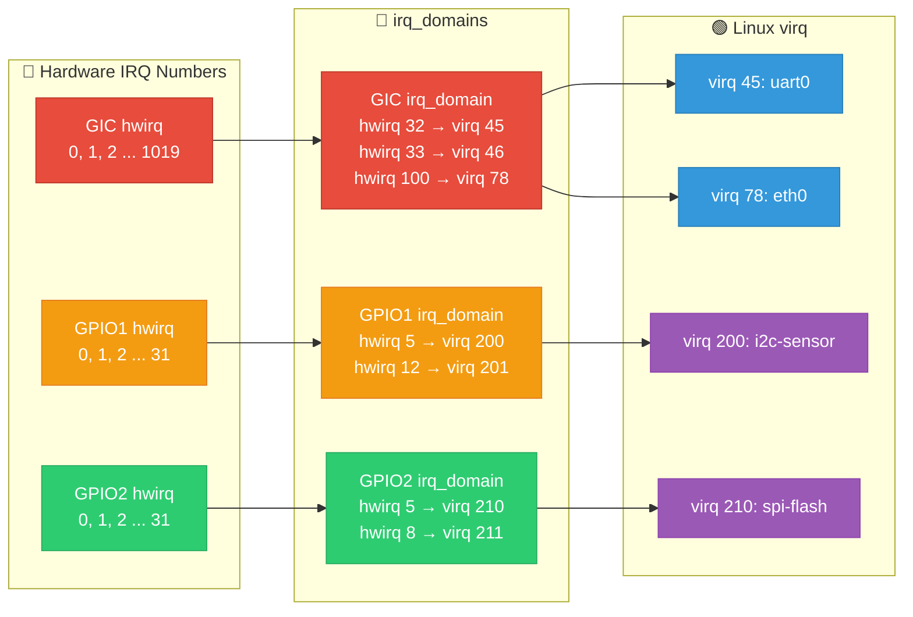
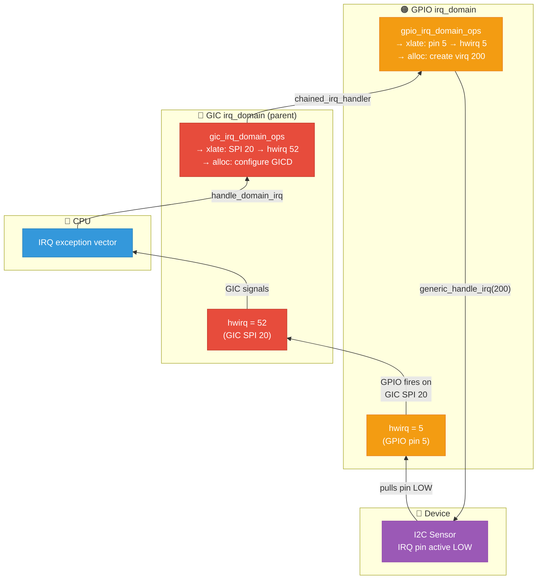
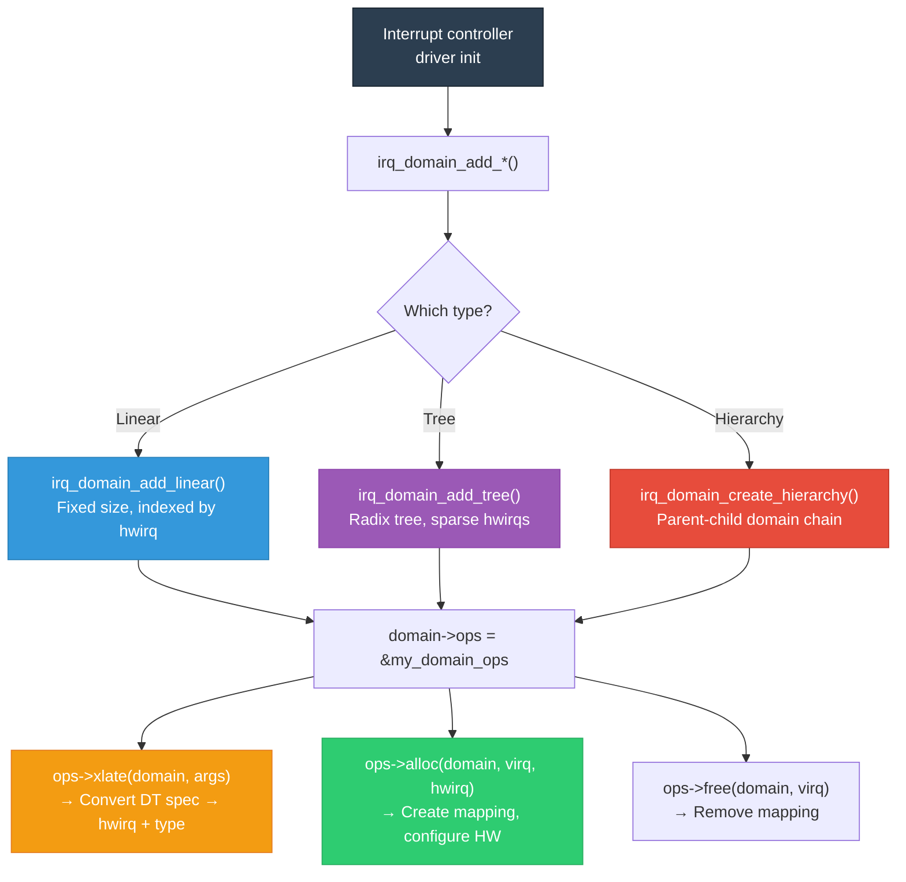

# 18 — `irq_domain` Framework

## 📌 Overview

The **`irq_domain`** framework is the kernel's mechanism for translating **hardware IRQ numbers** to **Linux virtual IRQ numbers (virq)**. Every interrupt controller in the system creates an `irq_domain` to manage its IRQ namespace.

This is essential because:
- Each controller has its own HW IRQ numbering (0, 1, 2 ...)
- Multiple controllers may use the same HW numbers
- Linux needs a **globally unique** virq for `request_irq()`

---

## 🔍 Key Concepts

| Term | Meaning |
|------|---------|
| **HW IRQ (hwirq)** | Hardware interrupt number local to a controller |
| **Linux virq** | Globally unique Linux IRQ number |
| **irq_domain** | Maps hwirq ↔ virq for one controller |
| **irq_desc** | Per-virq descriptor with handler, action chain |
| **irq_data** | Links virq, hwirq, irq_chip, and domain |
| **irq_chip** | Hardware operations: mask, unmask, ACK, EOI |
| **Hierarchy** | Domains can be stacked: GPIO → GIC |

---

## 🎨 Mermaid Diagrams

### IRQ Domain Translation



### Hierarchical IRQ Domain (Cascaded Controllers)



### irq_domain Creation Flow



---

## 💻 Code Examples

### Creating a Simple IRQ Domain

```c
#include <linux/irqdomain.h>
#include <linux/irq.h>

struct my_intc {
    void __iomem *base;
    struct irq_domain *domain;
    int nr_irqs;
};

/* Translate DT interrupt specifier to hwirq */
static int my_irq_domain_xlate(struct irq_domain *d,
                                struct device_node *controller,
                                const u32 *intspec, unsigned int intsize,
                                unsigned long *out_hwirq,
                                unsigned int *out_type)
{
    if (intsize < 2)
        return -EINVAL;
    
    *out_hwirq = intspec[0];                  /* Cell 0: IRQ number */
    *out_type = intspec[1] & IRQ_TYPE_SENSE_MASK; /* Cell 1: trigger */
    
    return 0;
}

/* Map hwirq to virq — configure the IRQ */
static int my_irq_domain_map(struct irq_domain *d,
                              unsigned int virq,
                              irq_hw_number_t hwirq)
{
    struct my_intc *intc = d->host_data;
    
    /* Set the irq_chip for this virq */
    irq_set_chip_and_handler(virq, &my_irq_chip, handle_level_irq);
    irq_set_chip_data(virq, intc);
    irq_set_noprobe(virq);
    
    return 0;
}

static const struct irq_domain_ops my_domain_ops = {
    .xlate = my_irq_domain_xlate,
    .map   = my_irq_domain_map,
};

static int my_intc_init(struct device_node *np)
{
    struct my_intc *intc;
    
    intc = kzalloc(sizeof(*intc), GFP_KERNEL);
    intc->base = of_iomap(np, 0);
    intc->nr_irqs = 32;
    
    /* Create linear domain: hwirq 0..31 → virq (auto-assigned) */
    intc->domain = irq_domain_add_linear(np, intc->nr_irqs,
                                          &my_domain_ops, intc);
    
    return 0;
}
IRQCHIP_DECLARE(my_intc, "vendor,my-intc", my_intc_init);
```

### Defining `irq_chip` Operations

```c
static void my_irq_mask(struct irq_data *d)
{
    struct my_intc *intc = irq_data_get_irq_chip_data(d);
    u32 mask = readl(intc->base + IRQ_MASK_REG);
    mask &= ~BIT(d->hwirq);
    writel(mask, intc->base + IRQ_MASK_REG);
}

static void my_irq_unmask(struct irq_data *d)
{
    struct my_intc *intc = irq_data_get_irq_chip_data(d);
    u32 mask = readl(intc->base + IRQ_MASK_REG);
    mask |= BIT(d->hwirq);
    writel(mask, intc->base + IRQ_MASK_REG);
}

static void my_irq_ack(struct irq_data *d)
{
    struct my_intc *intc = irq_data_get_irq_chip_data(d);
    writel(BIT(d->hwirq), intc->base + IRQ_CLEAR_REG);
}

static int my_irq_set_type(struct irq_data *d, unsigned int type)
{
    struct my_intc *intc = irq_data_get_irq_chip_data(d);
    u32 reg = readl(intc->base + IRQ_TYPE_REG);
    
    switch (type) {
    case IRQ_TYPE_LEVEL_HIGH:
        reg |= BIT(d->hwirq);
        irq_set_handler_locked(d, handle_level_irq);
        break;
    case IRQ_TYPE_EDGE_RISING:
        reg &= ~BIT(d->hwirq);
        irq_set_handler_locked(d, handle_edge_irq);
        break;
    default:
        return -EINVAL;
    }
    
    writel(reg, intc->base + IRQ_TYPE_REG);
    return 0;
}

static struct irq_chip my_irq_chip = {
    .name         = "my-intc",
    .irq_mask     = my_irq_mask,
    .irq_unmask   = my_irq_unmask,
    .irq_ack      = my_irq_ack,
    .irq_set_type = my_irq_set_type,
};
```

### Hierarchical Domain (GPIO Controller)

```c
/* GPIO controller as a child of GIC */
static int gpio_irq_domain_alloc(struct irq_domain *d,
                                  unsigned int virq,
                                  unsigned int nr_irqs, void *arg)
{
    struct irq_fwspec *fwspec = arg;
    irq_hw_number_t hwirq = fwspec->param[0];
    struct irq_fwspec parent_fwspec;
    int ret;
    
    /* Configure this level */
    irq_domain_set_hwirq_and_chip(d, virq, hwirq,
                                   &gpio_irq_chip, d->host_data);
    
    /* Forward to parent domain (GIC) */
    parent_fwspec.fwnode = d->parent->fwnode;
    parent_fwspec.param_count = 3;
    parent_fwspec.param[0] = GIC_SPI;
    parent_fwspec.param[1] = gpio_to_gic_irq(hwirq);  /* Map GPIO→GIC SPI */
    parent_fwspec.param[2] = IRQ_TYPE_LEVEL_HIGH;
    
    ret = irq_domain_alloc_irqs_parent(d, virq, nr_irqs, &parent_fwspec);
    return ret;
}

static const struct irq_domain_ops gpio_domain_ops = {
    .alloc = gpio_irq_domain_alloc,
    .free  = irq_domain_free_irqs_common,
    .xlate = irq_domain_xlate_twocell,
};

/* Create hierarchical domain with GIC as parent */
domain = irq_domain_create_hierarchy(gic_domain,  /* parent */
                                      0,           /* flags */
                                      32,          /* nr_irqs */
                                      fwnode,
                                      &gpio_domain_ops,
                                      gpio_data);
```

### Chained IRQ Handler (Cascaded Controller)

```c
/* Called when GIC fires the GPIO controller's consolidated IRQ */
static void gpio_chained_handler(struct irq_desc *desc)
{
    struct my_gpio *gpio = irq_desc_get_handler_data(desc);
    struct irq_chip *chip = irq_desc_get_chip(desc);
    u32 pending;
    
    chained_irq_enter(chip, desc);  /* ACK at parent (GIC) level */
    
    /* Read which GPIO pins have pending interrupts */
    pending = readl(gpio->base + GPIO_INT_STATUS);
    
    while (pending) {
        unsigned int hwirq = __ffs(pending);
        unsigned int virq = irq_find_mapping(gpio->domain, hwirq);
        
        /* Dispatch to the device driver's handler */
        generic_handle_irq(virq);
        
        pending &= ~BIT(hwirq);
    }
    
    chained_irq_exit(chip, desc);  /* EOI at parent (GIC) level */
}

/* Setup in init: */
irq_set_chained_handler_and_data(parent_irq, gpio_chained_handler, gpio);
```

---

## 🔑 Domain Types

| Type | Function | Use Case |
|------|----------|----------|
| `irq_domain_add_linear()` | O(1) lookup, array indexed by hwirq | Dense hwirq range (0..N) |
| `irq_domain_add_tree()` | Radix tree lookup | Sparse hwirq values |
| `irq_domain_create_hierarchy()` | Parent-child chain | Cascaded controllers |
| `irq_domain_add_nomap()` | hwirq == virq | Simple 1:1 mapping |

---

## 🔥 Tough Interview Questions & Deep Answers

### ❓ Q1: Why does Linux need `irq_domain`? Why not just use hardware IRQ numbers directly?

**A:** Several fundamental reasons:

1. **Namespace collision**: Two GPIO controllers each have hwirq 0-31. Without `irq_domain`, there's no way to distinguish GPIO1 pin 5 from GPIO2 pin 5. The domain gives each controller its own IRQ namespace.

2. **Dynamic assignment**: Hardware IRQ numbers are architecture/SoC-specific. Using virqs decouples drivers from hardware:
   ```c
   /* BAD: hardcoded hardware IRQ */
   request_irq(45, handler, ...);  /* Only works on one SoC */
   
   /* GOOD: dynamic virq from DT */
   int irq = platform_get_irq(pdev, 0);  /* Works on any SoC */
   request_irq(irq, handler, ...);
   ```

3. **Hierarchical routing**: When interrupts cascade (Device → GPIO → GIC → CPU), each level needs its own translation. `irq_domain` hierarchies handle this cleanly.

4. **Sparse IRQs**: Modern systems have thousands of possible interrupt sources. Using a flat array indexed by hwirq wastes memory. `irq_domain` with radix tree maps only active IRQs.

5. **Hot-pluggable controllers**: USB/PCI/PCIe can add interrupt controllers at runtime. `irq_domain` allows dynamic creation/destruction of IRQ mappings.

---

### ❓ Q2: Walk through what happens from `platform_get_irq()` to a valid Linux IRQ number.

**A:**

```c
/* Driver calls: */
int irq = platform_get_irq(pdev, 0);
```

**Internal call chain:**

```
1. platform_get_irq(pdev, 0)
   → of_irq_get(pdev->dev.of_node, 0)
   
2. of_irq_get(np, 0)
   → of_irq_parse_one(np, 0, &oirq)
      → Read 'interrupts' property from DT
      → Find interrupt-parent controller
      → oirq = {controller_np, args = {GIC_SPI, 100, IRQ_TYPE_LEVEL_HIGH}}
   
3. irq_create_fwspec_mapping(&fwspec)
   → Find irq_domain registered for this controller
      → irq_find_matching_fwnode(fwspec.fwnode)
   → domain->ops->xlate(domain, fwspec)
      → Convert: GIC_SPI 100 → hwirq = 132, type = LEVEL_HIGH
   
4. irq_domain_alloc_irqs(domain, 1, NUMA_NO_NODE, &fwspec)
   → Allocate a new virq from the IRQ number space
   → domain->ops->alloc(domain, virq, 1, &fwspec)
      → irq_domain_set_hwirq_and_chip(domain, virq, 132, &gic_chip)
      → Configure GIC: enable hwirq 132, set trigger type
      → If hierarchical: irq_domain_alloc_irqs_parent() → parent alloc
   
5. Return virq (e.g., 45)

Now: request_irq(45, handler, ...) →
     irq_desc[45] → irq_data → domain → hwirq 132 → GIC
```

---

### ❓ Q3: How does the hierarchical domain model handle an interrupt from a GPIO-connected I2C sensor?

**A:** Consider: I2C sensor → GPIO pin 5 → GIC SPI 20 → CPU

**Domain hierarchy:**
```
 [GPIO irq_domain] ← child
         |
 [GIC irq_domain]  ← parent
```

**Setup (during boot):**
```
1. GIC driver creates: gic_domain = irq_domain_add_linear(...)
2. GPIO driver creates: gpio_domain = irq_domain_create_hierarchy(gic_domain, ...)
3. GPIO registers chained handler for its own GIC IRQ (SPI 20)
```

**IRQ allocation (during sensor driver probe):**
```
1. platform_get_irq() → DT says: interrupt-parent=&gpio, interrupts=<5 ...>
2. irq_domain_alloc_irqs(gpio_domain, ...)
   → gpio_domain->ops->alloc():
     a. Configure GPIO pin 5 as interrupt input
     b. Set irq_chip = &gpio_irq_chip for this virq
     c. Call irq_domain_alloc_irqs_parent(gic_domain):
        → GIC alloc: configure SPI 20 in GIC distributor
3. Returns virq = 200
4. Sensor driver: request_irq(200, sensor_handler, ...)
```

**Runtime interrupt flow:**
```
1. Sensor pulls GPIO pin 5 LOW
2. GPIO controller asserts GIC SPI 20
3. GIC delivers IRQ to CPU
4. CPU enters IRQ exception → gic_handle_irq()
5. GIC handler reads IAR → hwirq = 52 (SPI 20 + 32)
6. generic_handle_domain_irq(gic_domain, 52)
   → Finds chained handler for this virq
7. gpio_chained_handler():
   → chained_irq_enter() (ACK at GIC level)
   → Read GPIO status register → bit 5 set
   → irq_find_mapping(gpio_domain, 5) → virq 200
   → generic_handle_irq(200)
8. sensor_handler(200, dev) runs
9. chained_irq_exit() (EOI at GIC level)
```

---

### ❓ Q4: What is the difference between `irq_domain_add_linear()` and `irq_domain_add_tree()`?

**A:**

**`irq_domain_add_linear()`:**
```c
domain = irq_domain_add_linear(np, 32, &ops, data);
```
- Creates a **fixed-size array** of `nr_irqs` entries
- Lookup: `domain->revmap[hwirq]` → O(1)
- Memory: `nr_irqs * sizeof(unsigned int)` always allocated
- **Best for**: Small, contiguous hwirq ranges (GPIO: 0-31, GIC: 0-1019)
- **Problem**: Wastes memory if hwirq range is large but sparse

**`irq_domain_add_tree()` (Deprecated in favor of hierarchy):**
```c
domain = irq_domain_add_tree(np, &ops, data);
```
- Uses a **radix tree** for hwirq → virq mapping
- Lookup: O(log n) radix tree search
- Memory: Only allocated for active mappings
- **Best for**: Sparse hwirq values (MSI: hwirqs can be 0, 100, 5000)
- **Problem**: Slower lookup, more complex code

**Modern approach (`irq_domain_create_hierarchy`):**
Most new code uses hierarchical domains which internally use the linear mapping at each level.

```c
/* Recommended for new interrupt controllers: */
domain = irq_domain_create_hierarchy(parent_domain, 0, nr_irqs,
                                      fwnode, &ops, data);
```

---

### ❓ Q5: How do MSI/MSI-X interrupts use `irq_domain`?

**A:** MSI (Message Signaled Interrupts) are PCIe interrupts that write a data value to a special memory address instead of toggling a dedicated IRQ line.

**MSI irq_domain architecture:**
```
 [Device MSI domain]
         |
 [MSI irq_domain]      ← Allocates MSI address/data pairs
         |
 [GIC ITS irq_domain]  ← Translates MSI writes to LPIs
         |  
 [GIC irq_domain]      ← Root controller
```

**How it works:**

1. **PCI driver calls `pci_alloc_irq_vectors()`**
   - Kernel requests N MSI vectors from the MSI domain

2. **MSI domain allocates:**
   ```c
   /* For each MSI vector: */
   virq = irq_domain_alloc_irqs(msi_domain, ...);
   /* Allocates a unique MSI data value + target address */
   ```

3. **GIC ITS domain:**
   - Creates an LPI (Locality-specific Peripheral Interrupt) entry
   - Programs ITS (Interrupt Translation Service) command queue
   - Maps: MSI data value → ITS DeviceID:EventID → LPI → virq

4. **PCI device configuration:**
   ```c
   /* Write MSI address + data to PCI config space */
   pci_write_msi_msg(virq, &msg);
   /* msg.address = GIC ITS translation address */
   /* msg.data = unique event ID for this interrupt */
   ```

5. **Runtime:**
   ```
   Device writes msg.data to msg.address (memory write)
   → GIC ITS receives write
   → ITS looks up DeviceID:EventID → finds LPI number
   → LPI delivered to target CPU
   → irq_domain hierarchy resolves virq
   → Driver's handler runs
   ```

**Why this matters**: MSI-X can support thousands of interrupts per device (NVMe SSDs, high-end NICs). The `irq_domain` hierarchy manages this efficiently with dynamic allocation.

---

[← Previous: 17 — NMI](17_NMI_Non_Maskable_Interrupts.md) | [Next: 19 — Interrupt Storms →](19_Interrupt_Storms_Handling.md)
