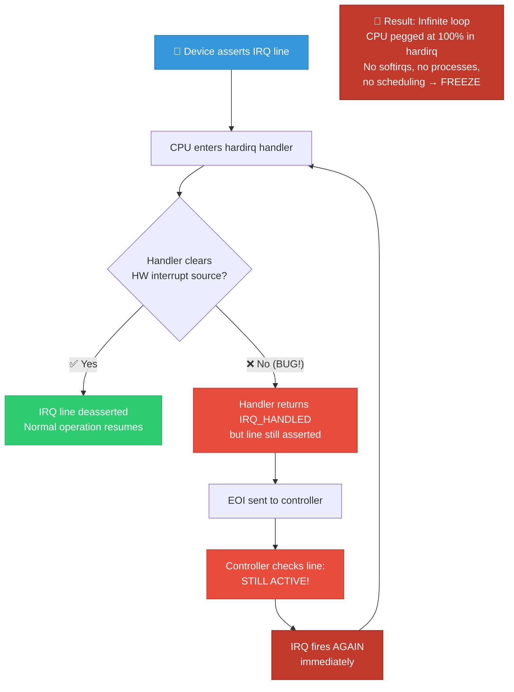
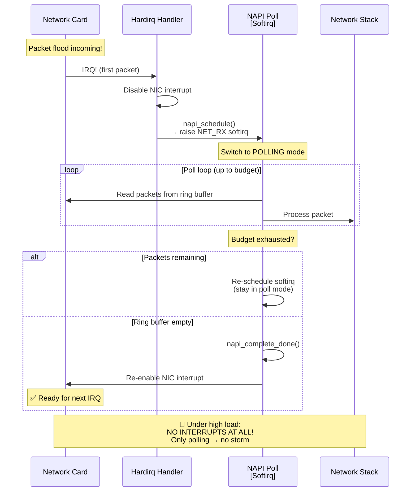
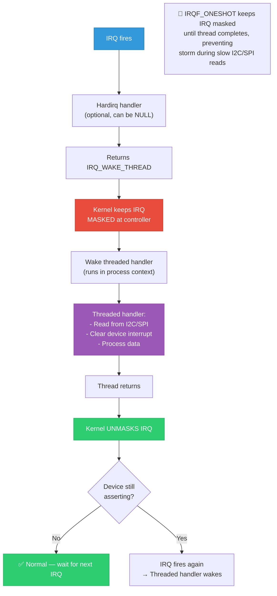

# 19 — Interrupt Storms & Handling

## 📌 Overview

An **interrupt storm** occurs when an interrupt fires at an extremely high rate, consuming all CPU time in interrupt handling and starving the rest of the system. This can freeze the system entirely since hardirq handlers have the highest priority after NMIs.

---

## 🔍 Types of Interrupt Storms

| Type | Cause | Effect |
|------|-------|--------|
| **Hardware storm** | Device stuck asserting IRQ line | 100% CPU in hardirq |
| **Software-induced** | Driver not clearing IRQ source | Re-triggers immediately |
| **Spurious storm** | No device claims the IRQ | "nobody cared" → auto-disable |
| **Livelock** | Legitimate high IRQ rate | CPU processes IRQs faster than they arrive → no user work |
| **Shared IRQ storm** | One device on shared line is broken | All handlers called repeatedly |

---

## 🎨 Mermaid Diagrams

### Interrupt Storm: Root Cause & Effect



### Linux Spurious IRQ Detection (`note_interrupt`)

```mermaid
flowchart TD
    A["IRQ handler returns"] --> B["note_interrupt()"]
    B --> C["irq_desc->irqs_unhandled++<br/>if ret == IRQ_NONE"]
    B --> D["irq_desc->irq_count++<br/>(always)"]
    
    D --> E{irq_count ><br/>100,000?}
    E -->|No| F["Continue"]
    E -->|Yes| G["Check ratio"]
    
    G --> H{irqs_unhandled > <br/>99,900?<br/>(99.9% unhandled)}
    
    H -->|Yes| I["🔴 __report_bad_irq()<br/>'irq N: nobody cared'"]
    I --> J["Disable IRQ:<br/>desc->depth++<br/>irq_disable(desc)"]
    J --> K["Print handler list<br/>and stack trace"]
    
    H -->|No| L["Reset counters<br/>Continue monitoring"]

    style A fill:#3498db,stroke:#2980b9,color:#fff
    style I fill:#e74c3c,stroke:#c0392b,color:#fff
    style J fill:#c0392b,stroke:#922b21,color:#fff
    style L fill:#2ecc71,stroke:#27ae60,color:#fff
```

### NAPI: Solving Network Interrupt Storms



### IRQF_ONESHOT: Preventing Storms with Threaded IRQs



---

## 💻 Code Examples

### Kernel Spurious IRQ Detection

```c
/* kernel/irq/spurious.c */

void note_interrupt(struct irq_desc *desc, irqreturn_t action_ret)
{
    if (action_ret == IRQ_NONE) {
        desc->irqs_unhandled++;
        /* Nobody claimed this interrupt */
    }
    
    desc->irq_count++;
    
    if (unlikely(desc->irq_count > 100000)) {
        /* Check: 99.9% unhandled? */
        if (desc->irqs_unhandled > 99900) {
            __report_bad_irq(desc, action_ret);
            
            /* Disable this IRQ forever */
            printk(KERN_ERR "Disabling IRQ #%d\n", 
                   irq_desc_get_irq(desc));
            desc->status_use_accessors |= IRQ_DISABLED;
            irq_disable(desc);
        }
        desc->irq_count = 0;
        desc->irqs_unhandled = 0;
    }
}
```

### Proper Handler: Preventing Storm

```c
/* BAD: Doesn't clear HW interrupt → STORM */
static irqreturn_t bad_handler(int irq, void *dev_id)
{
    struct my_dev *dev = dev_id;
    u32 data = readl(dev->base + DATA_REG);
    process_data(data);
    /* OOPS: forgot to clear IRQ_STATUS → line stays asserted */
    return IRQ_HANDLED;
}

/* GOOD: Properly clears HW interrupt */
static irqreturn_t good_handler(int irq, void *dev_id)
{
    struct my_dev *dev = dev_id;
    u32 status = readl(dev->base + IRQ_STATUS_REG);
    
    if (!(status & MY_IRQ_BIT))
        return IRQ_NONE;  /* Not my interrupt */
    
    /* Clear interrupt FIRST (write-1-to-clear) */
    writel(MY_IRQ_BIT, dev->base + IRQ_CLEAR_REG);
    
    /* Now safe to process */
    u32 data = readl(dev->base + DATA_REG);
    process_data(data);
    
    return IRQ_HANDLED;
}
```

### IRQF_ONESHOT with Threaded Handler

```c
/* For I2C/SPI devices: IRQ stays masked until thread finishes */
static irqreturn_t sensor_thread_fn(int irq, void *dev_id)
{
    struct sensor_dev *sensor = dev_id;
    int status, data;
    
    /* This runs in process context — can sleep for I2C */
    status = i2c_smbus_read_byte_data(sensor->client, STATUS_REG);
    if (status < 0)
        return IRQ_NONE;
    
    data = i2c_smbus_read_word_data(sensor->client, DATA_REG);
    
    /* Clear interrupt at device (via I2C) */
    i2c_smbus_write_byte_data(sensor->client, IRQ_CLEAR_REG, 0xFF);
    
    /* Process data */
    input_report_abs(sensor->input, ABS_X, data);
    input_sync(sensor->input);
    
    return IRQ_HANDLED;
    /* IRQ automatically unmasked after this returns */
}

static int sensor_probe(struct i2c_client *client)
{
    return devm_request_threaded_irq(&client->dev, client->irq,
                                     NULL,              /* No hardirq handler */
                                     sensor_thread_fn,
                                     IRQF_ONESHOT | IRQF_TRIGGER_FALLING,
                                     "my-sensor", sensor);
}
```

### NAPI: Network Storm Prevention

```c
/* Driver's hardirq handler — runs briefly */
static irqreturn_t eth_irq_handler(int irq, void *dev_id)
{
    struct eth_priv *priv = dev_id;
    
    /* Disable further interrupts from NIC */
    writel(0, priv->base + NIC_IRQ_ENABLE);
    
    /* Schedule NAPI poll */
    if (napi_schedule_prep(&priv->napi))
        __napi_schedule(&priv->napi);
    
    return IRQ_HANDLED;
}

/* NAPI poll function — runs in softirq context */
static int eth_napi_poll(struct napi_struct *napi, int budget)
{
    struct eth_priv *priv = container_of(napi, struct eth_priv, napi);
    int processed = 0;
    
    while (processed < budget) {
        struct sk_buff *skb = eth_rx_packet(priv);
        if (!skb)
            break;
        
        napi_gro_receive(napi, skb);
        processed++;
    }
    
    if (processed < budget) {
        /* All packets processed — re-enable interrupts */
        napi_complete_done(napi, processed);
        writel(1, priv->base + NIC_IRQ_ENABLE);
    }
    /* else: budget exhausted, stay in poll mode (no IRQs) */
    
    return processed;
}
```

### Monitoring & Recovery

```bash
# Detect interrupt storm in real-time
watch -n1 "awk '/^ *[0-9]/ {s=0; for(i=2;i<=NF-4;i++) s+=$i; \
    if(s>prev[$1] && (s-prev[$1])>10000) print $0; prev[$1]=s}' \
    /proc/interrupts"

# Check for disabled IRQs
dmesg | grep -i "nobody cared\|disabling irq"

# Force re-enable a disabled IRQ (dangerous!)
echo trig > /proc/irq/45/spurious  # Reset spurious counter

# Check if irqbalance is running
systemctl status irqbalance
```

---

## 🔥 Tough Interview Questions & Deep Answers

### ❓ Q1: A level-triggered interrupt causes a storm, but the handler returns `IRQ_HANDLED`. Why doesn't the kernel detect it?

**A:** The kernel's spurious IRQ detection (`note_interrupt()`) only checks for **unhandled** IRQs. It counts how many times `IRQ_NONE` is returned. If the handler returns `IRQ_HANDLED`, the kernel trusts it — the detection threshold is:

```
if (irqs_unhandled > 99,900 out of 100,000) → "nobody cared"
```

But if the handler returns `IRQ_HANDLED` every time (even though it's not actually fixing the problem):
- `irqs_unhandled = 0`
- The ratio check never triggers
- The storm continues **forever** — 100% CPU in hardirq

**Why the handler might incorrectly return `IRQ_HANDLED`:**
```c
/* Bug: reads status but doesn't clear the source */
static irqreturn_t buggy_handler(int irq, void *dev_id) {
    u32 status = readl(dev->base + IRQ_STATUS);
    if (status & MY_BIT) {
        process_data(dev);
        return IRQ_HANDLED;  /* Claimed it, but didn't clear HW! */
        /* Line stays asserted → immediate re-fire */
    }
    return IRQ_NONE;
}
```

**How to detect this type of storm:**
1. `/proc/interrupts` — watch count increasing thousands per second
2. `perf top` — shows CPU spent 100% in `irq_handler_entry`
3. `ftrace irqsoff` — shows IRQ handler running continuously

---

### ❓ Q2: How does NAPI prevent interrupt livelock in high-speed networking?

**A:** Without NAPI, every incoming packet triggers an interrupt. At 10 Gbps (~14.8M packets/sec), this means 14.8 million IRQs/sec — the CPU spends ALL time processing interrupts and can't do any actual network processing (protocol stack, userspace delivery). This is **livelock** — the system is "busy" but makes no forward progress.

**NAPI's solution — Interrupt Coalescing + Polling:**

```
Normal (low load):
  Packet → IRQ → process → IRQ → process (interrupt-driven)

High load (NAPI):
  Packet → IRQ → disable IRQs → POLL → POLL → POLL → ...
                                 (process many packets per poll call)
  
  When ring buffer empty → re-enable IRQs → wait for next packet

Extreme load:
  NO INTERRUPTS AT ALL — pure polling
  Softirq runs poll() continuously
```

**Why this prevents livelock:**
1. **Bounded work per IRQ**: NAPI `budget` limits packets per poll iteration (default 64)
2. **No per-packet IRQ overhead**: Disable NIC IRQ after first packet, process batch
3. **Backpressure**: If budget exhausted, softirq yields CPU → other work can run
4. **Adaptive**: At low load, operates in interrupt mode (low latency). At high load, switches to poll mode (high throughput).

**GRO (Generic Receive Offload)** further helps by merging small packets into larger ones in NAPI poll, reducing per-packet processing cost.

---

### ❓ Q3: Explain `IRQF_ONESHOT` — when is it required and what problem does it solve?

**A:** `IRQF_ONESHOT` means "keep the IRQ **masked** at the interrupt controller until the threaded handler finishes."

**Without IRQF_ONESHOT (problem):**
```
1. Level-triggered IRQ fires (line asserted)
2. Hardirq handler runs → returns IRQ_WAKE_THREAD
3. IRQ is UNMASKED immediately (default behavior)
4. But the device is STILL asserting the line!
5. IRQ fires AGAIN before thread runs → hardirq handler called again
6. IRQ fires AGAIN → hardirq handler → ... (STORM!)
```

**With IRQF_ONESHOT (solution):**
```
1. Level-triggered IRQ fires (line asserted)
2. Hardirq handler runs → returns IRQ_WAKE_THREAD
3. IRQ stays MASKED (IRQF_ONESHOT keeps it masked)
4. Threaded handler runs in process context
5. Thread reads I2C/SPI status → clears device interrupt
6. Thread returns → kernel UNMASKS IRQ
7. Line is now deasserted → no re-fire ✅
```

**When IRQF_ONESHOT is REQUIRED:**
- I2C/SPI devices where clearing the interrupt requires bus transactions (milliseconds, must sleep)
- Any level-triggered IRQ with a threaded handler and no hardirq handler (`NULL` primary)
- The kernel enforces this: if you pass `NULL` as the primary handler with a threaded handler, you MUST use `IRQF_ONESHOT` — otherwise `request_threaded_irq()` returns `-EINVAL`

```c
/* This FAILS: */
request_threaded_irq(irq, NULL, thread_fn, 0, "dev", dev);
/* Returns -EINVAL: "Threaded irq requested with handler=NULL and !ONESHOT" */

/* This WORKS: */
request_threaded_irq(irq, NULL, thread_fn, IRQF_ONESHOT, "dev", dev);
```

---

### ❓ Q4: A shared IRQ line has 3 devices. Device B is broken and constantly asserts. What happens?

**A:**

**Scenario:**
```
IRQ 45: Device_A_handler → Device_B_handler → Device_C_handler
Device B hardware is broken → always asserting the shared line
```

**What happens:**
```
1. Line asserted (Device B broken) → IRQ fires
2. Device_A_handler: reads status → not my IRQ → returns IRQ_NONE
3. Device_B_handler: reads status → device stuck, can't clear → returns IRQ_HANDLED
   (or returns IRQ_NONE if it doesn't recognize the status)
4. Device_C_handler: reads status → not my IRQ → returns IRQ_NONE
5. EOI → line still asserted → IRQ fires again immediately
6. Goto step 1 → STORM
```

**Kernel's response depends on return values:**

**Case 1: Device B's handler returns `IRQ_HANDLED` (incorrectly)**
- `note_interrupt()` sees at least one `IRQ_HANDLED` per invocation
- Spurious detection does NOT trigger
- Storm continues forever → system freeze

**Case 2: Device B's handler returns `IRQ_NONE`**
- All handlers return `IRQ_NONE`
- After 100,000 IRQs with 99.9% `IRQ_NONE` → "nobody cared"
- Kernel **disables IRQ 45 entirely**
- **Collateral damage**: Devices A and C also lose their interrupt!

**How to handle this in practice:**
1. Each driver should have a **timeout mechanism** (polling fallback)
2. Use MSI/MSI-X instead of shared IRQs where possible
3. For broken hardware: use `IRQF_ONESHOT + threaded` to rate-limit the storm
4. Debug via: `cat /proc/irq/45/actions` to identify all drivers on the line

---

### ❓ Q5: How would you implement rate-limiting for an interrupt that legitimately fires very frequently?

**A:** Several strategies:

**1. Hardware Interrupt Coalescing:**
```c
/* Configure the device to batch interrupts */
writel(50, dev->base + IRQ_COALESCE_COUNT);  /* Fire after 50 events */
writel(100, dev->base + IRQ_COALESCE_TIMER); /* Or after 100μs */
/* Only ONE interrupt per 50 events or 100μs, whichever comes first */
```

**2. NAPI-style Polling (for any device, not just network):**
```c
static irqreturn_t my_handler(int irq, void *dev_id) {
    struct my_dev *dev = dev_id;
    
    /* Disable device interrupt */
    writel(0, dev->base + IRQ_ENABLE);
    
    /* Schedule work to drain data */
    schedule_work(&dev->poll_work);
    
    return IRQ_HANDLED;
}

static void my_poll_work(struct work_struct *work) {
    struct my_dev *dev = container_of(work, struct my_dev, poll_work);
    
    /* Process all pending data */
    while (data_available(dev))
        process_one(dev);
    
    /* Re-enable interrupt */
    writel(1, dev->base + IRQ_ENABLE);
}
```

**3. Threaded IRQ with IRQF_ONESHOT:**
```c
/* Natural rate limit: IRQ stays masked until thread completes */
devm_request_threaded_irq(dev, irq, NULL, thread_fn,
                          IRQF_ONESHOT, "mydev", data);
/* Max rate = 1 / thread_execution_time */
```

**4. Software rate limiting in handler:**
```c
static irqreturn_t rate_limited_handler(int irq, void *dev_id) {
    struct my_dev *dev = dev_id;
    ktime_t now = ktime_get();
    
    if (ktime_before(now, dev->next_allowed)) {
        /* Too soon — just clear and ignore */
        writel(0xFF, dev->base + IRQ_CLEAR);
        return IRQ_HANDLED;
    }
    
    dev->next_allowed = ktime_add_us(now, 1000); /* Min 1ms between */
    process_interrupt(dev);
    
    return IRQ_HANDLED;
}
```

**Best practice**: Hardware coalescing is always preferred. If not available, use NAPI-style disable+poll. Software rate limiting in the handler should be a last resort.

---

[← Previous: 18 — irq_domain Framework](18_irq_domain_Framework.md) | [Next: 20 — Full Interrupt Flow →](20_Full_Interrupt_Flow_ARM_x86.md)
