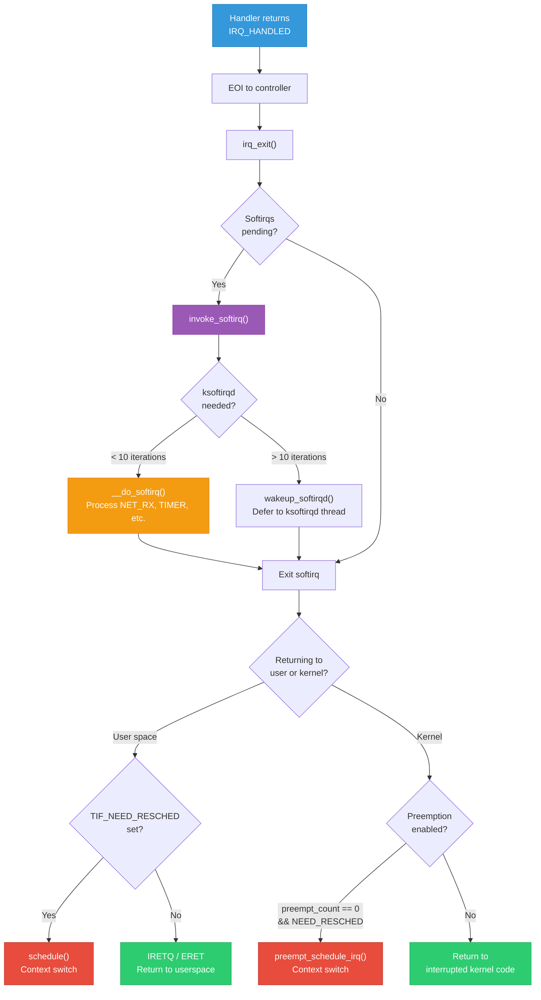
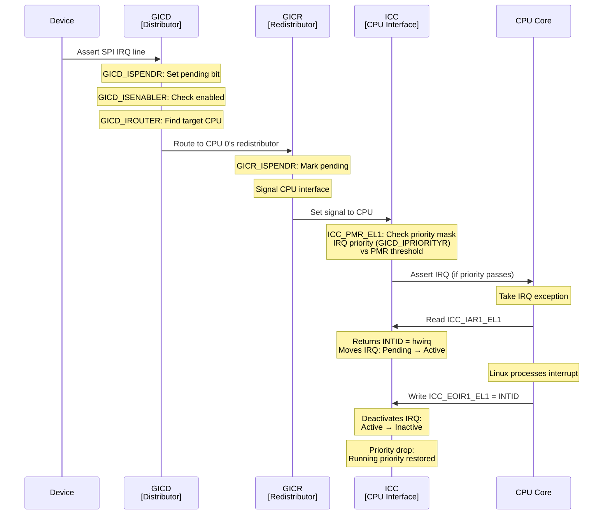

# 20 — Full Interrupt Flow: ARM64 & x86 End-to-End

## 📌 Overview

This document traces the **complete lifecycle of an interrupt** from the moment a hardware device asserts its IRQ line through to the driver's handler executing and returning — on both **ARM64 (GICv3)** and **x86_64 (APIC + IDT)** architectures.

---

## 🔍 Architecture Comparison

| Step | ARM64 (GICv3) | x86_64 (APIC) |
|------|--------------|----------------|
| **Signal source** | SPI/PPI/LPI via GIC | Pin (IO-APIC) or MSI write |
| **Controller** | GIC Distributor + Redistributor + CPU Interface | IO-APIC + Local APIC |
| **Priority system** | 8-bit priority (0x00=highest) | 256 vectors, priority = vector/16 |
| **Exception entry** | IRQ vector (EL1 → `vectors`) | IDT entry (`idt_table[vector]`) |
| **Context save** | `kernel_entry` macro | `PUSH_REGS` macro |
| **Read pending** | `ICC_IAR1_EL1` (Interrupt ACK Register) | Read APIC ISR / get vector |
| **Dispatch** | `generic_handle_domain_irq()` | `generic_handle_irq()` via vector |
| **EOI** | Write `ICC_EOIR1_EL1` | Write APIC EOI register |
| **Context restore** | `kernel_exit` macro | `POP_REGS` + `iret` |

---

## 🎨 Mermaid Diagrams

### Complete ARM64 Interrupt Flow

```mermaid
flowchart TD
    subgraph HW["🔧 Hardware"]
        DEV["Device asserts IRQ line<br/>(e.g., UART TX complete)"]
        SPI["GIC: SPI (Shared)<br/>hwirq = 132"]
    end
    
    subgraph GIC["🔴 GIC v3"]
        DIST["Distributor (GICD)<br/>1. Check: IRQ enabled? ✅<br/>2. Check: IRQ masked? ❌<br/>3. Route to target CPU"]
        REDIST["Redistributor (GICR)<br/>1. Check CPU affinity<br/>2. Set pending bit<br/>3. Signal CPU interface"]
        CPUIF["CPU Interface (ICC)<br/>1. Check priority vs PMR<br/>2. Signal IRQ to CPU core"]
    end
    
    subgraph CPU["🔵 CPU Core"]
        EXC["CPU takes IRQ exception<br/>PSTATE.I set (mask IRQs)<br/>ELR_EL1 = return address<br/>SPSR_EL1 = saved PSTATE"]
        VEC["Vector table entry:<br/>el1h_64_irq (if from EL1)<br/>el0_64_irq (if from EL0)"]
    end
    
    subgraph Kernel["🟢 Linux Kernel"]
        ENTRY["kernel_entry macro<br/>Save all registers to pt_regs<br/>on kernel stack"]
        IAR["Read ICC_IAR1_EL1<br/>→ hwirq = 132<br/>(also ACKs the IRQ)"]
        DOMAIN["handle_domain_irq()<br/>→ irq_find_mapping(domain, 132)<br/>→ virq = 45"]
        DESC["irq_desc[45]<br/>→ handle_fasteoi_irq()"]
        CHAIN["Call action chain:<br/>1. action->handler(45, dev_id)<br/>2. If IRQ_WAKE_THREAD → wake"]
        EOI["Write ICC_EOIR1_EL1<br/>= 132 (End of Interrupt)"]
        EXIT["kernel_exit macro<br/>Restore pt_regs<br/>ERET → return to code"]
    end
    
    DEV --> SPI --> DIST --> REDIST --> CPUIF
    CPUIF --> EXC --> VEC
    VEC --> ENTRY --> IAR --> DOMAIN --> DESC --> CHAIN
    CHAIN --> EOI --> EXIT

    style DEV fill:#2c3e50,stroke:#1a252f,color:#fff
    style SPI fill:#e74c3c,stroke:#c0392b,color:#fff
    style DIST fill:#e74c3c,stroke:#c0392b,color:#fff
    style REDIST fill:#c0392b,stroke:#922b21,color:#fff
    style CPUIF fill:#c0392b,stroke:#922b21,color:#fff
    style EXC fill:#3498db,stroke:#2980b9,color:#fff
    style VEC fill:#3498db,stroke:#2980b9,color:#fff
    style ENTRY fill:#2ecc71,stroke:#27ae60,color:#fff
    style IAR fill:#f39c12,stroke:#e67e22,color:#fff
    style DOMAIN fill:#9b59b6,stroke:#8e44ad,color:#fff
    style CHAIN fill:#f1c40f,stroke:#f39c12,color:#000
    style EOI fill:#e74c3c,stroke:#c0392b,color:#fff
    style EXIT fill:#2ecc71,stroke:#27ae60,color:#fff
```



### Complete x86_64 Interrupt Flow

```mermaid
flowchart TD
    subgraph HW["🔧 Hardware"]
        DEV["Device asserts IRQ<br/>(e.g., NIC RX complete)"]
        PIN["IO-APIC: Pin → Vector mapping<br/>or MSI write to LAPIC address"]
    end
    
    subgraph APIC["🔴 APIC"]
        IOAPIC["IO-APIC:<br/>1. Receive pin assertion<br/>2. Look up redirection entry<br/>3. Send message to LAPIC"]
        LAPIC["Local APIC:<br/>1. Set bit in IRR<br/>2. Compare priority vs PPR<br/>3. Deliver to CPU<br/>4. Move IRR → ISR"]
    end
    
    subgraph CPU["🔵 CPU"]
        INTR["CPU: INTR pin asserted<br/>IF flag in RFLAGS checked<br/>(IF=1 → accept interrupt)"]
        IDT["Read IDT entry for vector<br/>IDT[vector] → gate descriptor<br/>→ handler address"]
        STACK["CPU hardware push:<br/>SS, RSP, RFLAGS, CS, RIP<br/>(IST stack if configured)"]
    end
    
    subgraph Kernel["🟢 Linux Kernel"]
        ASM["asm_common_interrupt<br/>→ PUSH_REGS (save all GPRs)<br/>→ call common_interrupt()"]
        COMMON["common_interrupt(regs)<br/>→ irq_enter_rcu()<br/>→ handle_irq(desc)"]
        HANDLE["irq_desc[vector]<br/>→ handle_fasteoi_irq()<br/>or handle_edge_irq()"]
        ACTION["action->handler(irq, dev_id)<br/>→ Driver handler runs"]
        EOIX["apic_eoi()<br/>Write to LAPIC EOI register"]
        RET["irq_exit_rcu()<br/>→ Process softirqs if needed<br/>→ POP_REGS<br/>→ IRETQ"]
    end
    
    DEV --> PIN -->|"Physical pin\nor MSI write"| IOAPIC --> LAPIC
    LAPIC --> INTR --> IDT --> STACK
    STACK --> ASM --> COMMON --> HANDLE --> ACTION
    ACTION --> EOIX --> RET

    style DEV fill:#2c3e50,stroke:#1a252f,color:#fff
    style PIN fill:#e74c3c,stroke:#c0392b,color:#fff
    style IOAPIC fill:#e74c3c,stroke:#c0392b,color:#fff
    style LAPIC fill:#c0392b,stroke:#922b21,color:#fff
    style INTR fill:#3498db,stroke:#2980b9,color:#fff
    style IDT fill:#3498db,stroke:#2980b9,color:#fff
    style STACK fill:#3498db,stroke:#2980b9,color:#fff
    style ASM fill:#2ecc71,stroke:#27ae60,color:#fff
    style COMMON fill:#f39c12,stroke:#e67e22,color:#fff
    style HANDLE fill:#9b59b6,stroke:#8e44ad,color:#fff
    style ACTION fill:#f1c40f,stroke:#f39c12,color:#000
    style EOIX fill:#e74c3c,stroke:#c0392b,color:#fff
    style RET fill:#2ecc71,stroke:#27ae60,color:#fff
```



### IRQ Return Path: Softirq + Preemption Decision



### GICv3 Detailed Register Flow



---

## 💻 Code Walkthrough

### ARM64: Exception Entry (`arch/arm64/kernel/entry.S`)

```c
/* ARM64 vector table — arch/arm64/kernel/entry.S */
.align 11
SYM_CODE_START(vectors)
    /* EL1h (kernel mode, using SP_EL1) */
    kernel_ventry  1, h, 64, sync       // Synchronous
    kernel_ventry  1, h, 64, irq        // IRQ ← THIS IS THE ENTRY
    kernel_ventry  1, h, 64, fiq        // FIQ
    kernel_ventry  1, h, 64, error      // SError
    
    /* EL0 (user mode) */
    kernel_ventry  0, t, 64, sync
    kernel_ventry  0, t, 64, irq        // IRQ from user mode
    ...
SYM_CODE_END(vectors)

/* el1h_64_irq handler (simplified) */
el1h_64_irq:
    kernel_entry 1          // Save pt_regs on stack
    el1_interrupt_handler   // Call C handler
    kernel_exit 1           // Restore pt_regs, ERET
```

### ARM64: C Interrupt Handler

```c
/* arch/arm64/kernel/irq.c */
static void __el1_irq(struct pt_regs *regs)
{
    /* Enter IRQ context (increment preempt_count) */
    irq_enter_rcu();
    
    /* Call GIC handler — reads IAR, dispatches */
    do_interrupt_handler(regs, handle_arch_irq);
    /* handle_arch_irq = gic_handle_irq (set during GIC init) */
    
    /* Exit IRQ context — process softirqs */
    irq_exit_rcu();
}

/* drivers/irqchip/irq-gic-v3.c */
static void __exception_irq_entry gic_handle_irq(struct pt_regs *regs)
{
    u32 irqnr;
    
    irqnr = gic_read_iar();  /* read ICC_IAR1_EL1 → hwirq */
    
    if (likely(irqnr > 15 && irqnr < 1020)) {
        /* SPI or PPI */
        if (generic_handle_domain_irq(gic_data.domain, irqnr))
            WARN_ONCE(true, "Unexpected hwirq %d\n", irqnr);
        return;
    }
    if (irqnr < 16) {
        /* SGI (IPI) */
        gic_handle_irq_ipi(irqnr, regs);
        return;
    }
}
```

### x86_64: IDT Entry

```c
/* arch/x86/kernel/idt.c — IDT setup */
/* Each external interrupt vector gets an entry */
DEFINE_IDTENTRY_IRQ(common_interrupt)
{
    struct pt_regs *old_regs = set_irq_regs(regs);
    struct irq_desc *desc;
    
    /* RCU: validate we're in IRQ context */
    RCU_LOCKDEP_WARN(!rcu_is_watching(), "IRQ not in RCU");
    
    desc = __this_cpu_read(vector_irq[vector]);
    if (likely(!IS_ERR_OR_NULL(desc))) {
        handle_irq(desc, regs);
    } else {
        ack_APIC_irq();  /* Must ACK even for spurious */
    }
    
    set_irq_regs(old_regs);
}

/* The actual dispatch */
static void handle_irq(struct irq_desc *desc, struct pt_regs *regs)
{
    /* desc->handle_irq is set during IRQ setup:
     * - handle_fasteoi_irq for most APIC interrupts
     * - handle_edge_irq for edge-triggered  
     */
    desc->handle_irq(desc);
}
```

### `handle_fasteoi_irq()`: The Common Handler

```c
/* kernel/irq/chip.c — used by both GIC and APIC */
void handle_fasteoi_irq(struct irq_desc *desc)
{
    struct irq_chip *chip = desc->irq_data.chip;
    
    raw_spin_lock(&desc->lock);
    
    if (!irq_may_run(desc))
        goto out;
    
    desc->istate &= ~(IRQS_REPLAY | IRQS_WAITING);
    
    if (unlikely(!desc->action || irqd_irq_disabled(&desc->irq_data))) {
        desc->istate |= IRQS_PENDING;
        goto out;
    }
    
    kstat_incr_irqs_this_cpu(desc);
    
    /* Call ALL handlers in the action chain */
    handle_irq_event(desc);
    /*  → action->handler(irq, dev_id) for each action
     *  → if IRQ_WAKE_THREAD → wake irq_thread  */
    
out:
    /* Send EOI to chip (GIC: write EOIR, APIC: write EOI) */
    chip->irq_eoi(&desc->irq_data);
    
    raw_spin_unlock(&desc->lock);
}
```

### `handle_irq_event()`: Running the Action Chain

```c
/* kernel/irq/handle.c */
irqreturn_t handle_irq_event_percpu(struct irq_desc *desc)
{
    struct irqaction *action;
    irqreturn_t retval = IRQ_NONE;
    
    /* Walk the handler chain (shared IRQs have multiple actions) */
    for_each_action_of_desc(desc, action) {
        irqreturn_t res;
        
        /* Call the actual driver handler */
        res = action->handler(action->irq, action->dev_id);
        
        switch (res) {
        case IRQ_WAKE_THREAD:
            /* Wake up the threaded handler */
            irq_wake_thread(desc, action);
            break;
        case IRQ_HANDLED:
            break;
        case IRQ_NONE:
            break;
        }
        
        retval |= res;
    }
    
    /* Track for spurious detection */
    note_interrupt(desc, retval);
    
    return retval;
}
```

---

## 🔑 Timing Breakdown

```
┌────────────────────────────────────────────────────────────────┐
│                Complete Interrupt Timeline                      │
├──────────┬─────────────────────────────────────────────────────┤
│ T+0ns    │ Device asserts IRQ line                             │
│ T+10ns   │ GIC/APIC detects signal                            │
│ T+50ns   │ Controller routes to target CPU                     │
│ T+100ns  │ CPU exception taken, PSTATE/RFLAGS saved           │
│ T+150ns  │ Vector table/IDT entry point reached               │
│ T+300ns  │ pt_regs saved on stack                              │
│ T+400ns  │ IAR/vector read — IRQ acknowledged                 │
│ T+500ns  │ irq_domain lookup: hwirq → virq                   │
│ T+600ns  │ irq_desc found, flow handler called                │
│ T+700ns  │ Driver handler starts executing                     │
│ T+???    │ Driver handler completes (varies widely)           │
│ T+???+50 │ EOI written to controller                          │
│ T+???+100│ Softirqs processed (if pending)                    │
│ T+???+200│ Preemption check, possible schedule()              │
│ T+???+300│ ERET/IRETQ — return to interrupted code            │
└──────────┴─────────────────────────────────────────────────────┘

Typical handler-only latencies:
  Simple status clear:  200-500ns
  DMA completion:       500-1000ns
  Network (NAPI):       1-5μs
  Storage (block):      2-10μs
```

---

## 🔥 Tough Interview Questions & Deep Answers

### ❓ Q1: Trace the complete path of an interrupt on ARM64 from device assertion to driver handler and back, naming every key function.

**A:**

```
1. HARDWARE: Device asserts SPI line → GIC GICD detects
2. GIC GICD: GICD_ISPENDR → set pending, check GICD_ISENABLER, route via GICD_IROUTER
3. GIC GICR: Receive from GICD, mark pending, signal ICC
4. GIC ICC: Compare priority (GICD_IPRIORITYR) vs ICC_PMR_EL1 → passes → signal CPU

5. CPU: IRQ exception, save PSTATE → SPSR_EL1, PC → ELR_EL1
6. arch/arm64/kernel/entry.S: vectors → el1h_64_irq (or el0_64_irq)
7. kernel_entry: Save x0-x30, sp, pc to pt_regs on stack

8. arch/arm64/kernel/irq.c: __el1_irq(regs)
   → irq_enter_rcu(): preempt_count += HARDIRQ_OFFSET
   → handle_arch_irq(regs) = gic_handle_irq()

9. drivers/irqchip/irq-gic-v3.c: gic_handle_irq(regs)
   → gic_read_iar(): read ICC_IAR1_EL1 → hwirq (ACKs the IRQ)
   → generic_handle_domain_irq(gic_data.domain, hwirq)

10. kernel/irq/irqdesc.c: generic_handle_domain_irq()
    → irq_resolve_mapping(domain, hwirq) → virq
    → generic_handle_irq_desc(desc)

11. kernel/irq/chip.c: handle_fasteoi_irq(desc)
    → handle_irq_event(desc)

12. kernel/irq/handle.c: handle_irq_event_percpu(desc)
    → action->handler(irq, dev_id) → YOUR DRIVER HANDLER
    → note_interrupt(desc, ret) → spurious tracking

13. handle_fasteoi_irq: chip->irq_eoi() 
    → gic_eoi_irq() → write ICC_EOIR1_EL1

14. gic_handle_irq returns → irq_exit_rcu()
    → preempt_count -= HARDIRQ_OFFSET
    → invoke_softirq() if pending

15. arch/arm64/kernel/entry.S: kernel_exit
    → Restore pt_regs
    → ERET: Restore PSTATE from SPSR_EL1, jump to ELR_EL1
```

---

### ❓ Q2: What's the difference between `IRETQ` (x86) and `ERET` (ARM64) in the interrupt return path?

**A:**

**`ERET` (ARM64 — Exception Return)**:
```
1. Restores PSTATE from SPSR_EL1 (includes IRQ mask, execution state)
2. Jumps to address in ELR_EL1 (Exception Link Register)
3. If returning to EL0 → switches exception level
4. Single instruction — atomic (no window for interrupts)
5. ARM64 does NOT do automatic stack switch — kernel manages SP manually
```

**`IRETQ` (x86_64 — Interrupt Return)**:
```
1. Pops from stack: RIP, CS, RFLAGS, RSP, SS (in that order)
2. Restores RIP (return address) and RFLAGS (including IF flag)
3. If CS indicates user mode → switches privilege level
4. Stack switch: loads RSP from stack (returns to user stack)
5. Complex micro-op — multiple memory accesses inherently
```

**Key differences:**

| Aspect | ERET (ARM64) | IRETQ (x86_64) |
|--------|-------------|----------------|
| Saved state | SPSR_EL1 + ELR_EL1 (registers) | Stack (RIP, CS, RFLAGS, RSP, SS) |
| Stack switch | Manual (software) | Automatic (HW on privilege change) |
| IRQ window | None — atomic | Possible — can take IRQ between pops |
| Speed | ~1-2 cycles | ~20+ cycles (micro-ops) |
| IST equivalent | SP_EL1 per exception level | IST (Interrupt Stack Table) |

---

### ❓ Q3: Why does the kernel call `irq_enter()` before and `irq_exit()` after the interrupt handler? What would break without them?

**A:**

**`irq_enter()` sets up IRQ context:**
```c
void irq_enter(void) {
    preempt_count_add(HARDIRQ_OFFSET);  /* Mark: we're in hardirq */
    /* Now in_irq() == true, in_hardirq() == true */
    
    tick_irq_enter();  /* Update time accounting */
    account_irq_enter_time(current);
}
```

**`irq_exit()` tears down and processes deferred work:**
```c
void irq_exit(void) {
    account_irq_exit_time(current);
    preempt_count_sub(HARDIRQ_OFFSET);
    
    /* CRITICAL: process softirqs while preempt_count is right */
    if (!in_interrupt() && local_softirq_pending())
        invoke_softirq();
    
    tick_irq_exit();
}
```

**What breaks without them:**

1. **`in_irq()` detection fails**: Code that checks `in_irq()` to decide behavior (e.g., `GFP_ATOMIC` vs `GFP_KERNEL`) gets wrong answers → kernel may try to allocate with `GFP_KERNEL` in IRQ context → sleeping in atomic → crash.

2. **Preemption goes wrong**: Without `HARDIRQ_OFFSET`, the preemption counter doesn't know we're in hardirq. If preemption is enabled, `schedule()` could be called inside the handler → catastrophic stack corruption.

3. **Softirqs never run**: Softirqs are processed in `irq_exit()`. Without it, `NET_RX`, `TIMER`, `TASKLET` would never execute from the IRQ return path → network and timers stop working until `ksoftirqd` runs.

4. **Time accounting breaks**: `irq_enter/exit` track how long is spent in IRQ handling. Without it, `top` shows wrong `%si`/`%hi` values, and CPU accounting becomes inaccurate.

5. **RCU confusion**: RCU tracks execution contexts. Without proper IRQ enter/exit, RCU grace periods can't be detected correctly → potential use-after-free in RCU-protected structures.

---

### ❓ Q4: Compare how GICv3 and x86 APIC handle interrupt priority and preemption of lower-priority interrupts.

**A:**

**GICv3 Priority:**
```
- 8-bit priority field (GICD_IPRIORITYR): 0x00 (highest) to 0xFF (lowest)
- ICC_PMR_EL1 (Priority Mask): only IRQs with priority < PMR are delivered
- Running priority: ICC_RPR_EL1 — tracks current highest active IRQ
- Preemption: Higher-priority IRQ CAN preempt lower-priority handler
  (if ICC_BPR1_EL1 group priority bits differ)
- Group priority: top N bits of priority (N set by BPR)
  → Only different GROUP priorities preempt
  → Same group queued but not preempted

Example:
  IRQ A: priority 0x20 (high) — running
  IRQ B: priority 0x80 (low) — pending, waits
  IRQ C: priority 0x10 (higher) — PREEMPTS handler A
```

**x86 APIC Priority:**
```
- 256 vectors, priority = vector / 16 (16 priority classes)
- TPR (Task Priority Register): suppresses lower-priority interrupts
- PPR (Processor Priority Register): max(TPR, ISR highest active)
- Preemption: Higher vector number ALWAYS preempts lower
  → No group concept — any higher vector preempts

Example:
  Vector 0x50 handler running (priority class 5)
  Vector 0x80 arrives (priority class 8) → PREEMPTS
  Vector 0x40 arrives (priority class 4) → queued, waits

Linux reality: Linux doesn't use this! All external interrupts
run at same effective priority. IRQ handlers always run with
local IRQs disabled → no nesting.
```

**Key difference in Linux:**
```
ARM64 + GICv3: Linux typically disables nesting via PMR masking
               But pseudo-NMI uses priority to bypass masking

x86 + APIC:   Linux runs all hardirq handlers with IF=0
              (interrupts disabled) → no nesting at all
              TPR not actively used for priority management
```

---

### ❓ Q5: Walk through what happens when an interrupt arrives while the CPU is executing a userspace application on ARM64.

**A:**

```
T0: CPU running user process (EL0, PSTATE.I=0)
    Register state: x0-x30 = user values
    SP = SP_EL0 (user stack)
    PC = 0x00400100 (user code address)

T1: Device asserts IRQ → GIC delivers → CPU takes exception

T2: CPU HARDWARE (automatic):
    - SPSR_EL1 = current PSTATE (saves user mode state)
    - ELR_EL1 = 0x00400100 (user PC at interruption)
    - PSTATE.I = 1 (mask IRQs — prevent nested IRQs)  
    - PSTATE.EL = EL1 (switch to kernel mode)
    - SP = SP_EL1 (switch to kernel stack for this task)
    - PC = vectors + 0x480 (el0_64_irq entry in vector table)

T3: el0_64_irq (entry.S):
    - kernel_entry 0:
      → Save all GPRs (x0-x30) to pt_regs on kernel stack
      → Save SP_EL0, ELR_EL1, SPSR_EL1 to pt_regs
      → Now kernel has full user context saved
    
    - Call el0_interrupt() → __el0_irq()

T4: irq_enter_rcu():
    - preempt_count += HARDIRQ_OFFSET
    - ctx_tracking: mark transition user→kernel

T5: gic_handle_irq():
    - Read ICC_IAR1_EL1 → hwirq (ACK)
    - generic_handle_domain_irq() → driver handler

T6: Driver handler executes

T7: gic_eoi_irq() → write ICC_EOIR1_EL1

T8: irq_exit_rcu():
    - preempt_count -= HARDIRQ_OFFSET
    - Check softirq: process if pending
    - Check TIF_NEED_RESCHED: if set → schedule()

T9: ret_to_user (entry.S):
    - Check TIF_SIGPENDING: deliver pending signals
    - Check TIF_NEED_RESCHED: call schedule() if set
      → This is where context switch happens!
      → If higher-priority task ready → switch to it
      → Current user process saved (pt_regs already on stack)

T10: kernel_exit 0:
    - Restore x0-x30 from pt_regs
    - Restore SP_EL0 (user stack pointer)
    - ERET:
      → Restore PSTATE from SPSR_EL1 (including EL0)
      → PC = ELR_EL1 = 0x00400100
      → Now back in user mode, at exact point of interruption
    
T11: User process continues at 0x00400100 as if nothing happened
```

**Total time**: ~2-10μs for a simple handler, plus any scheduling time.

---

## 📚 Summary: Complete Interrupt Journey

```
DEVICE → GIC/APIC → CPU Exception → Save Context → ACK Interrupt
  → Find irq_domain → Map hwirq → virq → irq_desc → Flow Handler
  → Driver Handler(s) → EOI → Softirqs → Preemption Check → Return

Every single interrupt in Linux follows this path.
Understanding it end-to-end is what separates a kernel developer from a user.
```

---

[← Previous: 19 — Interrupt Storms](19_Interrupt_Storms_Handling.md) | [Back to Index →](ReadMe.Md)
