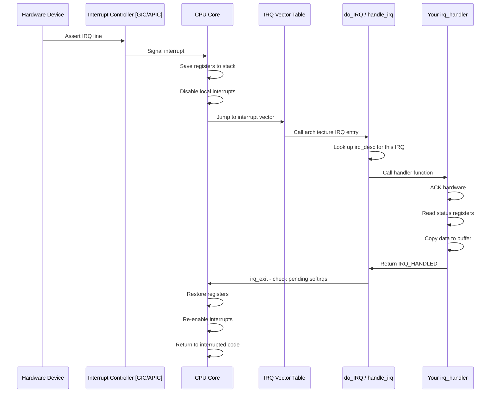
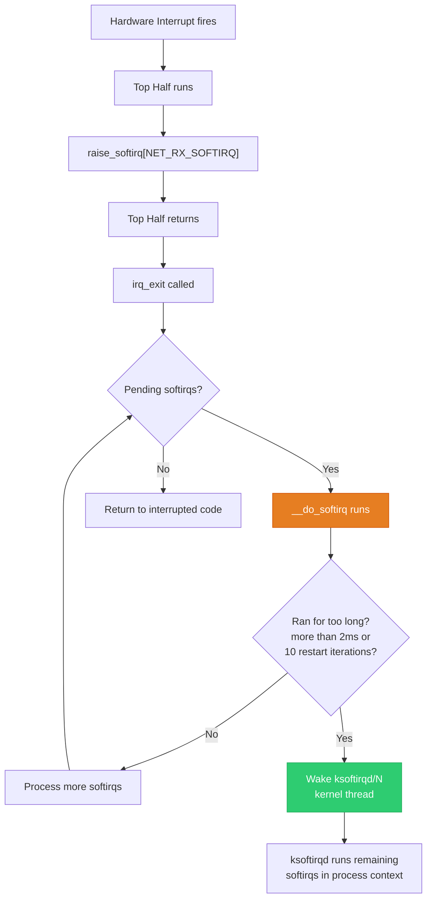
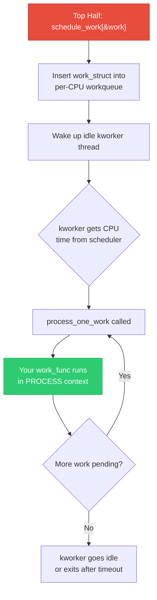
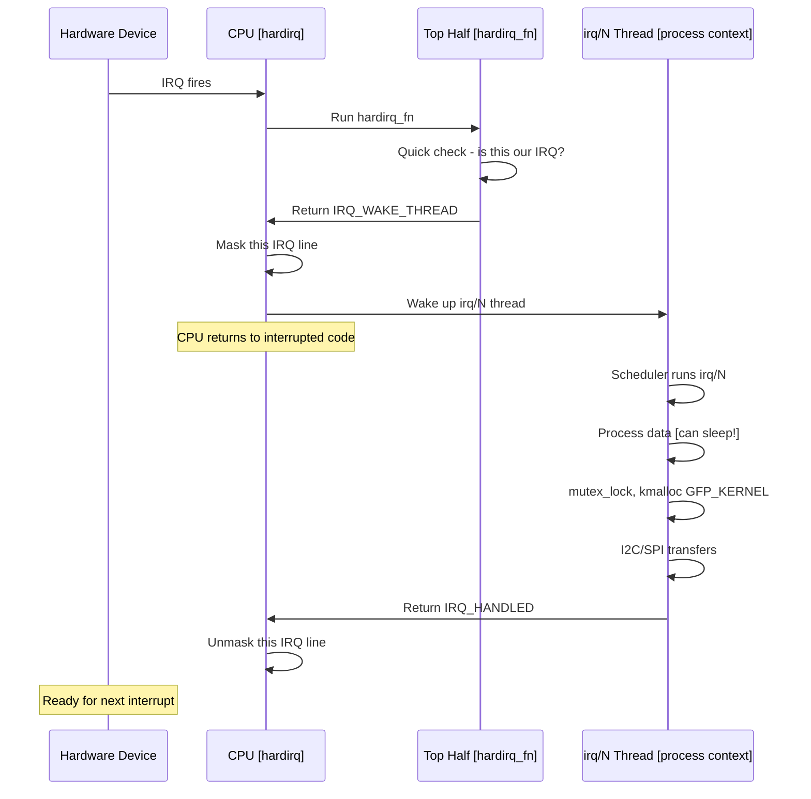
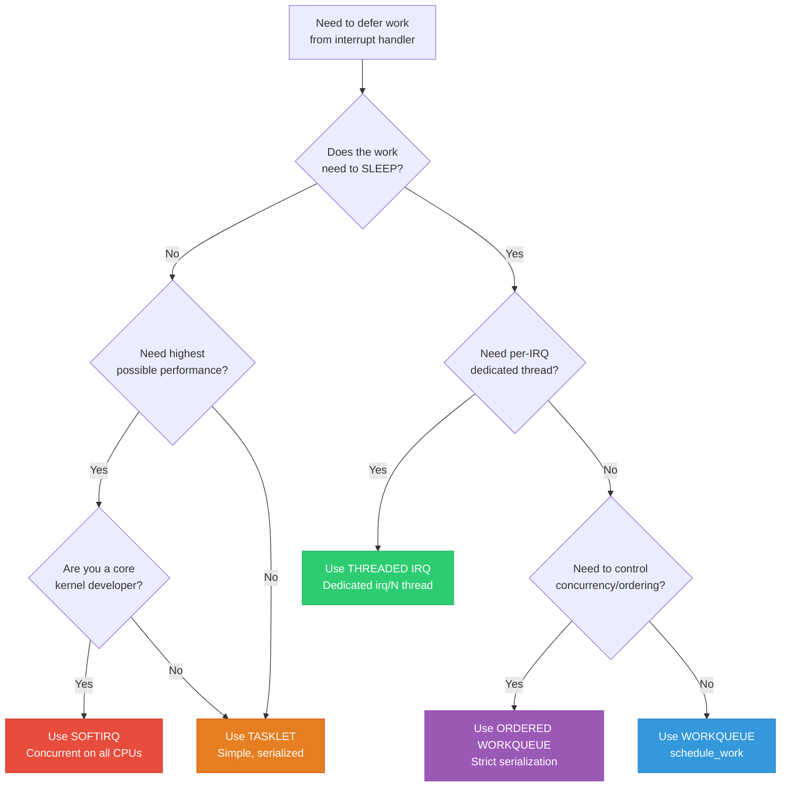
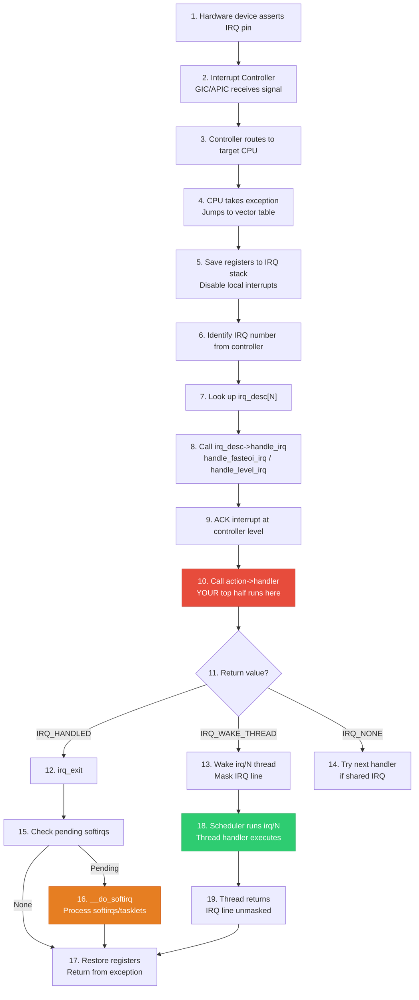

# 21 — Bottom Half Mechanisms Complete Deep Guide

## Table of Contents

1. [The Fundamental Problem — Why Split Interrupts?](#1-the-fundamental-problem--why-split-interrupts)
2. [Execution Contexts Deep Dive](#2-execution-contexts-deep-dive)
   - [Interrupt Context — What It Really Means](#21-interrupt-context--what-it-really-means)
   - [Process Context — What It Really Means](#22-process-context--what-it-really-means)
   - [The Context Check APIs](#23-the-context-check-apis)
3. [Top Half — Hardirq Handler](#3-top-half--hardirq-handler)
4. [Softirq — High-Performance Deferred Processing](#4-softirq--high-performance-deferred-processing)
5. [Tasklet — Serialized Lightweight Deferral](#5-tasklet--serialized-lightweight-deferral)
6. [Work Queue — Process Context Deferral](#6-work-queue--process-context-deferral)
7. [Threaded IRQ — Modern Interrupt Handling](#7-threaded-irq--modern-interrupt-handling)
8. [Complete Comparison Matrix](#8-complete-comparison-matrix)
9. [Decision Flowchart — Which Mechanism to Use](#9-decision-flowchart--which-mechanism-to-use)
10. [Real Driver Examples — All Five Mechanisms](#10-real-driver-examples--all-five-mechanisms)
11. [Internal Kernel Flow — From Hardware Pin to Handler](#11-internal-kernel-flow--from-hardware-pin-to-handler)
12. [Deep Interview Q&A — 25 Questions](#12-deep-interview-qa--25-questions)

---

## 1. The Fundamental Problem — Why Split Interrupts?

When hardware signals the CPU, the processor **drops everything** — it saves minimal state and jumps to the interrupt vector. While the interrupt handler runs:

- The current IRQ line is masked (at minimum)
- On many architectures, **all local interrupts are disabled**
- The interrupted process is frozen mid-instruction
- No scheduling can happen
- No sleeping, no blocking, no page faults

```
Timeline showing why long handlers are catastrophic:

    IRQ fires        Handler starts           Handler finishes
    ───┬──────────────┬─────────────────────────────┬──────────
       │              │◄── ALL IRQs blocked ──────►│
       │              │                             │
       │              │  Network packets dropped    │
       │              │  Timer ticks missed         │
       │              │  User input lost            │
       │              │  RT deadlines violated      │
       │              │                             │
    If handler takes 1ms = 1,000,000 nanoseconds = eternity for a CPU
```

### The Solution: Split Into Two Phases

```
Phase 1: TOP HALF [Interrupt Context]           Phase 2: BOTTOM HALF [Deferred]
─────────────────────────────────               ────────────────────────────────
• ACK the hardware interrupt                    • Process the data
• Read status/data registers                    • Run protocol stacks
• Copy time-critical data to RAM               • Wake up waiting processes
• Schedule the bottom half                      • Submit I/O requests
• Return IRQ_HANDLED                            • Allocate memory (sleepable)
                                                
Duration: ~1-10 microseconds                    Duration: microseconds to ms
Context: Interrupt (can't sleep)                Context: Softirq OR Process
```

---

## 2. Execution Contexts Deep Dive

This is the **most critical concept** — every mechanism choice depends on which execution context it runs in. The Linux kernel has exactly two execution contexts.

### 2.1 Interrupt Context — What It Really Means

**Definition**: Code that runs in response to a hardware/software interrupt, NOT on behalf of any process.

```
┌─────────────────────────────────────────────────────────────────┐
│                    INTERRUPT CONTEXT                             │
│                                                                 │
│  WHO runs here:                                                 │
│    • Top half handlers (hardirq)                                │
│    • Softirq handlers                                           │
│    • Tasklet handlers                                           │
│                                                                 │
│  STACK used:                                                    │
│    • Dedicated IRQ stack (separate from process kernel stack)    │
│    • On ARM64: irq_stack_ptr per-CPU                            │
│    • On x86: hardirq_stack per-CPU (16 KB)                      │
│                                                                 │
│  WHAT 'current' points to:                                      │
│    • The task_struct that was INTERRUPTED — NOT the handler's    │
│    • Completely unreliable — that process has nothing to do      │
│      with the interrupt                                         │
│                                                                 │
│  PREEMPTION: disabled                                           │
│  SCHEDULER: cannot be called                                    │
│  in_interrupt(): returns NON-ZERO                               │
└─────────────────────────────────────────────────────────────────┘
```

#### Why Can't Interrupt Context Sleep? — Deep Explanation

```c
// What happens if interrupt context calls schedule():

void schedule(void)
{
    struct task_struct *prev = current;   // ← The INTERRUPTED task, not the IRQ handler!
    struct task_struct *next;

    // 1. Save prev's CPU registers into prev->thread
    //    BUG: We're saving the interrupt handler's registers
    //    into an innocent process's task_struct!

    // 2. Pick next task from run queue
    next = pick_next_task(rq);

    // 3. Context switch to next
    context_switch(rq, prev, next);
    //    BUG: The interrupted process is now "sleeping"
    //    but it never asked to sleep! It might hold spinlocks!
}
```

**Three fatal problems:**

| Problem | What Goes Wrong |
|---------|----------------|
| **No own task_struct** | `current` points to the interrupted task. Sleeping would put THAT task to sleep — for no reason, without its consent |
| **Spinlock deadlock** | The interrupted task might hold spinlocks. If we schedule away, those locks are held forever — no one can release them |
| **Stack corruption** | The interrupted task's kernel stack is borrowed. If we schedule away and that task gets scheduled elsewhere, both the IRQ handler and the task use the same stack = memory corruption |

#### What You CAN Do in Interrupt Context

```
✅ Read/write hardware registers (readl, writel, ioread32, iowrite32)
✅ Allocate memory with GFP_ATOMIC (kmalloc, kmem_cache_alloc)
✅ Use spinlocks (spin_lock, spin_lock_irqsave)
✅ Access per-CPU variables
✅ Schedule bottom halves (raise_softirq, tasklet_schedule, schedule_work)
✅ Complete completions (complete())
✅ Wake up wait queues (wake_up())
✅ Use atomic operations (atomic_inc, atomic_set)
```

#### What You CANNOT Do in Interrupt Context

```
❌ Sleep / block (schedule, msleep, ssleep, wait_event)
❌ Mutex (mutex_lock — it calls schedule if contended)
❌ Semaphore (down — it sleeps if count is 0)
❌ kmalloc with GFP_KERNEL (may trigger reclaim = sleep)
❌ copy_to_user / copy_from_user (may page fault = sleep)
❌ Any I/O that might block (disk reads, USB transfers)
❌ printk with console drivers that sleep (use printk_deferred)
```

---

### 2.2 Process Context — What It Really Means

**Definition**: Code that runs on behalf of a specific process, with a valid `current` pointer and its own kernel stack.

```
┌─────────────────────────────────────────────────────────────────┐
│                    PROCESS CONTEXT                               │
│                                                                 │
│  WHO runs here:                                                 │
│    • System calls (read, write, ioctl, mmap)                    │
│    • Kernel threads (kworker, kswapd, ksoftirqd)                │
│    • Workqueue handlers                                         │
│    • Threaded IRQ handlers                                      │
│    • Timer callbacks (with TIMER_IRQSAFE not set)               │
│                                                                 │
│  STACK used:                                                    │
│    • The process's own kernel stack                              │
│    • Typically 8 KB (ARM) or 16 KB (x86_64)                     │
│                                                                 │
│  WHAT 'current' points to:                                      │
│    • Valid task_struct for this process/kernel thread            │
│    • Correct PID, credentials, signal info                      │
│                                                                 │
│  PREEMPTION: enabled (unless explicitly disabled)               │
│  SCHEDULER: can be called — sleeping is SAFE                    │
│  in_interrupt(): returns 0                                      │
│  in_task(): returns 1 (true)                                    │
└─────────────────────────────────────────────────────────────────┘
```

#### Why Process Context CAN Sleep

```
When a workqueue/threaded IRQ handler calls schedule():

    current → valid task_struct of kworker/irq thread
    current->thread → we can safely save registers here
    current->state → we can set this to TASK_INTERRUPTIBLE
    
    schedule() picks next task → context switch happens
    
    Later: this kworker/irq thread is woken up → 
    schedule() restores its registers → continues where it left off
    
    SAFE because:
    ✅ Own task_struct — not borrowing someone else's
    ✅ Own kernel stack — not sharing with interrupted code
    ✅ Was designed to sleep — no unexpected lock holding
```

### 2.3 The Context Check APIs

The kernel provides macros to check the current execution context:

```c
// Header: <linux/preempt.h>

in_interrupt()      // Returns true if in ANY interrupt context
                    // (hardirq OR softirq OR tasklet)

in_irq()            // Returns true if in hardirq context ONLY
                    // Deprecated: use in_hardirq() instead

in_hardirq()        // Returns true if in hardirq context

in_softirq()        // Returns true if in softirq/tasklet context
                    // OR if softirqs are disabled (BH disabled)

in_serving_softirq() // Returns true ONLY if actually running a softirq
                      // (not just BH-disabled)

in_task()           // Returns true if in process context
                    // Inverse of in_interrupt()

in_nmi()            // Returns true if in NMI context

// Internal implementation (preempt_count bit fields):
// Bits 0-7:   preemption count
// Bits 8-15:  softirq count  
// Bits 16-19: hardirq count
// Bit 20:     NMI
```

#### Context Check Decision Table

```c
// How to decide what to use:
if (in_hardirq()) {
    // Top half — most restricted
    // Use: spin_lock(), GFP_ATOMIC, raise_softirq()
}
else if (in_serving_softirq()) {
    // Softirq/Tasklet — cannot sleep but can be preempted by hardirq
    // Use: spin_lock(), GFP_ATOMIC, spin_lock_bh() for process sync
}
else if (in_task()) {
    // Process context — full freedom
    // Use: mutex_lock(), GFP_KERNEL, sleep, copy_to_user()
}
```

---

## 3. Top Half — Hardirq Handler

### What It Is

The **Top Half** is the function registered with `request_irq()` that executes **immediately** when the hardware interrupt fires. It runs in **hardirq context** — the most restricted environment in the kernel.

### How It Works Internally



### Key Rules

```
┌──────────────────────────────────────────────────────────┐
│                  TOP HALF RULES                           │
│                                                          │
│  1. Be FAST — microseconds, not milliseconds             │
│  2. Interrupts are disabled — you block everything       │
│  3. Cannot sleep (hardirq context)                       │
│  4. Cannot use mutex, semaphore, GFP_KERNEL              │
│  5. Use spin_lock() for SMP synchronization              │
│  6. If sharing data with process context:                │
│     use spin_lock_irqsave() from process side            │
│  7. Return IRQ_HANDLED if you handled the interrupt      │
│     Return IRQ_NONE if not yours (shared IRQ line)       │
│  8. Schedule bottom half for heavy work                  │
└──────────────────────────────────────────────────────────┘
```

### Code — Top Half Handler

```c
#include <linux/interrupt.h>

struct my_device {
    void __iomem *base;
    u32 status;
    u32 data_buffer[64];
    struct tasklet_struct tasklet;
};

/* Top Half — runs in hardirq context */
static irqreturn_t my_irq_handler(int irq, void *dev_id)
{
    struct my_device *dev = dev_id;
    u32 status;

    /* Step 1: Read interrupt status register */
    status = readl(dev->base + IRQ_STATUS_REG);

    /* Step 2: Check if this interrupt is for us (shared IRQ) */
    if (!(status & MY_IRQ_MASK))
        return IRQ_NONE;   /* Not our interrupt */

    /* Step 3: ACK the interrupt in hardware */
    writel(status, dev->base + IRQ_CLEAR_REG);

    /* Step 4: Save time-critical data */
    dev->status = status;

    /* Step 5: Schedule bottom half for heavy processing */
    tasklet_schedule(&dev->tasklet);

    return IRQ_HANDLED;
}

/* Registration */
ret = request_irq(irq_num, my_irq_handler,
                  IRQF_SHARED, "my_device", dev);
```

### What Happens in the CPU During Top Half

```
CPU was executing process X (user-space or kernel code)

    Process X instruction stream:
    ... mov r0, #5
    ... add r1, r0, #3
    ... str r1, [r2]        ← IRQ fires HERE
    
    CPU automatically:
    ┌─────────────────────────────────────────────┐
    │ 1. Finish current instruction               │
    │ 2. Save CPSR/PSTATE to SPSR                 │
    │ 3. Set IRQ disable bit in CPSR              │
    │ 4. Switch to IRQ mode / EL1                 │
    │ 5. Save return address to LR_irq            │
    │ 6. Jump to IRQ vector (0xFFFF0018 or VBAR)  │
    └─────────────────────────────────────────────┘
    
    Kernel IRQ entry code:
    ┌─────────────────────────────────────────────┐
    │ 1. Save all registers to IRQ stack          │
    │ 2. Switch to SVC/kernel stack               │
    │ 3. Call do_IRQ() → irq_desc → your handler  │
    │ 4. Your handler runs (TOP HALF)             │
    │ 5. irq_exit() — process pending softirqs    │
    │ 6. Restore registers                        │
    │ 7. Return from exception (eret/rfi)         │
    └─────────────────────────────────────────────┘
    
    Process X resumes: ... ldr r3, [r4]  ← continues
```

---

## 4. Softirq — High-Performance Deferred Processing

### What It Is

Softirqs are the **highest-performance** bottom half mechanism. They run in **interrupt context** (specifically softirq context) but with interrupts **re-enabled**. They are designed for **extremely high-frequency** work like networking and block I/O.

### Key Properties

```
┌─────────────────────────────────────────────────────────────┐
│                      SOFTIRQ PROPERTIES                      │
│                                                             │
│  Context:        Interrupt (softirq) — CANNOT sleep         │
│  When it runs:   After hardirq (irq_exit), or ksoftirqd     │
│  Concurrency:    Same softirq on MULTIPLE CPUs at once!     │
│  Number:         Fixed at compile time (10 types max)       │
│  Added by:       Only kernel core developers (not modules)  │
│  Synchronization: Must handle own locking (per-CPU data)    │
│  Performance:    Highest — no context switch, no scheduling  │
│  Reentrancy:     Same softirq can run on CPU 0 AND CPU 1   │
│                  simultaneously — extremely tricky locking   │
└─────────────────────────────────────────────────────────────┘
```

### The 10 Static Softirq Types

```c
// Defined in include/linux/interrupt.h
enum {
    HI_SOFTIRQ = 0,        // High-priority tasklets
    TIMER_SOFTIRQ,          // Timer callbacks
    NET_TX_SOFTIRQ,         // Network packet transmit
    NET_RX_SOFTIRQ,         // Network packet receive
    BLOCK_SOFTIRQ,          // Block I/O completion
    IRQ_POLL_SOFTIRQ,       // IRQ polling
    TASKLET_SOFTIRQ,        // Normal-priority tasklets
    SCHED_SOFTIRQ,          // Scheduler load balancing
    HRTIMER_SOFTIRQ,        // High-resolution timers (unused on most)
    RCU_SOFTIRQ,            // RCU callbacks
    NR_SOFTIRQS             // = 10 (total count)
};
```

### When Softirqs Execute



### Softirq Execution Flow — Internal

```c
// kernel/softirq.c — simplified

void irq_exit(void)
{
    preempt_count_sub(HARDIRQ_OFFSET);  // Exit hardirq

    if (!in_interrupt() && local_softirq_pending())
        invoke_softirq();  // → __do_softirq()
}

asmlinkage __visible void __do_softirq(void)
{
    struct softirq_action *h;
    __u32 pending = local_softirq_pending();
    int max_restart = MAX_SOFTIRQ_RESTART;  // = 10

    __local_bh_disable();   // Mark: we're in softirq
    local_irq_enable();     // Re-enable hardirqs!

restart:
    set_softirq_pending(0);
    h = softirq_vec;        // Array of 10 handlers

    while (pending) {
        if (pending & 1)
            h->action(h);   // Call the softirq handler
        h++;
        pending >>= 1;
    }

    pending = local_softirq_pending();
    if (pending && --max_restart)
        goto restart;

    if (pending)
        wakeup_softirqd();  // Too many — defer to ksoftirqd

    __local_bh_enable();
}
```

### Why Softirqs Are Dangerous — Multi-CPU Concurrency

```
CPU 0                              CPU 1
──────────                         ──────────
NET_RX_SOFTIRQ runs               NET_RX_SOFTIRQ runs
  │ net_rx_action()                  │ net_rx_action()
  │ process packet A                 │ process packet B
  │ access shared counter?           │ access shared counter?
  │     ↓                            │     ↓
  │ DATA RACE if not locked!         │ DATA RACE if not locked!

THIS is why:
  • Networking code uses per-CPU queues (no sharing = no locking)
  • When shared data is needed: spin_lock() between softirq instances
  • Most softirq handlers are written by senior kernel developers only
```

### Code — Softirq Handler (Kernel Core Only)

```c
// This is kernel-internal — NOT for drivers/modules

#include <linux/interrupt.h>

/* Step 1: Define handler */
static void my_softirq_handler(struct softirq_action *action)
{
    /* Runs in softirq context — cannot sleep! */
    /* Same handler can run on multiple CPUs simultaneously */
    
    struct my_per_cpu_data *data = this_cpu_ptr(&my_pcpu_data);
    
    /* Process using per-CPU data — no locking needed */
    process_pending_items(data);
}

/* Step 2: Register at boot (one-time, compile-time) */
void __init my_subsystem_init(void)
{
    open_softirq(MY_SOFTIRQ, my_softirq_handler);
}

/* Step 3: Raise from top half */
static irqreturn_t my_irq_handler(int irq, void *dev_id)
{
    /* ... handle hardware ... */
    raise_softirq(MY_SOFTIRQ);  // Mark softirq as pending
    return IRQ_HANDLED;
}
```

---

## 5. Tasklet — Serialized Lightweight Deferral

### What It Is

Tasklets are built **on top of softirqs** (they use `TASKLET_SOFTIRQ` and `HI_SOFTIRQ`) but add a critical constraint: **the same tasklet is guaranteed to run on only one CPU at a time**. This makes locking much simpler than raw softirqs.

### Key Properties

```
┌─────────────────────────────────────────────────────────────┐
│                      TASKLET PROPERTIES                      │
│                                                             │
│  Context:        Interrupt (softirq) — CANNOT sleep         │
│  When it runs:   During softirq processing (after hardirq)  │
│  Concurrency:    SAME tasklet serialized across CPUs         │
│                  DIFFERENT tasklets CAN run in parallel      │
│  Registration:   Dynamic — modules can use tasklets          │
│  Synchronization: No locking needed for tasklet-private data │
│  Performance:    High — no context switch                    │
│  Deprecation:    Being phased out in favor of threaded IRQs  │
│  Use case:       Per-device deferred work (legacy drivers)   │
└─────────────────────────────────────────────────────────────┘
```

### Softirq vs Tasklet — The Key Difference

```
SOFTIRQ:
    CPU 0: net_rx_action() runs ←─── SAME handler
    CPU 1: net_rx_action() runs ←─── runs SIMULTANEOUSLY
    CPU 2: net_rx_action() runs ←─── on ALL CPUs
    
    Result: Must lock ALL shared data!

TASKLET:
    CPU 0: my_tasklet_func() runs ←─── This specific tasklet
    CPU 1: (waiting...)           ←─── CANNOT run until CPU 0 finishes
    CPU 2: (waiting...)           ←─── 
    
    Result: Tasklet-private data needs NO locking!
    But: different tasklets CAN run on different CPUs
```

### Internal Implementation

```c
// include/linux/interrupt.h
struct tasklet_struct {
    struct tasklet_struct *next;  // Linked list of pending tasklets
    unsigned long state;          // TASKLET_STATE_SCHED, TASKLET_STATE_RUN
    atomic_t count;               // Disable counter (0 = enabled)
    void (*func)(unsigned long);  // Handler function
    unsigned long data;           // Argument to handler
};

// State machine:
// TASKLET_STATE_SCHED — scheduled, waiting to run
// TASKLET_STATE_RUN   — currently executing on some CPU

// When tasklet_schedule() is called:
// 1. Test-and-set TASKLET_STATE_SCHED (atomic)
//    If already set → return (already scheduled)
// 2. Add to per-CPU tasklet_vec list
// 3. raise_softirq_irqoff(TASKLET_SOFTIRQ)

// When softirq runs TASKLET_SOFTIRQ:
// 1. For each tasklet in the per-CPU list:
//    a. Test-and-set TASKLET_STATE_RUN
//       If already set → skip (running on another CPU)
//    b. Check count == 0 (enabled)
//    c. Clear TASKLET_STATE_SCHED
//    d. Call func(data)
//    e. Clear TASKLET_STATE_RUN
```

### Code — Tasklet Usage in a Driver

```c
#include <linux/interrupt.h>
#include <linux/module.h>

struct my_device {
    void __iomem *base;
    u32 pending_status;
    struct tasklet_struct bh_tasklet;
    spinlock_t lock;
};

/* Bottom Half — runs in softirq context */
static void my_tasklet_handler(unsigned long data)
{
    struct my_device *dev = (struct my_device *)data;
    u32 status;

    spin_lock(&dev->lock);    /* Sync with top half */
    status = dev->pending_status;
    dev->pending_status = 0;
    spin_unlock(&dev->lock);

    /* Heavy processing — still can't sleep! */
    process_device_data(dev, status);
    notify_subsystem(status);
}

/* Top Half — runs in hardirq context */
static irqreturn_t my_irq_handler(int irq, void *dev_id)
{
    struct my_device *dev = dev_id;
    u32 status = readl(dev->base + STATUS_REG);

    if (!(status & MY_IRQ_BITS))
        return IRQ_NONE;

    writel(status, dev->base + IRQ_ACK_REG);

    spin_lock(&dev->lock);
    dev->pending_status |= status;
    spin_unlock(&dev->lock);

    tasklet_schedule(&dev->bh_tasklet);
    return IRQ_HANDLED;
}

/* Init */
static int my_probe(struct platform_device *pdev)
{
    struct my_device *dev = devm_kzalloc(&pdev->dev, sizeof(*dev), GFP_KERNEL);
    
    spin_lock_init(&dev->lock);
    tasklet_init(&dev->bh_tasklet, my_tasklet_handler, (unsigned long)dev);
    
    ret = request_irq(irq, my_irq_handler, IRQF_SHARED, "my_dev", dev);
    return ret;
}

/* Cleanup */
static int my_remove(struct platform_device *pdev)
{
    tasklet_kill(&dev->bh_tasklet);  /* Wait for tasklet to finish */
    free_irq(irq, dev);
    return 0;
}
```

---

## 6. Work Queue — Process Context Deferral

### What It Is

Workqueues are the **most flexible** bottom half mechanism. Work runs on **kernel worker threads** (`kworker/N:M`) in **process context** — so it can **sleep, use mutexes, allocate with GFP_KERNEL, do I/O**, and everything a normal kernel thread can do.

### Key Properties

```
┌─────────────────────────────────────────────────────────────┐
│                    WORKQUEUE PROPERTIES                       │
│                                                             │
│  Context:        Process (kworker thread) — CAN sleep       │
│  When it runs:   When kworker thread is scheduled by CPU    │
│  Concurrency:    Configurable — single-threaded or multi    │
│  Registration:   Dynamic — modules freely use workqueues    │
│  Synchronization: Can use mutex, semaphore, GFP_KERNEL      │
│  Performance:    Lower than softirq — involves scheduling   │
│  Latency:        Higher — must wait for scheduler           │
│  Use case:       Complex processing, memory allocation,     │
│                  I2C/SPI transfers, firmware loading         │
└─────────────────────────────────────────────────────────────┘
```

### How Workqueues Map to Kernel Threads

```
Workqueue System Architecture:

    ┌──────────────────────────────────────────────────┐
    │                 system_wq (default)                │
    │  schedule_work(&my_work)                          │
    │  schedule_delayed_work(&my_dwork, delay)          │
    └────────────┬─────────────────────────────────────┘
                 │
    ┌────────────▼─────────────────────────────────────┐
    │              Worker Pool (per-CPU)                 │
    │                                                   │
    │  CPU 0: kworker/0:0, kworker/0:1, kworker/0:2   │
    │  CPU 1: kworker/1:0, kworker/1:1                 │
    │  CPU 2: kworker/2:0                              │
    │  ...                                              │
    │                                                   │
    │  Workers are created/destroyed dynamically        │
    │  based on load                                    │
    └──────────────────────────────────────────────────┘
    
    Special workqueues:
    ┌──────────────────────────────────────────────────┐
    │  system_highpri_wq  — WQ_HIGHPRI: high-priority  │
    │  system_long_wq     — WQ_LONG: long-running work │
    │  system_unbound_wq  — unbound to any CPU         │
    │  system_freezable_wq— freezable for suspend      │
    └──────────────────────────────────────────────────┘
```

### Internal Flow — From schedule_work() to Execution



### Different Types of Workqueues

```c
/* 1. Default shared workqueue — system_wq */
schedule_work(&my_work);
schedule_delayed_work(&my_dwork, msecs_to_jiffies(100));

/* 2. Custom single-threaded workqueue */
struct workqueue_struct *my_wq;
my_wq = create_singlethread_workqueue("my_worker");
queue_work(my_wq, &my_work);
// → Only ONE kworker thread handles all work items
// → Work items are serialized

/* 3. Custom multi-threaded workqueue */
my_wq = alloc_workqueue("my_workers",
                         WQ_UNBOUND | WQ_HIGHPRI,
                         max_active);
// WQ_UNBOUND: not pinned to a CPU — scheduler picks best CPU
// WQ_HIGHPRI: higher scheduling priority
// max_active: max concurrent work items (0 = default = 256)

/* 4. Ordered workqueue (strict serialization) */
my_wq = alloc_ordered_workqueue("my_ordered", 0);
// → Work items execute strictly one at a time, in order
```

### Code — Workqueue in a Driver

```c
#include <linux/workqueue.h>
#include <linux/interrupt.h>

struct my_device {
    void __iomem *base;
    struct work_struct process_work;
    struct delayed_work monitor_work;
    struct mutex data_lock;           /* Can use mutex — process context! */
    u8 *dma_buffer;
    u32 saved_status;
};

/* Bottom Half — runs in process context on kworker thread */
static void my_work_handler(struct work_struct *work)
{
    struct my_device *dev = container_of(work, struct my_device, process_work);

    /* CAN sleep, use mutexes, allocate memory! */
    mutex_lock(&dev->data_lock);

    /* Allocate memory with GFP_KERNEL — can sleep for reclaim */
    u8 *buf = kmalloc(4096, GFP_KERNEL);
    if (!buf) {
        mutex_unlock(&dev->data_lock);
        return;
    }

    /* Do complex processing */
    memcpy(buf, dev->dma_buffer, 4096);
    process_firmware_data(buf);

    /* Do I/O that might sleep */
    i2c_smbus_write_byte(dev->client, 0x42, buf[0]);
    
    kfree(buf);
    mutex_unlock(&dev->data_lock);
}

/* Top Half — hardirq context */
static irqreturn_t my_irq_handler(int irq, void *dev_id)
{
    struct my_device *dev = dev_id;
    u32 status = readl(dev->base + STATUS_REG);

    if (!(status & MY_IRQ_BITS))
        return IRQ_NONE;

    writel(status, dev->base + IRQ_ACK_REG);
    dev->saved_status = status;

    schedule_work(&dev->process_work);
    return IRQ_HANDLED;
}

/* Periodic monitoring work */
static void my_monitor_handler(struct work_struct *work)
{
    struct my_device *dev = container_of(work, struct my_device,
                                         monitor_work.work);
    check_device_health(dev);
    
    /* Re-schedule self every 1 second */
    schedule_delayed_work(&dev->monitor_work, HZ);
}

/* Init */
static int my_probe(struct platform_device *pdev)
{
    struct my_device *dev;
    
    dev = devm_kzalloc(&pdev->dev, sizeof(*dev), GFP_KERNEL);
    mutex_init(&dev->data_lock);
    INIT_WORK(&dev->process_work, my_work_handler);
    INIT_DELAYED_WORK(&dev->monitor_work, my_monitor_handler);
    
    request_irq(irq, my_irq_handler, 0, "my_dev", dev);
    schedule_delayed_work(&dev->monitor_work, HZ);  /* Start monitor */
    return 0;
}

/* Cleanup */
static int my_remove(struct platform_device *pdev)
{
    cancel_delayed_work_sync(&dev->monitor_work);
    cancel_work_sync(&dev->process_work);
    free_irq(irq, dev);
    return 0;
}
```

---

## 7. Threaded IRQ — Modern Interrupt Handling

### What It Is

Threaded IRQs are the **modern replacement** for the traditional top-half + bottom-half pattern. Instead of using a separate bottom half mechanism, the kernel creates a **dedicated kernel thread** (`irq/N-name`) for each interrupt. The top half does minimal work and wakes this thread for processing.

### Key Properties

```
┌─────────────────────────────────────────────────────────────┐
│                   THREADED IRQ PROPERTIES                     │
│                                                             │
│  Context:        Top half = hardirq, Thread = process       │
│  When it runs:   Top half wakes irq/N thread via scheduler  │
│  Concurrency:    Serialized — one thread per IRQ            │
│  Registration:   request_threaded_irq() — modules can use   │
│  Synchronization: Can use mutex/GFP_KERNEL in thread part   │
│  Performance:    Moderate — involves thread scheduling      │
│  RT support:     Excellent — thread has RT priority         │
│  IRQ masking:    The IRQ line stays masked until thread done │
│  Use case:       I2C/SPI devices, buses that sleep,         │
│                  PREEMPT_RT systems, modern drivers          │
└─────────────────────────────────────────────────────────────┘
```

### How Threaded IRQ Works



### IRQ Masking — Critical Behavior

```
Without threaded IRQ:
    IRQ fires → handler runs → returns → IRQ can fire again immediately
    Bottom half may still be processing when next IRQ fires

With threaded IRQ:
    IRQ fires → top half returns IRQ_WAKE_THREAD → IRQ line MASKED
    Thread processes data...
    Thread returns IRQ_HANDLED → IRQ line UNMASKED
    
    This means: NO new interrupts from this device until the thread
    finishes processing. Natural flow control / back-pressure!
    
    Practical benefit:
    ┌──────────────────────────────────────────────┐
    │ Device sending data faster than we process?  │
    │ → IRQ stays masked                           │
    │ → Device FIFO fills up                       │
    │ → Natural throttling, no interrupt storm     │
    └──────────────────────────────────────────────┘
```

### Code — Threaded IRQ in a Driver

```c
#include <linux/interrupt.h>
#include <linux/i2c.h>

struct my_sensor {
    struct i2c_client *client;
    struct mutex lock;
    u8 data_buf[256];
    int data_ready;
};

/* Top Half — hardirq context (optional, can be NULL) */
static irqreturn_t my_sensor_hardirq(int irq, void *dev_id)
{
    struct my_sensor *sensor = dev_id;

    /*
     * Quick check: is the interrupt from our device?
     * If the GPIO line is shared, check the pin state.
     * Don't do I2C/SPI here — that would sleep!
     */
    
    return IRQ_WAKE_THREAD;  /* Wake the thread handler */
}

/* Thread Handler — process context (full freedom!) */
static irqreturn_t my_sensor_thread(int irq, void *dev_id)
{
    struct my_sensor *sensor = dev_id;
    int ret;

    mutex_lock(&sensor->lock);

    /* I2C read — this SLEEPS! (bus transfer takes ~100 us) */
    ret = i2c_smbus_read_i2c_block_data(sensor->client,
                                         DATA_REG,
                                         sizeof(sensor->data_buf),
                                         sensor->data_buf);
    if (ret < 0) {
        dev_err(&sensor->client->dev, "I2C read failed: %d\n", ret);
        mutex_unlock(&sensor->lock);
        return IRQ_HANDLED;
    }

    /* Process data */
    sensor->data_ready = 1;

    /* Clear interrupt on the device via I2C — sleeps again */
    i2c_smbus_write_byte(sensor->client, STATUS_REG, 0x00);

    mutex_unlock(&sensor->lock);

    /* Wake up any userspace readers */
    wake_up_interruptible(&sensor->wait_queue);

    return IRQ_HANDLED;
}

/* Registration */
static int my_sensor_probe(struct i2c_client *client)
{
    struct my_sensor *sensor;
    int irq, ret;

    sensor = devm_kzalloc(&client->dev, sizeof(*sensor), GFP_KERNEL);
    sensor->client = client;
    mutex_init(&sensor->lock);
    init_waitqueue_head(&sensor->wait_queue);

    irq = client->irq;  /* From device tree: interrupts = <...> */

    ret = devm_request_threaded_irq(&client->dev,
                                     irq,
                                     my_sensor_hardirq,    /* Top half */
                                     my_sensor_thread,     /* Thread fn */
                                     IRQF_ONESHOT,         /* Keep masked! */
                                     "my_sensor",
                                     sensor);
    
    /* IRQF_ONESHOT is REQUIRED for threaded IRQs when
     * top half is NULL or returns IRQ_WAKE_THREAD.
     * It keeps the IRQ masked until the thread handler completes.
     * Without it: interrupt storms because HW hasn't been ACKed */

    return ret;
}
```

### The IRQF_ONESHOT Flag — Why It's Mandatory

```
Without IRQF_ONESHOT:
    IRQ fires → top half returns IRQ_WAKE_THREAD → IRQ UNMASKED immediately
    Device still asserting IRQ line (not ACKed yet!)
    IRQ fires AGAIN → top half → IRQ_WAKE_THREAD → IRQ fires AGAIN →
    INFINITE LOOP! Interrupt storm! System hangs!

With IRQF_ONESHOT:
    IRQ fires → top half returns IRQ_WAKE_THREAD → IRQ stays MASKED
    Thread runs → reads device data over I2C → clears interrupt register
    Thread returns IRQ_HANDLED → IRQ UNMASKED
    Device is no longer asserting → no storm
```

### When Top Half Can Be NULL

```c
/* If you don't need a hardirq handler at all: */
ret = devm_request_threaded_irq(&dev,
                                 irq,
                                 NULL,              /* No top half */
                                 my_thread_handler,  /* Only thread */
                                 IRQF_ONESHOT | IRQF_TRIGGER_FALLING,
                                 "my_device",
                                 dev);

/* The kernel auto-generates a default top half that:
 * 1. Disables the IRQ line (IRQF_ONESHOT)
 * 2. Returns IRQ_WAKE_THREAD
 * That's all — no custom top half needed for simple devices
 */
```

---

## 8. Complete Comparison Matrix

```
┌──────────────┬─────────────┬───────────┬──────────────┬──────────────────┬───────────────────┐
│ Mechanism    │ Context     │ Can Sleep │ Concurrency  │ Use Case         │ When to Use       │
├──────────────┼─────────────┼───────────┼──────────────┼──────────────────┼───────────────────┤
│ Top Half     │ Hardirq     │ No        │ N/A          │ HW ack, copy     │ Always — minimal  │
│ (hardirq)    │ (all IRQs   │           │ (runs on     │ critical data,   │ work only, ACK    │
│              │  disabled)  │           │  one CPU)    │ schedule BH      │ hardware, defer   │
├──────────────┼─────────────┼───────────┼──────────────┼──────────────────┼───────────────────┤
│ Softirq      │ Softirq     │ No        │ Multi-CPU    │ Network RX/TX,   │ Kernel-core only  │
│              │ (hardirqs   │           │ (same softirq│ Block I/O,       │ Extreme perf,     │
│              │  enabled)   │           │  on all CPUs)│ timers, RCU      │ high freq events  │
├──────────────┼─────────────┼───────────┼──────────────┼──────────────────┼───────────────────┤
│ Tasklet      │ Softirq     │ No        │ Serialized   │ Per-device       │ Simple defer work │
│              │ (hardirqs   │           │ (same tasklet│ deferred work    │ Legacy drivers    │
│              │  enabled)   │           │  one CPU)    │                  │ Being deprecated  │
├──────────────┼─────────────┼───────────┼──────────────┼──────────────────┼───────────────────┤
│ Work Queue   │ Process     │ Yes       │ Multi-CPU    │ Complex work,    │ Need sleeping:    │
│              │ (kworker    │           │ (configurable│ I/O, firmware    │ I2C, SPI, mutex,  │
│              │  thread)    │           │  concurrency)│ loading, alloc   │ memory allocation │
├──────────────┼─────────────┼───────────┼──────────────┼──────────────────┼───────────────────┤
│ Threaded IRQ │ Process     │ Yes       │ Serialized   │ I2C/SPI sensors, │ Modern drivers,   │
│              │ (irq/N      │           │ (one thread  │ RT systems,      │ buses that sleep, │
│              │  thread)    │           │  per IRQ)    │ slow buses       │ PREEMPT_RT        │
└──────────────┴─────────────┴───────────┴──────────────┴──────────────────┴───────────────────┘
```

### Extended Comparison

| Feature | Top Half | Softirq | Tasklet | Workqueue | Threaded IRQ |
|---------|----------|---------|---------|-----------|-------------|
| **Latency** | Lowest (~ns) | Very low | Low | Higher (~us) | Moderate |
| **Can use mutex** | No | No | No | Yes | Yes |
| **Can do I/O** | Register only | No | No | Yes | Yes |
| **GFP flags** | GFP_ATOMIC | GFP_ATOMIC | GFP_ATOMIC | GFP_KERNEL | GFP_KERNEL |
| **copy_to_user** | No | No | No | Yes | No (no user) |
| **Schedulable** | No | No | No | Yes | Yes |
| **RT priority** | N/A | N/A | N/A | Normal | Configurable |
| **Added by module** | Yes | No | Yes | Yes | Yes |
| **API** | request_irq | open_softirq | tasklet_init | INIT_WORK | request_threaded_irq |
| **Trigger** | Hardware | raise_softirq | tasklet_schedule | schedule_work | IRQ_WAKE_THREAD |

---

## 9. Decision Flowchart — Which Mechanism to Use



### Quick Decision Guide

```
Q: Does your bottom half need to sleep (mutex, I/O, GFP_KERNEL)?
├── NO → Do you need max performance and are core kernel dev?
│         ├── YES → Softirq
│         └── NO  → Tasklet (or workqueue if not time-critical)
└── YES → Is this an I2C/SPI/slow-bus device?
          ├── YES → Threaded IRQ (cleanest for bus devices)
          └── NO  → Workqueue (most flexible)
```

---

## 10. Real Driver Examples — All Five Mechanisms

### Example 1: Network Driver (Top Half + Softirq)

```c
/*
 * Intel e1000 Ethernet Driver — uses Top Half + Softirq (via NAPI)
 *
 * Flow: HW IRQ → top half disables IRQ → raise NAPI softirq →
 *       softirq polls packets in batches → re-enables IRQ
 */

/* Top Half */
static irqreturn_t e1000_intr(int irq, void *dev_id)
{
    struct net_device *netdev = dev_id;
    u32 icr = readl(hw->hw_addr + E1000_ICR);  /* Read + ACK */
    
    if (!icr)
        return IRQ_NONE;

    /* Disable further interrupts from NIC */
    writel(0, hw->hw_addr + E1000_IMC);

    /* Schedule NAPI polling (softirq) */
    napi_schedule(&adapter->napi);

    return IRQ_HANDLED;
}

/* Softirq side — NAPI poll (runs in softirq context) */
static int e1000_poll(struct napi_struct *napi, int budget)
{
    int work_done = 0;
    
    /* Process up to 'budget' packets */
    while (work_done < budget) {
        struct sk_buff *skb = get_next_packet(adapter);
        if (!skb)
            break;
        process_packet(skb);
        netif_receive_skb(skb);
        work_done++;
    }

    if (work_done < budget) {
        napi_complete(napi);
        /* Re-enable NIC interrupts */
        writel(IMS_ENABLE, hw->hw_addr + E1000_IMS);
    }

    return work_done;
}
```

### Example 2: UART Driver (Top Half + Tasklet)

```c
/*
 * Simple UART driver — uses Top Half + Tasklet
 * Top half reads FIFO, tasklet processes received data
 */

static irqreturn_t uart_irq_handler(int irq, void *dev_id)
{
    struct uart_dev *uart = dev_id;
    u8 byte;

    while (uart_data_ready(uart)) {
        byte = readb(uart->base + UART_RBR);
        uart->rx_buf[uart->rx_head++] = byte;
        uart->rx_head &= (BUF_SIZE - 1);
    }

    tasklet_schedule(&uart->rx_tasklet);
    return IRQ_HANDLED;
}

static void uart_rx_tasklet(unsigned long data)
{
    struct uart_dev *uart = (struct uart_dev *)data;
    /* Process received data, push to tty layer */
    tty_insert_flip_string(&uart->port, uart->rx_buf, count);
    tty_flip_buffer_push(&uart->port);
}
```

### Example 3: GPIO Controller (Top Half + Workqueue)

```c
/*
 * GPIO key driver — uses Workqueue
 * Debouncing requires delayed work with sleeping
 */

static irqreturn_t gpio_key_irq(int irq, void *dev_id)
{
    struct gpio_key *key = dev_id;
    /* Schedule debounce check after 50ms */
    schedule_delayed_work(&key->debounce_work, msecs_to_jiffies(50));
    return IRQ_HANDLED;
}

static void gpio_key_debounce(struct work_struct *work)
{
    struct gpio_key *key = container_of(work, struct gpio_key,
                                        debounce_work.work);
    int val;

    /* This may sleep — GPIO expander uses I2C! */
    val = gpiod_get_value_cansleep(key->gpiod);
    
    mutex_lock(&key->lock);
    if (val != key->last_state) {
        key->last_state = val;
        input_report_key(key->input, key->code, val);
        input_sync(key->input);
    }
    mutex_unlock(&key->lock);
}
```

### Example 4: I2C Accelerometer (Threaded IRQ)

```c
/*
 * ADXL345 Accelerometer on I2C bus — uses Threaded IRQ
 * Must do I2C reads in bottom half — can't do that in hardirq!
 */

static irqreturn_t adxl345_irq_thread(int irq, void *dev_id)
{
    struct adxl345 *accel = dev_id;
    u8 int_source;
    s16 x, y, z;

    /* I2C read — SLEEPS (~100-200 us) */
    int_source = i2c_smbus_read_byte_data(accel->client, INT_SOURCE_REG);

    if (int_source & DATA_READY) {
        /* Read 6 bytes of acceleration data — SLEEPS */
        i2c_smbus_read_i2c_block_data(accel->client, DATA_X0,
                                       6, (u8 *)&accel->data);
        
        input_report_abs(accel->input, ABS_X, accel->data.x);
        input_report_abs(accel->input, ABS_Y, accel->data.y);
        input_report_abs(accel->input, ABS_Z, accel->data.z);
        input_sync(accel->input);
    }

    return IRQ_HANDLED;
}

/* Registration — NULL top half, IRQF_ONESHOT mandatory */
devm_request_threaded_irq(&client->dev, client->irq,
                           NULL,               /* No top half needed */
                           adxl345_irq_thread,
                           IRQF_ONESHOT | IRQF_TRIGGER_LOW,
                           "adxl345", accel);
```

---

## 11. Internal Kernel Flow — From Hardware Pin to Handler



### Key Data Structures

```c
// The IRQ descriptor — one per IRQ number
struct irq_desc {
    struct irq_data         irq_data;       // HW IRQ number, chip info
    irq_flow_handler_t      handle_irq;     // Controller-level handler
    struct irqaction        *action;         // Chain of registered handlers
    unsigned int            status_use_accessors;
    unsigned int            depth;          // Disable-depth (nesting)
    const char              *name;
    struct cpumask          *percpu_enabled;
    // ...
};

// Each registered handler
struct irqaction {
    irq_handler_t           handler;        // Top half function
    irq_handler_t           thread_fn;      // Thread handler (threaded IRQ)
    struct task_struct      *thread;         // irq/N thread task
    struct irqaction        *next;          // Next handler (shared IRQ)
    unsigned int            flags;          // IRQF_SHARED, IRQF_ONESHOT, ...
    const char              *name;
    void                    *dev_id;        // Cookie passed to handler
};
```

---

## 12. Deep Interview Q&A — 25 Questions

### Q1: What is interrupt context? Why can't it sleep?

**A:** Interrupt context is code running in response to a hardware interrupt, NOT on behalf of any process. It borrows the interrupted process's `current` pointer and stack. It cannot sleep because:
1. `schedule()` would save the IRQ handler's state into the interrupted task's `task_struct` — corrupting it
2. The interrupted task might hold spinlocks — scheduling away would deadlock
3. The IRQ stack is shared — if the interrupted task is rescheduled, stack corruption occurs

---

### Q2: What is the difference between process context and interrupt context?

**A:**

| Aspect | Process Context | Interrupt Context |
|--------|----------------|-------------------|
| Runs on behalf of | A specific process/thread | No process — hardware event |
| `current` | Valid — our own task_struct | Unreliable — interrupted task's |
| Can sleep | Yes | No |
| Kernel stack | Own (8-16 KB) | Dedicated IRQ stack |
| Synchronization | Mutex, semaphore, spinlock | Spinlock only |
| Memory alloc | GFP_KERNEL | GFP_ATOMIC |
| `in_interrupt()` | 0 | Non-zero |

---

### Q3: What is in_interrupt()? How does it work internally?

**A:** `in_interrupt()` returns non-zero if the code is running in any interrupt context (hardirq, softirq, or tasklet). Internally, it checks the `preempt_count` variable — bits 8-19 are the softirq+hardirq counters. If any of these bits are set, we're in interrupt context. `in_interrupt()` = `(preempt_count() & (HARDIRQ_MASK | SOFTIRQ_MASK))`.

---

### Q4: What is the difference between softirq and tasklet?

**A:** Both run in softirq context (can't sleep), but:
- **Softirq**: The SAME handler runs on MULTIPLE CPUs simultaneously. Must use per-CPU data or explicit locking for all shared data. Fixed at compile time (10 types). Only for kernel core.
- **Tasklet**: The SAME tasklet is serialized — runs on only ONE CPU at a time. Tasklet-private data needs no locking. Dynamically allocated. Usable by modules. Built on top of softirq.

---

### Q5: Why can't softirqs sleep even though hardirqs are re-enabled?

**A:** Softirqs run with `preempt_count` having the softirq bits set (via `__local_bh_disable()`). Even though hardware interrupts are enabled (so a hardirq can preempt), the scheduler checks `preempt_count` before switching tasks. If softirq bits are set, scheduling is forbidden. The `current` pointer still points to the interrupted task — sleeping would corrupt it. The softirq has no own task_struct to save/restore state.

---

### Q6: How does a workqueue differ from a tasklet?

**A:**

| Feature | Tasklet | Workqueue |
|---------|---------|-----------|
| Context | Softirq (interrupt) | Process (kworker thread) |
| Can sleep | No | Yes |
| Mutex use | No | Yes |
| GFP flags | GFP_ATOMIC only | GFP_KERNEL |
| Latency | Lower (no scheduling) | Higher (scheduler involved) |
| Concurrency | Same tasklet serialized | Configurable |
| I/O operations | No (I2C, SPI) | Yes |
| Own task_struct | No | Yes (kworker) |

Rule: If your bottom half needs to sleep → workqueue. If not → tasklet (or threaded IRQ).

---

### Q7: What is a threaded IRQ? When would you use it over a workqueue?

**A:** A threaded IRQ (`request_threaded_irq()`) creates a dedicated `irq/N-name` kernel thread for handling an interrupt's bottom half in process context. 

Use it over workqueue when:
1. The device is on a sleeping bus (I2C, SPI) — you need to read the device to clear the interrupt
2. You need per-IRQ serialization (one thread per IRQ)
3. You need RT priority support (the thread priority can be set)
4. You want natural back-pressure (IRQ stays masked until thread finishes)
5. You're writing a modern driver — threaded IRQs are the recommended approach

---

### Q8: What is IRQF_ONESHOT? Why is it mandatory for threaded IRQs?

**A:** `IRQF_ONESHOT` keeps the IRQ line masked until the threaded handler completes. It's mandatory because:

Without it: Top half returns `IRQ_WAKE_THREAD` → IRQ immediately unmasked → device is still asserting IRQ (not ACKed yet, because ACK requires I2C/SPI in the thread) → IRQ fires again → infinite loop → system hangs.

With it: IRQ masked after top half → thread runs → reads device over I2C (clears interrupt source) → returns `IRQ_HANDLED` → IRQ unmasked → no storm.

---

### Q9: What happens inside irq_exit()? When are softirqs processed?

**A:** `irq_exit()` decrements the hardirq counter in `preempt_count`. Then it checks: if we're no longer in any interrupt context (`!in_interrupt()`) AND there are pending softirqs (`local_softirq_pending()`), it calls `__do_softirq()` which processes all pending softirqs (including tasklets). If softirqs take too long (>2ms or 10 restart iterations), `ksoftirqd/N` is woken to handle the rest in process context.

---

### Q10: What is ksoftirqd? When does it run?

**A:** `ksoftirqd/N` is a per-CPU kernel thread (one per CPU) that processes softirqs in **process context**. It runs when:
1. Softirqs have been raised but `__do_softirq()` has already restarted 10 times
2. Softirqs were raised outside hardirq context
3. The system is under heavy softirq load (prevents softirqs from starving user-space processes)

Since it runs in process context, it has lower priority than hardirq processing but prevents CPU monopolization.

---

### Q11: Can a softirq preempt another softirq?

**A:** No, softirqs on the **same CPU** cannot preempt each other — they run sequentially with softirq disabled. However, a **hardirq** can preempt a softirq. And the **same softirq type** can run simultaneously on **different CPUs**. After the hardirq returns, the preempted softirq resumes.

---

### Q12: What is the difference between spin_lock_bh() and spin_lock_irqsave()?

**A:**
- `spin_lock_bh()`: Acquires spinlock + disables softirqs (bottom halves). Use when synchronizing between process context and softirq/tasklet context. Does NOT disable hardirqs.
- `spin_lock_irqsave()`: Acquires spinlock + disables ALL local interrupts + saves IRQF flags. Use when synchronizing between any context and hardirq context.

Rule: If the other user of the lock is a hardirq → `spin_lock_irqsave()`. If the other user is a softirq/tasklet → `spin_lock_bh()`. If both users are process context → `spin_lock()` or `mutex_lock()`.

---

### Q13: What happens if you call mutex_lock() in interrupt context?

**A:** If the mutex is uncontended, it might appear to work (fast path uses atomic operations). But if contended:
1. `mutex_lock()` calls `schedule()` to sleep
2. `schedule()` sees `in_atomic()` is true → triggers `BUG()` or `WARN()`
3. Kernel oops/crash with: `BUG: scheduling while atomic`
4. Even if it somehow continued: the interrupted process would be put to sleep without its consent → data corruption, deadlock

With `CONFIG_DEBUG_ATOMIC_SLEEP`, even the uncontended path triggers a warning.

---

### Q14: How does a workqueue handler get scheduled after schedule_work()?

**A:**
1. `schedule_work(&work)` inserts `work_struct` into the per-CPU `worklist` of the default workqueue (`system_wq`)
2. If no idle kworker thread exists, one is woken or created
3. The kworker thread calls `process_one_work()` → calls your `work_func`
4. Your function runs in process context with a valid `current` pointing to the kworker thread
5. After completion, kworker checks for more work or goes idle

---

### Q15: What is NAPI and how does it relate to softirqs?

**A:** NAPI (New API) is the Linux networking optimization that combines interrupt-driven and polling modes:
1. First packet: hardirq fires → top half disables NIC interrupts → schedules `NET_RX_SOFTIRQ`
2. Softirq handler polls the NIC ring buffer — processes packets in batches (up to `budget`)
3. When no more packets: re-enable NIC interrupts → wait for next batch

This prevents interrupt storms during high traffic. Instead of one interrupt per packet, you get one interrupt → batch process hundreds of packets in softirq.

---

### Q16: Can you create your own softirq type?

**A:** Technically yes, but practically no. Softirq types are:
1. Fixed at compile time in an `enum` (max 10 types)
2. Adding one requires modifying kernel source (`include/linux/interrupt.h`)
3. Must be carefully designed for multi-CPU concurrency
4. Out-of-tree modules cannot add softirqs

If you need softirq-like performance: use a tasklet. If you really need custom softirq-level performance: propose a kernel patch to the LKML.

---

### Q17: What is the difference between tasklet_schedule() and tasklet_hi_schedule()?

**A:**
- `tasklet_schedule()` → uses `TASKLET_SOFTIRQ` (priority 6 out of 0-9)
- `tasklet_hi_schedule()` → uses `HI_SOFTIRQ` (priority 0 — highest)

High-priority tasklets run before normal tasklets, timers, and network processing in each softirq round. Use `tasklet_hi_schedule()` only for truly latency-critical work, otherwise you starve networking and other subsystems.

---

### Q18: Why are tasklets being deprecated?

**A:** Tasklets have several design problems:
1. **Serialization is too coarse** — same tasklet can't run on multiple CPUs even when processing independent data
2. **Can't sleep** — many modern devices (I2C, SPI) need sleeping bottom halves
3. **No priority control** — can't assign RT priority
4. **Global tasklet lists** — contention on SMP systems
5. **Threaded IRQs are better** — sleep-capable, per-IRQ threads, RT priority, built-in flow control

Many subsystems are being converted from tasklets to threaded IRQs or workqueues.

---

### Q19: What happens if a hardirq fires while a softirq is running?

**A:** The hardirq **preempts** the softirq immediately. Softirqs run with hardirqs enabled. The sequence:
1. Softirq handler running on CPU 0
2. Hardirq fires → CPU saves softirq state → jumps to hardirq handler
3. Hardirq handler runs → may `raise_softirq()` for more work
4. Hardirq returns → CPU resumes the preempted softirq
5. When the current softirq finishes, newly raised softirqs are processed

This nesting is safe because softirqs don't hold any sleeping locks, and hardirqs only use `spin_lock()` (not `spin_lock_bh()`).

---

### Q20: How does GFP_ATOMIC differ from GFP_KERNEL? Why use which?

**A:**
- **GFP_KERNEL**: Can sleep to reclaim memory (swap pages, flush caches, wait for I/O). Used in process context. Higher success rate. May block for milliseconds.
- **GFP_ATOMIC**: Cannot sleep. Uses emergency memory reserves. Used in interrupt/atomic context. May fail if memory is tight. Never blocks.

```c
// In interrupt context (hardirq, softirq, tasklet):
buf = kmalloc(size, GFP_ATOMIC);    // Must use — can't sleep

// In process context (syscall, workqueue, threaded IRQ):
buf = kmalloc(size, GFP_KERNEL);    // Should use — better success rate
```

---

### Q21: What is the latency difference between bottom half mechanisms?

**A:** From lowest to highest latency:

| Mechanism | Typical Latency | Why |
|-----------|----------------|-----|
| Softirq | ~1-5 us | Runs at irq_exit, no scheduling needed |
| Tasklet | ~1-5 us | Same as softirq (runs inside softirq) |
| Threaded IRQ | ~5-50 us | Must be scheduled by scheduler, but high priority |
| Workqueue | ~10-100 us | kworker must be scheduled, normal priority |

Note: workqueue latency increases under high system load because kworker threads compete with all other processes for CPU time. Threaded IRQ threads have higher default priority.

---

### Q22: Can a workqueue handler be interrupted by a hardirq?

**A:** Yes. Workqueue handlers run in process context with interrupts enabled. A hardware interrupt can preempt the workqueue handler at any point. The kworker thread is suspended, the hardirq handler runs, then the kworker resumes. This is why if a workqueue handler shares data with an IRQ handler, it must use `spin_lock_irqsave()` to protect the critical section.

---

### Q23: What is cancel_work_sync()? Why is it important during cleanup?

**A:** `cancel_work_sync()` cancels a pending work item OR waits for a running work item to complete. It's critical during module removal/device disconnect:

```c
static void my_remove(struct platform_device *pdev)
{
    /* If we just free_irq() and kfree() without this: */
    /* The work handler might still be running and accessing freed memory! */
    
    cancel_work_sync(&dev->my_work);          /* Wait for work to finish */
    cancel_delayed_work_sync(&dev->my_dwork); /* Wait for delayed work */
    free_irq(irq, dev);                       /* Now safe to remove IRQ */
    kfree(dev);                               /* Now safe to free memory */
}
```

Without it: use-after-free kernel crash.

---

### Q24: How does PREEMPT_RT change bottom halves?

**A:** In the PREEMPT_RT (Real-Time) kernel:
1. **Softirqs** → run in dedicated `ksoftirqd` threads (always in process context)
2. **Tasklets** → serialized into workqueue-like threads
3. **Spinlocks** → become RT-mutexes (can sleep! priority inheritance!)
4. **Hardirq handlers** → most run in threaded mode by default
5. Only `raw_spinlock_t` remains as a true non-sleeping spinlock

This means: in PREEMPT_RT, almost everything runs in process context with schedulable threads, enabling true real-time response guarantees. The distinction between execution contexts becomes less sharp.

---

### Q25: In a real SoC driver (Qualcomm/NVIDIA), which mechanism would you choose for a DMA completion interrupt?

**A:** For a DMA completion interrupt:

**Top Half**: Read the DMA status register, ACK the interrupt, save completion status. This takes ~200 ns.

**Bottom Half choice depends on what happens next:**

- **If just updating a completion counter and waking a waiter**: Use `complete()` directly in the top half — no bottom half needed. The `complete()` function is safe in hardirq context.

- **If processing the DMA buffer involves complex operations but no sleeping**: Use a **tasklet** for per-device serialized processing.

- **If the completion triggers firmware loading, memory remapping, or I/O**: Use a **workqueue** because these operations may sleep.

- **In Qualcomm GENI/QUP DMA drivers**: They use `complete()` in the top half to wake the thread that initiated the DMA transfer. The initiating thread then handles the result in process context.

- **In NVIDIA Tegra DMA drivers**: They use a combination — top half ACKs and raises a tasklet, the tasklet processes the DMA descriptor chain and calls completion callbacks.

---

## Summary

```
┌──────────────────────────────────────────────────────────────────┐
│                    BOTTOM HALF CHEAT SHEET                        │
│                                                                  │
│  Rule 1: Top half = FAST. ACK hardware, defer everything else.  │
│                                                                  │
│  Rule 2: Need sleeping? → Workqueue or Threaded IRQ              │
│          Don't need sleeping? → Tasklet (or Softirq if core dev) │
│                                                                  │
│  Rule 3: I2C/SPI device? → Threaded IRQ with IRQF_ONESHOT       │
│                                                                  │
│  Rule 4: Writing new driver? → Threaded IRQ (modern best way)   │
│                                                                  │
│  Rule 5: Performance-critical subsystem? → Softirq (kernel only)│
│                                                                  │
│  Rule 6: Always cancel_work_sync() / tasklet_kill() on cleanup  │
│                                                                  │
│  Rule 7: PREEMPT_RT changes everything — spinlocks sleep,       │
│          softirqs become threads, only raw_spinlock stays true   │
└──────────────────────────────────────────────────────────────────┘

    Execution Context Quick Reference:
    ┌───────────────┬──────────┬──────────┬──────────┐
    │ Feature       │ Hardirq  │ Softirq  │ Process  │
    ├───────────────┼──────────┼──────────┼──────────┤
    │ Can sleep     │    ❌    │    ❌    │    ✅    │
    │ IRQs enabled  │    ❌    │    ✅    │    ✅    │
    │ Preemptible   │    ❌    │    ❌    │    ✅    │
    │ Scheduler available │ ❌ │    ❌    │    ✅    │
    │ in_interrupt() │   ✅    │    ✅    │    ❌    │
    └───────────────┴──────────┴──────────┴──────────┘
```

---

*This guide covers the complete bottom half interrupt architecture — from hardware pin assertion through every deferral mechanism, with deep explanations of interrupt vs process context.*
