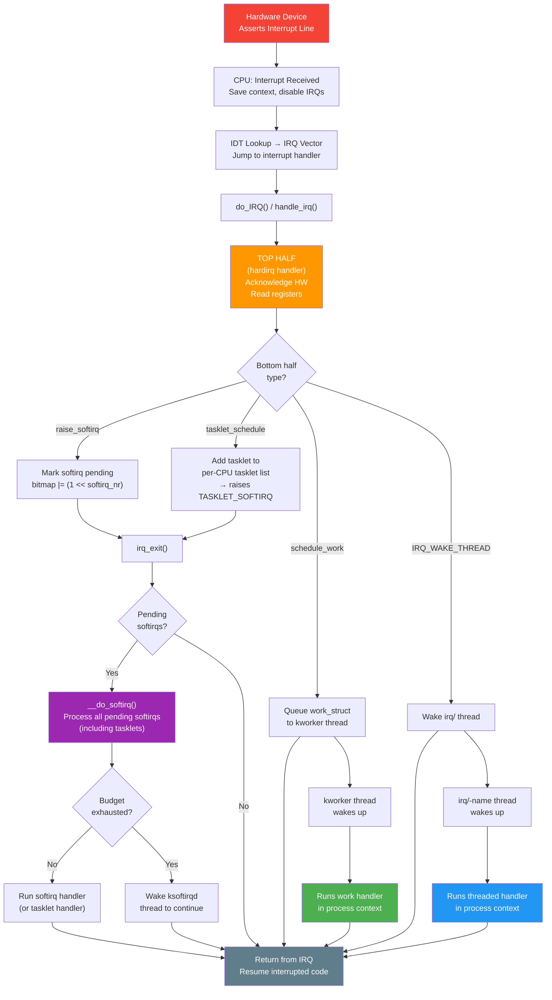
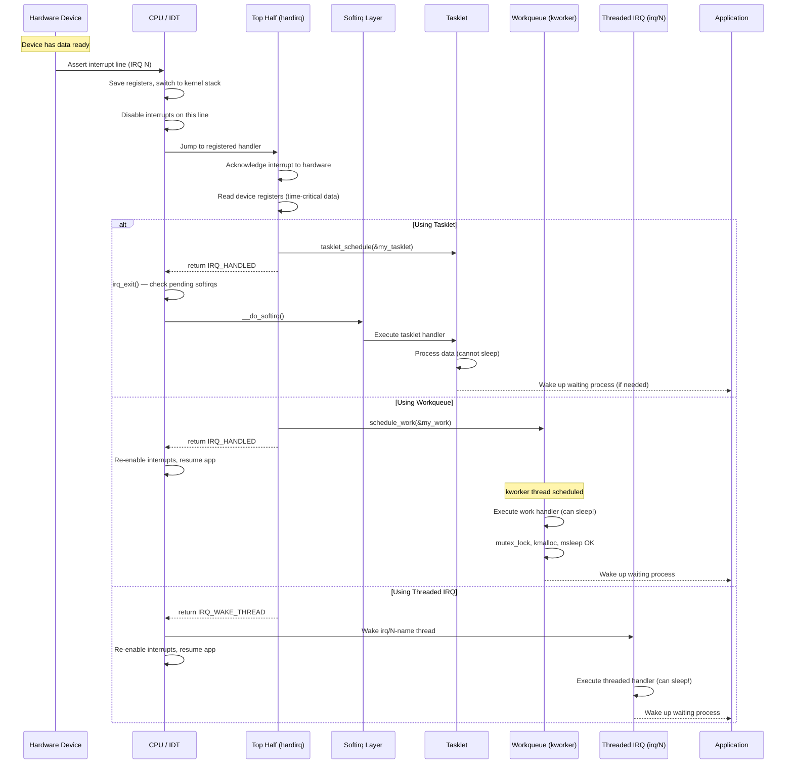
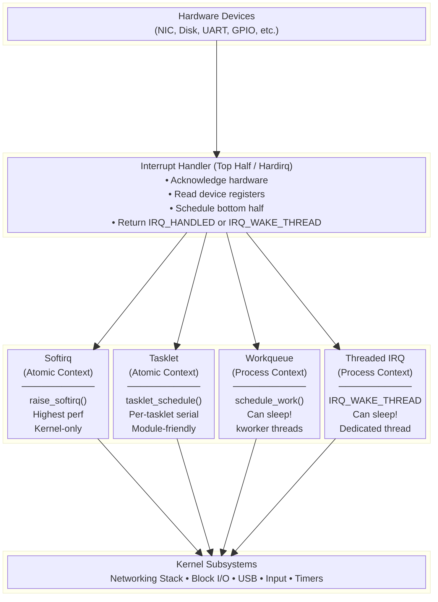

# Linux Bottom Halves — Deferred Interrupt Processing

## Table of Contents

1. [Introduction](#introduction)
2. [Why Bottom Halves Exist](#why-bottom-halves-exist)
3. [Top Half vs Bottom Half](#top-half-vs-bottom-half)
4. [Types of Bottom Halves](#types-of-bottom-halves)
   - [Softirqs](#1-softirqs)
   - [Tasklets](#2-tasklets)
   - [Workqueues](#3-workqueues)
   - [Threaded IRQs](#4-threaded-irqs)
5. [Comparison Table](#comparison-table)
6. [When to Use Which Bottom Half](#when-to-use-which-bottom-half)
7. [Sample Code — All Mechanisms](#sample-code--all-mechanisms)
8. [Flow Diagram — Interrupt Processing](#flow-diagram--interrupt-processing)
9. [Sequence Diagram — Complete Interrupt Lifecycle](#sequence-diagram--complete-interrupt-lifecycle)
10. [Block Diagram — Bottom Half Architecture](#block-diagram--bottom-half-architecture)
11. [Key Data Structures](#key-data-structures)
12. [Important Rules and Constraints](#important-rules-and-constraints)
13. [Interview Q&A](#interview-qa)
14. [Summary](#summary)

---

## Introduction

In the Linux kernel, interrupt handling is split into two parts:

- **Top Half (Hardirq):** Runs immediately when the interrupt fires. Must be fast — it runs with interrupts disabled (or at least the current IRQ line disabled).
- **Bottom Half:** Deferred work that runs later, outside the hardirq context, when it is safe to do more processing.

Bottom halves are the kernel's mechanism for **deferring non-critical, time-consuming work** from the interrupt handler to a safer execution context.

---

## Why Bottom Halves Exist

### The Problem

When a hardware interrupt fires:

1. The CPU stops whatever it was doing.
2. Interrupts are disabled (partially or fully).
3. The interrupt handler (top half) runs.

If the handler takes too long:
- Other interrupts are missed or delayed.
- System responsiveness degrades.
- Real-time deadlines are missed.

### The Solution

Split interrupt work into two phases:

```
Hardware Interrupt
       │
       ▼
┌──────────────┐    Fast, minimal work
│  TOP HALF    │    • Acknowledge hardware
│  (hardirq)   │    • Read data from device registers
│              │    • Schedule bottom half
└──────┬───────┘    • Return quickly
       │
       ▼
┌──────────────┐    Deferred, heavier work
│ BOTTOM HALF  │    • Process the data
│ (softirq /   │    • Copy to buffers
│  tasklet /   │    • Wake up user processes
│  workqueue)  │    • Protocol processing
└──────────────┘
```

---

## Top Half vs Bottom Half

| Aspect | Top Half (Hardirq) | Bottom Half |
|--------|-------------------|-------------|
| **When it runs** | Immediately on interrupt | Deferred — runs later |
| **Interrupts** | Disabled (current line) | Enabled (softirq/tasklet) or fully preemptible (workqueue) |
| **Context** | Interrupt context | Interrupt context (softirq/tasklet) or Process context (workqueue) |
| **Can sleep?** | ❌ No | ❌ No (softirq/tasklet), ✅ Yes (workqueue) |
| **Can acquire mutex?** | ❌ No | ❌ No (softirq/tasklet), ✅ Yes (workqueue) |
| **Duration** | Microseconds | Milliseconds acceptable |
| **Preemptible?** | ❌ No | ❌ No (softirq/tasklet), ✅ Yes (workqueue) |
| **Runs on** | Interrupting CPU | Same CPU (softirq/tasklet) or any CPU (workqueue) |

---

## Types of Bottom Halves

### 1. Softirqs

**The lowest-level, highest-performance bottom half mechanism.**

- Statically defined at compile time (limited to ~10 types).
- Can run concurrently on multiple CPUs (same softirq type!).
- Require careful locking since they are reentrant.
- Used by performance-critical subsystems: networking (`NET_TX_SOFTIRQ`, `NET_RX_SOFTIRQ`), block I/O, timers.

#### Predefined Softirq Types

```c
enum {
    HI_SOFTIRQ = 0,        // High-priority tasklets
    TIMER_SOFTIRQ,          // Timer bottom half
    NET_TX_SOFTIRQ,         // Network transmit
    NET_RX_SOFTIRQ,         // Network receive
    BLOCK_SOFTIRQ,          // Block device
    IRQ_POLL_SOFTIRQ,       // IRQ polling
    TASKLET_SOFTIRQ,        // Regular tasklets
    SCHED_SOFTIRQ,          // Scheduler
    HRTIMER_SOFTIRQ,        // High-resolution timers
    RCU_SOFTIRQ,            // RCU processing
    NR_SOFTIRQS             // Count
};
```

#### When Softirqs Run

Softirqs are checked and executed at these points:
1. After returning from a hardware interrupt (`irq_exit()`)
2. In the `ksoftirqd` kernel thread (when softirqs are excessive)
3. In code that explicitly calls `local_bh_enable()`

#### Softirq Sample Code

```c
#include <linux/interrupt.h>

/* Softirq handler function */
static void my_softirq_handler(struct softirq_action *action)
{
    /* Runs in softirq context — cannot sleep! */
    printk(KERN_INFO "Softirq handler executing on CPU %d\n",
           smp_processor_id());

    /* Process deferred work here */
}

/* Registration — typically in subsystem init (not in loadable modules) */
static int __init my_subsystem_init(void)
{
    /* Register softirq — uses a statically defined index */
    open_softirq(NET_RX_SOFTIRQ, my_softirq_handler);
    return 0;
}

/* Raising (triggering) the softirq — called from top half */
static irqreturn_t my_hardirq_handler(int irq, void *dev_id)
{
    /* Minimal top-half work */
    /* ... read device registers ... */

    /* Schedule the softirq to run */
    raise_softirq(NET_RX_SOFTIRQ);

    return IRQ_HANDLED;
}
```

> **Note:** Softirqs are not available for loadable modules. Use tasklets or workqueues in drivers.

---

### 2. Tasklets

**Built on top of softirqs. The most common bottom half for device drivers.**

- Dynamically created — can be used in loadable modules.
- A given tasklet runs on **only one CPU at a time** (serialized per-tasklet).
- Different tasklets can run concurrently on different CPUs.
- Cannot sleep — runs in softirq context.

#### Tasklet Sample Code — Complete Driver

```c
#include <linux/module.h>
#include <linux/interrupt.h>
#include <linux/kernel.h>

#define IRQ_NUMBER 11  /* Example IRQ — replace with actual */

/* Data to pass to tasklet */
struct my_device_data {
    unsigned long received_data;
    struct tasklet_struct my_tasklet;
};

static struct my_device_data dev_data;

/* ──────────────────────────────────────────────
 * BOTTOM HALF — Tasklet handler
 * Runs in softirq context (cannot sleep!)
 * ────────────────────────────────────────────── */
static void my_tasklet_handler(unsigned long data)
{
    struct my_device_data *dev = (struct my_device_data *)data;

    printk(KERN_INFO "Tasklet: Processing data = 0x%lx on CPU %d\n",
           dev->received_data, smp_processor_id());

    /* Heavy processing that was deferred from top half:
     * - Parse protocol headers
     * - Copy data to kernel buffers
     * - Update statistics
     * - Wake up waiting user processes
     */
}

/* ──────────────────────────────────────────────
 * TOP HALF — Hardirq handler
 * Runs with interrupts disabled — must be FAST
 * ────────────────────────────────────────────── */
static irqreturn_t my_hardirq_handler(int irq, void *dev_id)
{
    struct my_device_data *dev = (struct my_device_data *)dev_id;

    /* 1. Acknowledge the interrupt to hardware */
    /* iowrite32(ACK_BIT, dev->regs + INT_STATUS); */

    /* 2. Read critical data from device registers */
    dev->received_data = 0xDEADBEEF;  /* Simulated register read */

    /* 3. Schedule the bottom half */
    tasklet_schedule(&dev->my_tasklet);

    return IRQ_HANDLED;
}

/* ──────────────────────────────────────────────
 * MODULE INIT
 * ────────────────────────────────────────────── */
static int __init my_driver_init(void)
{
    int ret;

    /* Initialize the tasklet */
    tasklet_init(&dev_data.my_tasklet,
                 my_tasklet_handler,
                 (unsigned long)&dev_data);

    /* Register interrupt handler */
    ret = request_irq(IRQ_NUMBER,
                      my_hardirq_handler,
                      IRQF_SHARED,
                      "my_device",
                      &dev_data);
    if (ret) {
        printk(KERN_ERR "Failed to request IRQ %d\n", IRQ_NUMBER);
        return ret;
    }

    printk(KERN_INFO "Driver loaded: IRQ %d registered\n", IRQ_NUMBER);
    return 0;
}

/* ──────────────────────────────────────────────
 * MODULE EXIT
 * ────────────────────────────────────────────── */
static void __exit my_driver_exit(void)
{
    free_irq(IRQ_NUMBER, &dev_data);
    tasklet_kill(&dev_data.my_tasklet);  /* Wait for pending tasklet to finish */
    printk(KERN_INFO "Driver unloaded\n");
}

module_init(my_driver_init);
module_exit(my_driver_exit);
MODULE_LICENSE("GPL");
MODULE_DESCRIPTION("Tasklet Bottom Half Example");
```

#### Tasklet API Summary

```c
/* Static declaration */
DECLARE_TASKLET(name, function);                    /* Enabled by default */
DECLARE_TASKLET_DISABLED(name, function);           /* Disabled by default */

/* Dynamic initialization */
tasklet_init(struct tasklet_struct *t, void (*func)(unsigned long), unsigned long data);

/* Scheduling */
tasklet_schedule(struct tasklet_struct *t);          /* Normal priority */
tasklet_hi_schedule(struct tasklet_struct *t);       /* High priority */

/* Control */
tasklet_disable(struct tasklet_struct *t);           /* Disable (waits if running) */
tasklet_enable(struct tasklet_struct *t);            /* Re-enable */
tasklet_kill(struct tasklet_struct *t);              /* Kill — waits for completion */
```

---

### 3. Workqueues

**The most flexible bottom half — runs in process context.**

- Runs in a **kernel thread** (process context) — **can sleep!**
- Can acquire mutexes, perform blocking I/O, allocate memory with `GFP_KERNEL`.
- Work items are queued and executed by kernel worker threads (`kworker`).
- Can be delayed (scheduled to run after a timeout).

#### Workqueue Sample Code — Complete Driver

```c
#include <linux/module.h>
#include <linux/interrupt.h>
#include <linux/workqueue.h>
#include <linux/slab.h>

#define IRQ_NUMBER 11

/* Device data structure */
struct my_device {
    unsigned long hw_data;
    struct work_struct my_work;           /* Regular work */
    struct delayed_work my_delayed_work;  /* Delayed work */
    struct workqueue_struct *my_wq;       /* Custom workqueue (optional) */
};

static struct my_device dev;

/* ──────────────────────────────────────────────
 * BOTTOM HALF — Work handler
 * Runs in PROCESS CONTEXT — CAN SLEEP!
 * ────────────────────────────────────────────── */
static void my_work_handler(struct work_struct *work)
{
    struct my_device *dev = container_of(work, struct my_device, my_work);

    printk(KERN_INFO "Work handler: Processing data = 0x%lx on CPU %d\n",
           dev->hw_data, smp_processor_id());

    /* We CAN do things forbidden in softirq/tasklet context: */

    /* 1. Sleep / block */
    msleep(10);

    /* 2. Allocate memory that may sleep */
    void *buf = kmalloc(4096, GFP_KERNEL);
    if (buf) {
        /* Process data */
        kfree(buf);
    }

    /* 3. Acquire a mutex */
    /* mutex_lock(&some_mutex); */
    /* ... critical section ... */
    /* mutex_unlock(&some_mutex); */

    /* 4. Copy data to userspace buffers, wake processes, etc. */
}

/* Delayed work handler */
static void my_delayed_work_handler(struct work_struct *work)
{
    struct my_device *dev = container_of(work, struct my_device,
                                         my_delayed_work.work);

    printk(KERN_INFO "Delayed work: data = 0x%lx (ran after delay)\n",
           dev->hw_data);
}

/* ──────────────────────────────────────────────
 * TOP HALF — Hardirq handler
 * ────────────────────────────────────────────── */
static irqreturn_t my_hardirq_handler(int irq, void *dev_id)
{
    struct my_device *mydev = (struct my_device *)dev_id;

    /* Read hardware data */
    mydev->hw_data = 0xCAFEBABE;

    /* Option 1: Schedule work on default system workqueue */
    schedule_work(&mydev->my_work);

    /* Option 2: Schedule on custom workqueue */
    /* queue_work(mydev->my_wq, &mydev->my_work); */

    /* Option 3: Schedule delayed work (runs after 100ms) */
    /* schedule_delayed_work(&mydev->my_delayed_work, msecs_to_jiffies(100)); */

    return IRQ_HANDLED;
}

/* ──────────────────────────────────────────────
 * MODULE INIT
 * ────────────────────────────────────────────── */
static int __init my_driver_init(void)
{
    int ret;

    /* Initialize work items */
    INIT_WORK(&dev.my_work, my_work_handler);
    INIT_DELAYED_WORK(&dev.my_delayed_work, my_delayed_work_handler);

    /* Create a custom workqueue (optional — for dedicated workers) */
    dev.my_wq = create_singlethread_workqueue("my_device_wq");
    if (!dev.my_wq)
        return -ENOMEM;

    /* Register interrupt handler */
    ret = request_irq(IRQ_NUMBER, my_hardirq_handler,
                      IRQF_SHARED, "my_device", &dev);
    if (ret) {
        destroy_workqueue(dev.my_wq);
        return ret;
    }

    printk(KERN_INFO "Workqueue driver loaded\n");
    return 0;
}

/* ──────────────────────────────────────────────
 * MODULE EXIT
 * ────────────────────────────────────────────── */
static void __exit my_driver_exit(void)
{
    free_irq(IRQ_NUMBER, &dev);
    cancel_work_sync(&dev.my_work);              /* Wait for pending work */
    cancel_delayed_work_sync(&dev.my_delayed_work);
    destroy_workqueue(dev.my_wq);               /* Destroy custom workqueue */
    printk(KERN_INFO "Workqueue driver unloaded\n");
}

module_init(my_driver_init);
module_exit(my_driver_exit);
MODULE_LICENSE("GPL");
MODULE_DESCRIPTION("Workqueue Bottom Half Example");
```

#### Workqueue API Summary

```c
/* Work initialization */
INIT_WORK(&work, handler_function);
INIT_DELAYED_WORK(&delayed_work, handler_function);

/* Scheduling on default system workqueue */
schedule_work(&work);
schedule_delayed_work(&delayed_work, delay_in_jiffies);

/* Custom workqueue creation */
create_workqueue("name");                           /* Per-CPU workers */
create_singlethread_workqueue("name");              /* Single worker thread */
alloc_workqueue("name", flags, max_active);         /* Modern API */

/* Scheduling on custom workqueue */
queue_work(wq, &work);
queue_delayed_work(wq, &delayed_work, delay);

/* Cancellation and cleanup */
cancel_work_sync(&work);                            /* Cancel + wait */
cancel_delayed_work_sync(&delayed_work);
flush_workqueue(wq);                                /* Wait for all pending */
destroy_workqueue(wq);                              /* Destroy */
```

---

### 4. Threaded IRQs

**Modern alternative — combines top and bottom half in one API call.**

- The bottom half runs in a dedicated kernel thread (`irq/<irq>-<name>`).
- Process context — can sleep.
- Simplifies driver code — single `request_threaded_irq()` call.
- Preferred for modern drivers, especially on PREEMPT_RT kernels.

#### Threaded IRQ Sample Code

```c
#include <linux/module.h>
#include <linux/interrupt.h>

#define IRQ_NUMBER 11

struct my_device {
    unsigned long data;
};

static struct my_device dev;

/* ──────────────────────────────────────────────
 * TOP HALF — Quick hardirq handler
 * Return IRQ_WAKE_THREAD to trigger the threaded handler
 * ────────────────────────────────────────────── */
static irqreturn_t my_hardirq_handler(int irq, void *dev_id)
{
    struct my_device *mydev = (struct my_device *)dev_id;

    /* Acknowledge hardware interrupt */
    /* Read time-critical data */
    mydev->data = 0xBAADF00D;

    /* Signal the kernel to run the threaded handler */
    return IRQ_WAKE_THREAD;
}

/* ──────────────────────────────────────────────
 * BOTTOM HALF — Threaded handler
 * Runs in process context — CAN SLEEP!
 * Runs in thread: irq/11-my_device
 * ────────────────────────────────────────────── */
static irqreturn_t my_threaded_handler(int irq, void *dev_id)
{
    struct my_device *mydev = (struct my_device *)dev_id;

    printk(KERN_INFO "Threaded IRQ: data=0x%lx, pid=%d\n",
           mydev->data, current->pid);

    /* Can sleep, acquire mutexes, do I/O */
    msleep(5);

    return IRQ_HANDLED;
}

static int __init my_driver_init(void)
{
    int ret;

    /* Single call registers BOTH top half and bottom half */
    ret = request_threaded_irq(IRQ_NUMBER,
                               my_hardirq_handler,    /* Top half (can be NULL) */
                               my_threaded_handler,   /* Bottom half (threaded) */
                               IRQF_SHARED,
                               "my_device",
                               &dev);
    if (ret) {
        printk(KERN_ERR "Failed to register threaded IRQ\n");
        return ret;
    }

    printk(KERN_INFO "Threaded IRQ driver loaded\n");
    return 0;
}

static void __exit my_driver_exit(void)
{
    free_irq(IRQ_NUMBER, &dev);
    printk(KERN_INFO "Threaded IRQ driver unloaded\n");
}

module_init(my_driver_init);
module_exit(my_driver_exit);
MODULE_LICENSE("GPL");
MODULE_DESCRIPTION("Threaded IRQ Example");
```

---

## Comparison Table

| Feature | Softirq | Tasklet | Workqueue | Threaded IRQ |
|---------|---------|---------|-----------|-------------|
| **Context** | Softirq (interrupt) | Softirq (interrupt) | Process | Process |
| **Can sleep?** | ❌ | ❌ | ✅ | ✅ |
| **Can use mutex?** | ❌ | ❌ | ✅ | ✅ |
| **Concurrency** | Same softirq on multiple CPUs | Same tasklet serialized | Per-worker thread | Per-IRQ thread |
| **Latency** | Lowest | Low | Higher | Medium |
| **In modules?** | ❌ | ✅ | ✅ | ✅ |
| **Complexity** | High (locking) | Medium | Low | Low |
| **Dynamic creation** | ❌ (compile-time only) | ✅ | ✅ | ✅ |
| **Priority** | High | High/Normal | Normal (adjustable) | RT adjustable |
| **Use case** | Networking, timers | Simple device drivers | Complex I/O, sleeping | Modern drivers |

---

## When to Use Which Bottom Half

```
Need to defer work from interrupt handler?
│
├── Does the work need to SLEEP?
│   │
│   ├── YES ──► Does it need a dedicated thread per IRQ?
│   │           │
│   │           ├── YES ──► Use THREADED IRQ
│   │           │           (request_threaded_irq)
│   │           │
│   │           └── NO ──►  Use WORKQUEUE
│   │                       (schedule_work / queue_work)
│   │
│   └── NO ──►  Is it performance-critical (millions of IRQs/sec)?
│               │
│               ├── YES ──► Is it a core kernel subsystem?
│               │           │
│               │           ├── YES ──► Use SOFTIRQ
│               │           │           (networking, block I/O)
│               │           │
│               │           └── NO ──►  Use TASKLET
│               │
│               └── NO ──►  Use TASKLET
│                           (simplest non-sleeping option)
```

### Decision Rules

1. **Default choice for new drivers:** `Threaded IRQ` or `Workqueue`
2. **If you need to sleep** (mutex, kmalloc with GFP_KERNEL, I/O): `Workqueue` or `Threaded IRQ`
3. **If high performance, cannot sleep:** `Tasklet`
4. **If you're writing core subsystem code (networking, block):** `Softirq`
5. **Tasklets are being deprecated** in favor of workqueues/threaded IRQs in newer kernels

---

## Flow Diagram — Interrupt Processing



---

## Sequence Diagram — Complete Interrupt Lifecycle



---

## Block Diagram — Bottom Half Architecture



---

## Key Data Structures

### `struct tasklet_struct`

```c
struct tasklet_struct {
    struct tasklet_struct *next;   /* Next tasklet in per-CPU list */
    unsigned long state;           /* TASKLET_STATE_SCHED, TASKLET_STATE_RUN */
    atomic_t count;                /* 0 = enabled, nonzero = disabled */
    bool use_callback;
    union {
        void (*func)(unsigned long data);
        void (*callback)(struct tasklet_struct *t);
    };
    unsigned long data;            /* Argument passed to handler */
};
```

### `struct work_struct`

```c
struct work_struct {
    atomic_long_t data;            /* Work flags + pointer to workqueue */
    struct list_head entry;        /* Linked list node */
    work_func_t func;             /* Handler function */
};

/* Delayed variant */
struct delayed_work {
    struct work_struct work;
    struct timer_list timer;      /* Timer for delay */
    struct workqueue_struct *wq;
    int cpu;
};
```

### `struct softirq_action`

```c
struct softirq_action {
    void (*action)(struct softirq_action *);
};

/* Kernel maintains an array: */
static struct softirq_action softirq_vec[NR_SOFTIRQS];
```

---

## Important Rules and Constraints

### What You CANNOT Do in Softirq/Tasklet Context (Atomic Context)

```c
/* ❌ ALL OF THESE WILL CRASH/DEADLOCK: */

mutex_lock(&some_mutex);                    /* ❌ Can sleep */
kmalloc(size, GFP_KERNEL);                 /* ❌ Can sleep (use GFP_ATOMIC) */
msleep(10);                                 /* ❌ Sleeps */
copy_to_user(ubuf, kbuf, len);             /* ❌ Can fault/sleep */
usleep_range(100, 200);                    /* ❌ Sleeps */
wait_event(queue, condition);              /* ❌ Sleeps */
```

### What You CAN Do in Softirq/Tasklet Context

```c
/* ✅ These are safe: */

spin_lock(&some_lock);                     /* ✅ Busy-waits, doesn't sleep */
spin_lock_irqsave(&lock, flags);           /* ✅ Also disables interrupts */
kmalloc(size, GFP_ATOMIC);                /* ✅ Non-sleeping allocation */
printk(KERN_INFO "...");                   /* ✅ Buffered, doesn't sleep */
wake_up(&wait_queue);                      /* ✅ Wakes process, doesn't sleep */
tasklet_schedule(&another_tasklet);        /* ✅ Schedule another bottom half */
```

### Locking Rules

| Lock Type | Hardirq | Softirq/Tasklet | Workqueue/Thread |
|-----------|---------|-----------------|-----------------|
| `spin_lock()` | ⚠️ Use `spin_lock_irqsave()` | ⚠️ Use `spin_lock_bh()` if shared with softirq | ✅ |
| `mutex_lock()` | ❌ | ❌ | ✅ |
| `semaphore` | ❌ | ❌ | ✅ |
| `read/write lock` | ⚠️ Use `_irqsave` variant | ⚠️ Use `_bh` variant | ✅ |

---

## Interview Q&A

### Q1: Why can't tasklets sleep?
**A:** Tasklets run in softirq context, which is interrupt context (between hardirq and process context). The scheduler cannot preempt or reschedule code in interrupt context. Sleeping would mean calling `schedule()`, which is illegal — the kernel will BUG/OOPS.

### Q2: What happens if a softirq takes too long?
**A:** After processing a batch of softirqs, the kernel checks if it has been running too long. If so, it defers remaining softirqs to the `ksoftirqd` kernel thread, which runs at normal priority and can be preempted, preventing softirq starvation of user processes.

### Q3: Why are tasklets being deprecated?
**A:** Tasklets have drawbacks: (1) they run in atomic context needlessly for most drivers, (2) they impose serialization per-tasklet which limits scalability, (3) workqueues and threaded IRQs provide process context with the same or better performance for most use cases.

### Q4: Can a bottom half be interrupted by a hardirq?
**A:** Yes! Softirqs and tasklets run with interrupts enabled. A new hardware interrupt can preempt a running bottom half. This is why `spin_lock_bh()` is needed when sharing data between process context and softirq context.

### Q5: What is `ksoftirqd`?
**A:** It's a per-CPU kernel thread (`ksoftirqd/0`, `ksoftirqd/1`, ...) that processes softirqs when they are raised too frequently. It runs at normal priority, ensuring softirqs don't monopolize the CPU indefinitely.

---

## Summary

| Mechanism | Context | Can Sleep | Best For |
|-----------|---------|-----------|----------|
| **Softirq** | Interrupt | ❌ | High-perf core subsystems (networking, block) |
| **Tasklet** | Interrupt | ❌ | Simple, quick driver bottom halves |
| **Workqueue** | Process | ✅ | Complex work needing sleep/mutex/I/O |
| **Threaded IRQ** | Process | ✅ | Modern drivers, PREEMPT_RT compatibility |

**Key Takeaways:**

1. **Top half = fast, bottom half = deferred** — split work to minimize interrupt latency.
2. **If you need to sleep, use workqueue or threaded IRQ.**
3. **Default choice for new drivers: threaded IRQ** (`request_threaded_irq()`).
4. **Tasklets are legacy** — prefer workqueues for new code.
5. **Softirqs are kernel-internal only** — not for loadable modules.

---

*Document prepared for Linux kernel interview preparation.*
*Covers: softirqs, tasklets, workqueues, threaded IRQs, interrupt handling architecture, locking rules, and sample driver code.*
