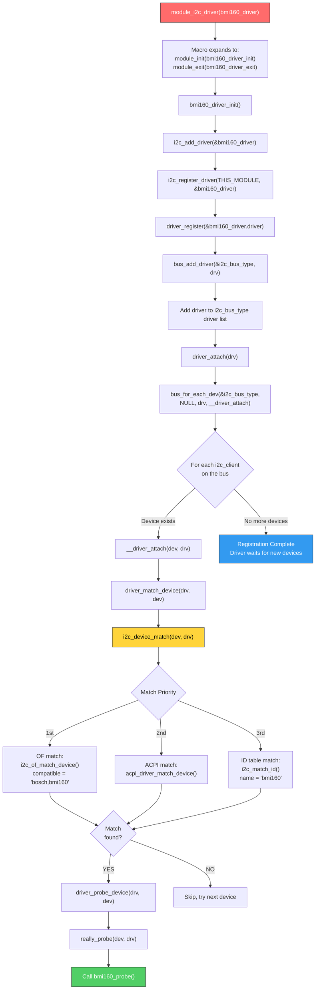

```mermaid
flowchart TD
    A["module_i2c_driver(bmi160_driver)"] --> B["Macro expands to:<br/>module_init(bmi160_driver_init)<br/>module_exit(bmi160_driver_exit)"]

    B --> C["bmi160_driver_init()"]
    C --> D["i2c_add_driver(&bmi160_driver)"]
    D --> E["i2c_register_driver(THIS_MODULE, &bmi160_driver)"]

    E --> F["driver_register(&bmi160_driver.driver)"]
    F --> G["bus_add_driver(&i2c_bus_type, drv)"]
    G --> H["Add driver to i2c_bus_type driver list"]
    H --> I["driver_attach(drv)"]
    I --> J["bus_for_each_dev(&i2c_bus_type,<br/>NULL, drv, __driver_attach)"]

    J --> K{"For each i2c_client<br/>on the bus"}
    K -->|"Device exists"| L["__driver_attach(dev, drv)"]
    L --> M["driver_match_device(drv, dev)"]
    M --> N["i2c_device_match(dev, drv)"]

    N --> O{"Match Priority"}
    O -->|"1st"| P["OF match:<br/>i2c_of_match_device()<br/>compatible = 'bosch,bmi160'"]
    O -->|"2nd"| Q["ACPI match:<br/>acpi_driver_match_device()"]
    O -->|"3rd"| R["ID table match:<br/>i2c_match_id()<br/>name = 'bmi160'"]

    P --> S{"Match<br/>found?"}
    Q --> S
    R --> S

    S -->|"YES"| T["driver_probe_device(drv, dev)"]
    S -->|"NO"| U["Skip, try next device"]

    T --> V["really_probe(dev, drv)"]
    V --> W["Call bmi160_probe()"]

    K -->|"No more devices"| X["Registration Complete<br/>Driver waits for new devices"]

    style A fill:#ff6b6b,color:#fff,stroke:#333
    style W fill:#51cf66,color:#fff,stroke:#333
    style X fill:#339af0,color:#fff,stroke:#333
    style N fill:#ffd43b,color:#000,stroke:#333

```

