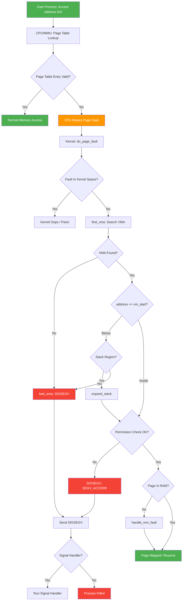

```mermaid
flowchart TD
    A["User Process: Access address 0x0"]
    B["CPU/MMU: Page Table Lookup"]
    C{"Page Table Entry Valid?"}
    D["Normal Memory Access"]
    E["CPU Raises Page Fault"]
    F["Kernel: do_page_fault"]
    G{"Fault in Kernel Space?"}
    H["Kernel Oops / Panic"]
    I["find_vma: Search VMA"]
    J{"VMA Found?"}
    K["bad_area: SIGSEGV"]
    L{"address >= vm_start?"}
    M{"Stack Region?"}
    N["expand_stack"]
    O{"Permission Check OK?"}
    P["SIGSEGV: SEGV_ACCERR"]
    Q{"Page in RAM?"}
    R["handle_mm_fault"]
    S["Page Mapped: Resume"]
    T["Send SIGSEGV"]
    U{"Signal Handler?"}
    V["Run Signal Handler"]
    W["Process Killed"]

    A --> B
    B --> C
    C -->|Yes| D
    C -->|No| E
    E --> F
    F --> G
    G -->|Yes| H
    G -->|No| I
    I --> J
    J -->|No| K
    J -->|Yes| L
    L -->|Below| M
    L -->|Inside| O
    M -->|Yes| N
    M -->|No| K
    N --> O
    O -->|No| P
    O -->|Yes| Q
    Q -->|No| R
    Q -->|Yes| S
    R --> S
    K --> T
    P --> T
    T --> U
    U -->|Yes| V
    U -->|No| W

    style A fill:#4CAF50,color:#fff
    style D fill:#4CAF50,color:#fff
    style S fill:#4CAF50,color:#fff
    style E fill:#FF9800,color:#fff
    style K fill:#f44336,color:#fff
    style P fill:#f44336,color:#fff
    style W fill:#f44336,color:#fff
```
