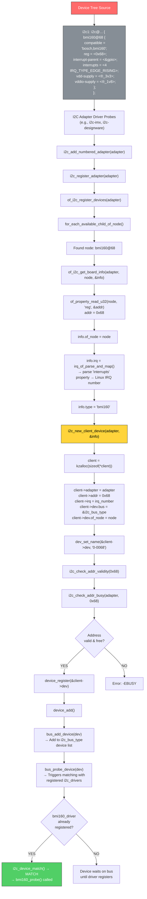

```mermaid
flowchart TD
    A["Device Tree Source"] --> B["i2c1: i2c@... { <br/> bmi160@68 { <br/>&nbsp;&nbsp;compatible = 'bosch,bmi160';<br/>&nbsp;&nbsp;reg = &lt;0x68&gt;;<br/>&nbsp;&nbsp;interrupt-parent = &lt;&gpio&gt;;<br/>&nbsp;&nbsp;interrupts = &lt;4 IRQ_TYPE_EDGE_RISING&gt;;<br/>&nbsp;&nbsp;vdd-supply = &lt;&reg_3v3&gt;;<br/>&nbsp;&nbsp;vddio-supply = &lt;&reg_1v8&gt;;<br/> };<br/>};"]

    B --> C["I2C Adapter Driver Probes<br/>(e.g., i2c-imx, i2c-designware)"]
    C --> D["i2c_add_numbered_adapter(adapter)"]
    D --> E["i2c_register_adapter(adapter)"]

    E --> F["of_i2c_register_devices(adapter)"]
    F --> G["for_each_available_child_of_node()"]

    G --> H["Found node: bmi160@68"]
    H --> I["of_i2c_get_board_info(adapter, node, &info)"]

    I --> I1["of_property_read_u32(node, 'reg', &addr)<br/>addr = 0x68"]
    I1 --> I2["info.of_node = node"]
    I2 --> I3["info.irq = irq_of_parse_and_map()<br/>→ parse 'interrupts' property → Linux IRQ number"]
    I3 --> I4["info.type = 'bmi160'"]

    I4 --> J["i2c_new_client_device(adapter, &info)"]

    J --> K["client = kzalloc(sizeof(*client))"]
    K --> L["client->adapter = adapter<br/>client->addr = 0x68<br/>client->irq = irq_number<br/>client->dev.bus = &i2c_bus_type<br/>client->dev.of_node = node"]

    L --> M["dev_set_name(&client->dev, '0-0068')"]
    M --> N["i2c_check_addr_validity(0x68)"]
    N --> O["i2c_check_addr_busy(adapter, 0x68)"]

    O --> P{"Address<br/>valid & free?"}
    P -->|"YES"| Q["device_register(&client->dev)"]
    P -->|"NO"| R["Error: -EBUSY"]

    Q --> S["device_add()"]
    S --> T["bus_add_device(dev)<br/>→ Add to i2c_bus_type device list"]
    T --> U["bus_probe_device(dev)<br/>→ Triggers matching with<br/>registered i2c_drivers"]

    U --> V{"bmi160_driver<br/>already<br/>registered?"}
    V -->|"YES"| W["i2c_device_match() → MATCH<br/>→ bmi160_probe() called"]
    V -->|"NO"| X["Device waits on bus<br/>until driver registers"]

    style A fill:#ff6b6b,color:#fff,stroke:#333
    style B fill:#868e96,color:#fff,stroke:#333
    style W fill:#51cf66,color:#fff,stroke:#333
    style J fill:#ffd43b,color:#000,stroke:#333

```
