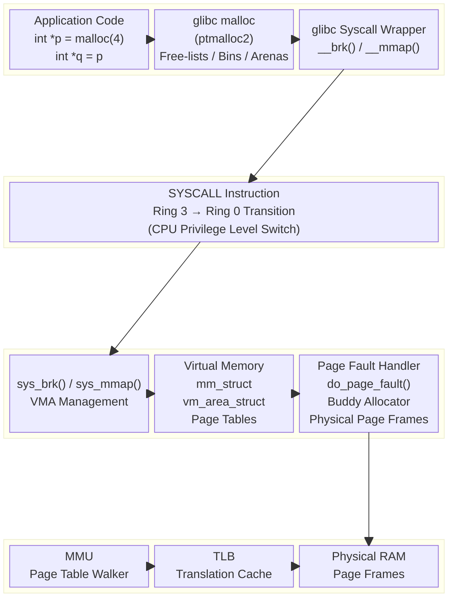
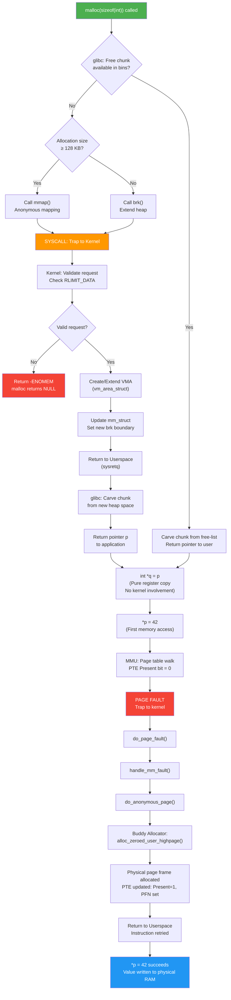
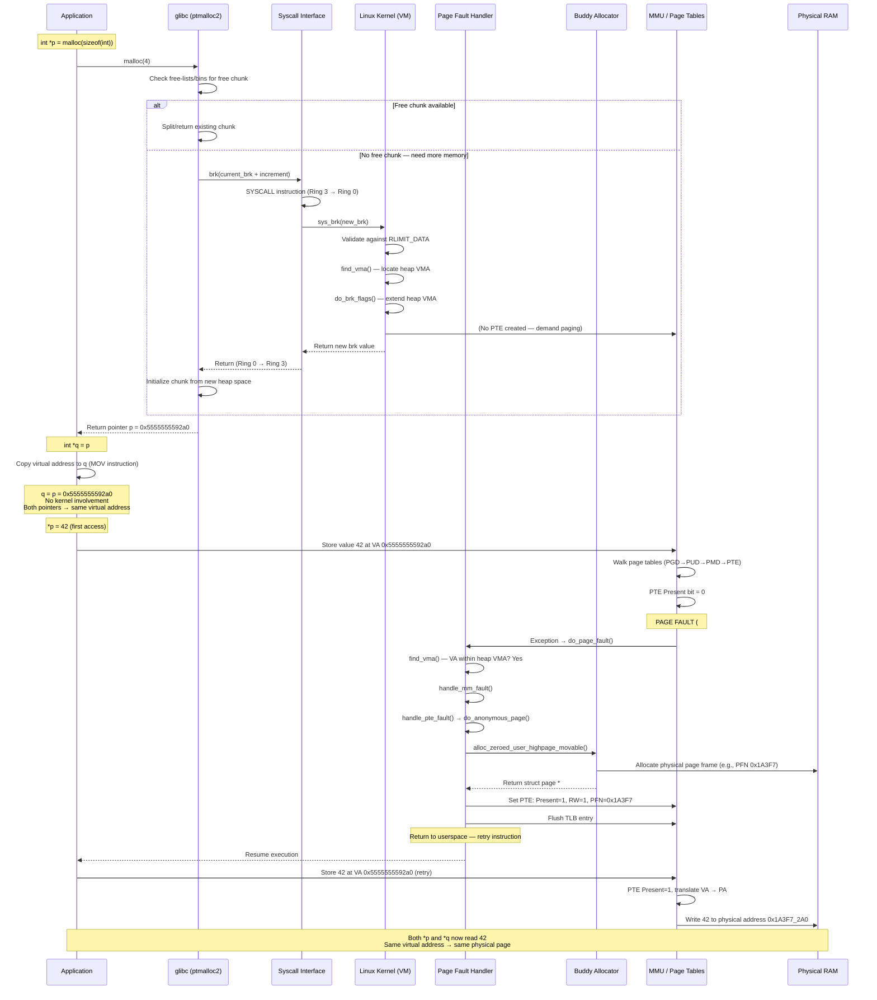

# Linux Memory Allocation Internals: `malloc()` — From Userspace to Kernel and Back

## Table of Contents

1. [Introduction](#introduction)
2. [The Code Under Study](#the-code-under-study)
3. [High-Level Overview](#high-level-overview)
4. [Step-by-Step Walkthrough](#step-by-step-walkthrough)
   - [Phase 1: Userspace — malloc() in glibc](#phase-1-userspace--malloc-in-glibc)
   - [Phase 2: Transition to Kernel — brk() / mmap()](#phase-2-transition-to-kernel--brk--mmap)
   - [Phase 3: Kernel — Virtual Memory Allocation](#phase-3-kernel--virtual-memory-allocation)
   - [Phase 4: Return to Userspace](#phase-4-return-to-userspace)
   - [Phase 5: Pointer Assignment int *q = p](#phase-5-pointer-assignment-int-q--p)
   - [Phase 6: First Access — Page Fault and Physical Page Allocation](#phase-6-first-access--page-fault-and-physical-page-allocation)
5. [Block Diagram — System Architecture](#block-diagram--system-architecture)
6. [Flow Diagram — malloc Execution Path](#flow-diagram--malloc-execution-path)
7. [Sequence Diagram — Complete Interaction](#sequence-diagram--complete-interaction)
8. [Key Data Structures Involved](#key-data-structures-involved)
9. [Memory Layout After Allocation](#memory-layout-after-allocation)
10. [Important Concepts](#important-concepts)
11. [Summary](#summary)

---

## Introduction

When a C programmer writes `malloc(sizeof(int))`, it appears as a simple function call. Behind the scenes, it triggers a complex chain of events spanning the **C library (glibc)**, the **Linux kernel's virtual memory subsystem**, the **page fault handler**, and the **hardware MMU**. This document traces the complete journey.

---

## The Code Under Study

```c
#include <stdlib.h>

int main(void)
{
    int *p = malloc(sizeof(int));   // Line 1
    int *q = p;                     // Line 2

    *p = 42;                        // Line 3 (first actual access — triggers page fault)

    free(p);                        // Line 4
    return 0;
}
```

### What Happens at Each Line

| Line | Action | Where it Happens |
|------|--------|-----------------|
| `int *p = malloc(sizeof(int))` | Allocates **virtual** memory, returns a pointer | Userspace (glibc) → possibly Kernel |
| `int *q = p` | Copies the **virtual address** — purely a CPU register/stack operation | Userspace only (no kernel involvement) |
| `*p = 42` | First write triggers a **page fault**; kernel allocates a **physical page** | Kernel (page fault handler) |
| `free(p)` | Returns memory to glibc's free-list (may or may not return to kernel) | Userspace (glibc) → possibly Kernel |

---

## High-Level Overview

```
 ┌──────────────────────────────────────────────────────────┐
 │                     USERSPACE                            │
 │                                                          │
 │  Application  ──►  glibc malloc  ──►  System Call        │
 │                        ▲                    │            │
 │                        │                    ▼            │
 │                   Return pointer      ┌──────────┐      │
 │                                       │ brk() or │      │
 │                                       │ mmap()   │      │
 └───────────────────────────────────────┤          ├──────┘
                                         └────┬─────┘
                                              │ Trap / SYSCALL instruction
 ┌────────────────────────────────────────────▼────────────┐
 │                     KERNEL SPACE                        │
 │                                                         │
 │  sys_brk() / sys_mmap()  ──►  VMA creation             │
 │                                    │                    │
 │                              Page Table updated         │
 │                              (PTE marked invalid        │
 │                               — no physical page yet)   │
 │                                    │                    │
 │                              Return virtual address     │
 └─────────────────────────────────────────────────────────┘
```

---

## Step-by-Step Walkthrough

### Phase 1: Userspace — `malloc()` in glibc

When `malloc(sizeof(int))` is called (requesting 4 bytes):

1. **glibc's ptmalloc2 allocator** checks its internal **free-lists** (bins) for a suitably sized free chunk.
2. glibc manages memory in **arenas** subdivided into **chunks**. Each chunk has metadata (size, flags).
3. **If a free chunk is available:**
   - glibc carves out 4 bytes (+ internal overhead, typically 16–32 bytes minimum) from an existing free chunk.
   - Returns a pointer to the usable region.
   - **No kernel call is made** — this is entirely in userspace.
4. **If no free chunk is available:**
   - glibc must request more memory from the kernel.
   - For **small allocations** (< 128 KB by default): calls `brk()` / `sbrk()` to extend the **heap segment**.
   - For **large allocations** (≥ 128 KB): calls `mmap()` to create a new anonymous mapping.
   - Since `sizeof(int)` = 4 bytes, glibc typically extends the heap via `brk()`.

#### glibc Chunk Layout

```
    chunk-> +-+-+-+-+-+-+-+-+-+-+-+-+-+-+-+-+-+-+-+-+-+-+-+
            |             Size of previous chunk          |
            +-+-+-+-+-+-+-+-+-+-+-+-+-+-+-+-+-+-+-+-+-+-+-+
            |             Size of chunk (in bytes)    |A|M|P|
      mem-> +-+-+-+-+-+-+-+-+-+-+-+-+-+-+-+-+-+-+-+-+-+-+-+
            |             User data starts here...        |
            .                                             .
            .             (malloc returns this address)    .
            .                                             .
            +-+-+-+-+-+-+-+-+-+-+-+-+-+-+-+-+-+-+-+-+-+-+-+
```

- **A** = NON_MAIN_ARENA flag
- **M** = IS_MMAPPED flag
- **P** = PREV_INUSE flag

---

### Phase 2: Transition to Kernel — `brk()` / `mmap()`

If glibc needs more memory, it invokes a **system call**:

#### `brk()` System Call Path

```
malloc()
  └──► glibc: __libc_malloc()
         └──► _int_malloc()
                └──► sysmalloc()
                       └──► __brk()          ← glibc wrapper
                              └──► SYSCALL   ← x86_64: syscall instruction
                                     └──► sys_brk()   ← Kernel entry point
```

#### How the System Call Works (x86_64)

1. glibc places the syscall number (`12` for `brk`) into register `rax`.
2. Arguments go into `rdi`, `rsi`, `rdx`, etc.
3. The `syscall` instruction triggers a **trap** into kernel mode.
4. CPU switches from **Ring 3** (user) to **Ring 0** (kernel).
5. The kernel's **syscall entry point** (`entry_SYSCALL_64`) dispatches to `sys_brk()`.

---

### Phase 3: Kernel — Virtual Memory Allocation

#### 3.1 `sys_brk()` — Extending the Heap

```c
// Simplified kernel flow
SYSCALL_DEFINE1(brk, unsigned long, brk)
{
    struct mm_struct *mm = current->mm;

    // Validate new brk value
    // Check against RLIMIT_DATA
    // Ensure no overlap with existing VMAs

    if (brk > mm->brk) {
        // Extend: create or expand the heap VMA
        do_brk_flags(old_brk, new_brk - old_brk, 0);
    }

    mm->brk = brk;
    return brk;
}
```

#### 3.2 VMA (Virtual Memory Area) Creation

The kernel creates or extends a **`vm_area_struct`** (VMA):

```c
struct vm_area_struct {
    unsigned long vm_start;     // Start of virtual address range
    unsigned long vm_end;       // End of virtual address range
    struct vm_area_struct *vm_next;
    pgprot_t vm_page_prot;      // Access permissions
    unsigned long vm_flags;     // VM_READ | VM_WRITE | VM_EXEC
    struct mm_struct *vm_mm;    // Owning process's mm_struct
    // ...
};
```

#### 3.3 What the Kernel Does NOT Do Yet

**Critical point:** At this stage, the kernel:

- ✅ Creates/extends the VMA (virtual address range is valid)
- ✅ Updates the process's `mm_struct`
- ❌ Does **NOT** allocate any physical page frames
- ❌ Does **NOT** create page table entries mapping to physical memory

This is **demand paging** — physical memory is allocated only when actually accessed.

#### 3.4 Page Table State After `brk()`

```
Page Table Entry (PTE) for the allocated virtual page:

┌─────────┬───────┬───────┬─────────┬─────────┐
│ Present │ R/W   │ U/S   │ PFN     │ Other   │
│   = 0   │  N/A  │  N/A  │  Empty  │  N/A    │
└─────────┴───────┴───────┴─────────┴─────────┘
         ▲
         │
    Not present — any access will trigger a PAGE FAULT
```

---

### Phase 4: Return to Userspace

1. Kernel sets the return value (new `brk` address) into `rax`.
2. Executes `sysretq` (or `iretq`) to return to Ring 3.
3. CPU restores userspace registers and resumes execution.
4. glibc receives the new heap boundary.
5. glibc carves a chunk from the newly available virtual space.
6. Returns a pointer to the application → stored in `p`.

```
p = 0x5555_5555_92a0   (example virtual address on the heap)
```

At this point, `p` holds a **valid virtual address**, but it is backed by **no physical memory**.

---

### Phase 5: Pointer Assignment `int *q = p`

```c
int *q = p;
```

This line is **purely a userspace operation**:

1. The compiler generates a simple `mov` instruction:
   ```asm
   mov rax, [rbp-8]    ; load p from stack
   mov [rbp-16], rax   ; store into q on stack
   ```
2. **No system call**, no kernel involvement, no memory allocation.
3. Both `p` and `q` now hold the **same virtual address** (e.g., `0x5555_5555_92a0`).
4. They point to the **same (not-yet-physical) memory location**.

#### Memory State After `int *q = p`

```
Stack:
┌────────────────────────┐
│  q = 0x5555555592a0    │  ← [rbp-16]
├────────────────────────┤
│  p = 0x5555555592a0    │  ← [rbp-8]
├────────────────────────┤
│  saved rbp             │
├────────────────────────┤
│  return address        │
└────────────────────────┘

Heap:
┌────────────────────────┐
│  0x5555555592a0:       │  ← p and q both point here
│  (Virtual page exists) │
│  (NO physical page)    │     ← Page fault on first access
└────────────────────────┘
```

---

### Phase 6: First Access — Page Fault & Physical Page Allocation

When `*p = 42` (or `*q = 42`) executes:

1. **CPU's MMU** walks the page table for virtual address `0x5555_5555_92a0`.
2. Finds the PTE with **Present bit = 0**.
3. **Hardware generates a page fault** (exception #14 on x86_64).
4. CPU traps into kernel → **`do_page_fault()`**.

#### Kernel Page Fault Handler Flow

```
do_page_fault()
  └──► handle_mm_fault()
         └──► __handle_mm_fault()
                └──► handle_pte_fault()
                       └──► do_anonymous_page()    ← This is our case
                              ├──► alloc_zeroed_user_highpage_movable()
                              │       └──► Buddy allocator: get_free_page()
                              │              └──► Returns a physical page frame
                              ├──► Set PTE: Present=1, R/W=1, PFN=physical_frame
                              └──► Return to userspace
```

#### After Page Fault Resolution

```
Page Table Entry (PTE) — AFTER page fault:

┌─────────┬───────┬───────┬──────────────┬─────────┐
│ Present │ R/W   │ U/S   │ PFN          │ Other   │
│   = 1   │  = 1  │  = 1  │ 0x1A3F7      │ Dirty=1 │
└─────────┴───────┴───────┴──────────────┴─────────┘

Virtual Address              Physical Address
0x5555_5555_92a0   ──────►   0x1A3F7_000 + offset
```

Now both `*p` and `*q` access **the same physical memory** containing the value `42`.

---

## Block Diagram — System Architecture



---

## Flow Diagram — malloc Execution Path



---

## Sequence Diagram — Complete Interaction



---

## Key Data Structures Involved

### Kernel Side

| Data Structure | Purpose |
|---|---|
| `struct mm_struct` | Per-process memory descriptor. Contains `brk`, `mmap`, VMA list, page table root (`pgd`) |
| `struct vm_area_struct` | Describes one contiguous virtual memory region (heap, stack, mmap, etc.) |
| `pgd_t / pud_t / pmd_t / pte_t` | 4-level page table entries (5-level on newer kernels) |
| `struct page` | Represents one physical page frame (4 KB). Managed by the buddy allocator |
| `struct task_struct` | Process descriptor. Contains pointer to `mm_struct` |

### glibc Side

| Data Structure | Purpose |
|---|---|
| `malloc_state` (Arena) | Per-thread (or shared) allocator state |
| `malloc_chunk` | Header for each allocated/free block |
| Bins (fast, small, large, unsorted) | Free-lists organized by chunk size |

---

## Memory Layout After Allocation

```
Process Virtual Address Space (64-bit)
─────────────────────────────────────────────────
0xFFFF_FFFF_FFFF_FFFF  ┌─────────────────────┐
                        │   Kernel Space       │
                        │   (not accessible    │
                        │    from userspace)    │
0xFFFF_8000_0000_0000  ├─────────────────────┤
                        │                     │
                        │       ...           │
                        │                     │
0x7FFF_FFFF_FFFF       ├─────────────────────┤
                        │   Stack ↓           │
                        │   [p, q, rbp, ret]  │
                        ├─────────────────────┤
                        │       ...           │
                        ├─────────────────────┤
                        │   Memory Mappings   │
                        │   (shared libs,     │
                        │    mmap regions)     │
                        ├─────────────────────┤
                        │       ...           │
                        ├─────────────────────┤
                        │   Heap ↑            │
                        │   ┌───────────────┐ │
                        │   │ malloc chunk   │ │
                        │   │ header (16B)   │ │
                        │   ├───────────────┤ │
                        │   │ USER DATA (4B)│◄├── p, q point here
                        │   │ value = 42    │ │   (0x5555555592a0)
                        │   ├───────────────┤ │
                        │   │ padding/align  │ │
                        │   └───────────────┘ │
                        ├─────────────────────┤
                        │   BSS (uninit data) │
                        ├─────────────────────┤
                        │   Data (init data)  │
                        ├─────────────────────┤
                        │   Text (code)       │
0x0000_0000_0000       └─────────────────────┘
```

---

## Important Concepts

### 1. Demand Paging

Physical memory is **not** allocated at `malloc()` time. It is allocated **on first access** via a page fault. This is why `malloc()` almost never fails — it only reserves virtual address space.

### 2. Overcommit

By default, Linux **overcommits** memory. `malloc()` can succeed even if there isn't enough physical RAM + swap. The OOM (Out-Of-Memory) killer handles the case when physical memory is truly exhausted.

### 3. `p` and `q` — Same Virtual Address, Same Physical Page

After `int *q = p`:
- `p` and `q` hold the **same virtual address**.
- They map to the **same physical page frame**.
- Modifying `*p` is visible through `*q` and vice versa.
- This is **not** a copy — it's **pointer aliasing**.

### 4. Page Size

On x86_64 Linux, the default page size is **4 KB (4096 bytes)**. Even though `malloc(4)` requests only 4 bytes, the kernel allocates an entire 4 KB page on the first fault.

### 5. Why glibc, Not Direct Syscalls?

- `brk()` / `mmap()` are expensive (kernel transitions, TLB flushes).
- glibc's malloc batches allocations: it requests large chunks from the kernel and sub-divides them, amortizing syscall overhead.
- A 4-byte `malloc` **rarely** triggers a syscall — the memory usually comes from glibc's existing pool.

### 6. Four-Level Page Table Walk (x86_64)

```
Virtual Address (48-bit used):
┌────────┬────────┬────────┬────────┬──────────────┐
│ PGD    │ PUD    │ PMD    │ PTE    │ Page Offset  │
│ (9bit) │ (9bit) │ (9bit) │ (9bit) │ (12 bit)     │
└────┬───┴────┬───┴────┬───┴────┬───┴──────┬───────┘
     │        │        │        │          │
     ▼        ▼        ▼        ▼          ▼
   CR3 →   PGD    →  PUD   →  PMD   →   PTE  → Physical Page + Offset
 (page      entry     entry    entry     entry
  table                                  (PFN + flags)
  root)
```

---

## Summary

| Step | Component | What Happens |
|------|-----------|-------------|
| 1 | `malloc(4)` → glibc | Check free-lists for available chunk |
| 2 | glibc → `brk()` | If no chunk: syscall to extend heap (only if needed) |
| 3 | Kernel `sys_brk()` | Extend heap VMA. **No physical page allocated** |
| 4 | Kernel → glibc | Return new brk boundary |
| 5 | glibc → App | Return pointer `p` (virtual address) |
| 6 | `int *q = p` | Copy virtual address. **Purely userspace, no kernel** |
| 7 | `*p = 42` (first access) | **Page fault** → kernel allocates physical page via buddy allocator |
| 8 | Kernel → App | PTE updated, instruction retried, write succeeds |
| 9 | `*q` access | Same virtual address → same physical page → sees value `42` |

**Key takeaway:** `malloc()` gives you a **virtual address**. Physical memory is allocated **lazily** on first access. `int *q = p` is just copying a number (the virtual address) — the kernel is completely unaware of it.

---

*Document prepared for Linux kernel interview preparation.*
*Covers: glibc malloc internals, brk/mmap syscalls, VMA management, demand paging, page fault handling, buddy allocator, pointer aliasing.*
