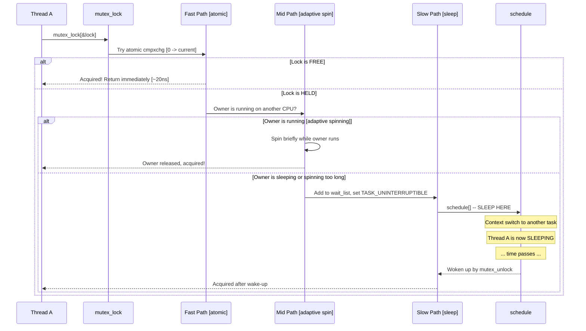
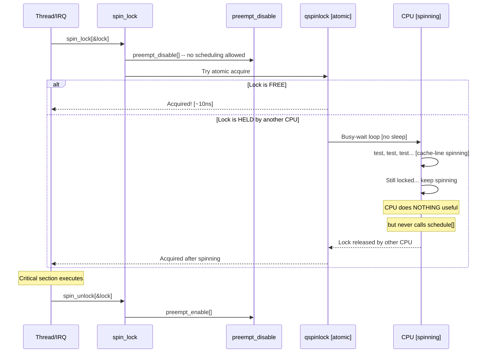
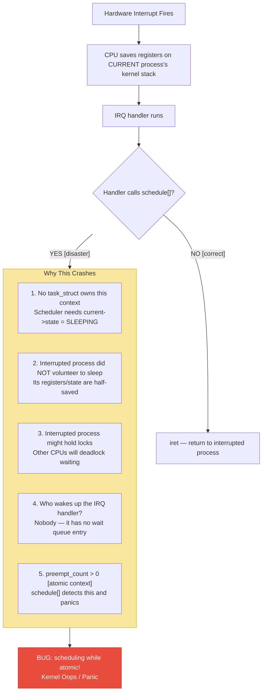
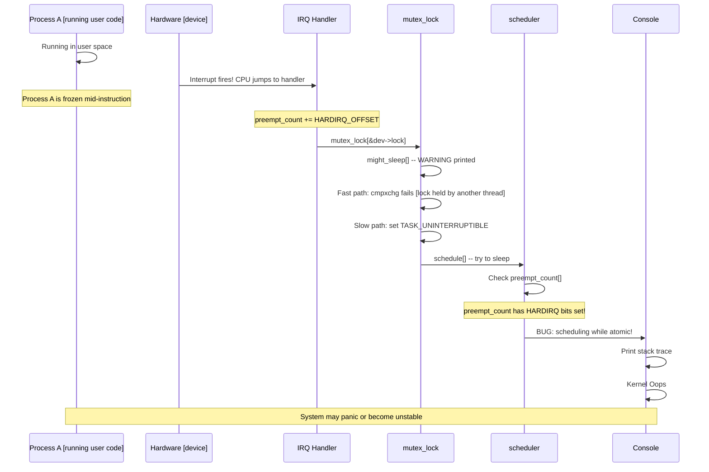
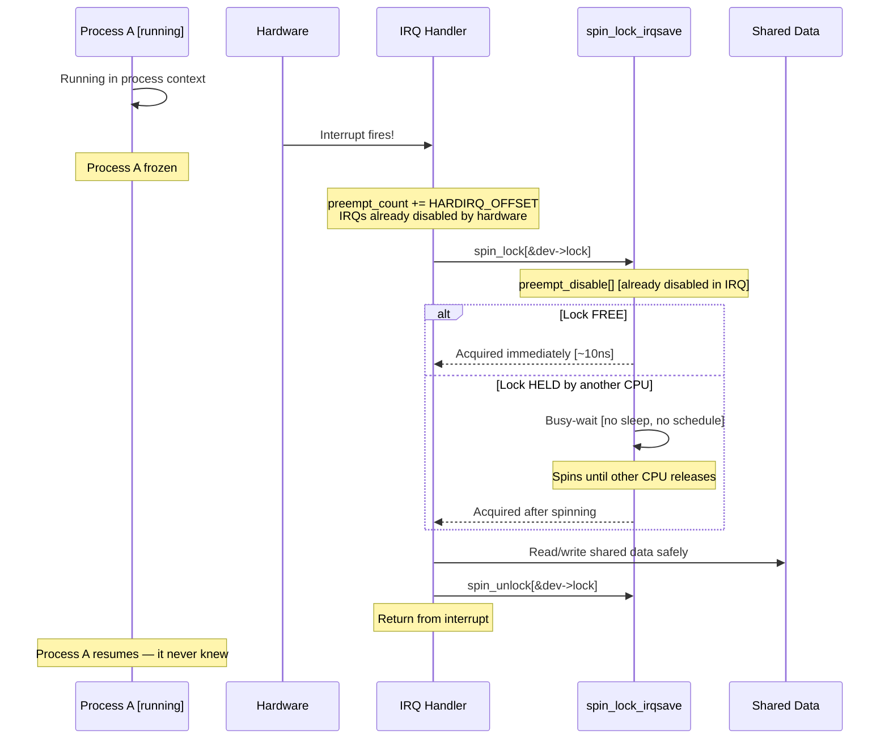
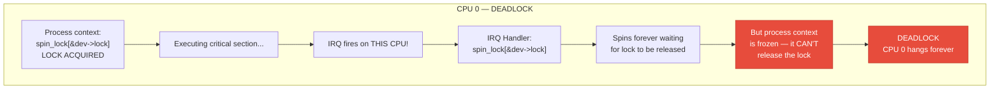
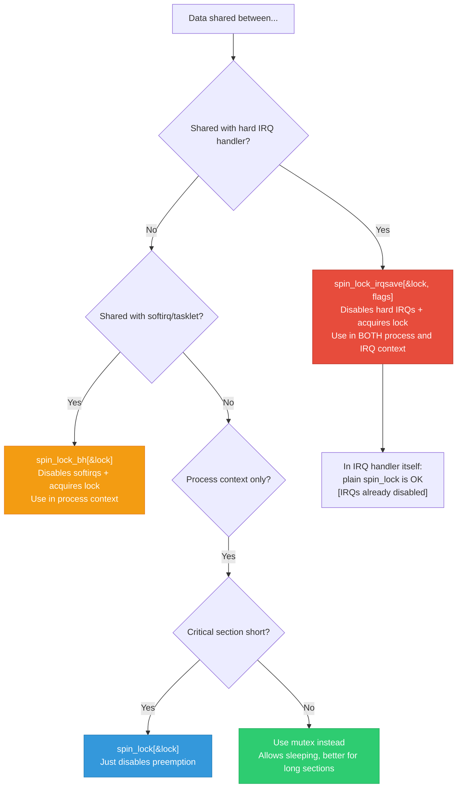
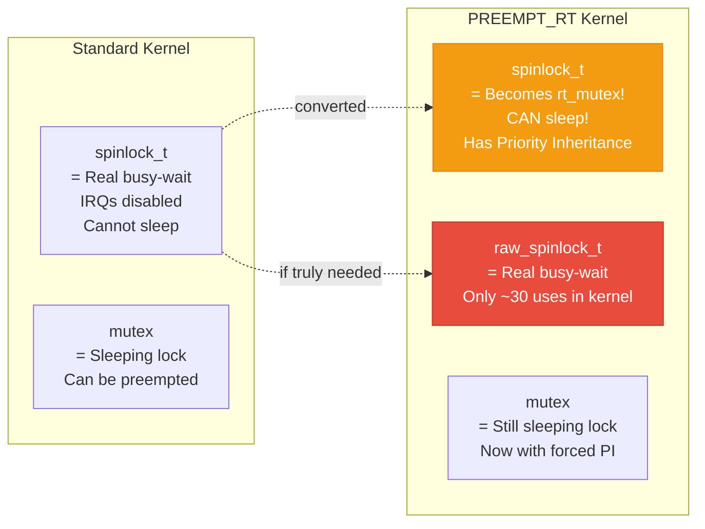

# Why Spinlock in Interrupt Context, Not Mutex — Complete End-to-End Guide

> **One-line answer**: Mutex puts the caller to **sleep** when the lock is unavailable. Interrupt context has **no process context** to sleep — calling `schedule()` will crash the kernel with **"BUG: scheduling while atomic"**. Spinlock **busy-waits** without sleeping, so it is safe in interrupt context.

---

## Table of Contents

1. [The Fundamental Rule](#1-the-fundamental-rule)
2. [What Exactly Happens Inside a Mutex](#2-what-exactly-happens-inside-a-mutex)
3. [What Exactly Happens Inside a Spinlock](#3-what-exactly-happens-inside-a-spinlock)
4. [Why Interrupt Context Cannot Sleep](#4-why-interrupt-context-cannot-sleep)
5. [What Happens If You Use Mutex in IRQ — Step by Step Crash](#5-what-happens-if-you-use-mutex-in-irq)
6. [What Happens If You Use Spinlock in IRQ — Correct Path](#6-what-happens-if-you-use-spinlock-in-irq)
7. [The IRQ Self-Deadlock Problem](#7-the-irq-self-deadlock-problem)
8. [Spinlock Variants for Interrupt Safety](#8-spinlock-variants-for-interrupt-safety)
9. [PREEMPT_RT Changes Everything](#9-preempt_rt-changes-everything)
10. [Complete Comparison Matrix](#10-complete-comparison-matrix)
11. [Real Driver Example — Both In Action](#11-real-driver-example)
12. [Deep Q&A — 25 Questions](#12-deep-qa)

---

## 1. The Fundamental Rule

```
╔══════════════════════════════════════════════════════════════╗
║  INTERRUPT CONTEXT = NO SLEEPING = NO MUTEX                  ║
║  PROCESS CONTEXT   = CAN SLEEP   = MUTEX OR SPINLOCK         ║
╠══════════════════════════════════════════════════════════════╣
║  "If you can't sleep, you can't use a mutex."                ║
║  "If you must share data with an IRQ, use a spinlock."       ║
╚══════════════════════════════════════════════════════════════╝
```

### Why in one paragraph:

When a hardware interrupt fires, the CPU stops whatever process was running and jumps to the IRQ handler. This handler runs on the **interrupted process's kernel stack** but has **no process context** of its own. The scheduler needs a valid `task_struct` and a voluntarily-sleeping task to perform a context switch. In IRQ context, there is no such task — the kernel is borrowing someone else's stack. If the IRQ handler calls `schedule()` [which `mutex_lock()` does when contended], the kernel has no process to put to sleep, no place to save state, and no way to wake up again. **The system crashes.**

---

## 2. What Exactly Happens Inside a Mutex



### Key code path inside `mutex_lock()`:

```c
void __sched mutex_lock(struct mutex *lock)
{
    might_sleep();  /* <-- THIS IS THE KEY LINE */
                    /* If in atomic context, this triggers a WARNING */
    
    /* Fast path: try to acquire with single atomic op */
    if (atomic_long_try_cmpxchg_acquire(&lock->owner, 0, current))
        return;  /* Got it! */
    
    /* Slow path: will eventually call schedule() */
    __mutex_lock_slowpath(lock);
    /* Inside __mutex_lock_slowpath:
     *   set_current_state(TASK_UNINTERRUPTIBLE);
     *   schedule_preempt_disabled();  <-- SLEEPS HERE
     */
}
```

**The `schedule()` call is why mutex cannot be used in interrupt context.**

---

## 3. What Exactly Happens Inside a Spinlock



### Key code path inside `spin_lock()`:

```c
static inline void spin_lock(spinlock_t *lock)
{
    /* Step 1: Disable preemption — no schedule() possible */
    preempt_disable();
    
    /* Step 2: Try to acquire the lock atomically */
    /* If locked, spin in a tight loop — NEVER sleep */
    do {
        while (atomic_read(&lock->val) != 0)
            cpu_relax();  /* hint: spin, no sleep */
    } while (atomic_cmpxchg(&lock->val, 0, 1) != 0);
    
    /* Step 3: Acquired — we are in critical section */
    /* preempt_count is still elevated: no schedule() allowed */
}

static inline void spin_unlock(spinlock_t *lock)
{
    atomic_set(&lock->val, 0);  /* Release */
    preempt_enable();           /* Allow scheduling again */
}
```

**No `schedule()`, no `might_sleep()`, no sleeping — safe in ANY context.**

---

## 4. Why Interrupt Context Cannot Sleep



### The `preempt_count` mechanism:

```c
/*
 * preempt_count is a per-CPU counter with bit fields:
 *
 *  Bit 0-7:   Preemption nesting count
 *  Bit 8-15:  Softirq nesting count  
 *  Bit 16-19: Hardirq nesting count  <-- Set when in IRQ
 *  Bit 20:    NMI flag
 *
 * When ANY of these bits are set, we are in "atomic context"
 * schedule() checks: if (preempt_count() != 0) BUG()
 */

void __schedule(unsigned int sched_mode)
{
    /* ... */
    if (unlikely(in_atomic_preempt_off())) {
        /* We are in atomic context — scheduling is ILLEGAL */
        __schedule_bug(prev);  /* Prints "BUG: scheduling while atomic" */
        /* Kernel oops follows */
    }
}

/* When hardirq runs, kernel does: */
#define __irq_enter()          \
    do {                       \
        preempt_count_add(HARDIRQ_OFFSET);  /* Set hardirq bits */  \
        /* Now in_irq() == true, in_atomic() == true */             \
    } while (0)
```

### The 5 reasons IRQ context cannot sleep:

| # | Reason | Detail |
|---|--------|--------|
| 1 | **No owning task** | IRQ handler borrows the interrupted task's stack. It has no `task_struct` to put to sleep. |
| 2 | **Interrupted task didn't consent** | The process was running user code; it didn't call `schedule()`. Its state is inconsistent for a context switch. |
| 3 | **Lock inversion** | The interrupted task may hold a mutex. Sleeping in IRQ means that mutex is held forever — other waiters deadlock. |
| 4 | **No wake-up path** | `schedule()` puts a task on a wait queue. IRQ context has no task to enqueue, so nobody can `wake_up()` it. |
| 5 | **preempt_count guard** | Kernel sets `HARDIRQ_OFFSET` on entry. `schedule()` checks this and crashes intentionally. |

---

## 5. What Happens If You Use Mutex in IRQ — Step by Step Crash



### Actual kernel output you would see:

```
BUG: scheduling while atomic: swapper/0/0/0x00010002
Modules linked in: my_broken_driver
CPU: 0 PID: 0 Comm: swapper/0 Tainted: G        W
Hardware name: QEMU Standard PC
Call Trace:
 <IRQ>
 dump_stack+0x77/0x97
 __schedule_bug+0x55/0x73
 __schedule+0x6b0/0x7f0
 schedule+0x35/0xa0
 schedule_preempt_disabled+0x15/0x30
 __mutex_lock.constprop.0+0x3a0/0x580   <-- HERE: mutex trying to sleep
 my_broken_irq_handler+0x42/0x100 [my_broken_driver]
 __handle_irq_event_percpu+0x44/0x170
 handle_irq_event+0x3a/0x58
 handle_edge_irq+0x80/0x190
 do_IRQ+0x4e/0xd0
 common_interrupt+0xf/0xf
 </IRQ>
```

---

## 6. What Happens If You Use Spinlock in IRQ — Correct Path



**No sleeping, no scheduling, no crash. The CPU just spins until the lock is free.**

---

## 6.1 But Why Continuous Spinning? Mutex Already Knows When Resource is Free!

> **The question**: Mutex acquires → releases → wakes up the next waiter automatically.
> If we already know when the resource becomes free, why does spinlock waste CPU
> continuously checking instead of getting notified?

**Answer: The "notification" model requires sleeping infrastructure that does NOT exist in IRQ context.**

### How mutex notification works:

```
Thread A holds mutex → Thread B calls mutex_lock() → lock is held →
Thread B adds itself to WAIT QUEUE → Thread B calls schedule() →
Thread B SLEEPS (gives up CPU to other work)

... later ...

Thread A calls mutex_unlock() → checks wait queue →
finds Thread B → calls wake_up(Thread B) →
Scheduler puts Thread B back on run queue →
Thread B eventually runs and acquires the lock
```

The key mechanism is `schedule()` — Thread B **gives up the CPU**. This requires:
- A valid `task_struct` — **IRQ handler has none**
- A wait queue entry — **IRQ handler can't create one**
- The scheduler to context-switch — **impossible in atomic context**

**None of these exist in interrupt context.** So the notification/sleep model is physically impossible.

### Why spinning is actually FASTER here:

```
Spinlock critical section:  ~0.1 - 5 microseconds (very short)
Context switch cost:        ~5,000 nanoseconds (5 microseconds)

If the lock is held for 0.5 us:
  Spinlock: waste 0.5 us spinning → acquire → done
  Mutex:    sleep (5 us) + wake up (5 us) = 10 us minimum!
            Spinning would have been 20x FASTER
```

Spinlocks are used **only for very short critical sections**. The holder is on another CPU executing at full speed — it will release in microseconds. Spinning for 0.5 us is cheaper than sleeping + waking (10+ us overhead).

### Real scenario visualized:

```
CPU 0 (Process context)          CPU 1 (IRQ handler)
─────────────────────            ─────────────────────
spin_lock_irqsave(&lock)
  ↓ LOCKED                       IRQ fires!
  write register                  spin_lock(&lock)
  update buffer                     ↓ LOCKED by CPU 0
  ↓ (takes ~0.3 us)                spinning... (0.3 us)
spin_unlock_irqrestore(&lock)       spinning...
  ↓ RELEASED                       ↓ ACQUIRED!
                                    read status
                                    copy data
                                  spin_unlock(&lock)
                                  return IRQ_HANDLED

Total spin time: ~0.3 us — less than a single context switch!
```

### The core insight:

| | Mutex [notification-based] | Spinlock [polling-based] |
|--|---------------------------|------------------------|
| **How it waits** | Sleep → get woken up | Busy-loop checking |
| **Requires** | `schedule()` + `task_struct` + scheduler | Nothing — just CPU cycles |
| **Works in IRQ?** | NO — can't sleep | YES |
| **Wait cost** | ~5 us context switch overhead | Burns CPU but ~0.1-1 us |
| **Good for** | Long waits [milliseconds] | Very short waits [microseconds] |

**The "notification" model [mutex] is smarter but requires sleeping infrastructure. The "polling" model [spinlock] is simpler but needs nothing — and for microsecond-scale critical sections, polling is actually faster than the sleep+wake overhead.**

---

## 7. The IRQ Self-Deadlock Problem

Even with spinlock, there is a deadly trap: **taking the same spinlock that process context holds when the IRQ fires on the SAME CPU.**



### The fix: `spin_lock_irqsave()`

```c
/* WRONG — deadlock if IRQ fires while lock is held */
spin_lock(&dev->lock);
/* ... critical section ... */
/* IRQ fires here on same CPU → IRQ handler tries spin_lock → DEADLOCK */
spin_unlock(&dev->lock);

/* CORRECT — disable IRQs while holding the lock */
unsigned long flags;
spin_lock_irqsave(&dev->lock, flags);  /* Disable IRQs + acquire lock */
/* ... critical section ... */
/* IRQs disabled, so IRQ handler CANNOT run on this CPU */
spin_unlock_irqrestore(&dev->lock, flags);  /* Restore IRQs + release */
```

---

## 8. Spinlock Variants for Interrupt Safety



### What each variant does:

| Variant | Disables | When to Use |
|---------|----------|-------------|
| `spin_lock()` | Preemption | Process-only data, short critical section |
| `spin_lock_bh()` | Preemption + Softirqs | Shared with softirq/tasklet |
| `spin_lock_irq()` | Preemption + Hard IRQs | Shared with IRQ, know IRQs are enabled |
| `spin_lock_irqsave()` | Preemption + Hard IRQs + saves flags | Shared with IRQ, safest — always use this |

### Inside the IRQ handler:
```c
/* In the IRQ handler itself, IRQs are already disabled by hardware.
 * So plain spin_lock() is sufficient — no need for irqsave. */
irqreturn_t my_irq_handler(int irq, void *dev_id)
{
    struct my_dev *dev = dev_id;
    spin_lock(&dev->lock);      /* IRQs already off, just need the lock */
    /* ... access shared data ... */
    spin_unlock(&dev->lock);
    return IRQ_HANDLED;
}

/* In process context, MUST use irqsave to prevent deadlock */
void my_process_function(struct my_dev *dev)
{
    unsigned long flags;
    spin_lock_irqsave(&dev->lock, flags);  /* Disable IRQs + lock */
    /* ... access same shared data ... */
    spin_unlock_irqrestore(&dev->lock, flags);
}
```

---

## 9. PREEMPT_RT Changes Everything

Under `PREEMPT_RT` [Real-Time Linux], the rules change dramatically:



### Why PREEMPT_RT converts spinlocks:

```c
/* Under PREEMPT_RT:
 * 
 * spinlock_t → becomes rt_mutex (sleepable, PI-aware)
 * raw_spinlock_t → remains a true spinlock (busy-wait)
 *
 * IRQ handlers become kernel threads → CAN sleep!
 * So spinlock_t (now rt_mutex) is safe even in "IRQ" context
 * because "IRQ context" is now just a high-priority thread.
 */

/* This is why the kernel has BOTH types: */
typedef struct {
    struct rt_mutex_base lock;  /* Under RT: a sleeping lock! */
} spinlock_t;

typedef struct {
    arch_spinlock_t raw_lock;   /* Under RT: stays a real spinlock */
} raw_spinlock_t;
```

| | Standard Kernel | PREEMPT_RT |
|--|----------------|------------|
| `spinlock_t` | Busy-wait, disables preemption | Converted to rt_mutex, CAN sleep |
| `raw_spinlock_t` | Same as spinlock_t | True busy-wait, only for scheduler/timer |
| IRQ handlers | Hardirq context, cannot sleep | Kernel threads, CAN sleep |
| `spin_lock_irqsave` | Disables IRQs | Only disables migration |
| `mutex` | Sleeping lock | Sleeping lock with PI |

---

## 10. Complete Comparison Matrix

| Feature | **Spinlock** | **Mutex** |
|---------|-------------|-----------|
| **Wait mechanism** | Busy-wait [burns CPU] | Sleep [frees CPU] |
| **Interrupt context** | YES | NO |
| **Softirq context** | YES | NO |
| **Process context** | YES | YES |
| **Can holder sleep** | NO | YES |
| **Preemption** | Disabled while held | Holder can be preempted |
| **Owner tracking** | No [standard], Yes [debug] | YES — always tracks owner |
| **Recursive locking** | DEADLOCK | DEADLOCK [debug catches it] |
| **Priority Inheritance** | No | No [Yes under RT] |
| **Uncontended cost** | ~10 ns | ~20 ns |
| **Contended cost** | CPU spins = wasted cycles | Context switch ~5 us, frees CPU |
| **Max hold time** | Very short [microseconds] | Can be long [milliseconds+] |
| **`might_sleep()` check** | Never called | Called — warns if atomic |
| **lockdep support** | YES | YES |
| **Trylock** | `spin_trylock()` | `mutex_trylock()` |
| **Interruptible** | No | `mutex_lock_interruptible()` |
| **SMP behavior** | True busy-wait | Adaptive spin, then sleep |
| **UP behavior** | Just disables preemption [no spin] | Normal sleeping lock |
| **Key use cases** | IRQ data, short critical sections | File ops, ioctl, device config |

---

## 11. Real Driver Example — Both In Action

```c
#include <linux/module.h>
#include <linux/interrupt.h>
#include <linux/mutex.h>
#include <linux/spinlock.h>

struct sensor_device {
    /* === Spinlock: protects data shared with IRQ handler === */
    spinlock_t          irq_lock;       /* Protects hw_status and ring_buf */
    u32                 hw_status;      /* Written by IRQ, read by process */
    u32                 ring_buf[256];  /* Filled by IRQ, drained by process */
    int                 ring_head;      /* Written by IRQ */
    int                 ring_tail;      /* Written by process */
    
    /* === Mutex: protects config accessed only from process context === */
    struct mutex        config_lock;    /* Protects sample_rate, mode */
    u32                 sample_rate;    /* Set via sysfs/ioctl */
    u32                 mode;           /* Set via sysfs/ioctl */
    
    struct completion   data_ready;     /* Wake up reader when data arrives */
};

/* ============================================================
 * IRQ HANDLER — runs in hardirq context
 * CAN use: spinlock, atomic ops, completion
 * CANNOT use: mutex, kmalloc(GFP_KERNEL), msleep, copy_to_user
 * ============================================================ */
static irqreturn_t sensor_irq_handler(int irq, void *dev_id)
{
    struct sensor_device *sdev = dev_id;
    u32 status;
    
    /* Read HW status register */
    status = readl(sdev->base + STATUS_REG);
    if (!(status & OUR_IRQ_BIT))
        return IRQ_NONE;  /* Not our interrupt */
    
    /* Spinlock — safe in IRQ context */
    spin_lock(&sdev->irq_lock);
    
    sdev->hw_status = status;
    sdev->ring_buf[sdev->ring_head] = readl(sdev->base + DATA_REG);
    sdev->ring_head = (sdev->ring_head + 1) % 256;
    
    spin_unlock(&sdev->irq_lock);
    
    /* Wake up any process waiting for data */
    complete(&sdev->data_ready);
    
    /* Acknowledge interrupt in hardware */
    writel(status, sdev->base + STATUS_REG);
    
    return IRQ_HANDLED;
}

/* ============================================================
 * READ — runs in process context (user called read())
 * CAN use: mutex, spinlock, sleep, kmalloc, copy_to_user
 * ============================================================ */
static ssize_t sensor_read(struct file *filp, char __user *buf,
                           size_t count, loff_t *ppos)
{
    struct sensor_device *sdev = filp->private_data;
    u32 data;
    unsigned long flags;
    
    /* Wait until IRQ handler signals data is ready — can sleep here */
    wait_for_completion_interruptible(&sdev->data_ready);
    
    /* Spinlock with irqsave — because ring_buf is shared with IRQ handler */
    spin_lock_irqsave(&sdev->irq_lock, flags);
    
    if (sdev->ring_tail == sdev->ring_head) {
        spin_unlock_irqrestore(&sdev->irq_lock, flags);
        return 0;  /* Buffer empty */
    }
    
    data = sdev->ring_buf[sdev->ring_tail];
    sdev->ring_tail = (sdev->ring_tail + 1) % 256;
    
    spin_unlock_irqrestore(&sdev->irq_lock, flags);
    
    /* copy_to_user can sleep — MUST be outside spinlock */
    if (copy_to_user(buf, &data, sizeof(data)))
        return -EFAULT;
    
    return sizeof(data);
}

/* ============================================================
 * IOCTL — runs in process context
 * Config data NOT shared with IRQ → use mutex (can sleep)
 * ============================================================ */
static long sensor_ioctl(struct file *filp, unsigned int cmd,
                         unsigned long arg)
{
    struct sensor_device *sdev = filp->private_data;
    u32 new_rate;
    
    switch (cmd) {
    case SENSOR_SET_RATE:
        if (copy_from_user(&new_rate, (void __user *)arg, sizeof(new_rate)))
            return -EFAULT;
        
        /* Mutex — safe in process context, allows sleeping */
        mutex_lock(&sdev->config_lock);
        
        sdev->sample_rate = new_rate;
        
        /* This function talks to I2C, which may sleep */
        sensor_configure_hw(sdev);  /* i2c_transfer() sleeps! */
        
        mutex_unlock(&sdev->config_lock);
        
        return 0;
    }
    return -ENOTTY;
}

/* ============================================================
 * PROBE — device initialization
 * ============================================================ */
static int sensor_probe(struct platform_device *pdev)
{
    struct sensor_device *sdev;
    
    sdev = devm_kzalloc(&pdev->dev, sizeof(*sdev), GFP_KERNEL);
    
    /* Initialize BOTH locks */
    spin_lock_init(&sdev->irq_lock);
    mutex_init(&sdev->config_lock);
    init_completion(&sdev->data_ready);
    
    /* Register IRQ */
    devm_request_irq(&pdev->dev, sdev->irq, sensor_irq_handler,
                     IRQF_SHARED, "sensor", sdev);
    
    return 0;
}
```

### Why each lock is chosen:

```
┌──────────────────────────┬────────────┬─────────────────────────────┐
│ Data                     │ Lock Type  │ Reason                      │
├──────────────────────────┼────────────┼─────────────────────────────┤
│ hw_status, ring_buf      │ spinlock   │ Shared with IRQ handler     │
│ ring_head, ring_tail     │ (irqsave)  │ Cannot sleep in IRQ context │
├──────────────────────────┼────────────┼─────────────────────────────┤
│ sample_rate, mode        │ mutex      │ Process context only        │
│ (hardware config via I2C)│            │ I2C transfer needs to sleep │
└──────────────────────────┴────────────┴─────────────────────────────┘
```

---

## 12. Deep Q&A — 25 Questions

---

### Q1: What exactly does `might_sleep()` do and why does it matter?

**A:** `might_sleep()` is a debug annotation placed at the beginning of any function that may sleep. In a debug build (`CONFIG_DEBUG_ATOMIC_SLEEP=y`), it checks `preempt_count()` — if any hardirq, softirq, or preempt-disable bits are set, it prints a WARNING stack trace: "BUG: sleeping function called from invalid context". It does NOT prevent the sleep, it only warns. The actual crash comes later when `schedule()` detects the atomic context and panics. In production kernels without debug, `might_sleep()` is a no-op — the system will crash without warning.

---

### Q2: On a UP [single-CPU] system, does spinlock actually spin?

**A:** No. On UP systems without preemption, `spin_lock()` compiles down to just `preempt_disable()`. There is no spinning because there is no other CPU to hold the lock. The lock variable itself is not even checked. On UP with `CONFIG_PREEMPT`, `spin_lock()` still disables preemption, preventing another thread from running, which is equivalent to holding the lock. The actual spinning code (`arch_spin_lock`) is compiled out entirely with `#ifdef CONFIG_SMP`.

---

### Q3: What happens if you hold a spinlock and call `kmalloc(GFP_KERNEL)`?

**A:** `GFP_KERNEL` allows the allocator to sleep [invoke the OOM killer, wait for writeback, reclaim pages]. Since the spinlock holder has preemption disabled [and possibly IRQs disabled], calling `schedule()` from inside the allocator triggers "BUG: scheduling while atomic". The correct approach is `kmalloc(GFP_ATOMIC)`, which never sleeps — it either gets memory from the emergency reserves immediately or fails. Under a mutex, `GFP_KERNEL` is fine.

---

### Q4: Why does `spin_lock()` disable preemption, not just spin?

**A:** Without disabling preemption, consider: Thread A takes `spin_lock()`, then gets preempted by Thread B. Thread B tries the same `spin_lock()` and spins forever — Thread A will never run to release it because Thread B is higher priority and spinning on the same CPU. This is a single-CPU deadlock. Disabling preemption ensures the lock holder runs to completion without being preempted.

---

### Q5: Why not just disable interrupts instead of using spinlocks?

**A:** Disabling interrupts with `local_irq_disable()` only affects the LOCAL CPU. On an SMP system, another CPU can still access the shared data concurrently. Spinlocks provide mutual exclusion across ALL CPUs. Additionally, disabling interrupts for too long causes missed interrupts, increased latency, and potential hardware timeouts. Spinlocks provide fine-grained protection: short critical section, minimal IRQ latency.

---

### Q6: What is "adaptive spinning" in mutex and why doesn't spinlock have it?

**A:** When `mutex_lock()` finds the lock held, before sleeping it checks: is the owner currently running on another CPU? If yes, it spins briefly because the owner is likely to release soon — this avoids the ~5 us context switch cost. If the owner is sleeping or the spinner waits too long, it falls back to sleeping. This is called "adaptive spinning" or "optimistic spinning". Spinlock doesn't need this — it ALWAYS spins. There's no "adaptation" because sleeping is not an option for spinlocks.

---

### Q7: Can you use `mutex_trylock()` in interrupt context?

**A:** Technically `mutex_trylock()` itself never sleeps — it either acquires the lock atomically and returns 1, or fails immediately and returns 0. However, calling it from IRQ context violates the mutex contract: if you acquire it, the unlock must also happen in a context where `mutex_unlock()` can wake up a sleeping waiter, which involves scheduler operations. The kernel will warn about this with lockdep. The correct approach is `spin_trylock()` for interrupt context.

---

### Q8: What is `spin_lock_irq()` vs `spin_lock_irqsave()` — when to use which?

**A:** `spin_lock_irq()` disables IRQs and acquires the lock. On unlock, `spin_unlock_irq()` unconditionally re-enables IRQs. This is ONLY safe if you KNOW IRQs were enabled before. `spin_lock_irqsave()` saves the current IRQ state in `flags`, then disables IRQs. On unlock, `spin_unlock_irqrestore()` restores the saved state — if IRQs were already disabled [e.g., called from another IRQ handler], they stay disabled. **Rule: always prefer `irqsave` unless you are 100% certain IRQs were enabled.** Using `spin_lock_irq` when IRQs were already disabled creates a subtle bug: you'd re-enable IRQs at unlock, breaking the caller's expectation.

---

### Q9: What is the "thundering herd" problem with spinlocks?

**A:** With a classic test-and-set spinlock, when the lock is released, ALL waiting CPUs simultaneously try to acquire it by doing an atomic cmpxchg on the same cache line. This causes a cache-line storm [invalidation traffic across all CPUs], wasting memory bandwidth. The qspinlock [used in Linux since v4.2] solves this with an MCS-like queue: each waiter spins on its own local variable. When the lock is released, only the NEXT waiter is notified, avoiding the thundering herd entirely.

---

### Q10: Why does `mutex_lock()` have `__sched` annotation?

**A:** The `__sched` attribute places the function in a special `.sched.text` section. When the kernel prints a stack trace [e.g., for a hung task], `get_wchan()` skips functions in this section to report the actual call site rather than internal scheduler functions. Without `__sched`, the "blocked at" location would show `__mutex_lock_slowpath` instead of the user-visible function that called `mutex_lock()`, making debugging harder.

---

### Q11: What happens if Thread A holds a mutex and is killed by a signal?

**A:** If Thread A used `mutex_lock()` [uninterruptible], it CANNOT be killed until it acquires the lock. It shows as `D` state [uninterruptible sleep] and ignores all signals including SIGKILL. If Thread A used `mutex_lock_interruptible()`, a signal will wake it up, `mutex_lock_interruptible()` returns `-EINTR`, and the thread must NOT access the protected data — it didn't acquire the lock. The mutex itself remains held by whoever has it. The critical design point: `mutex_unlock()` must only be called by the owner, so killed tasks must handle cleanup properly or the lock leaks.

---

### Q12: How long is "too long" to hold a spinlock?

**A:** As a guideline: microseconds, not milliseconds. While holding a spinlock, IRQs may be disabled and preemption is definitely disabled. Every microsecond you hold it is a microsecond of interrupt latency for the entire CPU and wasted spinning cycles on other CPUs trying to acquire it. The Linux kernel's lockdep can be configured to detect locks held longer than a threshold. PREEMPT_RT systems target sub-100us worst-case latency, putting even stricter limits. A practical rule: if your critical section involves I/O, page faults, or memory allocation, it's too long for a spinlock — use a mutex.

---

### Q13: What is lock "poisoning" in mutex and how does it catch bugs?

**A:** When `CONFIG_DEBUG_MUTEXES` is enabled, the kernel sets the mutex owner to a poison value after `mutex_unlock()`. If any code later calls `mutex_unlock()` again [double unlock], accesses the mutex after `kfree()` [use-after-free], or tries to unlock from a different thread [wrong owner], the poison value triggers an immediate kernel BUG with a helpful stack trace. The specific checks are: [1] owner must match `current`, [2] wait_list must not be corrupted, [3] lock count must be consistent.

---

### Q14: Why can't the kernel just make interrupts sleep like PREEMPT_RT does?

**A:** PREEMPT_RT converts hardirq handlers into kernel threads, which CAN sleep. But this adds overhead: each IRQ needs a `task_struct`, a kernel stack [8-16KB], scheduling overhead, and potential priority inversion. For standard kernels optimized for throughput, this overhead is unacceptable. A web server handling 100K interrupts/sec wastes megabytes of memory and millions of context switches. PREEMPT_RT trades throughput for determinism — only real-time systems [robotics, audio, automotive] need this guarantee. Standard servers and desktops don't.

---

### Q15: What is the difference between `spin_lock_bh()` and `spin_lock_irqsave()` in terms of what they disable?

**A:**
- `spin_lock_bh()` disables softirqs [bottom halves] and preemption on the local CPU. Hard IRQs CAN still fire. Use when data is shared between process context and softirq/tasklet context, but NOT with hard IRQ handlers.
- `spin_lock_irqsave()` disables hard IRQs [which implicitly disables softirqs too since softirqs only run after a hard IRQ] and preemption. Use when data is shared with hard IRQ handlers.

`irqsave` is a superset — it blocks everything that `bh` blocks plus hard IRQs. Using `irqsave` when only `bh` is needed wastes precious interrupt response time. Use the minimum variant needed.

---

### Q16: Draw the contention scenario: 4 CPUs, one spinlock.

**A:**
```
Time →    CPU0           CPU1           CPU2           CPU3
t=0       spin_lock()    [idle]         [idle]         [idle]
          ACQUIRED ✓
t=1       critical       spin_lock()    [idle]         [idle]
          section        SPINNING...
t=2       critical       SPINNING...    spin_lock()    [idle]
          section                       SPINNING...
t=3       critical       SPINNING...    SPINNING...    spin_lock()
          section                                      SPINNING...
t=4       spin_unlock()  SPINNING...    SPINNING...    SPINNING...
       → [released]
t=5       [free]         ACQUIRED ✓     SPINNING...    SPINNING...
                         critical sec
t=6       [free]         spin_unlock()  SPINNING...    SPINNING...
                      → [released]
t=7       [free]         [free]         ACQUIRED ✓     SPINNING...

Note: During t=1 to t=4, THREE CPUs are doing NOTHING useful.
This is why spinlocks must protect SHORT critical sections.
With mutex, those 3 CPUs would sleep and run other useful work.
```

---

### Q17: Can a kernel thread use mutex? What about a workqueue?

**A:** Yes to both. Kernel threads [created with `kthread_create()`] have their own `task_struct` and run in process context — they can sleep, so mutexes are fine. Workqueues also run in process context [as part of kworker threads], so `mutex_lock()` is safe. The key question is always: "Am I in process context?" If yes, mutex works. Only these contexts CANNOT use mutex: hardirq, softirq, tasklet, NMI, and any code with preemption or IRQs explicitly disabled.

---

### Q18: What does `lockdep` report differently for spinlock vs mutex bugs?

**A:** Lockdep tracks different properties:
- **Spinlock**: Reports IRQ safety issues. If a spinlock is used in process context with `spin_lock()` [IRQs enabled] AND also used in an IRQ handler, lockdep warns about potential deadlock — you should use `spin_lock_irqsave()`. It also detects lock ordering violations [ABBA] and recursive locking.
- **Mutex**: Reports sleep-in-atomic context. If `mutex_lock()` is called with IRQs disabled, in softirq, or inside a spinlock, lockdep warns. It also tracks owner validation [only owner should unlock] and recursive locking.

Both report circular dependency: if lock A is taken before B in one path, and B before A in another, lockdep flags an ABBA deadlock.

---

### Q19: What is `raw_spinlock_t` and why does it exist?

**A:** `raw_spinlock_t` is a spinlock that remains a true busy-wait lock even under PREEMPT_RT. Regular `spinlock_t` gets converted to a sleeping `rt_mutex` under RT, but some code absolutely must not sleep: the scheduler itself [can't schedule while scheduling], the timer subsystem, printk, and architecture-level code like page table manipulation. Only ~30 locations in the kernel use `raw_spinlock_t`. For driver developers: if you reach for `raw_spinlock_t`, you're almost certainly doing it wrong. Use `spinlock_t`.

---

### Q20: What happens if a spinlock holder crashes [Oops/panic]?

**A:** The lock is NEVER released. Any CPU trying to acquire that spinlock will spin forever — the system hangs. This is why kernel Oops in critical sections often escalate to a full system hang. With `panic_on_oops=1` [default in many distros], the system reboots immediately. With mutex, the sleeping waiters will also hang forever in `TASK_UNINTERRUPTIBLE` state — visible as `D` state processes. The kernel has no mechanism to auto-release locks from crashed holders; this is a fundamental design limitation.

---

### Q21: How do you choose between mutex and spinlock for a new driver?

**A:** Decision flowchart:
1. **Shared with IRQ handler?** → spinlock [with irqsave]
2. **Shared with softirq/tasklet?** → spinlock [with bh]
3. **Critical section needs to sleep?** [I2C, SPI, USB, allocations, file ops] → mutex
4. **Critical section is very short and runs frequently?** [register read/write] → consider spinlock for lower overhead
5. **Everything else?** → mutex [safer default, less CPU waste on contention]

The golden rule: **Start with mutex unless you have a specific reason not to.** The only hard requirement for spinlock is interrupt context or when sleeping is impossible.

---

### Q22: Explain the ABBA deadlock between spinlock and mutex.

**A:** Consider:
```
Thread A:                      Thread B:
mutex_lock(&config_lock);      spin_lock_irqsave(&data_lock, flags);
spin_lock_irqsave(&data_lock); mutex_lock(&config_lock);  ← DEADLOCK
```

Thread A holds `config_lock`, waits for `data_lock`. Thread B holds `data_lock`, waits for `config_lock`. Neither can proceed. Worse: Thread B is spinning with IRQs disabled — if Thread A is on the same CPU, Thread A will NEVER run to release `config_lock`. Even on different CPUs, this is a classic ABBA deadlock. Fix: always take locks in the same order [e.g., mutex first, then spinlock], or restructure to avoid nesting.

---

### Q23: What is "lock-free" and when should you use it instead of spinlock or mutex?

**A:** Lock-free techniques use atomic operations [cmpxchg, atomic_inc] and memory barriers to protect shared data without any lock. Examples in the kernel: `kfifo` [single producer, single consumer lock-free ring buffer], RCU [readers lock-free, writer waits for grace period], per-CPU counters [no sharing needed]. Use lock-free when: [1] the critical section is just incrementing a counter [use atomic_t], [2] read-mostly data [use RCU], or [3] single-producer single-consumer queues [use kfifo]. For anything complex, locks are safer and clearer.

---

### Q24: What happens on ARM vs x86 with spinlock implementation?

**A:** x86 uses `LOCK CMPXCHG` — a single atomic instruction with implicit memory barrier. ARM uses LL/SC [Load-Link/Store-Conditional with LDXR/STXR on ARMv8]:
```
// ARM64 spinlock acquire (simplified)
sevl                    // Set Event Locally
prfm pstl1strm, [lock] // Prefetch for store
1: wfe                  // Wait For Event — saves power
   ldaxr  w1, [lock]    // Load-Acquire Exclusive
   cbnz   w1, 1b        // If locked, loop back to wfe
   stxr   w2, w0, [lock]// Try Store Exclusive
   cbnz   w2, 1b        // If store failed (contention), retry
```
Key difference: ARM's `WFE` puts the CPU into low-power state while spinning, saving energy. x86 uses `PAUSE` which is a hint but doesn't sleep. ARM also has weaker memory ordering, requiring explicit barriers [acquire/release] that x86 gets for free from its TSO model.

---

### Q25: Interview scenario — design the locking for a DMA-based network driver.

**A:** Four types of data, four locking strategies:

| Data | Context | Lock | Why |
|------|---------|------|-----|
| TX ring buffer descriptors | Process [xmit] + IRQ [TX completion] | `spin_lock_irqsave` | Shared with hard IRQ |
| RX ring buffer | NAPI poll [softirq] + IRQ [schedule NAPI] | `spin_lock` [in NAPI, IRQ just triggers] | NAPI disables IRQ itself |
| Device config [MTU, link speed] | Process only [ethtool, ifconfig] | `mutex` | I2C/MDIO may sleep |
| Per-CPU packet counters | All contexts | `per_cpu` + `this_cpu_inc` | No lock needed |
| VLAN filter table | Process [add/remove] + data path [every packet] | `RCU` | Read-hot, write-cold |

This uses the minimum locking needed for each data type — no over-locking, no under-locking.

---

## Quick Reference Card

```
╔═══════════════════════════════════════════════════════════════════╗
║                SPINLOCK vs MUTEX QUICK REFERENCE                 ║
╠═══════════════════════════════════════════════════════════════════╣
║                                                                   ║
║  CAN'T SLEEP? ──→ SPINLOCK        CAN SLEEP? ──→ MUTEX           ║
║                                                                   ║
║  IN IRQ?      ──→ SPINLOCK        NEED I2C/SPI? ──→ MUTEX        ║
║  IN SOFTIRQ?  ──→ SPINLOCK        NEED kmalloc? ──→ MUTEX        ║
║  IN TASKLET?  ──→ SPINLOCK        LONG SECTION? ──→ MUTEX        ║
║                                                                   ║
║  ┌─────────────────────────────────────────────────────────────┐  ║
║  │ SPINLOCK + IRQ DATA:                                        │  ║
║  │   Process ctx: spin_lock_irqsave(&lock, flags)              │  ║
║  │   IRQ handler: spin_lock(&lock)                             │  ║
║  │                                                             │  ║
║  │ SPINLOCK + SOFTIRQ DATA:                                    │  ║
║  │   Process ctx: spin_lock_bh(&lock)                          │  ║
║  │   Softirq:     spin_lock(&lock)                             │  ║
║  │                                                             │  ║
║  │ MUTEX:                                                      │  ║
║  │   Process ctx: mutex_lock(&lock)                            │  ║
║  │   NEVER in IRQ/softirq/tasklet                              │  ║
║  └─────────────────────────────────────────────────────────────┘  ║
║                                                                   ║
║  GOLDEN RULES:                                                    ║
║  1. Never sleep under spinlock                                    ║
║  2. Never use mutex in interrupt context                          ║
║  3. Always use irqsave for data shared with IRQ                   ║
║  4. When in doubt, use mutex                                      ║
║  5. Keep spinlock critical sections SHORT                         ║
╚═══════════════════════════════════════════════════════════════════╝
```

---

[Index: LKI Explore](../ReadMe.Md)
