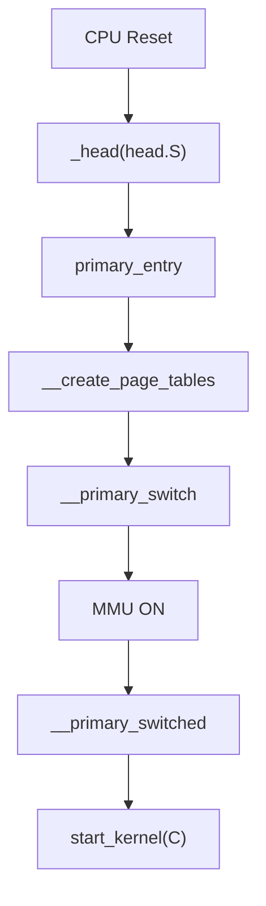

# Phase 1: Assembly Bootstrap — `arch/arm64/kernel/head.S`

## Overview
- The CPU starts at a fixed address in ROM/flash, with MMU and caches OFF.
- The kernel's first code is in `head.S`, which sets up minimal page tables and enables the MMU.

---

## Key Functions & Flow
- `_head` (reset vector)
- `primary_entry` — entry point for kernel
- `__create_page_tables` — builds early page tables (identity + kernel map)
- `__primary_switch` — enables MMU, sets up stack pointer
- `__primary_switched` — jumps to C code

---

## Mermaid: Early Boot Flow

---

## MMU & Page Table Setup
- **Identity map**: Maps physical addresses 1:1 for early code/data
- **Kernel map**: Maps kernel VA to PA (PAGE_OFFSET)
- **TTBR0/TTBR1**: Set up for user/kernel split
- **SCTLR_EL1**: MMU enabled

---

## Code Walkthrough
- `primary_entry` (head.S:84):
  - Sets up stack pointer
  - Calls `__create_page_tables`
- `__create_page_tables`:
  - Allocates page tables in `.bss`
  - Fills in entries for identity and kernel mapping
- `__primary_switch`:
  - Loads TTBRs, enables MMU
  - Branches to `__primary_switched`

---

## Data Structures
- Early page tables: statically allocated arrays in `.bss`
- No dynamic allocation yet

---

## References
- `arch/arm64/kernel/head.S`
- ARM ARM (DDI0487) — MMU, TTBR, SCTLR
