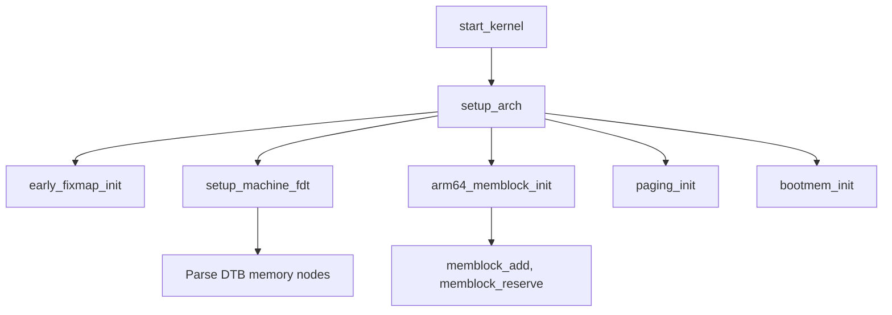

# Phase 2: Early C Setup — `setup_arch()`

## Overview
- After MMU is enabled, control passes to C code: `start_kernel()` in `init/main.c`.
- `setup_arch()` is called to initialize architecture-specific subsystems.

---

## Key Functions & Flow
- `start_kernel()` (init/main.c)
- `setup_arch()` (arch/arm64/kernel/setup.c)
  - `early_fixmap_init()` — sets up fixmap region
  - `setup_machine_fdt()` — parses Device Tree Blob (DTB)
  - `arm64_memblock_init()` — initializes memblock allocator
  - `paging_init()` — sets up full page tables
  - `bootmem_init()` — prepares buddy allocator

---

## Mermaid: setup_arch Call Tree

---

## Device Tree (DTB) Parsing
- `setup_machine_fdt()` locates and parses the DTB
- Finds `memory {}` nodes, registers regions with memblock
- Reserves kernel, initrd, and reserved-memory regions

---

## Memblock Allocator
- `arm64_memblock_init()` calls `memblock_add()` for each usable region
- `memblock_reserve()` for kernel and reserved areas
- No freeing yet — only allocation/reservation

---

## Data Structures
- `struct memblock`, `struct memblock_region`
- Early fixmap: static mapping for early I/O, debug

---

## References
- `init/main.c`, `arch/arm64/kernel/setup.c`, `arch/arm64/mm/init.c`
- `Documentation/devicetree/booting.txt`
