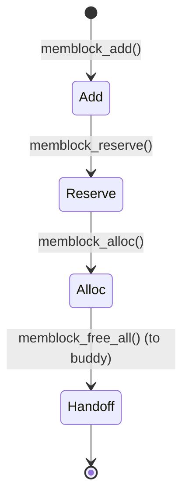

# Phase 2b: Memblock Allocator — `mm/memblock.c`

## Overview
- Memblock is the early boot memory allocator for Linux.
- Used before the buddy system is ready.
- Manages memory as a set of regions (arrays), not a bitmap or free list.

---

## Data Structures
- `struct memblock` — global state
- `struct memblock_region` — describes a memory or reserved region

---

## Mermaid: Memblock Lifecycle

---

## How It Works
- `memblock_add(base, size)` — registers a usable region
- `memblock_reserve(base, size)` — marks reserved (kernel, DTB, etc)
- `memblock_alloc(size, align)` — finds a free gap, marks as reserved
- No freeing: only allocation and reservation
- Linear scan of regions (O(N²) worst case)

---

## Code Walkthrough
- `memblock_alloc_range_nid()` — main allocation function
- `memblock_find_region()` — finds a suitable gap
- `memblock_free_all()` — hands all memory to buddy system

---

## Limitations
- No freeing, only allocation
- Not scalable for runtime use

---

## References
- `mm/memblock.c`, `arch/arm64/mm/init.c`
