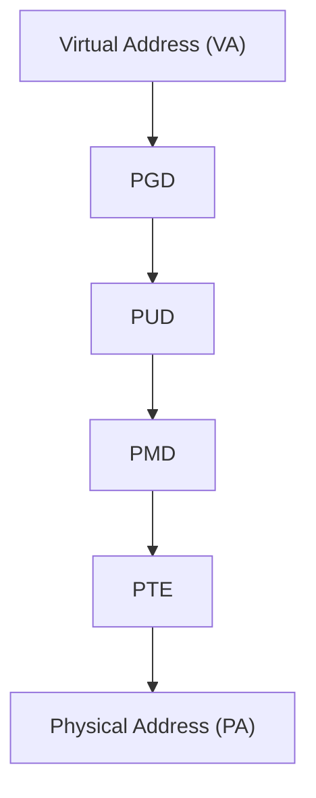

# Phase 3: Paging Initialization — `arch/arm64/mm/mmu.c`

## Overview
- After memblock, the kernel sets up full page tables for all RAM.
- Establishes the kernel linear mapping (PAGE_OFFSET → all physical RAM).

---

## Key Functions & Flow
- `paging_init()` (arch/arm64/mm/mmu.c)
  - `map_mem()` — maps all memblock regions
  - `__map_memblock()` — creates page table entries
  - `create_mapping_noalloc()` — builds page tables using memblock

---

## Mermaid: VA → PA Translation

---

## Page Table Levels (ARMv8, 4KB pages)
- **PGD**: Page Global Directory (top level)
- **PUD**: Page Upper Directory
- **PMD**: Page Middle Directory
- **PTE**: Page Table Entry (leaf)

---

## Kernel Linear Map
- All RAM is mapped at `PAGE_OFFSET` (typically 0xFFFF_0000_0000_0000)
- Allows kernel to access all physical memory via VA

---

## Fixmap Region
- Special static mapping for early I/O, debug, etc.
- Set up before full paging

---

## Code Walkthrough
- `paging_init()` — main entry
- `map_mem()` — iterates memblock regions
- `__map_memblock()` — creates mappings
- `pgd_alloc`, `pud_populate`, `pmd_populate` — allocate/fill page tables

---

## References
- `arch/arm64/mm/mmu.c`, `arch/arm64/mm/init.c`, `include/linux/mm_types.h`
