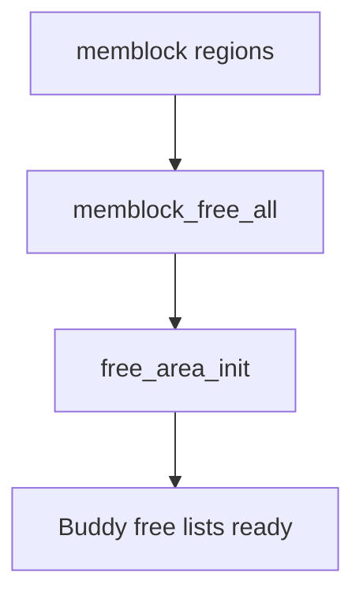

# Phase 4: Buddy Allocator Initialization — `mm/page_alloc.c`

## Overview
- The buddy system is the main physical page allocator for the kernel.
- Takes over from memblock after `memblock_free_all()`.

---

## Key Functions & Flow
- `bootmem_init()` (arch/arm64/mm/init.c)
  - `zone_sizes_init()` — sets up memory zones (DMA, NORMAL)
  - `free_area_init()` — initializes free lists
- `mm_core_init()` (init/main.c)
  - `memblock_free_all()` — hands memory to buddy
  - `mem_init()` — finalizes memory setup

---

## Mermaid: Memblock → Buddy Handoff

---

## Data Structures
- `struct page` — per-physical-page descriptor
- Free lists: array of lists by order (0–MAX_ORDER)
- Zones: `ZONE_DMA`, `ZONE_NORMAL`

---

## Code Walkthrough
- `__free_one_page()` — adds page to free list
- `expand()` — splits higher-order blocks
- `alloc_pages()` — main allocation API

---

## References
- `mm/page_alloc.c`, `arch/arm64/mm/init.c`, `include/linux/mmzone.h`
