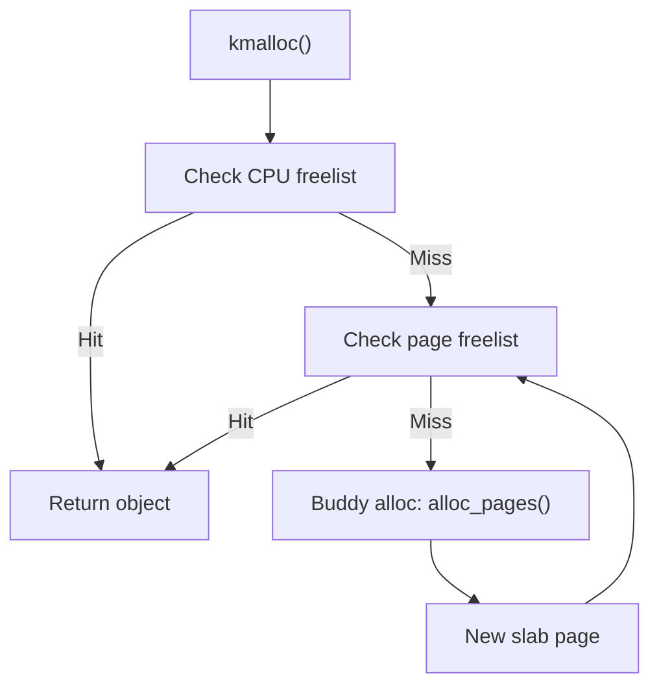

# Phase 5: Slab/SLUB Allocator Initialization — `mm/slub.c`

## Overview
- The slab (SLUB) allocator provides fast object allocation for the kernel.
- Depends on the buddy system for backing pages.

---

## Key Functions & Flow
- `kmem_cache_init()` (mm/slub.c)
  - Sets up `struct kmem_cache` for each object size
  - Initializes per-CPU and per-node caches
- `kmalloc` caches: `kmalloc-8`, `kmalloc-16`, ...

---

## Mermaid: kmalloc Call Path

---

## Data Structures
- `struct kmem_cache` — describes a cache
- `struct kmem_cache_cpu` — per-CPU freelist
- `struct kmem_cache_node` — per-node freelist

---

## Code Walkthrough
- `kmem_cache_init()` — bootstraps caches
- `kmalloc()` — main allocation API
- Relies on buddy for new pages

---

## Why Slab Needs Buddy
- Slab caches allocate whole pages from buddy
- Cannot initialize until buddy is ready

---

## References
- `mm/slub.c`, `include/linux/slab.h`, `include/linux/slub_def.h`
