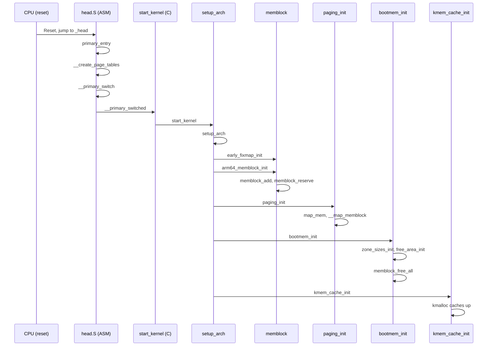

# ARMv8 Linux Memory Subsystem — Full Call Sequence

## End-to-End Boot Call Chain

## Resource Timeline

| Function | Allocator Available |
|----------|--------------------|
| head.S   | Static .bss        |
| setup_arch | memblock         |
| paging_init | memblock        |
| bootmem_init | buddy          |
| kmem_cache_init | slab        |

## File References
- arch/arm64/kernel/head.S
- init/main.c
- arch/arm64/kernel/setup.c
- arch/arm64/mm/init.c
- arch/arm64/mm/mmu.c
- mm/memblock.c
- mm/page_alloc.c
- mm/slub.c
