# ARM64 Kernel Boot — End-to-End Memory Initialization Flow

This documentation covers the **complete memory initialization sequence** of the Linux kernel on ARM64, from the moment the CPU powers on until the memory subsystem (buddy allocator, slab, vmalloc) is fully operational.

---

## Directory Structure

| Phase | Directory | Source File(s) | What Happens |
|-------|-----------|----------------|--------------|
| 1 | `01_Primary_Entry/` | `arch/arm64/kernel/head.S` | Record MMU state, save FDT, set up early stack |
| 2 | `02_Identity_Map/` | `arch/arm64/kernel/pi/map_range.c` | Build identity-mapped page tables (VA == PA) |
| 3 | `03_CPU_Setup/` | `arch/arm64/mm/proc.S` | Configure TCR_EL1, MAIR_EL1 (MMU registers) |
| 4 | `04_Enable_MMU/` | `arch/arm64/kernel/head.S` | Turn on MMU, load TTBR0/TTBR1 |
| 5 | `05_Map_Kernel/` | `arch/arm64/kernel/pi/map_kernel.c` | Map kernel at virtual address, KASLR |
| 6 | `06_Primary_Switched/` | `arch/arm64/kernel/head.S` | Transition to kernel VA, call `start_kernel()` |
| 7 | `07_Setup_Arch/` | `arch/arm64/kernel/setup.c` | `setup_arch()` — fixmap, FDT parse, memblock |
| 8 | `08_Memblock/` | `mm/memblock.c`, `arch/arm64/mm/init.c` | Early memory allocator — add/reserve regions |
| 9 | `09_Paging_Init/` | `arch/arm64/mm/mmu.c` | Final page tables — linear map all of RAM |
| 10 | `10_Bootmem_Init/` | `arch/arm64/mm/init.c` | NUMA, DMA zones, CMA, crashkernel reservation |
| 11 | `11_MM_Core_Init/` | `mm/mm_init.c` | Zone lists, memblock→buddy transition |
| 12 | `12_SLAB_SLUB/` | `mm/slub.c` | Kernel object allocator (kmem_cache) |
| 13 | `13_Vmalloc/` | `mm/vmalloc.c` | Virtual contiguous allocator |

---

## End-to-End Mermaid Flow

```mermaid
flowchart TD
    subgraph Phase1["Phase 1: Primary Entry (Assembly)"]
        A["⚡ Power On\nx0 = FDT address\nMMU OFF, no stack"] --> A1["record_mmu_state\nx19 = MMU on/off"]
        A1 --> A2["preserve_boot_args\nx21 = FDT pointer"]
        A2 --> A3["Early stack setup\nsp = early_init_stack"]
    end

    subgraph Phase2["Phase 2: Identity Map"]
        A3 --> B1["__pi_create_init_idmap\nBuild page tables: VA == PA"]
        B1 --> B2["Cache maintenance\ninvalidate or clean"]
    end

    subgraph Phase3["Phase 3: CPU Setup"]
        B2 --> C1["init_kernel_el\nNormalize to EL1\nx20 = boot mode"]
        C1 --> C2["__cpu_setup\nTCR_EL1, MAIR_EL1\nMMU regs configured"]
    end

    subgraph Phase4["Phase 4: Enable MMU"]
        C2 --> D1["__enable_mmu\nTTBR0 = idmap\nTTBR1 = reserved_pg_dir\n🔥 MMU ON"]
    end

    subgraph Phase5["Phase 5: Map Kernel VA"]
        D1 --> E1["__pi_early_map_kernel\nMap kernel at 0xFFFF..."]
        E1 --> E2["map_kernel()\ninit_pg_dir → swapper_pg_dir"]
        E2 --> E3["KASLR offset applied"]
    end

    subgraph Phase6["Phase 6: Primary Switched"]
        E3 --> F1["br __primary_switched\nJump to kernel VA"]
        F1 --> F2["init_cpu_task\nException vectors"]
        F2 --> F3["Save FDT, boot_mode\nto global variables"]
        F3 --> F4["bl start_kernel\n🚀 C code begins"]
    end

    subgraph Phase7["Phase 7: setup_arch()"]
        F4 --> G1["early_fixmap_init\nearly_ioremap_init"]
        G1 --> G2["setup_machine_fdt\nParse device tree"]
    end

    subgraph Phase8["Phase 8: Memblock"]
        G2 --> H1["arm64_memblock_init\nmemblock_add / reserve"]
        H1 --> H2["Register kernel, initrd\nScan DT reserved mem"]
    end

    subgraph Phase9["Phase 9: Paging Init"]
        H2 --> I1["paging_init\nmap_mem(swapper_pg_dir)"]
        I1 --> I2["Linear map all RAM\ncreate_idmap (final)"]
    end

    subgraph Phase10["Phase 10: Bootmem Init"]
        I2 --> J1["bootmem_init\narch_numa_init"]
        J1 --> J2["DMA zone limits\nCMA / crashkernel"]
    end

    subgraph Phase11["Phase 11: mm_core_init()"]
        J2 --> K1["mm_core_init_early\nfree_area_init\n(zone/buddy skeleton)"]
        K1 --> K2["build_all_zonelists"]
        K2 --> K3["memblock_free_all\n🔄 memblock → buddy"]
    end

    subgraph Phase12["Phase 12: SLAB/SLUB"]
        K3 --> L1["kmem_cache_init\nBootstrap slab caches"]
        L1 --> L2["create_kmalloc_caches\n8B, 16B ... 8MB"]
    end

    subgraph Phase13["Phase 13: Vmalloc"]
        L2 --> M1["vmalloc_init\nvmap_area setup"]
        M1 --> M2["✅ Memory subsystem\nfully operational"]
    end
```



---

## Memory Allocator Timeline

```
Boot time ──────────────────────────────────────────────────────────► Running

│ No allocator │   memblock    │     buddy + slab + vmalloc        │
│ (assembly)   │ (early C)     │     (full kernel)                 │
├──────────────┼───────────────┼───────────────────────────────────►│
│ Phase 1-4    │ Phase 7-10    │ Phase 11-13                       │
│              │               │                                   │
│ Static page  │ memblock_add  │ memblock_free_all → buddy         │
│ tables only  │ memblock_alloc│ kmem_cache_init → slab            │
│              │               │ vmalloc_init → vmalloc            │
```

---

## Key Data Structures Across Phases

| Structure | Introduced In | Purpose |
|-----------|---------------|---------|
| `init_idmap_pg_dir` | Phase 2 | Identity map page tables (VA == PA) |
| `init_pg_dir` | Phase 5 | Temporary kernel VA page tables |
| `swapper_pg_dir` | Phase 5/9 | Final kernel page tables |
| `memblock` | Phase 8 | Early memory region tracking |
| `pg_data_t` / `pglist_data` | Phase 10/11 | Per-NUMA-node memory descriptor |
| `zone` | Phase 11 | DMA / DMA32 / NORMAL / MOVABLE zones |
| `free_area[]` | Phase 11 | Buddy allocator free lists (order 0–10) |
| `kmem_cache` | Phase 12 | Slab cache descriptor |
| `vmap_area` | Phase 13 | vmalloc region descriptor |

---

## Key Registers (ARM64-specific)

| Register | Set In | Purpose |
|----------|--------|---------|
| `SCTLR_EL1` | Phase 3/4 | System control — MMU enable, cache enable |
| `TCR_EL1` | Phase 3 | Translation control — page size, VA bits, cacheability |
| `MAIR_EL1` | Phase 3 | Memory attribute types (Normal, Device, etc.) |
| `TTBR0_EL1` | Phase 4 | Translation table base — identity map (lower VA) |
| `TTBR1_EL1` | Phase 4/5 | Translation table base — kernel map (upper VA) |
| `VBAR_EL1` | Phase 6 | Exception vector base address |

---

## How to Read This Documentation

1. Start with this file for the big picture
2. Navigate to each phase directory in order (01 → 13)
3. In each directory, start with `00_Overview.md` for the phase summary
4. Read numbered sub-documents for detailed instruction/function-level analysis
5. Each document references the exact source file and line numbers in the kernel tree
