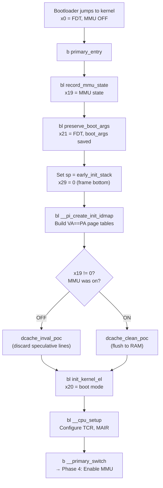

# Phase 1: Primary Entry — `primary_entry`

**Source:** `arch/arm64/kernel/head.S` lines 85–131

## What Happens

When the CPU powers on, the bootloader loads the kernel image into RAM, sets `x0` = FDT physical address, and jumps to the kernel image header. The header contains `b primary_entry` which branches here immediately.

`primary_entry` is the **first kernel code** that executes. Its job is to prepare the absolute minimum environment needed before the MMU can be enabled.

## CPU State at Entry

| State | Value |
|-------|-------|
| MMU | OFF (typically) |
| D-cache | OFF (typically) |
| I-cache | ON or OFF |
| `x0` | Physical address of FDT blob |
| `x1`–`x3` | Bootloader-specific arguments |
| Stack | **None** |
| Exception Level | EL1 or EL2 |

## Code

```asm
SYM_CODE_START(primary_entry)
    bl   record_mmu_state        ← Step 1: x19 = MMU on/off
    bl   preserve_boot_args      ← Step 2: x21 = FDT, save args

    adrp x1, early_init_stack    ← Step 3: set up stack
    mov  sp, x1
    mov  x29, xzr

    adrp x0, __pi_init_idmap_pg_dir   ← Step 4: build identity map
    mov  x1, xzr
    bl   __pi_create_init_idmap

    cbnz x19, 0f                 ← Step 5: cache maintenance
    dmb  sy                           (fork on MMU state)
    ...invalidate...
    b    1f
0:  ...clean...

1:  mov  x0, x19                 ← Step 6: init exception level
    bl   init_kernel_el
    mov  x20, x0

    bl   __cpu_setup             ← Step 7: configure MMU regs
    b    __primary_switch        ← Step 8: enable MMU, jump to VA
SYM_CODE_END(primary_entry)
```

## Register Allocations (Callee-Saved)

| Register | Set By | Value | Lifetime |
|----------|--------|-------|----------|
| `x19` | `record_mmu_state` | SCTLR_ELx_M if MMU was on, else 0 | → `start_kernel()` |
| `x20` | `primary_entry` (line 119) | Boot mode (EL1 or EL2 ± VHE) | → `__primary_switch` |
| `x21` | `preserve_boot_args` | FDT physical address | → `start_kernel()` |

These are `x19`–`x21` because they are the first three **callee-saved** registers in AAPCS64 — guaranteed preserved across `bl` calls. See `01_Record_MMU_State.md` for details on each.

## Flow Diagram



## Detailed Sub-Documents

| Document | Covers |
|----------|--------|
| [01_Record_MMU_State.md](01_Record_MMU_State.md) | `record_mmu_state` — SCTLR, EE/M/C bits |
| [02_Preserve_Boot_Args.md](02_Preserve_Boot_Args.md) | `preserve_boot_args` — FDT save, `boot_args[]` |
| [03_Early_Stack.md](03_Early_Stack.md) | `early_init_stack` setup, frame pointer |
