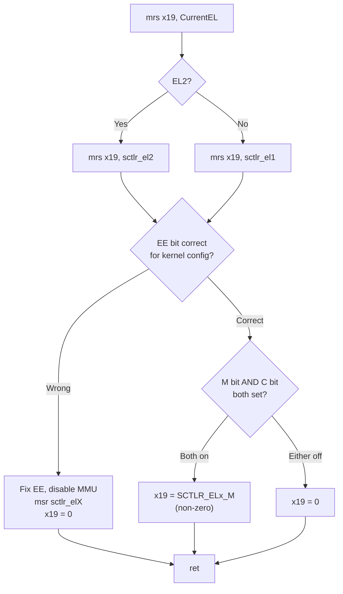

# `record_mmu_state` — Detect MMU/Cache State at Entry

**Source:** `arch/arm64/kernel/head.S` lines 133–160

## Purpose

Determine whether the bootloader entered the kernel with the **MMU already enabled**. This is critical because all subsequent cache maintenance decisions depend on this answer.

## Why It Matters

| Boot Scenario | MMU State | D-Cache State | Required Action |
|---------------|-----------|---------------|-----------------|
| Normal boot (U-Boot) | OFF | OFF | **Invalidate** cache (discard stale speculative lines) |
| EFI boot (UEFI firmware) | ON | ON | **Clean** cache (flush dirty lines to RAM before disabling) |

If you get this wrong:
- Missing invalidation → CPU reads stale data from cache when MMU is enabled → corrupt page tables → crash
- Missing clean → RAM doesn't have the latest data → CPU fetches garbage after MMU is disabled → crash

## Code Walkthrough

```asm
SYM_CODE_START_LOCAL(record_mmu_state)
    mrs   x19, CurrentEL            ; Read current exception level
    cmp   x19, #CurrentEL_EL2       ; Are we at EL2?
    mrs   x19, sctlr_el1            ; Read SCTLR_EL1 (default)
    b.ne  0f                        ; If not EL2, skip
    mrs   x19, sctlr_el2            ; If EL2, read SCTLR_EL2 instead
```

**Step 1:** Determine which SCTLR to read. The System Control Register exists per-EL. If the CPU entered at EL2 (hypervisor level), we need `SCTLR_EL2`; otherwise `SCTLR_EL1`.

```asm
0:
CPU_LE( tbnz  x19, #SCTLR_ELx_EE_SHIFT, 1f )
CPU_BE( tbz   x19, #SCTLR_ELx_EE_SHIFT, 1f )
```

**Step 2:** Check the **EE bit** (Endianness of Exception). `CPU_LE()` / `CPU_BE()` are compile-time macros that assemble only the correct check for the kernel's configured endianness. If the running CPU has the wrong endianness, jump to the fixup path at label `1:`.

```asm
    tst   x19, #SCTLR_ELx_C        ; Z := (C == 0)
    and   x19, x19, #SCTLR_ELx_M   ; isolate M bit (MMU enable)
    csel  x19, xzr, x19, eq        ; if C==0: x19=0, else x19=M bit
    ret
```

**Step 3 (happy path):** Check both **M** (MMU) and **C** (Data Cache) bits:
- `tst x19, #SCTLR_ELx_C` — sets Z flag if C bit is 0
- `and x19, x19, #SCTLR_ELx_M` — keep only the M bit
- `csel x19, xzr, x19, eq` — if C was off (Z set), force `x19 = 0`

**Result:** `x19 = SCTLR_ELx_M` (non-zero) only if BOTH M and C bits were set. Otherwise `x19 = 0`.

**Logic:** Even if the MMU was on, if the data cache was off, we treat it as "MMU off" for cache maintenance purposes — no dirty cache lines exist.

### Endianness Fixup Path (label 1:)

```asm
1:  eor   x19, x19, #SCTLR_ELx_EE  ; flip endianness bit
    bic   x19, x19, #SCTLR_ELx_M   ; clear MMU enable bit
    b.ne  2f                         ; branch based on EL
    pre_disable_mmu_workaround
    msr   sctlr_el2, x19            ; write corrected SCTLR_EL2
    b     3f
2:  pre_disable_mmu_workaround
    msr   sctlr_el1, x19            ; write corrected SCTLR_EL1
3:  isb                              ; instruction synchronization barrier
    mov   x19, xzr                   ; x19 = 0 (MMU is now off)
    ret
```

If the CPU was running in the wrong byte order:
1. Flip the EE bit to the correct endianness
2. Clear the M bit to disable the MMU (can't have MMU on during endianness switch — page tables would be misinterpreted)
3. Write back the corrected SCTLR
4. `isb` ensures the change takes effect before next instruction
5. Set `x19 = 0` — we've disabled the MMU

## SCTLR Bit Map (Relevant Bits)

```
SCTLR_ELx
┌──────────────────────────────────────────────────┐
│ ... │ EE │ ... │ C │ ... │ M │
│     │bit25│     │bit2│     │bit0│
└──────────────────────────────────────────────────┘
  EE = Exception Endianness (0=LE, 1=BE)
  C  = Data Cache Enable
  M  = MMU Enable
```

## Flow Diagram



## Key Takeaway

After `record_mmu_state` returns:
- **`x19 != 0`** → MMU and D-cache were both on at entry → later code must **clean** caches
- **`x19 == 0`** → MMU or D-cache was off → later code must **invalidate** caches
