# ARM64 `primary_entry` Boot Flow — Block-by-Block

## Mermaid Flow Diagram

```mermaid
flowchart TD
    A["⚡ Power On\nBootloader loads kernel into RAM\nx0 = FDT address"] --> B["Image Header\nb primary_entry"]

    B --> C["<b>Block 1: record_mmu_state</b>\nbl record_mmu_state"]
    C --> C1{"CurrentEL\n== EL2?"}
    C1 -- Yes --> C2["mrs x19, sctlr_el2"]
    C1 -- No --> C3["mrs x19, sctlr_el1"]
    C2 --> C4{"Endianness\ncorrect?"}
    C3 --> C4
    C4 -- No --> C5["Fix EE bit, disable MMU\nx19 = 0"]
    C4 -- Yes --> C6{"M bit AND\nC bit set?"}
    C6 -- "Both on" --> C7["x19 = SCTLR_ELx_M\n(non-zero = MMU was ON)"]
    C6 -- "Either off" --> C8["x19 = 0\n(MMU was OFF)"]

    C5 --> D
    C7 --> D
    C8 --> D

    D["<b>Block 2: preserve_boot_args</b>\nbl preserve_boot_args"] --> D1["mov x21, x0  (save FDT)\nstp x0-x3 → boot_args"]
    D1 --> D2{"x19 != 0?\n(MMU on?)"}
    D2 -- "MMU off" --> D3["dmb sy\ndcache_inval_poc on boot_args"]
    D2 -- "MMU on" --> D4["str x19 → mmu_enabled_at_boot"]

    D3 --> E
    D4 --> E

    E["<b>Block 3: Early Stack Setup</b>"] --> E1["adrp x1, early_init_stack\nmov sp, x1\nmov x29, xzr (no frame)"]

    E1 --> F["<b>Block 4: Create Identity Map</b>\nadrp x0, __pi_init_idmap_pg_dir\nbl __pi_create_init_idmap"]
    F --> F1["Builds page tables where VA == PA\nReturns x0 = end of used region"]

    F1 --> G{"<b>Block 5: Cache Maintenance</b>\nx19 != 0?"}
    G -- "MMU OFF (x19=0)" --> G1["dmb sy\ndcache_inval_poc\non page table region\n(discard stale speculative lines)"]
    G -- "MMU ON (x19≠0)" --> G2["dcache_clean_poc\non .idmap.text region\n(flush to RAM before MMU off)"]

    G1 --> H
    G2 --> H

    H["<b>Block 6: init_kernel_el</b>\nmov x0, x19\nbl init_kernel_el"] --> H1{"CurrentEL\n== EL2?"}
    H1 -- EL1 --> H2["Disable MMU at EL1\nERET\nw0 = BOOT_CPU_MODE_EL1"]
    H1 -- EL2 --> H3["Clean HYP code if needed\nDisable MMU at EL2\nSetup HCR, hyp stub vectors"]
    H3 --> H4{"VHE / E2H\nsupported?"}
    H4 -- Yes --> H5["ERET with BOOT_CPU_FLAG_E2H\nKernel stays at EL2"]
    H4 -- No --> H6["ERET to EL1\nw0 = BOOT_CPU_MODE_EL2"]
    H2 --> H7["mov x20, x0\n(save boot mode)"]
    H5 --> H7
    H6 --> H7

    H7 --> I["<b>Block 7: __cpu_setup</b>\nbl __cpu_setup\n(arch/arm64/mm/proc.S)"]
    I --> I1["Configure TCR_EL1 (page size, VA width)\nConfigure MAIR_EL1 (memory types)\nReturn desired SCTLR_EL1 in x0\n(MMU NOT turned on yet)"]

    I1 --> J["<b>Block 8: __primary_switch</b>\nb __primary_switch"]
    J --> J1["<b>8a: __enable_mmu</b>\nLoad TTBR0 = identity map\nLoad TTBR1 = reserved_pg_dir\nset_sctlr_el1 x0\n🔥 MMU IS NOW ON"]
    J1 --> J2["<b>8b: Re-establish stack</b>\nsp = early_init_stack\nx0 = x20 (boot mode)\nx1 = x21 (FDT)"]
    J2 --> J3["<b>8c: __pi_early_map_kernel</b>\nCreate real kernel VA mappings\nat 0xFFFF_xxxx_xxxx_xxxx"]
    J3 --> J4["<b>8d: Jump to virtual address</b>\nldr x8, =__primary_switched\nbr x8"]

    J4 --> K["<b>__primary_switched</b>\n(now running at kernel VA)"]
    K --> K1["init_cpu_task (init_task, kernel stack)"]
    K1 --> K2["Install exception vectors (VBAR_EL1)"]
    K2 --> K3["Save x21 → __fdt_pointer\nSave x20 → __boot_cpu_mode"]
    K3 --> K4["finalise_el2"]
    K4 --> K5["🚀 bl start_kernel\nC code takes over"]
```



---

## Block-by-Block Explanation

### Initial CPU State at Power-On

| State        | Value                                    |
|--------------|------------------------------------------|
| MMU          | OFF (typically)                          |
| D-cache      | OFF (typically)                          |
| `x0`         | Physical address of FDT blob             |
| `x1`–`x3`   | Bootloader-specific arguments            |
| Stack        | None                                     |
| Virtual memory | None                                   |

---

### Block 1: `record_mmu_state`

```asm
bl  record_mmu_state
```

- Reads `CurrentEL` → determines EL1 or EL2
- Reads the appropriate `SCTLR_ELx` (System Control Register)
- Checks **EE bit** (endianness) — if wrong, fixes it and disables MMU → `x19 = 0`
- If endianness correct, checks **M bit** (MMU enable) AND **C bit** (cache enable):
  - Both on → `x19 = SCTLR_ELx_M` (non-zero, "MMU was ON")
  - Either off → `x19 = 0` ("MMU was OFF")

**Why?** Some boot paths (e.g., EFI) enter with MMU on. The kernel needs to know for cache maintenance decisions later.

---

### Block 2: `preserve_boot_args`

```asm
bl  preserve_boot_args
```

- `mov x21, x0` — saves FDT pointer into callee-saved `x21`
- Stores `x0`–`x3` into the `boot_args` array in memory
- If MMU off: `dmb sy` + `dcache_inval_poc` on `boot_args` (discard stale cache)
- If MMU on: stores `x19` into `mmu_enabled_at_boot`

**Why?** `x0`–`x3` will be clobbered by subsequent calls. The FDT address is critical for hardware discovery.

---

### Block 3: Early Stack Setup

```asm
adrp  x1, early_init_stack
mov   sp, x1
mov   x29, xzr
```

- Sets `sp` to a pre-allocated static buffer
- Zeroes frame pointer (`x29 = 0`) — marks bottom of call stack

**Why?** C functions called next need a stack. Until now there was none.

---

### Block 4: Create Identity Map Page Tables

```asm
adrp  x0, __pi_init_idmap_pg_dir
mov   x1, xzr
bl    __pi_create_init_idmap
```

- `__pi_` prefix = position-independent C function (works with physical addresses)
- Builds page tables where **VA == PA** (identity map)
- Returns `x0` = end of used page table region

**Why?** When the MMU is turned on, the CPU translates addresses. Without an identity map, the next instruction fetch after enabling MMU would fault.

---

### Block 5: Cache Maintenance on Page Tables

```asm
cbnz  x19, 0f      // branch based on MMU state
```

**MMU was OFF path:**
```asm
dmb   sy
dcache_inval_poc    // invalidate page table region
```
- CPU may have speculatively loaded stale cache lines → must discard them

**MMU was ON path:**
```asm
dcache_clean_poc    // clean .idmap.text region
```
- Dirty cache lines must be flushed to RAM before MMU is disabled

**Why?** ARM64 caches and RAM can be inconsistent. Cache coherency must be ensured before any MMU state transition.

---

### Block 6: `init_kernel_el`

```asm
mov   x0, x19
bl    init_kernel_el
mov   x20, x0
```

**If at EL2:**
1. Clean HYP code to PoC (if MMU was on)
2. Disable MMU at EL2
3. Configure `HCR_EL2`, install hyp stub vectors
4. Check VHE/E2H support
5. `ERET` → returns `BOOT_CPU_MODE_EL2` (± `BOOT_CPU_FLAG_E2H`)

**If at EL1:**
1. Disable MMU at EL1
2. `ERET` → returns `BOOT_CPU_MODE_EL1`

**Result:** `x20` = boot mode. CPU is at EL1 (or EL2+VHE), MMU OFF, registers in known state.

---

### Block 7: `__cpu_setup`

```asm
bl  __cpu_setup
```

Configures MMU-related registers **without turning MMU on**:
- `TCR_EL1` — page size, VA width (39/48/52-bit), walk cacheability
- `MAIR_EL1` — memory attribute types (Normal, Device, etc.)
- Returns desired `SCTLR_EL1` in `x0` (with MMU enable bit set)

---

### Block 8: `__primary_switch`

```asm
b  __primary_switch
```

#### 8a: Enable MMU
```asm
bl  __enable_mmu
```
- Validates page granule support
- `TTBR0_EL1` ← identity map, `TTBR1_EL1` ← `reserved_pg_dir`
- Writes `SCTLR_EL1` → **MMU is now ON**
- Execution continues via identity map (VA == PA)

#### 8b: Re-establish stack
```asm
mov  sp, early_init_stack
mov  x0, x20    // boot mode
mov  x1, x21    // FDT
```

#### 8c: Map kernel at virtual address
```asm
bl  __pi_early_map_kernel
```
- Creates real kernel VA mappings at `0xFFFF_xxxx_xxxx_xxxx`

#### 8d: Jump to virtual address
```asm
ldr  x8, =__primary_switched
br   x8
```
- Loads the **virtual address** of `__primary_switched`
- Branches — the kernel now executes at its proper high virtual address

---

### `__primary_switched` (Running at Kernel VA)

```asm
SYM_FUNC_START_LOCAL(__primary_switched)
```

1. `init_cpu_task` — sets up `init_task`, kernel stack, per-CPU offset
2. Install exception vectors (`VBAR_EL1`)
3. `x21` → `__fdt_pointer` (global C variable)
4. `x20` → `__boot_cpu_mode` (via `set_cpu_boot_mode_flag`)
5. `finalise_el2` — finalize hypervisor configuration
6. **`bl start_kernel`** — C code takes over
