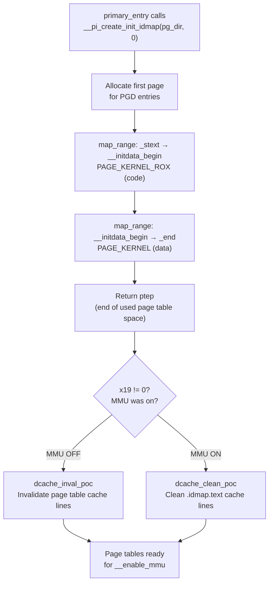

# Phase 2: Identity Map — Building VA == PA Page Tables

**Source:** `arch/arm64/kernel/pi/map_range.c`, `arch/arm64/kernel/head.S` lines 92–117

## What is an Identity Map?

An **identity map** (idmap) is a page table configuration where **virtual address == physical address**. If the kernel code is loaded at physical address `0x4080_0000`, the identity map ensures virtual address `0x4080_0000` maps to the same physical location.

## Why is it Needed?

When you enable the MMU, the CPU **immediately** begins translating every address through the page tables. Consider this sequence:

```
Instruction at physical address 0x4080_1000:   set_sctlr_el1  x0   ← enables MMU
Instruction at physical address 0x4080_1004:   ret             ← next instruction
```

The moment `set_sctlr_el1` executes, the CPU fetches the next instruction at **virtual** address `0x4080_1004`. Without a page table mapping `VA 0x4080_1004 → PA 0x4080_1004`, the CPU faults immediately.

The identity map provides this seamless transition: MMU off → MMU on with no interruption, because the addresses don't change.

## Calling Sequence

```asm
; From primary_entry (head.S lines 92-94):
adrp  x0, __pi_init_idmap_pg_dir    ; x0 = physical addr of page table buffer
mov   x1, xzr                        ; x1 = 0 (clrmask = no bits to clear)
bl    __pi_create_init_idmap          ; call C function (position-independent)
```

- `__pi_` prefix means "position-independent" — compiled to work with physical addresses
- `init_idmap_pg_dir` is a pre-allocated buffer in the linker script (defined in `arch/arm64/kernel/vmlinux.lds.S`)

## What Gets Mapped

`create_init_idmap()` creates two mappings:

| Region | VA Range | PA Range | Protection | Content |
|--------|----------|----------|------------|---------|
| Text | `_stext` → `__initdata_begin` | same (PA == VA) | `PAGE_KERNEL_ROX` | Kernel code (read-only + executable) |
| Data | `__initdata_begin` → `_end` | same (PA == VA) | `PAGE_KERNEL` | Kernel data (read-write, no-execute) |

## Flow Diagram



## Detailed Sub-Documents

| Document | Covers |
|----------|--------|
| [01_Create_Init_Idmap.md](01_Create_Init_Idmap.md) | `create_init_idmap()` — the C function |
| [02_Map_Range.md](02_Map_Range.md) | `map_range()` — recursive page table population |
| [03_Cache_Maintenance.md](03_Cache_Maintenance.md) | Why invalidate vs clean, dcache_inval_poc / dcache_clean_poc |

## Page Table Buffer Layout

```
init_idmap_pg_dir (pre-allocated in vmlinux.lds.S)
┌─────────────────────────────┐  ← pg_dir (x0 at entry)
│ PGD entries (level 0/1)     │  First PAGE_SIZE
├─────────────────────────────┤  ← ptep starts here
│ PUD/PMD/PTE pages           │  Allocated by map_range as needed
│ (populated recursively)     │
│                             │
├─────────────────────────────┤  ← ptep at return (x0)
│ Unused space                │
│                             │
└─────────────────────────────┘  ← init_idmap_pg_end
```

The buffer size (`INIT_IDMAP_DIR_SIZE`) is computed at compile time by macros in `arch/arm64/include/asm/kernel-pgtable.h` based on the page size and VA bits configuration.
