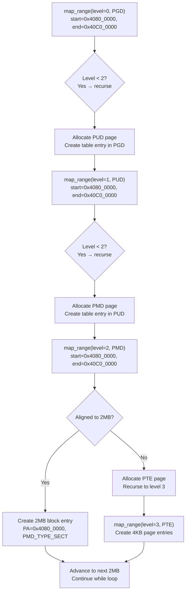

# `map_range()` — Recursive Page Table Population Engine

**Source:** `arch/arm64/kernel/pi/map_range.c` lines 28–88

## Purpose

`map_range()` is the core engine that populates ARM64 page tables. It recursively walks the page table hierarchy and inserts block or page entries to map a contiguous physical range into the virtual address space.

This single function is used for **both** the identity map (Phase 2) and the kernel VA mapping (Phase 5).

## Function Signature

```c
void __init map_range(phys_addr_t *pte,       // allocator pointer
                      u64 start, u64 end,     // virtual address range
                      phys_addr_t pa,         // physical address start
                      pgprot_t prot,          // page protection flags
                      int level,              // current page table level
                      pte_t *tbl,             // page table at this level
                      bool may_use_cont,      // allow contiguous entries
                      u64 va_offset)          // VA→PA offset for table access
```

## ARM64 Page Table Hierarchy

```
4KB pages, 48-bit VA:

Level 0 (PGD)     Level 1 (PUD)     Level 2 (PMD)     Level 3 (PTE)
┌──────────┐      ┌──────────┐      ┌──────────┐      ┌──────────┐
│ 512 entries│ ──► │ 512 entries│ ──► │ 512 entries│ ──► │ 512 entries│
│ 512GB each │      │ 1GB each  │      │ 2MB each  │      │ 4KB each  │
└──────────┘      └──────────┘      └──────────┘      └──────────┘

VA bits:  [47:39]       [38:30]          [29:21]          [20:12]      [11:0]
          PGD index     PUD index        PMD index        PTE index     offset
```

## Algorithm Walkthrough

### Initialization

```c
u64 cmask = (level == 3) ? CONT_PTE_SIZE - 1 : U64_MAX;
ptdesc_t protval = pgprot_val(prot) & ~PTE_TYPE_MASK;
int lshift = (3 - level) * PTDESC_TABLE_SHIFT;
u64 lmask = (PAGE_SIZE << lshift) - 1;
```

- `cmask` — contiguous entry alignment mask (only applies at level 3 PTE)
- `protval` — protection bits without the type field (block vs page vs table is added later)
- `lshift` — how many bits to shift for this level's granularity (level 2 → 21 bits = 2MB, level 3 → 12 bits = 4KB)
- `lmask` — mask for the size covered by one entry at this level

### Table Index Calculation

```c
tbl += (start >> (lshift + PAGE_SHIFT)) % PTRS_PER_PTE;
```

Advance the table pointer to the entry that covers the `start` address. This is essentially computing the page table **index** for this level.

### Entry Type

```c
if (protval)
    protval |= (level == 2) ? PMD_TYPE_SECT : PTE_TYPE_PAGE;
```

- At **level 2** (PMD): use `PMD_TYPE_SECT` → 2MB **block** descriptor
- At **level 3** (PTE): use `PTE_TYPE_PAGE` → 4KB **page** descriptor
- If `protval == 0`: we're unmapping (clearing entries)

### Main Loop

```c
while (start < end) {
    u64 next = min((start | lmask) + 1, PAGE_ALIGN(end));
```

Iterate through the VA range, one entry at a time. `next` is the end of the current entry's coverage.

### Decision: Table Entry or Block/Page Entry

```c
    if (level < 2 || (level == 2 && (start | next | pa) & lmask)) {
        // Need finer granularity → create table entry and recurse
        if (pte_none(*tbl)) {
            *tbl = __pte(__phys_to_pte_val(*pte) | PMD_TYPE_TABLE | PMD_TABLE_UXN);
            *pte += PTRS_PER_PTE * sizeof(pte_t);
        }
        map_range(pte, start, next, pa, prot, level + 1,
                  (pte_t *)(__pte_to_phys(*tbl) + va_offset),
                  may_use_cont, va_offset);
```

**When to recurse:**
- Level 0 or 1: always need to go deeper (PGD/PUD entries are always table pointers)
- Level 2 (PMD): recurse if the range doesn't align to 2MB (can't use a block descriptor)

**Table allocation:**
- If the entry is empty (`pte_none(*tbl)`), allocate a new page from `*pte` and create a table descriptor
- `*pte` advances by one page worth of entries (`PTRS_PER_PTE × sizeof(pte_t)`)

```c
    } else {
        // Aligned → create block/page entry directly
        if (((start | pa) & cmask) == 0 && may_use_cont)
            protval |= PTE_CONT;
        if ((end & ~cmask) <= start)
            protval &= ~PTE_CONT;

        *tbl = __pte(__phys_to_pte_val(pa) | protval);
    }
```

**When to create a direct mapping:**
- Level 2 with 2MB-aligned range → 2MB block entry
- Level 3 → 4KB page entry
- Optionally set `PTE_CONT` for contiguous TLB entries (16 consecutive aligned entries)

## Recursion Visualization



## Contiguous Entries Optimization

ARM64 supports a **contiguous bit** (`PTE_CONT`) that tells the TLB: "this entry and the next 15 are contiguous with the same attributes." This allows one TLB entry to cover:
- 16 × 4KB = 64KB (at PTE level)
- 16 × 2MB = 32MB (at PMD level)

The identity map uses `may_use_cont = false` for simplicity. The kernel VA map uses `may_use_cont = true` for performance.

## Key Takeaway

`map_range()` is a recursive page table builder. It walks the hierarchy top-down (PGD → PUD → PMD → PTE), creating table entries at intermediate levels and block/page entries at leaf levels. It uses a simple bump allocator (`*pte`) to grab new page table pages from a pre-allocated buffer.
